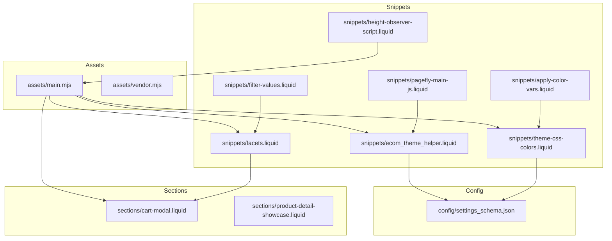
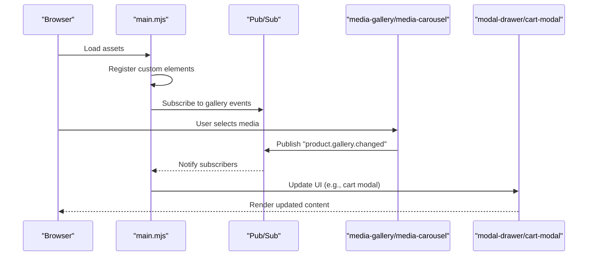
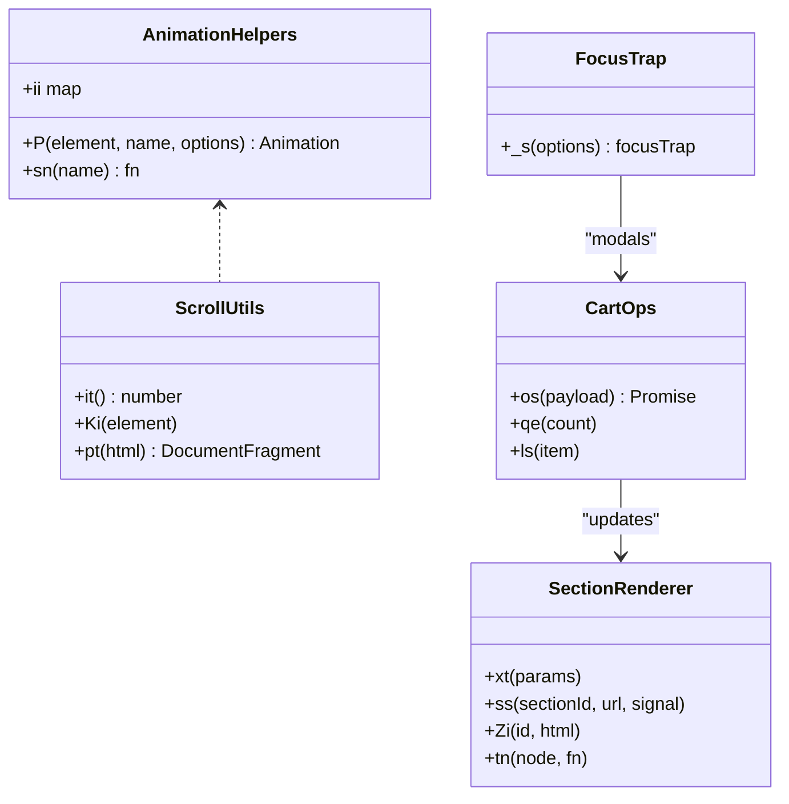
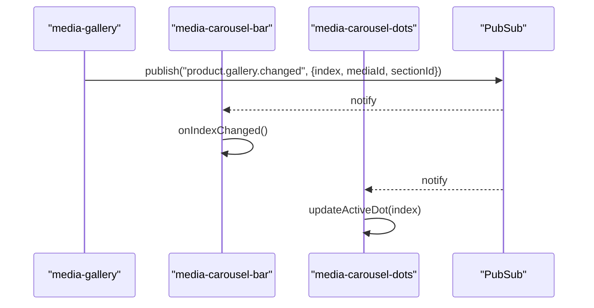
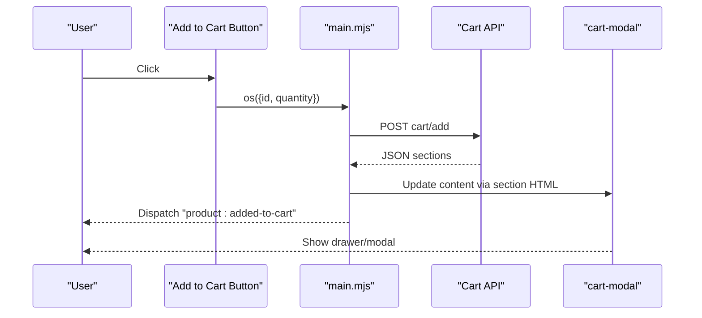
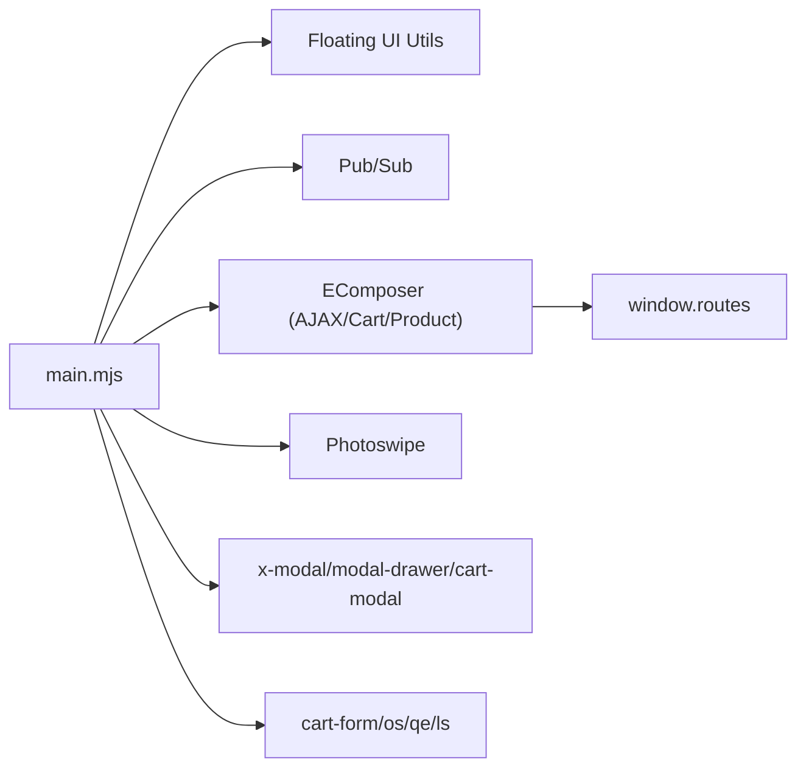

# API Reference

<cite>
**Referenced Files in This Document**
- [main.mjs](file://assets/main.mjs)
- [vendor.mjs](file://assets/vendor.mjs)
- [settings_schema.json](file://config/settings_schema.json)
- [ecom_theme_helper.liquid](file://snippets/ecom_theme_helper.liquid)
- [cart-modal.liquid](file://sections/cart-modal.liquid)
- [facets.liquid](file://snippets/facets.liquid)
- [filter-values.liquid](file://snippets/filter-values.liquid)
- [theme-css-colors.liquid](file://snippets/theme-css-colors.liquid)
- [apply-color-vars.liquid](file://snippets/apply-color-vars.liquid)
- [height-observer-script.liquid](file://snippets/height-observer-script.liquid)
- [pagefly-main-js.liquid](file://snippets/pagefly-main-js.liquid)
- [product-detail-showcase.liquid](file://sections/product-detail-showcase.liquid)
</cite>

## Table of Contents
1. [Introduction](#introduction)
2. [Project Structure](#project-structure)
3. [Core Components](#core-components)
4. [Architecture Overview](#architecture-overview)
5. [Detailed Component Analysis](#detailed-component-analysis)
6. [Dependency Analysis](#dependency-analysis)
7. [Performance Considerations](#performance-considerations)
8. [Troubleshooting Guide](#troubleshooting-guide)
9. [Conclusion](#conclusion)
10. [Appendices](#appendices)

## Introduction
This API reference documents the Igogomi theme’s JavaScript APIs, Liquid filters/tags, web component specifications, theme settings API, configuration options, and Shopify theme app SDK integration points. It focuses on:
- Main JavaScript module exports and utilities
- Event system and pub/sub patterns
- Web component APIs and attributes
- Theme settings schema and programmatic access
- Liquid helpers and filters used by the theme
- Hooks and extension points for customization

## Project Structure
The theme organizes client-side logic in modular assets and exposes configuration via JSON schema and Liquid snippets/sections.

**Diagram sources**
- [main.mjs](file://assets/main.mjs)
- [vendor.mjs](file://assets/vendor.mjs)
- [settings_schema.json](file://config/settings_schema.json)
- [ecom_theme_helper.liquid](file://snippets/ecom_theme_helper.liquid)
- [theme-css-colors.liquid](file://snippets/theme-css-colors.liquid)
- [apply-color-vars.liquid](file://snippets/apply-color-vars.liquid)
- [facets.liquid](file://snippets/facets.liquid)
- [filter-values.liquid](file://snippets/filter-values.liquid)
- [height-observer-script.liquid](file://snippets/height-observer-script.liquid)
- [pagefly-main-js.liquid](file://snippets/pagefly-main-js.liquid)
- [cart-modal.liquid](file://sections/cart-modal.liquid)
- [product-detail-showcase.liquid](file://sections/product-detail-showcase.liquid)

**Section sources**
- [main.mjs](file://assets/main.mjs)
- [vendor.mjs](file://assets/vendor.mjs)
- [settings_schema.json](file://config/settings_schema.json)
- [ecom_theme_helper.liquid](file://snippets/ecom_theme_helper.liquid)
- [theme-css-colors.liquid](file://snippets/theme-css-colors.liquid)
- [apply-color-vars.liquid](file://snippets/apply-color-vars.liquid)
- [facets.liquid](file://snippets/facets.liquid)
- [filter-values.liquid](file://snippets/filter-values.liquid)
- [height-observer-script.liquid](file://snippets/height-observer-script.liquid)
- [pagefly-main-js.liquid](file://snippets/pagefly-main-js.liquid)
- [cart-modal.liquid](file://sections/cart-modal.liquid)
- [product-detail-showcase.liquid](file://sections/product-detail-showcase.liquid)

## Core Components
- JavaScript module exports and utilities:
  - Debounce/throttle helpers, intersection observer utilities, scroll utilities, focus trap integration, animations, and pub/sub messaging.
  - Web components: modal drawer, cart modal, dropdowns, media gallery/carousel, image comparison, localization form, newsletter modal, notification wrapper, and more.
  - Utility functions for cart operations, section rendering, and image preloading.
- Theme settings API:
  - Centralized configuration via settings_schema.json covering appearance, colors, typography, layout, and product card options.
- Liquid helpers and filters:
  - Money formatting, image resizing, product fetching, and quickview integration.
  - Faceted filtering UI generation and presentation logic.
- Shopify theme app SDK integration:
  - EComposer integration via snippets for AJAX cart, routes, and product retrieval.
  - PageFly metadata injection for analytics and page tracking.

**Section sources**
- [main.mjs](file://assets/main.mjs)
- [settings_schema.json](file://config/settings_schema.json)
- [ecom_theme_helper.liquid](file://snippets/ecom_theme_helper.liquid)
- [facets.liquid](file://snippets/facets.liquid)

## Architecture Overview
The theme’s runtime architecture combines:
- A modular JavaScript bundle (main.mjs) that defines custom elements and provides utilities.
- A pub/sub system for cross-component communication (e.g., media gallery events).
- Liquid-driven configuration and UI scaffolding, with optional third-party integrations (EComposer, PageFly).

**Diagram sources**
- [main.mjs](file://assets/main.mjs)

**Section sources**
- [main.mjs](file://assets/main.mjs)

## Detailed Component Analysis

### JavaScript Module Exports and Utilities
- Exported utilities and helpers:
  - Debounce/throttle: z(fn, delay) with cancel support.
  - Leading-edge throttle: ei(fn, period).
  - Animation helpers: P(element, animationName, options) returning an Animation.
  - Scroll utilities: it(), pt(), Ki(element), ns(images), De(image), ts().
  - Focus and accessibility: rn(), _e(), As(), Ts(), _s(options) focus trap.
  - Cart operations: os({id, quantity}) -> fetch + JSON payload, qe(count), ls(item) -> drawer or modal.
  - Section rendering: xt({id, url, signal}), ss(sectionId, url, signal), Zi(id, html), tn(node, fn).
  - Media helpers: Ui(), Gi(), j(ms), pe(fn), Qn(target, cb, options).
  - Animations: sn(name) -> function(element, options), ii map of named animations.
  - Utility constants: cubic-bezier easing presets.
- Global window helpers:
  - window._delay = j(ms)
  - window.routes for cart endpoints
  - window.Shopify routes and designMode flags
  - window._t translations, svgs icons, cartStrings

**Diagram sources**
- [main.mjs](file://assets/main.mjs)

**Section sources**
- [main.mjs](file://assets/main.mjs)

### Event System and Pub/Sub
- Pub/Sub module:
  - Methods: publish(topic, data), publishSync(topic, data), subscribe(topic, handler), subscribeOnce, clearAllSubscriptions, countSubscriptions, unsubscribe.
  - Used by media gallery components to broadcast media change events.
- Media gallery events:
  - Topics: "product.gallery.changed", "product.gallery.indicator_changed".
  - Consumers: media-carousel-bar, media-carousel, mini-gallery.

**Diagram sources**
- [main.mjs](file://assets/main.mjs)

**Section sources**
- [main.mjs](file://assets/main.mjs)

### Web Components Specification

#### Custom Elements and Attributes
- announcement-bar
  - Attributes: transition ("fade" | "slide-y"), speed (ms), autoplay (boolean).
  - Lifecycle: connectedCallback initializes slides, handles prev/next clicks, starts/stops autoplay.
- dropdown-element
  - Attributes: interaction-handler ("click" | "hover"), hover-show-delay (ms), hide-on-menu-click (boolean), min-width-full (boolean), offset (px), offset-cross (px), placement ("bottom-start" and variants), append-to-body (boolean), animation ("fade-down" | "fade-up" | "scale").
  - Behavior: toggles open/close, manages position via floating UI, supports show/hide animations.
- dropdown-list
  - Extends dropdown-element with focus-only mode, keyboard navigation, and mobile modal fallback on small screens.
  - Attributes: focus-only (boolean), list-title (string).
- modal-drawer
  - Attributes: position ("top" | "bottom" | "left" | "right"), animation, child (boolean), fade-on-mobile (boolean).
  - Behavior: overlays content with animated entrance/exit, manages z-index, scroll lock, and parent-child chaining.
- cart-modal
  - Extends modal-drawer; subscribes to "product:added-to-cart" to refresh content; updates order note and cart bubble.
- x-modal
  - Base modal with shadow DOM, focus trap, overlay, and loading overlay.
  - Attributes: append-to-body (boolean), initial-focus (selector), disable-focus-trap (boolean), hide-scrollbar (boolean), show-on (selector), hide-on (selector).
- cart-form
  - Handles cart quantity updates, note updates, and error display; supports modal or section reloads.
- media-gallery
  - Sets active media by data attribute.
- media-carousel
  - Attributes: lightbox (boolean), video-autoplay (boolean), adaptive-height (boolean), loop (boolean), item-selector (selector).
  - Behavior: scroll-based navigation, media preloading, video/model autoplay, emits gallery events.
- media-carousel-bar
  - Displays progress indicator for media carousel; clickable to jump to media.
- media-carousel-dots
  - Mirrors media carousel navigation via dots; subscribes to gallery events.
- media-grid
  - Reorders media items to place featured media first within a section.
- media-lightbox
  - Opens lightbox for clicked images; uses Photoswipe.
- mini-gallery
  - Hides non-featured media within a section.
- mobile-menu and mobile-menu-page
  - Nested pages with slide transitions; integrates with sticky header overlay.
- newsletter-modal
  - Optional modal with frequency and delay controls; stores dismissal in localStorage.
- notification-wrapper
  - Animated toast notifications with severity-based styling.
- modal-trigger
  - Activates a target modal by selector.
- image-comparison
  - Draggable slider to compare two images; supports keyboard navigation.
- localization-form
  - Switches locale/country via form submission.
- lqip-element
  - Lazy image placeholder with fade-in when actual image loads.
- height-observer
  - Custom element that exposes element height via CSS variable using ResizeObserver.

```mermaid
classDiagram
class HTMLElement
class announcement_bar
class dropdown_element
class dropdown_list
class modal_drawer
class cart_modal
class x_modal
class cart_form
class media_gallery
class media_carousel
class media_carousel_bar
class media_carousel_dots
class media_grid
class media_lightbox
class mini_gallery
class mobile_menu
class mobile_menu_page
class newsletter_modal
class notification_wrapper
class modal_trigger
class image_comparison
class localization_form
class lqip_element
class height_observer
HTMLElement <|-- announcement_bar
HTMLElement <|-- dropdown_element
dropdown_element <|-- dropdown_list
HTMLElement <|-- modal_drawer
modal_drawer <|-- cart_modal
HTMLElement <|-- x_modal
HTMLElement <|-- cart_form
HTMLElement <|-- media_gallery
HTMLElement <|-- media_carousel
HTMLElement <|-- media_carousel_bar
HTMLElement <|-- media_carousel_dots
HTMLElement <|-- media_grid
HTMLElement <|-- media_lightbox
HTMLElement <|-- mini_gallery
HTMLElement <|-- mobile_menu
HTMLElement <|-- mobile_menu_page
HTMLElement <|-- newsletter_modal
HTMLElement <|-- notification_wrapper
HTMLElement <|-- modal_trigger
HTMLElement <|-- image_comparison
HTMLElement <|-- localization_form
HTMLElement <|-- lqip_element
HTMLElement <|-- height_observer
```

**Diagram sources**
- [main.mjs](file://assets/main.mjs)

**Section sources**
- [main.mjs](file://assets/main.mjs)

### Theme Settings API
- Appearance settings:
  - Corner radii for blocks, buttons, inputs, dropdowns.
  - Input style (filled/outline), icon corner style (round/square), icon thickness (thin/normal/bold).
  - Image background shade intensity and toggles for collections, thumbnails, and gallery.
- Color settings:
  - Background, text, headings, primary/secondary buttons, header/footer backgrounds/foregrounds.
  - Product card colors, sale badge, sold-out badge, custom badges, rating star.
  - Article category badge, alerts (success/warning/danger), extra colors (active filter pill, input accent, progress bar, range slider, selected dropdown item, cart badge, text selection).
- Typography settings:
  - Font pickers for headings/body/buttons/labels/navigation/product cards/accordion.
  - Letter spacing ranges and text styles (normal/uppercase/lowercase) for headings and labels.
- Layout settings:
  - Page width, spacing between sections, spacing between blocks.
- Product card settings:
  - Visibility toggles for vendor, quick add to cart, sold out badge, discount badge, custom badges, product rating, size preview.
  - Additional behaviors like second image on hover, empty rating visibility, dynamic checkout in quick add.

Programmatic access:
- Access via settings keys in Liquid and CSS custom properties generated from theme-css-colors.liquid.
- Example keys: settings.colors_background, settings.colors_primary_button_background, settings.type_body_base_size, settings.layout_space_between_sections.

**Section sources**
- [settings_schema.json](file://config/settings_schema.json)
- [theme-css-colors.liquid](file://snippets/theme-css-colors.liquid)
- [apply-color-vars.liquid](file://snippets/apply-color-vars.liquid)

### Liquid Filters, Tags, and Helpers
- Money formatting and image resizing:
  - Money formatting helpers and image resize logic exposed via window.EComposer.formatMoney and window.EComposer.resizeImage.
- Product retrieval:
  - window.EComposer.getProduct(handle) fetches product JSON with optional proxy support.
- Quickview integration:
  - EComposer quickview initialization and modal lifecycle managed in snippets/ecom_theme_helper.liquid.
- Faceted filtering:
  - Snippet facets.liquid generates filter UIs with dropdown-element and handles visibility based on active values and section settings.
  - Snippet filter-values.liquid sets presentation modes (swatch/image/list) and classes for filter lists.
- CSS variables and color utilities:
  - theme-css-colors.liquid renders CSS custom properties from settings.
  - apply-color-vars.liquid applies background/text/heading variables to scoped contexts.
- Height observer:
  - height-observer-script.liquid defines a custom element that exposes height via CSS variable.
- PageFly metadata:
  - pagefly-main-js.liquid injects page/product metadata for analytics.

**Section sources**
- [ecom_theme_helper.liquid](file://snippets/ecom_theme_helper.liquid)
- [facets.liquid](file://snippets/facets.liquid)
- [filter-values.liquid](file://snippets/filter-values.liquid)
- [theme-css-colors.liquid](file://snippets/theme-css-colors.liquid)
- [apply-color-vars.liquid](file://snippets/apply-color-vars.liquid)
- [height-observer-script.liquid](file://snippets/height-observer-script.liquid)
- [pagefly-main-js.liquid](file://snippets/pagefly-main-js.liquid)

### Shopify Theme App SDK Integration
- EComposer integration:
  - Routes, query parameters, money formatting, image resizing, product retrieval, and AJAX cart configuration are initialized in ecom_theme_helper.liquid.
  - Quickview modal and styling are integrated via snippet.
- PageFly integration:
  - pagefly-main-js.liquid augments window.pfPageInfo with page/product identifiers and images for analytics.

**Section sources**
- [ecom_theme_helper.liquid](file://snippets/ecom_theme_helper.liquid)
- [pagefly-main-js.liquid](file://snippets/pagefly-main-js.liquid)

### Cart Modal and Related Workflows
- cart-modal.liquid composes:
  - cart-form for quantity/note updates
  - child drawers for order note and shipping estimator
  - modal-trigger for opening child modals
  - Uses modal-drawer and x-modal under the hood
- Programmatic triggers:
  - os({id, quantity}) adds to cart and dispatches "product:added-to-cart"
  - ls(item) opens drawer or modal depending on configuration
  - qe(count) updates cart bubble

**Diagram sources**
- [main.mjs](file://assets/main.mjs)
- [cart-modal.liquid](file://sections/cart-modal.liquid)

**Section sources**
- [main.mjs](file://assets/main.mjs)
- [cart-modal.liquid](file://sections/cart-modal.liquid)

## Dependency Analysis
- Internal dependencies:
  - main.mjs depends on floating UI utilities for positioning dropdowns and menus.
  - Pub/Sub is used across media gallery components.
  - Cart operations depend on window.routes and window.Shopify.
- External integrations:
  - EComposer for AJAX cart and product retrieval.
  - PageFly for page metadata.
  - Photoswipe for media lightbox.

**Diagram sources**
- [main.mjs](file://assets/main.mjs)
- [ecom_theme_helper.liquid](file://snippets/ecom_theme_helper.liquid)

**Section sources**
- [main.mjs](file://assets/main.mjs)
- [ecom_theme_helper.liquid](file://snippets/ecom_theme_helper.liquid)

## Performance Considerations
- Debouncing and throttling:
  - z() and ei() reduce frequent recalculations and event handlers.
- IntersectionObserver and ResizeObserver:
  - Used for lazy loading, scroll shadows, and responsive layouts.
- Animation primitives:
  - P() leverages native Web Animations API for smooth transitions.
- Prefetching and preloading:
  - vendor.mjs implements instant.page prefetching for links.
- Image optimization:
  - De() and ns() preload images; lqip-element defers placeholder until actual image loads.

[No sources needed since this section provides general guidance]

## Troubleshooting Guide
- Cart operations fail:
  - Verify window.routes availability and network connectivity.
  - Check error handling in cart-form.updateQuantity() and os().
- Modals not closing or focus trapped:
  - Ensure x-modal focus trap is enabled and not disabled via attribute.
  - Confirm modal-trigger targets the correct selector.
- Dropdown/menu misaligned:
  - Adjust placement and offset attributes; verify append-to-body usage.
- Media carousel not updating:
  - Ensure gallery events are published and subscribers are registered.
- Newsletter modal not appearing:
  - Check localStorage dismissal flag and frequency settings.

**Section sources**
- [main.mjs](file://assets/main.mjs)
- [cart-modal.liquid](file://sections/cart-modal.liquid)

## Conclusion
The Igogomi theme provides a robust set of JavaScript utilities, a comprehensive suite of web components, and a structured settings schema for customization. Liquid snippets integrate third-party services and expose helpers for money formatting, image manipulation, and faceted filtering. The pub/sub pattern and custom elements enable modular, maintainable UI extensions while preserving performance and accessibility.

[No sources needed since this section summarizes without analyzing specific files]

## Appendices

### Appendix A: Web Component Attribute Reference
- announcement-bar
  - transition: "fade" | "slide-y"
  - speed: number (ms)
  - autoplay: boolean
- dropdown-element
  - interaction-handler: "click" | "hover"
  - hover-show-delay: number (ms)
  - hide-on-menu-click: boolean
  - min-width-full: boolean
  - offset: number (px)
  - offset-cross: number (px)
  - placement: "bottom-start" and variants
  - append-to-body: boolean
  - animation: "fade-down" | "fade-up" | "scale"
- modal-drawer
  - position: "top" | "bottom" | "left" | "right"
  - animation: string
  - child: boolean
  - fade-on-mobile: boolean
- x-modal
  - append-to-body: boolean
  - initial-focus: selector
  - disable-focus-trap: boolean
  - hide-scrollbar: boolean
  - show-on: selector
  - hide-on: selector
- cart-form
  - data attributes for remove buttons and quantity inputs
- media-carousel
  - lightbox: boolean
  - video-autoplay: boolean
  - adaptive-height: boolean
  - loop: boolean
  - item-selector: selector
- modal-trigger
  - target: selector

**Section sources**
- [main.mjs](file://assets/main.mjs)

### Appendix B: Theme Settings Keys
- Appearance: block_corner_radius, button_corner_radius, input_corner_radius, dropdown_corner_radius, input_style, icons_corner_style, icons_line_thickness, image_background_shade_collection_images, image_background_shade_product_thumbnails, image_background_shade_product_gallery, image_background_shade_intensity.
- Colors: colors_background, colors_text, colors_headings, colors_primary_button_background, colors_primary_button_text, colors_secondary_button_background, colors_secondary_button_text, colors_header_background, colors_header_text, colors_footer_background, colors_footer_text, colors_product_card_background, colors_product_card_text, colors_product_sale_price, colors_product_sale_badge, colors_product_sold_out_badge, colors_custom_badge, colors_product_rating_star, colors_in_stock_text, colors_low_stock_text, colors_free_shipping_bar, colors_modal_background, colors_modal_foreground, colors_article_category_badge, colors_alerts_success, colors_alerts_warning, colors_alerts_danger, colors_active_filter_pill, colors_filter_button, colors_input_accent, colors_progress_bar, colors_range_slider, colors_selected_dropdown_item, colors_cart_badge, colors_text_selection.
- Typography: type_heading_font, type_heading_letter_spacing, type_body_font, type_body_base_size, type_body_letter_spacing, type_button_font, type_label_font, type_navigation_font, type_product_card_font, type_accordion_font, type_heading_text_style, type_button_text_style, type_label_text_style, type_navigation_text_style.
- Layout: page_width, layout_space_between_sections, layout_space_between_blocks.
- Product Card: product_card_vendor, product_card_quick_add_to_cart, product_card_sold_out_badge, product_card_discount_badge, product_card_custom_badges, product_card_product_rating, product_card_size_preview, product_card_second_image_on_hover, product_card_show_empty_rating, product_card_show_dynamic_checkout_in_quick_add.

**Section sources**
- [settings_schema.json](file://config/settings_schema.json)
- [theme-css-colors.liquid](file://snippets/theme-css-colors.liquid)
- [apply-color-vars.liquid](file://snippets/apply-color-vars.liquid)

### Appendix C: Liquid Helpers and Filters
- Money formatting and image resizing:
  - formatMoney(amount, format)
  - resizeImage(url, size)
- Product retrieval:
  - getProduct(handle)
- Faceted filtering:
  - filter presentation modes and list classes
- CSS variables:
  - theme-css-colors.liquid renders custom properties
  - apply-color-vars.liquid applies scoped variables

**Section sources**
- [ecom_theme_helper.liquid](file://snippets/ecom_theme_helper.liquid)
- [facets.liquid](file://snippets/facets.liquid)
- [filter-values.liquid](file://snippets/filter-values.liquid)
- [theme-css-colors.liquid](file://snippets/theme-css-colors.liquid)
- [apply-color-vars.liquid](file://snippets/apply-color-vars.liquid)