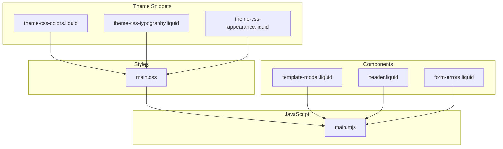
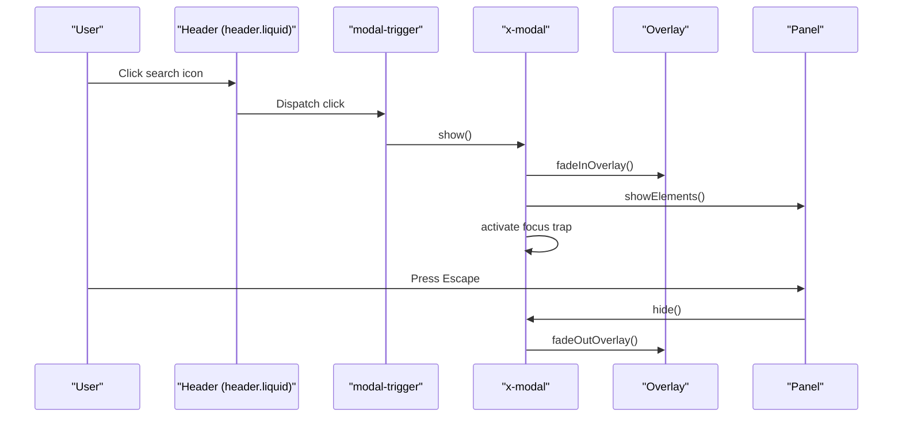
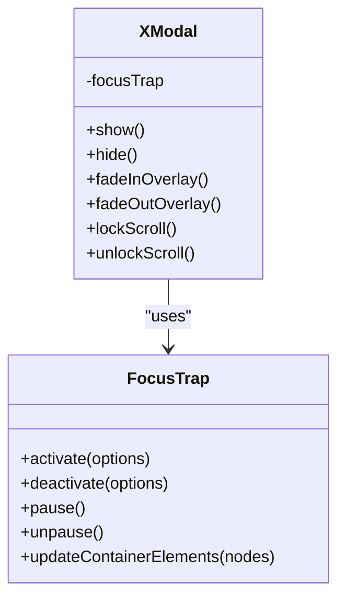
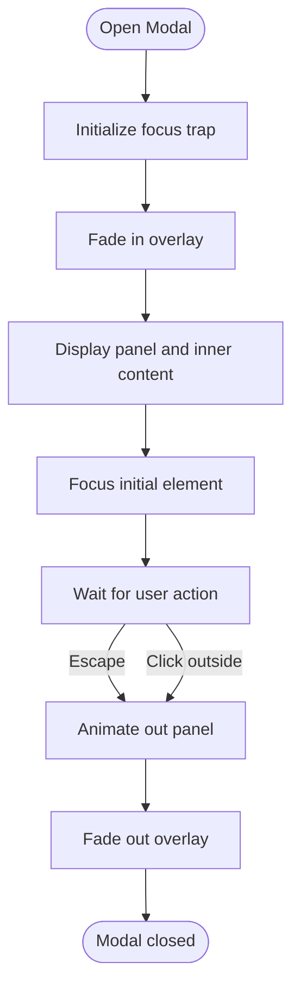
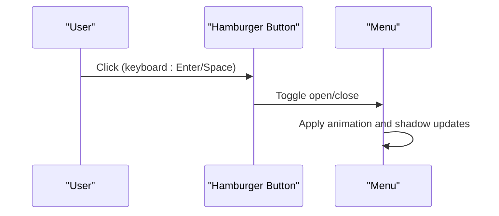
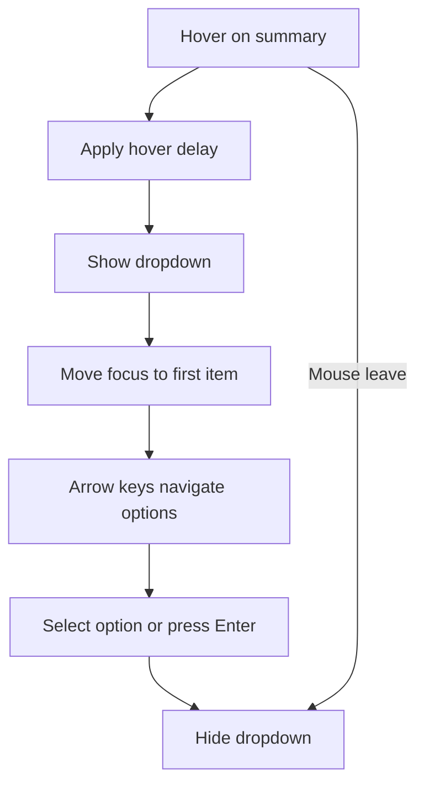
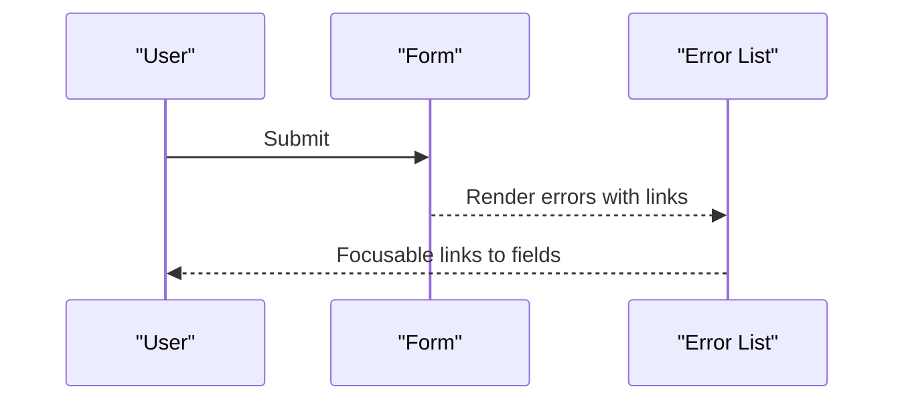
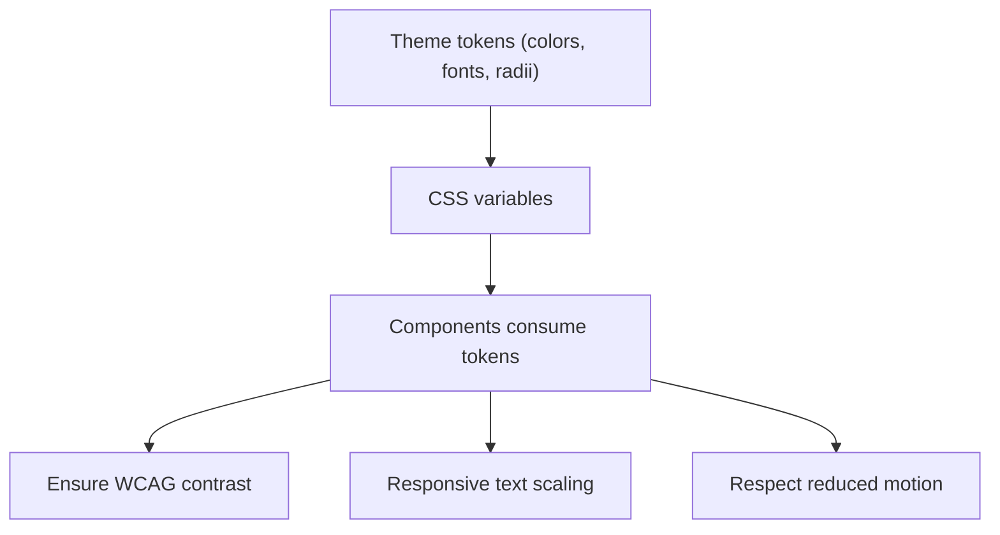
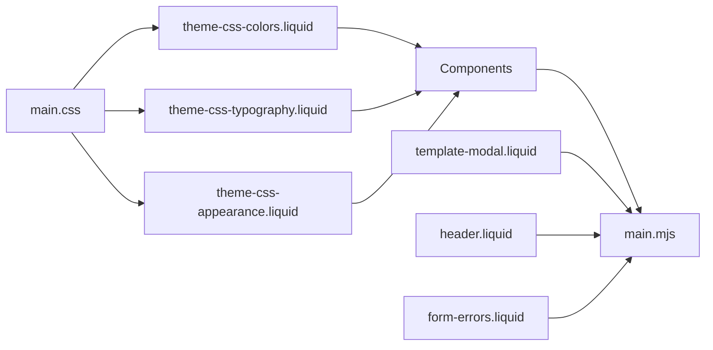

# Accessibility Features

<cite>
**Referenced Files in This Document**
- [main.mjs](file://assets/main.mjs)
- [main.css](file://assets/main.css)
- [template-modal.liquid](file://snippets/template-modal.liquid)
- [theme-css-colors.liquid](file://snippets/theme-css-colors.liquid)
- [theme-css-typography.liquid](file://snippets/theme-css-typography.liquid)
- [theme-css-appearance.liquid](file://snippets/theme-css-appearance.liquid)
- [form-errors.liquid](file://snippets/form-errors.liquid)
- [header.liquid](file://sections/header.liquid)
</cite>

## Table of Contents
1. [Introduction](#introduction)
2. [Project Structure](#project-structure)
3. [Core Components](#core-components)
4. [Architecture Overview](#architecture-overview)
5. [Detailed Component Analysis](#detailed-component-analysis)
6. [Dependency Analysis](#dependency-analysis)
7. [Performance Considerations](#performance-considerations)
8. [Troubleshooting Guide](#troubleshooting-guide)
9. [Conclusion](#conclusion)

## Introduction
This document explains the accessibility features and WCAG 2.1 conformance approach in the Igogomi theme. It focuses on keyboard navigation, screen reader compatibility, focus management, ARIA attributes, semantic HTML, assistive technology support, color contrast, text scaling, reduced motion preferences, focus traps for modals, skip links, accessible forms, and progressive enhancement when JavaScript is disabled.

## Project Structure
Accessibility-related code spans CSS resets and base styles, theme configuration tokens, modal and drawer components, dropdowns, and form error rendering. The JavaScript module integrates focus trapping, animations, and UI behaviors. Theme snippets define color, typography, and appearance tokens consumed by components.

**Diagram sources**
- [theme-css-colors.liquid:1-147](file://snippets/theme-css-colors.liquid#L1-L147)
- [theme-css-typography.liquid:1-118](file://snippets/theme-css-typography.liquid#L1-L118)
- [theme-css-appearance.liquid:1-67](file://snippets/theme-css-appearance.liquid#L1-L67)
- [main.css:1-200](file://assets/main.css#L1-L200)
- [main.mjs:1-51](file://assets/main.mjs#L1-L51)
- [template-modal.liquid:1-117](file://snippets/template-modal.liquid#L1-L117)
- [header.liquid:1-200](file://sections/header.liquid#L1-L200)
- [form-errors.liquid:1-19](file://snippets/form-errors.liquid#L1-L19)

**Section sources**
- [main.css:17-32](file://assets/main.css#L17-L32)
- [theme-css-colors.liquid:1-147](file://snippets/theme-css-colors.liquid#L1-L147)
- [theme-css-typography.liquid:1-118](file://snippets/theme-css-typography.liquid#L1-L118)
- [theme-css-appearance.liquid:1-67](file://snippets/theme-css-appearance.liquid#L1-L67)
- [main.mjs:1-51](file://assets/main.mjs#L1-L51)
- [template-modal.liquid:1-117](file://snippets/template-modal.liquid#L1-L117)
- [header.liquid:113-118](file://sections/header.liquid#L113-L118)
- [form-errors.liquid:1-19](file://snippets/form-errors.liquid#L1-L19)

## Core Components
- Focus management and focus traps: Implemented via a focus trap library integrated in the JavaScript module for modal and drawer components.
- Keyboard navigation: Supported through native tab order, arrow keys for lists/dropdowns, Escape to close, and inert handling for non-focusable elements.
- Screen reader compatibility: Uses ARIA roles and labels, skip links, and semantic HTML structure.
- Modal system: Provides overlay, panel, loading states, and focus trapping with configurable initial focus and scroll locking.
- Dropdowns and menus: Support hover/click interaction handlers, dynamic positioning, and keyboard navigation.
- Form accessibility: Error rendering with anchor links to fields, and focus management on submit.
- Color and contrast: CSS variables define theme colors; ensure sufficient contrast per WCAG guidelines.
- Text scaling and responsive units: Relative units and clamp-based sizing enable scalable typography.
- Reduced motion: Animations use CSS transitions and keyframes; consider prefers-reduced-motion at runtime.
- Progressive enhancement: Semantic HTML and CSS resets provide baseline accessibility even without JS.

**Section sources**
- [main.mjs:5-6](file://assets/main.mjs#L5-L6)
- [main.mjs:100-200](file://assets/main.mjs#L100-L200)
- [main.mjs:200-350](file://assets/main.mjs#L200-L350)
- [template-modal.liquid:103-116](file://snippets/template-modal.liquid#L103-L116)
- [header.liquid:113-118](file://sections/header.liquid#L113-L118)
- [form-errors.liquid:1-19](file://snippets/form-errors.liquid#L1-L19)

## Architecture Overview
The theme’s accessibility architecture centers on:
- CSS resets and base styles ensuring consistent focus styles and platform-specific adjustments.
- Theme tokens (colors, typography, appearance) feeding into components.
- JavaScript components implementing focus traps, overlays, animations, and keyboard handling.
- Liquid snippets composing accessible markup and ARIA attributes.

**Diagram sources**
- [header.liquid:183-189](file://sections/header.liquid#L183-L189)
- [main.mjs:300-420](file://assets/main.mjs#L300-L420)
- [template-modal.liquid:103-116](file://snippets/template-modal.liquid#L103-L116)

## Detailed Component Analysis

### Focus Management and Focus Traps
- Focus trap integration: The module initializes focus traps for modal content, supporting initial focus selection, Escape key handling, and outside clicks.
- Tab order: Uses a tabbable candidate resolver to include inputs, buttons, links, and contenteditable elements while excluding inert nodes.
- Nested modals: Tracks active modals and adjusts z-index and scroll behavior accordingly.

**Diagram sources**
- [main.mjs:5-6](file://assets/main.mjs#L5-L6)
- [main.mjs:300-420](file://assets/main.mjs#L300-L420)

**Section sources**
- [main.mjs:5-6](file://assets/main.mjs#L5-L6)
- [main.mjs:100-200](file://assets/main.mjs#L100-L200)
- [main.mjs:300-420](file://assets/main.mjs#L300-L420)

### Modal System (Overlay, Panel, Loading States)
- Overlay and panel structure are defined in a shared template with CSS variables for colors and corner radius.
- Panel receives tabindex for programmatic focus and supports scrollable variants.
- Loading overlay displays a spinner during async operations.

**Diagram sources**
- [template-modal.liquid:103-116](file://snippets/template-modal.liquid#L103-L116)
- [main.mjs:300-420](file://assets/main.mjs#L300-L420)

**Section sources**
- [template-modal.liquid:1-117](file://snippets/template-modal.liquid#L1-L117)
- [main.mjs:300-420](file://assets/main.mjs#L300-L420)

### Keyboard Navigation and ARIA Attributes
- ARIA labels and roles: The header uses aria-label on the logo link and a hamburger button with an accessible label.
- Native semantics: Buttons and links are styled without losing semantic meaning.
- Platform-specific focus: Includes Firefox-specific focus ring handling.

**Diagram sources**
- [header.liquid:113-118](file://sections/header.liquid#L113-L118)
- [main.css:134-136](file://assets/main.css#L134-L136)

**Section sources**
- [header.liquid:77-118](file://sections/header.liquid#L77-L118)
- [main.css:103-136](file://assets/main.css#L103-L136)

### Dropdowns and Menus (Keyboard, Hover/Collapse)
- Interaction handlers: Supports click or hover with configurable delays.
- Dynamic positioning: Uses a positioning utility to compute placement and constraints.
- Keyboard navigation: Arrow keys move selection; Escape hides the dropdown.

**Diagram sources**
- [main.mjs:420-520](file://assets/main.mjs#L420-L520)

**Section sources**
- [main.mjs:420-520](file://assets/main.mjs#L420-L520)

### Accessible Forms and Error Handling
- Error rendering: Iterates over form errors and creates navigable links to specific fields.
- Focus management: On submit, loading states are indicated and focus remains on actionable elements.

**Diagram sources**
- [form-errors.liquid:1-19](file://snippets/form-errors.liquid#L1-L19)
- [main.mjs:520-600](file://assets/main.mjs#L520-L600)

**Section sources**
- [form-errors.liquid:1-19](file://snippets/form-errors.liquid#L1-L19)
- [main.mjs:520-600](file://assets/main.mjs#L520-L600)

### Color Contrast, Text Scaling, and Reduced Motion
- Color tokens: CSS variables define base backgrounds, foregrounds, accents, and component colors; ensure contrast ratios meet WCAG AA/AAA thresholds.
- Typography scaling: Relative units and clamp-based sizes enable scalable text across breakpoints.
- Reduced motion: Prefer CSS transitions and keyframes; consider adding prefers-reduced-motion checks for custom animations.

**Diagram sources**
- [theme-css-colors.liquid:1-147](file://snippets/theme-css-colors.liquid#L1-L147)
- [theme-css-typography.liquid:1-118](file://snippets/theme-css-typography.liquid#L1-L118)
- [theme-css-appearance.liquid:1-67](file://snippets/theme-css-appearance.liquid#L1-L67)

**Section sources**
- [theme-css-colors.liquid:1-147](file://snippets/theme-css-colors.liquid#L1-L147)
- [theme-css-typography.liquid:1-118](file://snippets/theme-css-typography.liquid#L1-L118)
- [theme-css-appearance.liquid:1-67](file://snippets/theme-css-appearance.liquid#L1-L67)

## Dependency Analysis
- CSS resets and base styles normalize platform differences and ensure consistent focus styles.
- Theme tokens feed into components via CSS variables for colors, typography, and corner radii.
- JavaScript components depend on the focus trap library and animation helpers.
- Modals and drawers rely on overlay and panel templates.

**Diagram sources**
- [main.css:1-200](file://assets/main.css#L1-L200)
- [theme-css-colors.liquid:1-147](file://snippets/theme-css-colors.liquid#L1-L147)
- [theme-css-typography.liquid:1-118](file://snippets/theme-css-typography.liquid#L1-L118)
- [theme-css-appearance.liquid:1-67](file://snippets/theme-css-appearance.liquid#L1-L67)
- [main.mjs:1-51](file://assets/main.mjs#L1-L51)
- [template-modal.liquid:1-117](file://snippets/template-modal.liquid#L1-L117)
- [header.liquid:1-200](file://sections/header.liquid#L1-L200)
- [form-errors.liquid:1-19](file://snippets/form-errors.liquid#L1-L19)

**Section sources**
- [main.css:17-32](file://assets/main.css#L17-L32)
- [main.mjs:1-51](file://assets/main.mjs#L1-L51)
- [template-modal.liquid:1-117](file://snippets/template-modal.liquid#L1-L117)
- [header.liquid:1-200](file://sections/header.liquid#L1-L200)
- [form-errors.liquid:1-19](file://snippets/form-errors.liquid#L1-L19)

## Performance Considerations
- Animation performance: CSS transforms and opacity changes are used for smooth transitions; avoid layout thrashing by batching DOM reads/writes.
- Scroll locking: Pauses body scrolling when modals are open; ensure nested modals coordinate scroll behavior.
- Image lazy loading: Deferred media and lightbox preloads help reduce perceived latency.

## Troubleshooting Guide
- Focus trap does not activate: Verify the modal content element exists and is visible; confirm initial focus selector resolves to a focusable element.
- Escape key does nothing: Ensure the modal is open and the focus trap is active; check event listeners are attached.
- Dropdown not closing on outside click: Confirm click handler is bound and the dropdown is not configured to hide on menu click.
- Form errors not linking to fields: Ensure the form_id and field keys match the rendered error list and the target input IDs.

**Section sources**
- [main.mjs:300-420](file://assets/main.mjs#L300-L420)
- [main.mjs:420-520](file://assets/main.mjs#L420-L520)
- [form-errors.liquid:1-19](file://snippets/form-errors.liquid#L1-L19)

## Conclusion
The Igogomi theme implements a robust accessibility foundation through CSS resets, theme tokens, focus traps, keyboard navigation, and semantic markup. By leveraging CSS variables for color and typography, the theme supports scalable and consistent experiences. Progressive enhancement ensures core functionality remains accessible even when JavaScript is disabled. For full WCAG 2.1 compliance, teams should validate color contrast, test with assistive technologies, and consider reduced motion preferences.