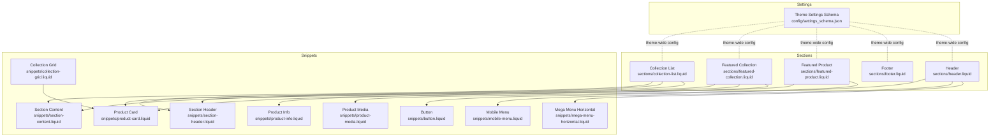
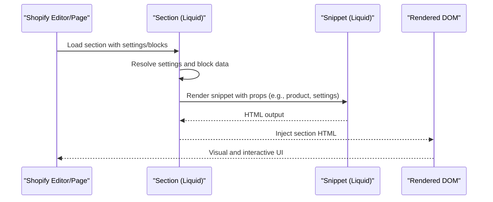
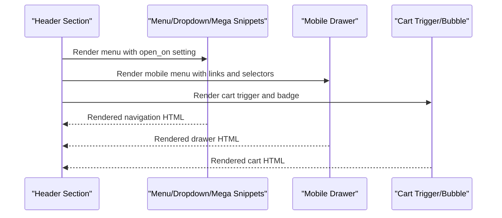
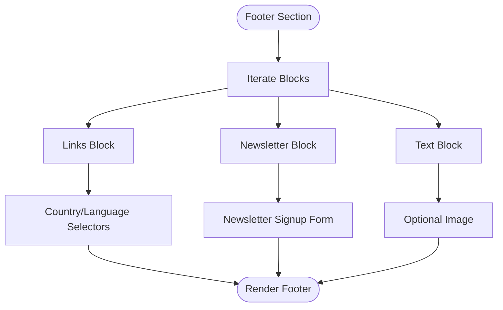
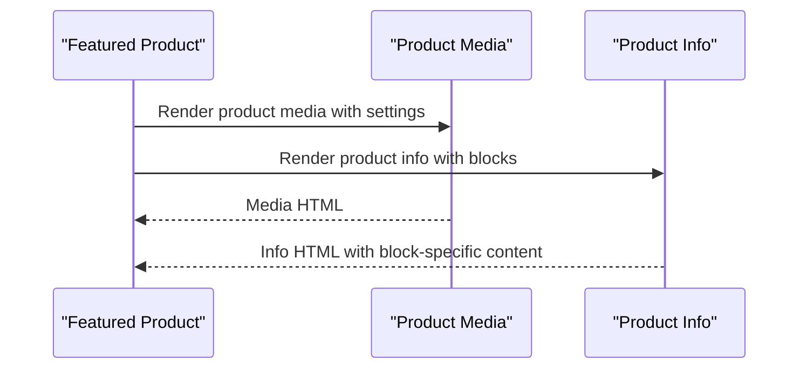
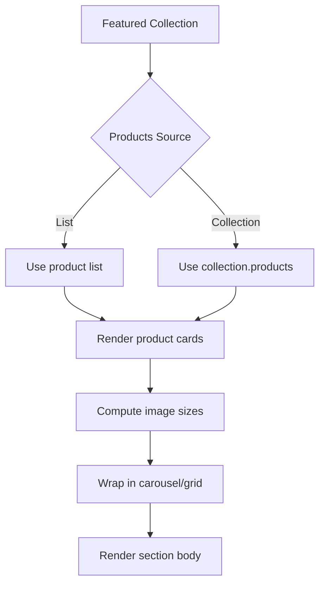
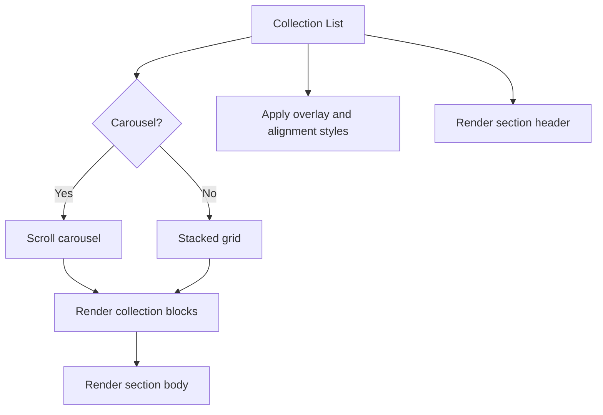
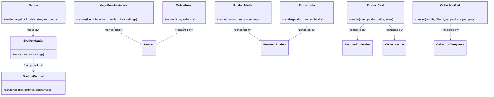
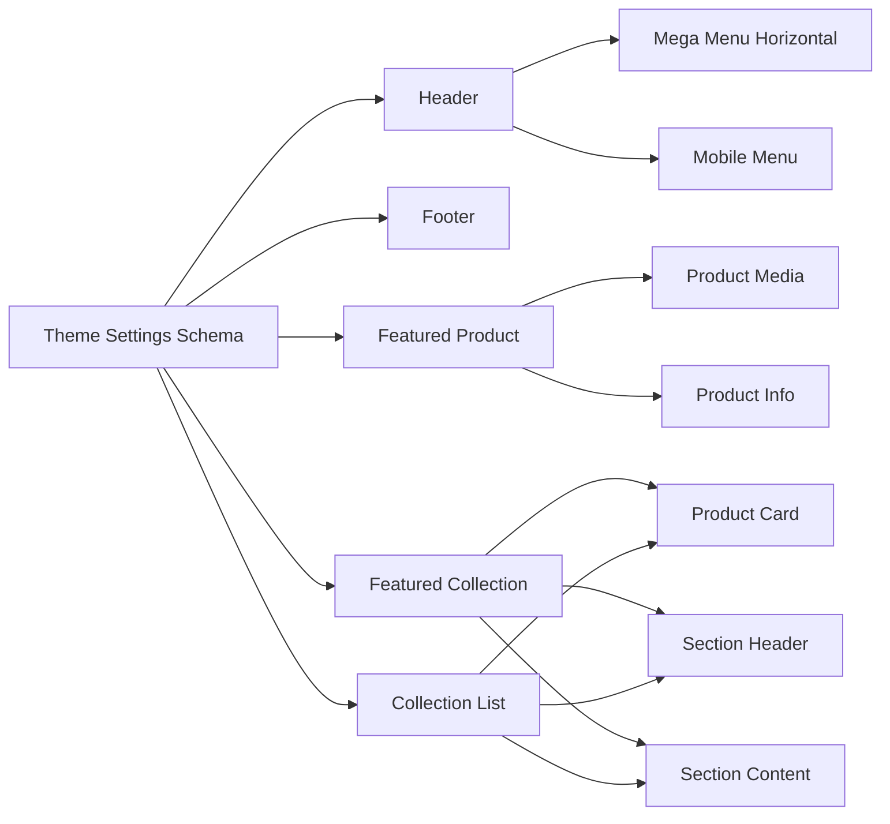

# Component System

<cite>
**Referenced Files in This Document**
- [header.liquid](file://sections/header.liquid)
- [footer.liquid](file://sections/footer.liquid)
- [featured-product.liquid](file://sections/featured-product.liquid)
- [featured-collection.liquid](file://sections/featured-collection.liquid)
- [collection-list.liquid](file://sections/collection-list.liquid)
- [settings_schema.json](file://config/settings_schema.json)
- [section-header.liquid](file://snippets/section-header.liquid)
- [section-content.liquid](file://snippets/section-content.liquid)
- [button.liquid](file://snippets/button.liquid)
- [mega-menu-horizontal.liquid](file://snippets/mega-menu-horizontal.liquid)
- [mobile-menu.liquid](file://snippets/mobile-menu.liquid)
- [product-media.liquid](file://snippets/product-media.liquid)
- [product-info.liquid](file://snippets/product-info.liquid)
- [product-card.liquid](file://snippets/product-card.liquid)
- [collection-grid.liquid](file://snippets/collection-grid.liquid)
</cite>

## Table of Contents
1. [Introduction](#introduction)
2. [Project Structure](#project-structure)
3. [Core Components](#core-components)
4. [Architecture Overview](#architecture-overview)
5. [Detailed Component Analysis](#detailed-component-analysis)
6. [Dependency Analysis](#dependency-analysis)
7. [Performance Considerations](#performance-considerations)
8. [Troubleshooting Guide](#troubleshooting-guide)
9. [Conclusion](#conclusion)
10. [Appendices](#appendices)

## Introduction
This document explains the Igogomi theme’s component system with a focus on:
- Section-based architecture: major sections such as header, footer, product sections, and collection sections
- Snippet system: reusable partials for forms, navigation, media, and UI building blocks
- Composition patterns: how sections orchestrate snippets and pass data via section settings and block configurations
- Prop-like customization: how section settings and block settings act as “props” to configure behavior and appearance
- Integration mechanisms: how components interact across sections and how data flows between them
- Relationship between Liquid templating and component behavior

## Project Structure
The theme organizes presentation logic into:
- Sections: top-level page regions with settings and optional blocks
- Snippets: reusable UI fragments rendered by sections
- Settings schema: global theme settings and presets

**Diagram sources**
- [header.liquid:1-555](file://sections/header.liquid#L1-L555)
- [footer.liquid:1-325](file://sections/footer.liquid#L1-L325)
- [featured-product.liquid:1-1066](file://sections/featured-product.liquid#L1-L1066)
- [featured-collection.liquid:1-237](file://sections/featured-collection.liquid#L1-L237)
- [collection-list.liquid:1-423](file://sections/collection-list.liquid#L1-L423)
- [settings_schema.json:1-1158](file://config/settings_schema.json#L1-L1158)
- [section-header.liquid:1-39](file://snippets/section-header.liquid#L1-L39)
- [section-content.liquid:1-40](file://snippets/section-content.liquid#L1-L40)
- [button.liquid:1-31](file://snippets/button.liquid#L1-L31)
- [mega-menu-horizontal.liquid:1-69](file://snippets/mega-menu-horizontal.liquid#L1-L69)
- [mobile-menu.liquid:1-71](file://snippets/mobile-menu.liquid#L1-L71)
- [product-media.liquid:1-286](file://snippets/product-media.liquid#L1-L286)
- [product-info.liquid:1-208](file://snippets/product-info.liquid#L1-L208)
- [product-card.liquid:1-195](file://snippets/product-card.liquid#L1-L195)
- [collection-grid.liquid:1-72](file://snippets/collection-grid.liquid#L1-L72)

**Section sources**
- [header.liquid:1-555](file://sections/header.liquid#L1-L555)
- [footer.liquid:1-325](file://sections/footer.liquid#L1-L325)
- [featured-product.liquid:1-1066](file://sections/featured-product.liquid#L1-L1066)
- [featured-collection.liquid:1-237](file://sections/featured-collection.liquid#L1-L237)
- [collection-list.liquid:1-423](file://sections/collection-list.liquid#L1-L423)
- [settings_schema.json:1-1158](file://config/settings_schema.json#L1-L1158)

## Core Components
- Section: A region with a schema defining settings and optional blocks. Examples:
  - Header: renders navigation, country/language selectors, cart trigger, and mobile drawer
  - Footer: renders links, text, newsletter, social icons, and payment types
  - Featured Product: composes product media and product info
  - Featured Collection: renders a grid/carousel of product cards
  - Collection List: renders a grid of collection blocks with optional overlays
- Snippet: Reusable UI partials:
  - Section-level helpers: section-header, section-content, button
  - Navigation: mega-menu-horizontal, mobile-menu
  - Product: product-media, product-info, product-card
  - Collections: collection-grid

Customization is achieved via:
- Section settings: define layout, colors, typography, and behavior toggles
- Block settings: define per-block content and behavior (e.g., collection blocks, product info blocks)
- Theme settings schema: global appearance, colors, typography, layout, and product card preferences

**Section sources**
- [header.liquid:276-555](file://sections/header.liquid#L276-L555)
- [footer.liquid:131-325](file://sections/footer.liquid#L131-L325)
- [featured-product.liquid:12-155](file://sections/featured-product.liquid#L12-L155)
- [featured-collection.liquid:62-236](file://sections/featured-collection.liquid#L62-L236)
- [collection-list.liquid:75-422](file://sections/collection-list.liquid#L75-L422)
- [settings_schema.json:1-1158](file://config/settings_schema.json#L1-L1158)

## Architecture Overview
The system follows a declarative, schema-driven pattern:
- Sections declare settings and blocks in their schema
- Sections render snippets and pass data (e.g., product, collection, section settings)
- Snippets encapsulate rendering logic and accept props-like arguments
- Theme settings schema defines global styles and defaults

**Diagram sources**
- [header.liquid:1-555](file://sections/header.liquid#L1-L555)
- [footer.liquid:1-325](file://sections/footer.liquid#L1-L325)
- [featured-product.liquid:1-1066](file://sections/featured-product.liquid#L1-L1066)
- [featured-collection.liquid:1-237](file://sections/featured-collection.liquid#L1-L237)
- [collection-list.liquid:1-423](file://sections/collection-list.liquid#L1-L423)
- [product-media.liquid:1-286](file://snippets/product-media.liquid#L1-L286)
- [product-info.liquid:1-208](file://snippets/product-info.liquid#L1-L208)
- [product-card.liquid:1-195](file://snippets/product-card.liquid#L1-L195)
- [collection-grid.liquid:1-72](file://snippets/collection-grid.liquid#L1-L72)

## Detailed Component Analysis

### Header Section
- Responsibilities:
  - Renders logo, desktop/mobile navigation, country/language selectors, search, and cart
  - Conditionally renders mega menus and dropdowns based on block settings
  - Integrates with mobile drawer and cart modal triggers
- Key snippet integrations:
  - Mega menu horizontal/drawer via block settings
  - Mobile menu drawer
  - Country/language selector dropdowns
  - Cart bubble and modal trigger
- Customization:
  - Sticky mode, layouts, dropdown triggers, transparent header options, logo sizes, selectors visibility

**Diagram sources**
- [header.liquid:120-234](file://sections/header.liquid#L120-L234)
- [mega-menu-horizontal.liquid:1-69](file://snippets/mega-menu-horizontal.liquid#L1-L69)
- [mobile-menu.liquid:1-71](file://snippets/mobile-menu.liquid#L1-L71)

**Section sources**
- [header.liquid:1-555](file://sections/header.liquid#L1-L555)
- [mega-menu-horizontal.liquid:1-69](file://snippets/mega-menu-horizontal.liquid#L1-L69)
- [mobile-menu.liquid:1-71](file://snippets/mobile-menu.liquid#L1-L71)

### Footer Section
- Responsibilities:
  - Renders multiple block types: links, text, newsletter
  - Integrates country/language selectors and social/payment icons
- Customization:
  - Full-width toggle, social/payment visibility, country/language selector toggles

**Diagram sources**
- [footer.liquid:5-129](file://sections/footer.liquid#L5-L129)

**Section sources**
- [footer.liquid:1-325](file://sections/footer.liquid#L1-L325)

### Featured Product Section
- Responsibilities:
  - Compose product media and product info into a sticky sidebar layout
  - Expose extensive media and info customization via settings and blocks
- Data passing:
  - Passes product object to product-media and product-info
  - Product info renders multiple blocks (vendor, title, rating, price, variants, inventory, buy buttons, etc.)

**Diagram sources**
- [featured-product.liquid:1-11](file://sections/featured-product.liquid#L1-L11)
- [product-media.liquid:1-286](file://snippets/product-media.liquid#L1-L286)
- [product-info.liquid:1-208](file://snippets/product-info.liquid#L1-L208)

**Section sources**
- [featured-product.liquid:1-1066](file://sections/featured-product.liquid#L1-L1066)
- [product-media.liquid:1-286](file://snippets/product-media.liquid#L1-L286)
- [product-info.liquid:1-208](file://snippets/product-info.liquid#L1-L208)

### Featured Collection Section
- Responsibilities:
  - Render a grid or carousel of product cards
  - Support section-level heading/content and link
  - Compute image sizes and animation attributes
- Data passing:
  - Uses either a product list or a collection’s products
  - Passes card attributes and image sizes to product-card

**Diagram sources**
- [featured-collection.liquid:1-60](file://sections/featured-collection.liquid#L1-L60)
- [product-card.liquid:1-195](file://snippets/product-card.liquid#L1-L195)

**Section sources**
- [featured-collection.liquid:1-237](file://sections/featured-collection.liquid#L1-L237)
- [product-card.liquid:1-195](file://snippets/product-card.liquid#L1-L195)

### Collection List Section
- Responsibilities:
  - Render a grid of collection blocks with optional overlays and labels
  - Support carousel vs stack modes, alignment, and overlay styling
  - Render section header and apply section-level styles
- Data passing:
  - Iterates over blocks to render collection-blocks
  - Applies item attributes and block context

**Diagram sources**
- [collection-list.liquid:1-73](file://sections/collection-list.liquid#L1-L73)

**Section sources**
- [collection-list.liquid:1-423](file://sections/collection-list.liquid#L1-L423)

### Snippet System: Reusable UI Elements
- Section-level helpers:
  - section-header: renders heading/subheading/content and optional link
  - section-content: renders heading/subheading/content and optional button
  - button: renders anchor or button with style and color vars
- Navigation:
  - mega-menu-horizontal: renders a horizontal mega menu with promo images
  - mobile-menu: renders a mobile drawer with links and optional selectors
- Product:
  - product-media: renders media grid/carousel with thumbnails and indicators
  - product-info: renders product details and controls via block composition
  - product-card: renders a single product card with badges, ratings, and quick add
- Collections:
  - collection-grid: renders filters, sort, results, and paginated product grid

**Diagram sources**
- [section-header.liquid:1-39](file://snippets/section-header.liquid#L1-L39)
- [section-content.liquid:1-40](file://snippets/section-content.liquid#L1-L40)
- [button.liquid:1-31](file://snippets/button.liquid#L1-L31)
- [mega-menu-horizontal.liquid:1-69](file://snippets/mega-menu-horizontal.liquid#L1-L69)
- [mobile-menu.liquid:1-71](file://snippets/mobile-menu.liquid#L1-L71)
- [product-media.liquid:1-286](file://snippets/product-media.liquid#L1-L286)
- [product-info.liquid:1-208](file://snippets/product-info.liquid#L1-L208)
- [product-card.liquid:1-195](file://snippets/product-card.liquid#L1-L195)
- [collection-grid.liquid:1-72](file://snippets/collection-grid.liquid#L1-L72)

**Section sources**
- [section-header.liquid:1-39](file://snippets/section-header.liquid#L1-L39)
- [section-content.liquid:1-40](file://snippets/section-content.liquid#L1-L40)
- [button.liquid:1-31](file://snippets/button.liquid#L1-L31)
- [mega-menu-horizontal.liquid:1-69](file://snippets/mega-menu-horizontal.liquid#L1-L69)
- [mobile-menu.liquid:1-71](file://snippets/mobile-menu.liquid#L1-L71)
- [product-media.liquid:1-286](file://snippets/product-media.liquid#L1-L286)
- [product-info.liquid:1-208](file://snippets/product-info.liquid#L1-L208)
- [product-card.liquid:1-195](file://snippets/product-card.liquid#L1-L195)
- [collection-grid.liquid:1-72](file://snippets/collection-grid.liquid#L1-L72)

## Dependency Analysis
- Sections depend on snippets for rendering:
  - Header depends on mega-menu and mobile-menu snippets
  - Featured Product depends on product-media and product-info
  - Featured/Collection lists depend on product-card
  - Collection List depends on collection-blocks and section-header/content
- Global theme settings influence:
  - Colors, typography, layout spacing, and product card behavior
  - Applied via CSS variables and color helpers in snippets

**Diagram sources**
- [settings_schema.json:1-1158](file://config/settings_schema.json#L1-L1158)
- [header.liquid:1-555](file://sections/header.liquid#L1-L555)
- [footer.liquid:1-325](file://sections/footer.liquid#L1-L325)
- [featured-product.liquid:1-1066](file://sections/featured-product.liquid#L1-L1066)
- [featured-collection.liquid:1-237](file://sections/featured-collection.liquid#L1-L237)
- [collection-list.liquid:1-423](file://sections/collection-list.liquid#L1-L423)
- [product-media.liquid:1-286](file://snippets/product-media.liquid#L1-L286)
- [product-info.liquid:1-208](file://snippets/product-info.liquid#L1-L208)
- [product-card.liquid:1-195](file://snippets/product-card.liquid#L1-L195)
- [section-header.liquid:1-39](file://snippets/section-header.liquid#L1-L39)
- [section-content.liquid:1-40](file://snippets/section-content.liquid#L1-L40)

**Section sources**
- [settings_schema.json:1-1158](file://config/settings_schema.json#L1-L1158)
- [header.liquid:1-555](file://sections/header.liquid#L1-L555)
- [footer.liquid:1-325](file://sections/footer.liquid#L1-L325)
- [featured-product.liquid:1-1066](file://sections/featured-product.liquid#L1-L1066)
- [featured-collection.liquid:1-237](file://sections/featured-collection.liquid#L1-L237)
- [collection-list.liquid:1-423](file://sections/collection-list.liquid#L1-L423)

## Performance Considerations
- Lazy loading and LQIP placeholders are used in product-card and product-media to improve perceived performance
- Adaptive height and fit-height options reduce layout shifts
- Conditional rendering of selectors and modals reduces unnecessary DOM
- Carousel and grid modes allow efficient scrolling and virtualized rendering of items

[No sources needed since this section provides general guidance]

## Troubleshooting Guide
- Navigation issues:
  - Verify menu link lists and mega menu block associations
  - Confirm dropdown interaction handler setting
- Product media problems:
  - Check media layout and indicator settings
  - Ensure product has media and variant selection is correct
- Collection grid issues:
  - Confirm filter type and sticky sidebar conditions
  - Verify pagination and results count rendering
- Color and typography:
  - Review theme settings schema for color and font choices
  - Ensure CSS variables are applied consistently across snippets

**Section sources**
- [header.liquid:120-234](file://sections/header.liquid#L120-L234)
- [product-media.liquid:165-254](file://snippets/product-media.liquid#L165-L254)
- [collection-grid.liquid:17-72](file://snippets/collection-grid.liquid#L17-L72)
- [settings_schema.json:1-1158](file://config/settings_schema.json#L1-L1158)

## Conclusion
Igogomi’s component system combines schema-driven sections with reusable snippets to deliver a flexible, customizable storefront. Sections act as orchestrators, while snippets encapsulate UI logic and styling. Prop-like settings and blocks enable precise customization, and theme settings provide global consistency. The architecture supports modular composition, predictable data flow, and scalable enhancements.

[No sources needed since this section summarizes without analyzing specific files]

## Appendices

### Component Composition Patterns
- Section-to-snippet rendering: sections call snippets with explicit props (e.g., product, settings)
- Block composition: sections iterate over blocks to render specialized content
- Conditional rendering: sections and snippets adapt behavior based on settings and availability

**Section sources**
- [featured-product.liquid:1-11](file://sections/featured-product.liquid#L1-L11)
- [product-info.liquid:25-195](file://snippets/product-info.liquid#L25-L195)
- [product-card.liquid:1-195](file://snippets/product-card.liquid#L1-L195)

### Prop-like Settings Through Section Configurations
- Section settings: define layout, colors, typography, and behavior toggles
- Block settings: define per-block content and behavior
- Theme settings schema: global defaults and presets

**Section sources**
- [header.liquid:276-555](file://sections/header.liquid#L276-L555)
- [footer.liquid:131-325](file://sections/footer.liquid#L131-L325)
- [featured-product.liquid:12-155](file://sections/featured-product.liquid#L12-L155)
- [featured-collection.liquid:62-236](file://sections/featured-collection.liquid#L62-L236)
- [collection-list.liquid:75-422](file://sections/collection-list.liquid#L75-L422)
- [settings_schema.json:1-1158](file://config/settings_schema.json#L1-L1158)