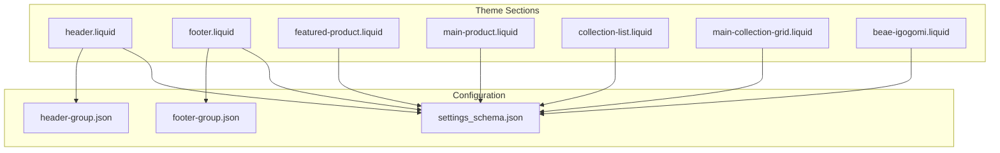
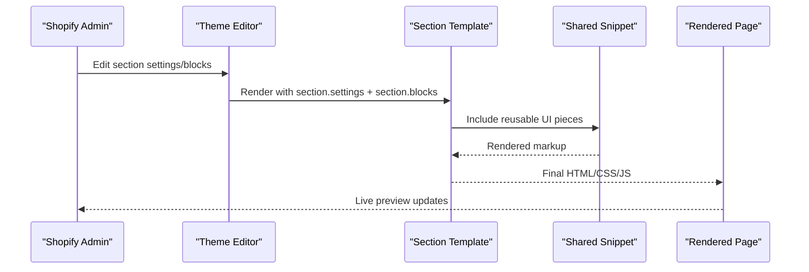
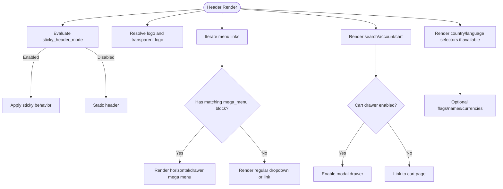
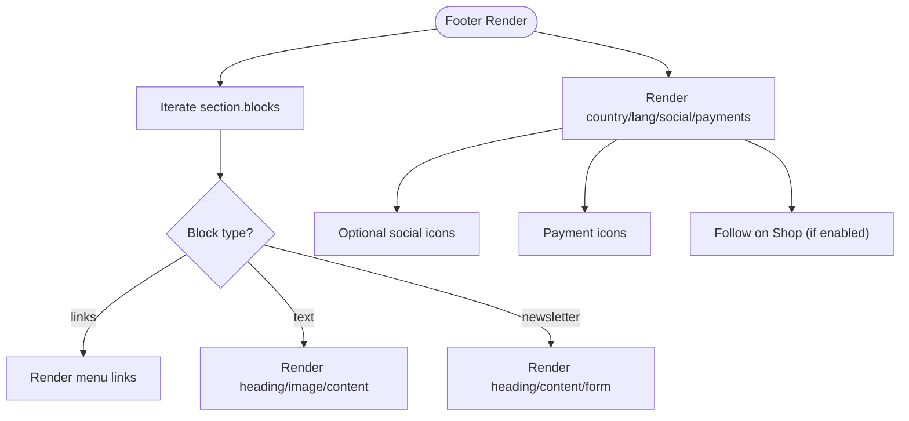
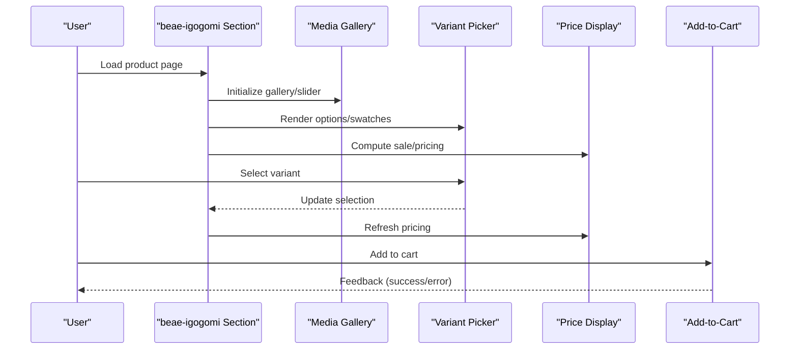
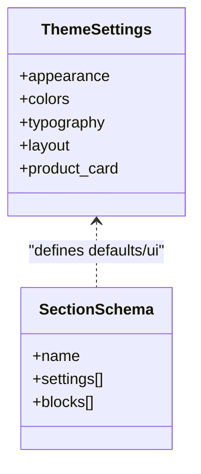
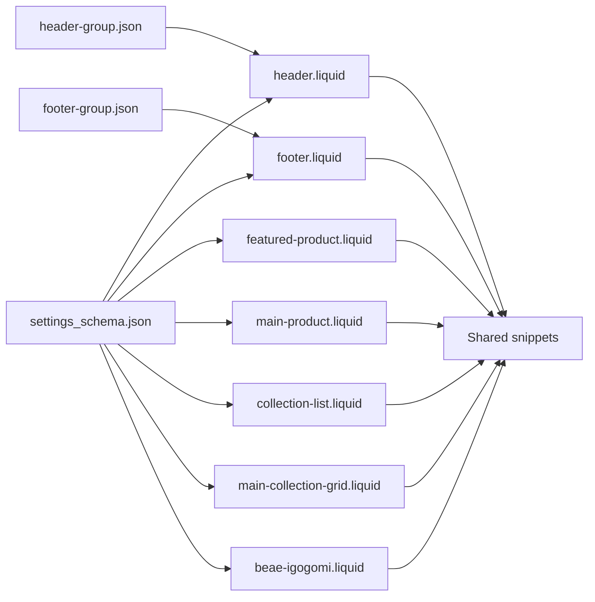

# Sections

<cite>
**Referenced Files in This Document**
- [header.liquid](file://sections/header.liquid)
- [footer.liquid](file://sections/footer.liquid)
- [beae-igogomi.liquid](file://sections/beae-igogomi.liquid)
- [featured-product.liquid](file://sections/featured-product.liquid)
- [main-product.liquid](file://sections/main-product.liquid)
- [collection-list.liquid](file://sections/collection-list.liquid)
- [main-collection-grid.liquid](file://sections/main-collection-grid.liquid)
- [settings_schema.json](file://config/settings_schema.json)
- [header-group.json](file://sections/header-group.json)
- [footer-group.json](file://sections/footer-group.json)
</cite>

## Table of Contents
1. [Introduction](#introduction)
2. [Project Structure](#project-structure)
3. [Core Components](#core-components)
4. [Architecture Overview](#architecture-overview)
5. [Detailed Component Analysis](#detailed-component-analysis)
6. [Dependency Analysis](#dependency-analysis)
7. [Performance Considerations](#performance-considerations)
8. [Troubleshooting Guide](#troubleshooting-guide)
9. [Conclusion](#conclusion)

## Introduction
This document explains the Igogomi theme’s section system, a Shopify theme architecture built around reusable, configurable sections. Sections encapsulate UI and behavior for distinct page regions (header, footer, product showcases, collections) and expose settings and blocks via Shopify’s theme editor. It covers:
- Section-based architecture and how sections integrate with Liquid templating
- Header section features: navigation, logo configuration, sticky modes, internationalization, and mega menus
- Footer section structure and content organization
- Product-focused sections: beae-igogomi, featured-product, and main-product
- Collection sections: collection-list and main-collection-grid
- Schema-based configuration system for admin customization
- Examples of section settings, block configurations, and responsive behaviors

## Project Structure
The theme organizes sections under the sections directory, each rendering a specific UI region or content area. Settings and presets are configured via settings_schema.json and grouped sections via JSON files.

**Diagram sources**
- [header.liquid](file://sections/header.liquid)
- [footer.liquid](file://sections/footer.liquid)
- [featured-product.liquid](file://sections/featured-product.liquid)
- [main-product.liquid](file://sections/main-product.liquid)
- [collection-list.liquid](file://sections/collection-list.liquid)
- [main-collection-grid.liquid](file://sections/main-collection-grid.liquid)
- [beae-igogomi.liquid](file://sections/beae-igogomi.liquid)
- [settings_schema.json](file://config/settings_schema.json)
- [header-group.json](file://sections/header-group.json)
- [footer-group.json](file://sections/footer-group.json)

**Section sources**
- [header.liquid](file://sections/header.liquid)
- [footer.liquid](file://sections/footer.liquid)
- [featured-product.liquid](file://sections/featured-product.liquid)
- [main-product.liquid](file://sections/main-product.liquid)
- [collection-list.liquid](file://sections/collection-list.liquid)
- [main-collection-grid.liquid](file://sections/main-collection-grid.liquid)
- [beae-igogomi.liquid](file://sections/beae-igogomi.liquid)
- [settings_schema.json](file://config/settings_schema.json)
- [header-group.json](file://sections/header-group.json)
- [footer-group.json](file://sections/footer-group.json)

## Core Components
- Section settings: Define global configuration per section (e.g., layout, colors, typography, behavior toggles).
- Blocks: Reusable child components within a section (e.g., footer links, collection items, product highlights).
- Schema: Defines the settings UI shown in the Shopify theme editor, enabling admin-driven customization.
- Group presets: JSON files that preconfigure sections and blocks for common setups (e.g., header-group.json, footer-group.json).

Key capabilities demonstrated:
- Dynamic navigation rendering with mega menu integration
- Internationalization selectors (country/language)
- Transparent header with dynamic styles
- Product media galleries, variants, pricing, and add-to-cart flows
- Collection grids with filters, sorting, and pagination
- Responsive layouts and sticky behaviors

**Section sources**
- [header.liquid](file://sections/header.liquid)
- [footer.liquid](file://sections/footer.liquid)
- [featured-product.liquid](file://sections/featured-product.liquid)
- [main-product.liquid](file://sections/main-product.liquid)
- [collection-list.liquid](file://sections/collection-list.liquid)
- [main-collection-grid.liquid](file://sections/main-collection-grid.liquid)
- [beae-igogomi.liquid](file://sections/beae-igogomi.liquid)
- [settings_schema.json](file://config/settings_schema.json)
- [header-group.json](file://sections/header-group.json)
- [footer-group.json](file://sections/footer-group.json)

## Architecture Overview
Sections are rendered as HTML with embedded Liquid logic and styled via theme settings. They rely on shared snippets for common UI elements (e.g., product cards, media, navigation). The schema system exposes a settings UI in the Shopify admin, while group JSON files provide ready-to-use configurations.

**Diagram sources**
- [header.liquid](file://sections/header.liquid)
- [footer.liquid](file://sections/footer.liquid)
- [featured-product.liquid](file://sections/featured-product.liquid)
- [main-product.liquid](file://sections/main-product.liquid)
- [collection-list.liquid](file://sections/collection-list.liquid)
- [main-collection-grid.liquid](file://sections/main-collection-grid.liquid)
- [beae-igogomi.liquid](file://sections/beae-igogomi.liquid)
- [settings_schema.json](file://config/settings_schema.json)

## Detailed Component Analysis

### Header Section
The header section renders the site’s branding, navigation, actions (search, account, cart), and internationalization controls. It supports:
- Sticky header modes (disabled, scroll-up, always-visible)
- Logo configuration with separate transparent variant
- Desktop/mobile layouts (logo-left/nav-left, logo-left/nav-center, logo-center)
- Dropdown interaction modes (click/hover)
- Country/language selectors with flags, names, and currencies
- Mega menu blocks for advanced navigation

**Diagram sources**
- [header.liquid](file://sections/header.liquid)

**Section sources**
- [header.liquid](file://sections/header.liquid)

### Footer Section
The footer aggregates multiple content blocks:
- Links block: renders a menu as a column of links
- Text block: displays heading, optional image, and rich text content
- Newsletter block: renders heading, content, and a styled subscription form

It also integrates country/language selectors and social/payment icons, with optional follow-on-shop integration.

**Diagram sources**
- [footer.liquid](file://sections/footer.liquid)

**Section sources**
- [footer.liquid](file://sections/footer.liquid)

### Product-Focused Sections

#### beae-igogomi
This section orchestrates a rich product detail experience, integrating media, tabs, variants, pricing, inventory, and add-to-cart. It includes:
- Media gallery with slider/carousel behavior
- Tabs for description/specifications
- Variant picker with swatches and size guide integration
- Pricing display with sale badges
- Inventory indicators and low-stock messaging
- Add-to-cart and buy-now buttons
- Local pickup availability

**Diagram sources**
- [beae-igogomi.liquid](file://sections/beae-igogomi.liquid)

**Section sources**
- [beae-igogomi.liquid](file://sections/beae-igogomi.liquid)

#### featured-product
A compact product showcase section that renders a single product’s media and info, with extensive media configuration (width, layout, zoom, indicators) and color overrides.

**Section sources**
- [featured-product.liquid](file://sections/featured-product.liquid)

#### main-product
The primary product detail section with sticky add-to-cart, breadcrumbs toggle, and comprehensive block system for vendor, title, rating, SKU, highlights, price, installments, variant picker, inventory, quantity selector, buy buttons, pickup availability, complementary products, share button, and rich text blocks.

**Section sources**
- [main-product.liquid](file://sections/main-product.liquid)

### Collection Sections

#### collection-list
Displays a grid or carousel of collections with overlay or label styles. Supports:
- Grid columns (desktop/mobile)
- Content alignment and overlay configuration
- Title sizing and section headings
- Color overrides for backgrounds/text/headings

**Section sources**
- [collection-list.liquid](file://sections/collection-list.liquid)

#### main-collection-grid
Renders a full product catalog with:
- Products per row (desktop/mobile)
- Pagination (classic/load-more)
- Filters (vertical/horizontal/drawer), sorting, results count
- Promo tiles as blocks
- Color and spacing settings

**Section sources**
- [main-collection-grid.liquid](file://sections/main-collection-grid.liquid)

### Schema-Based Configuration System
The theme uses settings_schema.json to define:
- Appearance: corner radii, input styles, icon styles, image shade settings
- Colors: general, buttons, header/footer/product/card/sale badges, cart modals, article categories, alerts
- Typography: fonts, letter spacing, button/label/navigation/product card/accordion styles
- Layout: page width, spacing between sections/blocks
- Product card: visibility toggles and quick add behavior

Sections declare their own settings and blocks in their schema blocks, enabling:
- Admin UI for section-level customization
- Block-level composition (e.g., product highlights, variant picker, complementary products)
- Preset groups (header-group.json, footer-group.json) to quickly apply common configurations

**Diagram sources**
- [settings_schema.json](file://config/settings_schema.json)
- [header.liquid](file://sections/header.liquid)
- [footer.liquid](file://sections/footer.liquid)
- [featured-product.liquid](file://sections/featured-product.liquid)
- [main-product.liquid](file://sections/main-product.liquid)
- [collection-list.liquid](file://sections/collection-list.liquid)
- [main-collection-grid.liquid](file://sections/main-collection-grid.liquid)
- [beae-igogomi.liquid](file://sections/beae-igogomi.liquid)

**Section sources**
- [settings_schema.json](file://config/settings_schema.json)
- [header.liquid](file://sections/header.liquid)
- [footer.liquid](file://sections/footer.liquid)
- [featured-product.liquid](file://sections/featured-product.liquid)
- [main-product.liquid](file://sections/main-product.liquid)
- [collection-list.liquid](file://sections/collection-list.liquid)
- [main-collection-grid.liquid](file://sections/main-collection-grid.liquid)
- [beae-igogomi.liquid](file://sections/beae-igogomi.liquid)

## Dependency Analysis
- Sections depend on shared snippets for product media/info, navigation, and UI elements.
- Section settings reference theme-wide settings (colors, typography, layout) from settings_schema.json.
- Group JSON files (header-group.json, footer-group.json) predefine section and block configurations for quick setup.

**Diagram sources**
- [settings_schema.json](file://config/settings_schema.json)
- [header.liquid](file://sections/header.liquid)
- [footer.liquid](file://sections/footer.liquid)
- [featured-product.liquid](file://sections/featured-product.liquid)
- [main-product.liquid](file://sections/main-product.liquid)
- [collection-list.liquid](file://sections/collection-list.liquid)
- [main-collection-grid.liquid](file://sections/main-collection-grid.liquid)
- [beae-igogomi.liquid](file://sections/beae-igogomi.liquid)
- [header-group.json](file://sections/header-group.json)
- [footer-group.json](file://sections/footer-group.json)

**Section sources**
- [settings_schema.json](file://config/settings_schema.json)
- [header.liquid](file://sections/header.liquid)
- [footer.liquid](file://sections/footer.liquid)
- [featured-product.liquid](file://sections/featured-product.liquid)
- [main-product.liquid](file://sections/main-product.liquid)
- [collection-list.liquid](file://sections/collection-list.liquid)
- [main-collection-grid.liquid](file://sections/main-collection-grid.liquid)
- [beae-igogomi.liquid](file://sections/beae-igogomi.liquid)
- [header-group.json](file://sections/header-group.json)
- [footer-group.json](file://sections/footer-group.json)

## Performance Considerations
- Lazy-loading images in galleries and carousels reduces initial payload.
- Conditional rendering of cart drawers avoids unnecessary JavaScript when cart is a page.
- Sticky header mode affects scroll performance; choose “scroll-up” or “disabled” for heavy pages.
- Media layout and zoom options impact resource usage; prefer optimized image sizes and lightbox only when needed.
- Collection grids with filters and pagination should leverage “load-more” for large catalogs to reduce DOM.

## Troubleshooting Guide
- Mega menu not appearing: ensure a matching “mega_menu” block exists for the targeted menu item and that the type is set (horizontal/drawer).
- Transparent header not applying: verify “text_color_header_transparent” and “logo_header_transparent” are configured; confirm sticky mode enables transparent header styles.
- Country/language selectors missing: enable selectors and ensure multiple markets/languages are configured in the Shopify admin.
- Product media not updating: check media settings (layout, zoom, indicators) and ensure variant selection triggers media refresh.
- Collection grid empty: verify collection has products and pagination/filter settings are not hiding results unintentionally.

**Section sources**
- [header.liquid](file://sections/header.liquid)
- [footer.liquid](file://sections/footer.liquid)
- [main-collection-grid.liquid](file://sections/main-collection-grid.liquid)
- [beae-igogomi.liquid](file://sections/beae-igogomi.liquid)

## Conclusion
Igogomi’s section system provides a modular, admin-friendly foundation for building storefront experiences. Sections encapsulate UI logic, leverage shared snippets for consistency, and expose powerful configuration via schemas and group presets. By combining section settings, blocks, and theme-wide settings, merchants can tailor navigation, product presentation, and collection browsing to meet diverse business needs while maintaining responsive, accessible layouts.