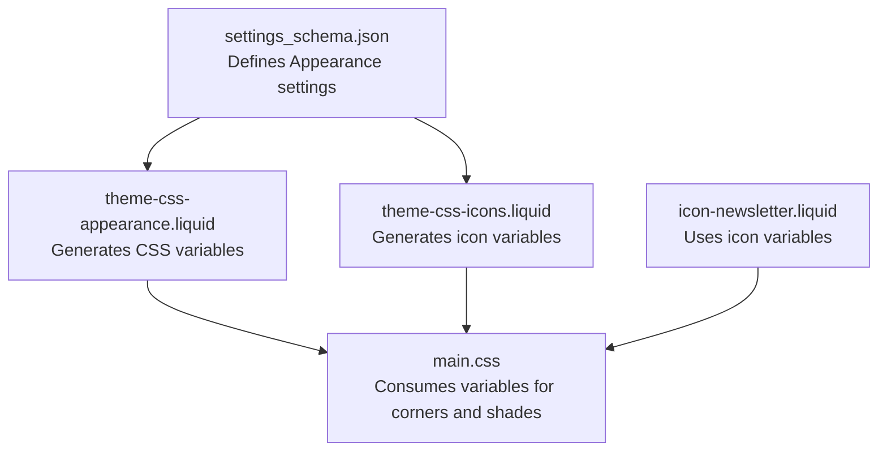
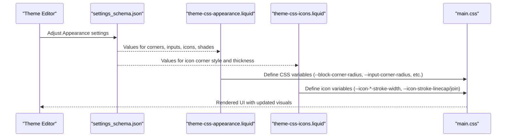
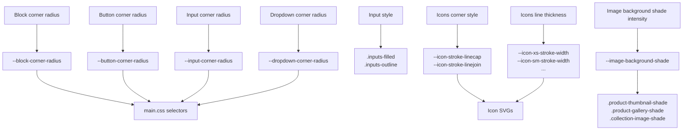
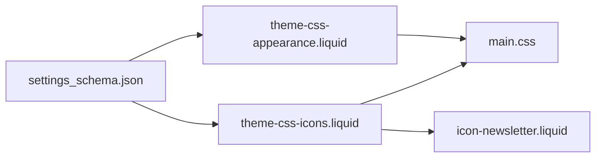

# Appearance Settings

<cite>
**Referenced Files in This Document**
- [settings_schema.json](file://config/settings_schema.json)
- [en.default.schema.json](file://locales/en.default.schema.json)
- [theme-css-appearance.liquid](file://snippets/theme-css-appearance.liquid)
- [theme-css-icons.liquid](file://snippets/theme-css-icons.liquid)
- [main.css](file://assets/main.css)
- [icon-newsletter.liquid](file://snippets/icon-newsletter.liquid)
</cite>

## Table of Contents
1. [Introduction](#introduction)
2. [Project Structure](#project-structure)
3. [Core Components](#core-components)
4. [Architecture Overview](#architecture-overview)
5. [Detailed Component Analysis](#detailed-component-analysis)
6. [Dependency Analysis](#dependency-analysis)
7. [Performance Considerations](#performance-considerations)
8. [Troubleshooting Guide](#troubleshooting-guide)
9. [Conclusion](#conclusion)

## Introduction
This document explains the Appearance settings category in the Igogomi theme configuration system. It covers corner radius controls for blocks, buttons, inputs, and dropdowns; input style options (filled vs outline); icon corner styles (round vs square) and line thickness variations (thin, normal, bold); and image background shade settings for collection images, product thumbnails, and gallery images, including intensity controls. It also describes how these settings relate to generated CSS variables and provides best practices for maintaining visual consistency across elements.

## Project Structure
The Appearance settings are defined in the theme’s settings schema and rendered into runtime CSS variables via Liquid snippets. The CSS that consumes these variables lives in the global stylesheet.

**Diagram sources**
- [settings_schema.json:11-151](file://config/settings_schema.json#L11-L151)
- [theme-css-appearance.liquid:1-67](file://snippets/theme-css-appearance.liquid#L1-L67)
- [theme-css-icons.liquid:1-53](file://snippets/theme-css-icons.liquid#L1-L53)
- [main.css:2052-2252](file://assets/main.css#L2052-L2252)
- [icon-newsletter.liquid:1-17](file://snippets/icon-newsletter.liquid#L1-L17)

**Section sources**
- [settings_schema.json:11-151](file://config/settings_schema.json#L11-L151)
- [theme-css-appearance.liquid:1-67](file://snippets/theme-css-appearance.liquid#L1-L67)
- [theme-css-icons.liquid:1-53](file://snippets/theme-css-icons.liquid#L1-L53)
- [main.css:2052-2252](file://assets/main.css#L2052-L2252)
- [icon-newsletter.liquid:1-17](file://snippets/icon-newsletter.liquid#L1-L17)

## Core Components
- Corner radius controls:
  - Block corner radius: affects general blocks and containers.
  - Button corner radius: affects interactive buttons.
  - Input corner radius: affects form inputs and related controls.
  - Dropdown corner radius: affects select/dropdown elements.
- Input style:
  - Filled: inputs have a solid background with subtle borders.
  - Outline: inputs have a bordered style with minimal background.
- Icon styling:
  - Corner style: round or square for icon strokes.
  - Line thickness: thin, normal, or bold affecting stroke widths.
- Image background shade:
  - Enable/disable per image type: collection images, product thumbnails, product gallery.
  - Intensity: percentage controlling brightness to simulate a light gray background behind white areas.

These settings are defined in the settings schema and exposed to the theme editor UI. Their runtime values are injected into CSS variables via Liquid snippets and consumed by CSS selectors.

**Section sources**
- [settings_schema.json:11-151](file://config/settings_schema.json#L11-L151)
- [en.default.schema.json:195-262](file://locales/en.default.schema.json#L195-L262)
- [theme-css-appearance.liquid:1-67](file://snippets/theme-css-appearance.liquid#L1-L67)
- [theme-css-icons.liquid:1-53](file://snippets/theme-css-icons.liquid#L1-L53)
- [main.css:2052-2252](file://assets/main.css#L2052-L2252)

## Architecture Overview
The Appearance settings pipeline:

**Diagram sources**
- [settings_schema.json:11-151](file://config/settings_schema.json#L11-L151)
- [theme-css-appearance.liquid:1-67](file://snippets/theme-css-appearance.liquid#L1-L67)
- [theme-css-icons.liquid:1-53](file://snippets/theme-css-icons.liquid#L1-L53)
- [main.css:2052-2252](file://assets/main.css#L2052-L2252)

## Detailed Component Analysis

### Corner Radius Controls
- Purpose: Control the roundedness of UI elements consistently across the theme.
- Settings:
  - Block corner radius: base unit for general containers.
  - Button corner radius: specific rounding for buttons.
  - Input corner radius: rounding for form inputs and toggles.
  - Dropdown corner radius: rounding for select/dropdown menus.
- Generated variables:
  - Root variables define base radii and derived sizes for small and extra-small elements.
- CSS usage:
  - Inputs and checkboxes use the input corner radius variable for consistent rounding.
  - Buttons and other interactive elements use button corner radius.
  - General blocks derive smaller variants from the block corner radius.

Practical effects:
- Higher values increase visual softness and modernity.
- Lower values convey crisp, geometric aesthetics.
- Consistency across inputs, buttons, and dropdowns improves usability.

Best practices:
- Keep input and dropdown radii equal to maintain uniformity in form groups.
- Match button radii to block radii for cohesive container boundaries.

**Section sources**
- [settings_schema.json:17-56](file://config/settings_schema.json#L17-L56)
- [theme-css-appearance.liquid:2-9](file://snippets/theme-css-appearance.liquid#L2-L9)
- [main.css:2230-2232](file://assets/main.css#L2230-L2232)

### Input Style: Filled vs Outline
- Purpose: Choose between solid background inputs and bordered inputs.
- Settings:
  - Select between filled and outline styles.
- Generated variables:
  - No dedicated CSS variables; the style is applied via class-based modifiers on input containers.
- CSS usage:
  - Filled inputs use a “filled” modifier class that applies a subtle background and ring-based focus states.
  - Outline inputs use an “outline” modifier class that emphasizes borders and lighter focus rings.

Practical effects:
- Filled inputs visually group content and reduce perceived complexity.
- Outline inputs emphasize edges and work well in dense layouts.

Best practices:
- Use filled inputs for primary forms and outline inputs for secondary or lightweight contexts.
- Maintain consistent focus and hover states across both styles.

**Section sources**
- [settings_schema.json:61-76](file://config/settings_schema.json#L61-L76)
- [main.css:2081-2131](file://assets/main.css#L2081-L2131)

### Icon Corner Styles and Line Thickness
- Purpose: Control the visual weight and joint style of icons.
- Settings:
  - Corner style: round or square for stroke joins and caps.
  - Line thickness: thin, normal, or bold affecting stroke widths.
- Generated variables:
  - Icon stroke widths for extra-small to extra-large sizes.
  - Global stroke width defaults to medium.
  - Stroke linecap and linejoin set to the chosen corner style.
- CSS usage:
  - Icon SVGs consume the stroke width and line style variables.
  - Some icons switch between rounded and sharp path shapes depending on the corner style setting.

Practical effects:
- Thin icons appear delicate and minimal.
- Bold icons stand out strongly against backgrounds.
- Round joins/caps soften edges; square creates sharper intersections.

Best practices:
- Pair icon thickness with surrounding typography and spacing.
- Prefer consistent corner style across icon sets for visual harmony.

**Section sources**
- [settings_schema.json:81-116](file://config/settings_schema.json#L81-L116)
- [theme-css-icons.liquid:25-51](file://snippets/theme-css-icons.liquid#L25-L51)
- [icon-newsletter.liquid:10-16](file://snippets/icon-newsletter.liquid#L10-L16)

### Image Background Shade
- Purpose: Improve image visibility by simulating a light gray background behind white areas.
- Settings:
  - Enable shade for collection images, product thumbnails, and product gallery.
  - Intensity: percentage determining brightness reduction.
- Generated variables:
  - A computed brightness factor derived from intensity.
- CSS usage:
  - Product thumbnails: apply a brightness filter to the thumbnail elements.
  - Product gallery: add a semi-transparent dark overlay and apply brightness to enlarged images.
  - Collection images: apply a brightness filter to improve contrast.

Practical effects:
- Increases perceived contrast between images and backgrounds.
- Enhances readability and visual separation in grids.

Best practices:
- Use moderate intensity to avoid posterization or unnatural darkening.
- Test across different image types and backgrounds to balance visibility and fidelity.

**Section sources**
- [settings_schema.json:118-149](file://config/settings_schema.json#L118-L149)
- [theme-css-appearance.liquid:11](file://snippets/theme-css-appearance.liquid#L11)
- [theme-css-appearance.liquid:39-65](file://snippets/theme-css-appearance.liquid#L39-L65)

### Relationship Between Settings and CSS Variables
The following diagram maps key Appearance settings to their generated CSS variables and consuming CSS:

**Diagram sources**
- [theme-css-appearance.liquid:2-9](file://snippets/theme-css-appearance.liquid#L2-L9)
- [theme-css-appearance.liquid:11](file://snippets/theme-css-appearance.liquid#L11)
- [theme-css-icons.liquid:25-51](file://snippets/theme-css-icons.liquid#L25-L51)
- [main.css:2081-2252](file://assets/main.css#L2081-L2252)

## Dependency Analysis
- Settings schema defines the configuration surface.
- Liquid snippets translate settings into CSS variables and conditional styles.
- CSS consumes these variables and applies them to selectors for visual rendering.
- Icons consume icon-specific variables for stroke and shape behavior.

**Diagram sources**
- [settings_schema.json:11-151](file://config/settings_schema.json#L11-L151)
- [theme-css-appearance.liquid:1-67](file://snippets/theme-css-appearance.liquid#L1-L67)
- [theme-css-icons.liquid:1-53](file://snippets/theme-css-icons.liquid#L1-L53)
- [main.css:2052-2252](file://assets/main.css#L2052-L2252)
- [icon-newsletter.liquid:1-17](file://snippets/icon-newsletter.liquid#L1-L17)

**Section sources**
- [settings_schema.json:11-151](file://config/settings_schema.json#L11-L151)
- [theme-css-appearance.liquid:1-67](file://snippets/theme-css-appearance.liquid#L1-L67)
- [theme-css-icons.liquid:1-53](file://snippets/theme-css-icons.liquid#L1-L53)
- [main.css:2052-2252](file://assets/main.css#L2052-L2252)
- [icon-newsletter.liquid:1-17](file://snippets/icon-newsletter.liquid#L1-L17)

## Performance Considerations
- CSS variables minimize repeated style declarations and enable efficient updates when settings change.
- Filters (brightness) applied conditionally only when enabled prevent unnecessary processing.
- Using scalable vector graphics (SVG) for icons ensures crisp rendering at any size without rasterization costs.

## Troubleshooting Guide
- Inputs do not reflect rounded corners:
  - Verify input corner radius is greater than zero and that inputs use the intended modifier class for filled or outline styles.
  - Confirm the input selector consumes the input corner radius variable.
- Icon strokes appear too thick or thin:
  - Adjust icon line thickness to match the desired visual weight.
  - Ensure the icon’s stroke width variable is applied consistently.
- Gallery overlay not visible:
  - Confirm the product gallery shade setting is enabled and that the overlay and image filters are present in the DOM.
- Images look too dark or washed out:
  - Reduce intensity or disable the shade feature for specific image types.

**Section sources**
- [main.css:2230-2232](file://assets/main.css#L2230-L2232)
- [theme-css-appearance.liquid:39-65](file://snippets/theme-css-appearance.liquid#L39-L65)
- [theme-css-icons.liquid:25-51](file://snippets/theme-css-icons.liquid#L25-L51)

## Conclusion
The Appearance settings provide a cohesive toolkit for shaping the theme’s visual identity. By centralizing corner radii, input styles, icon treatment, and image shading into CSS variables, the theme achieves consistent, maintainable styling across blocks, buttons, inputs, dropdowns, and imagery. Following the best practices outlined here will help preserve visual coherence while enabling flexible customization.