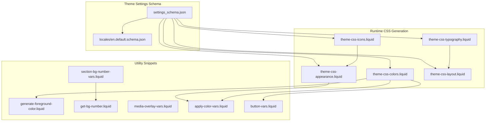
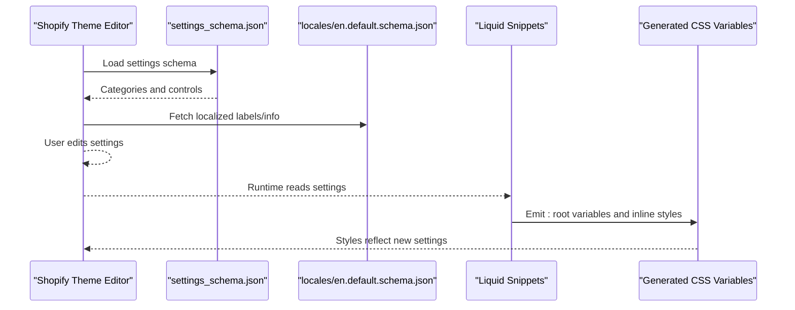
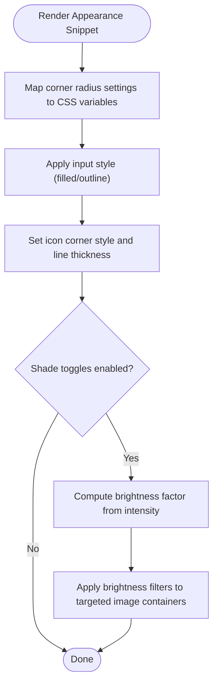
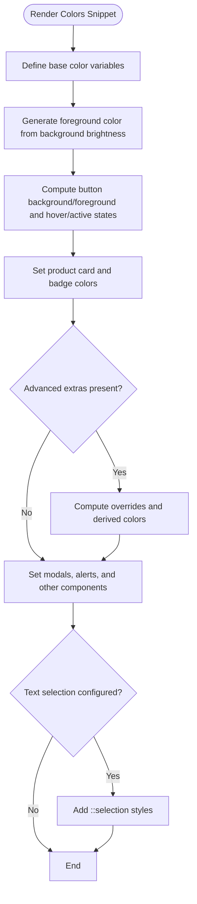
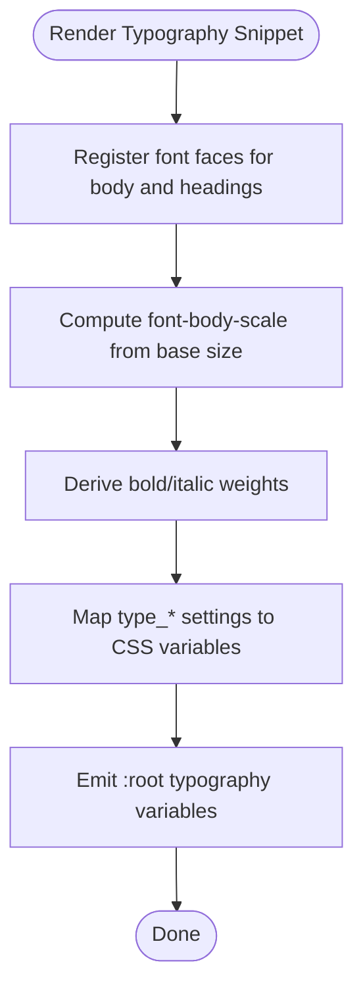
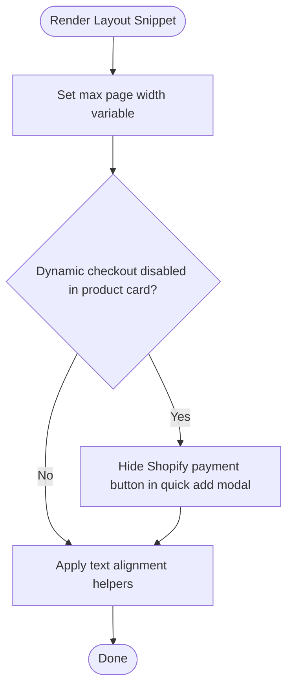
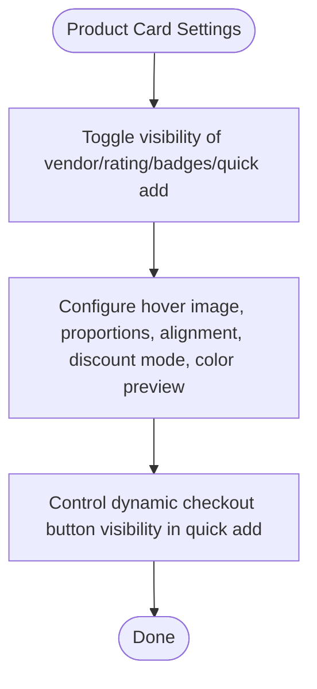
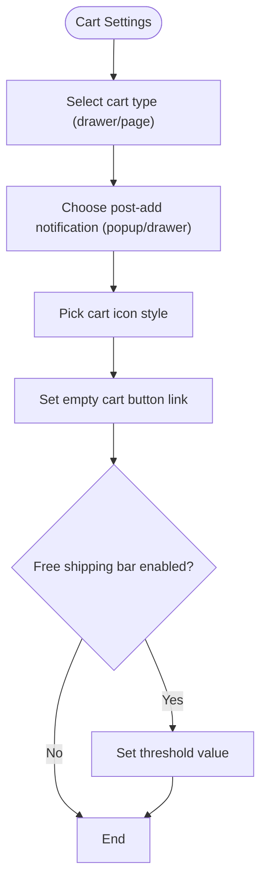
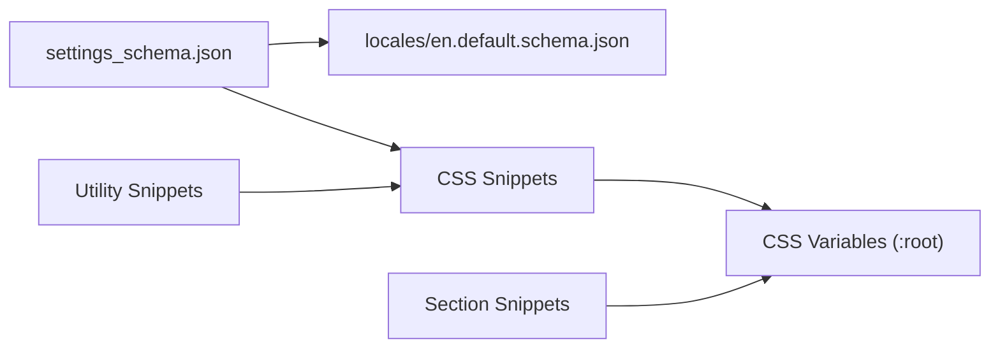

# Configuration System

<cite>
**Referenced Files in This Document**
- [settings_schema.json](file://config/settings_schema.json)
- [theme-css-appearance.liquid](file://snippets/theme-css-appearance.liquid)
- [theme-css-colors.liquid](file://snippets/theme-css-colors.liquid)
- [theme-css-typography.liquid](file://snippets/theme-css-typography.liquid)
- [theme-css-layout.liquid](file://snippets/theme-css-layout.liquid)
- [theme-css-icons.liquid](file://snippets/theme-css-icons.liquid)
- [apply-color-vars.liquid](file://snippets/apply-color-vars.liquid)
- [button-vars.liquid](file://snippets/button-vars.liquid)
- [generate-foreground-color.liquid](file://snippets/generate-foreground-color.liquid)
- [get-bg-number.liquid](file://snippets/get-bg-number.liquid)
- [section-bg-number-vars.liquid](file://snippets/section-bg-number-vars.liquid)
- [media-overlay-vars.liquid](file://snippets/media-overlay-vars.liquid)
- [en.default.schema.json](file://locales/en.default.schema.json)
</cite>

## Table of Contents
1. [Introduction](#introduction)
2. [Project Structure](#project-structure)
3. [Core Components](#core-components)
4. [Architecture Overview](#architecture-overview)
5. [Detailed Component Analysis](#detailed-component-analysis)
6. [Dependency Analysis](#dependency-analysis)
7. [Performance Considerations](#performance-considerations)
8. [Troubleshooting Guide](#troubleshooting-guide)
9. [Conclusion](#conclusion)
10. [Appendices](#appendices)

## Introduction
This document explains the Igogomi theme’s configuration system built on Shopify’s settings schema. It describes how the settings_schema.json file organizes customization categories (appearance, colors, typography, layout, product cards, cart, animation, color swatches, currency, favicon, social media), how the Shopify Theme Editor surfaces these settings, and how runtime values are translated into CSS variables and theme styles via Liquid snippets. It also covers practical customization scenarios, best practices, and the relationship between settings and generated CSS classes.

## Project Structure
The configuration system centers around:
- settings_schema.json: Defines the hierarchical settings UI and categories.
- Locale files: Provide localized labels and help text for settings.
- Liquid snippets: Convert settings into CSS variables and inline styles.

**Diagram sources**
- [settings_schema.json:1-1158](file://config/settings_schema.json#L1-L1158)
- [en.default.schema.json:1-669](file://locales/en.default.schema.json#L1-L669)
- [theme-css-appearance.liquid:1-67](file://snippets/theme-css-appearance.liquid#L1-L67)
- [theme-css-colors.liquid:1-147](file://snippets/theme-css-colors.liquid#L1-L147)
- [theme-css-typography.liquid:1-118](file://snippets/theme-css-typography.liquid#L1-L118)
- [theme-css-layout.liquid:1-20](file://snippets/theme-css-layout.liquid#L1-L20)
- [theme-css-icons.liquid:1-53](file://snippets/theme-css-icons.liquid#L1-L53)
- [generate-foreground-color.liquid:1-9](file://snippets/generate-foreground-color.liquid#L1-L9)
- [get-bg-number.liquid:1-18](file://snippets/get-bg-number.liquid#L1-L18)
- [section-bg-number-vars.liquid:1-36](file://snippets/section-bg-number-vars.liquid#L1-L36)
- [media-overlay-vars.liquid:1-46](file://snippets/media-overlay-vars.liquid#L1-L46)
- [apply-color-vars.liquid:1-12](file://snippets/apply-color-vars.liquid#L1-L12)
- [button-vars.liquid:1-12](file://snippets/button-vars.liquid#L1-L12)

**Section sources**
- [settings_schema.json:1-1158](file://config/settings_schema.json#L1-L1158)
- [en.default.schema.json:1-669](file://locales/en.default.schema.json#L1-L669)

## Core Components
- Appearance: Corner radii, input styles, icon corner style/thickness, and image background shade toggles and intensity.
- Colors: Base palette, primary/secondary buttons, header/footer, product card, sale badges/prices, modals, articles, alerts, and extra accent controls.
- Typography: Headings/body fonts, letter spacing, base body size, font selection for buttons/labels/navigation/product cards/accordions, and text transforms.
- Layout: Maximum page width and spacing between sections/blocks.
- Product Card: Visibility of vendor/rating/quick add, sold-out/discount badges, second image on hover, size preview, thumbnail proportions, text alignment, discount display mode, color preview type, and dynamic checkout visibility.
- Cart: Drawer/page cart, post-add notification, cart icon, empty cart button link, free shipping bar enablement and threshold.
- Animation: Reveal-on-scroll and zoom-in toggles.
- Color Swatches: Style, custom swatch definitions, matching option names, and visibility enhancement.
- Currency: Toggle to show currency codes.
- Favicon: Upload favicon asset.
- Social Media: Platform links.

**Section sources**
- [settings_schema.json:11-1158](file://config/settings_schema.json#L11-L1158)
- [en.default.schema.json:195-669](file://locales/en.default.schema.json#L195-L669)

## Architecture Overview
The settings schema defines UI controls. At runtime, Liquid snippets read the current settings and emit CSS variables and inline styles. These variables are consumed by theme styles to produce visual outcomes.

**Diagram sources**
- [settings_schema.json:1-1158](file://config/settings_schema.json#L1-L1158)
- [en.default.schema.json:1-669](file://locales/en.default.schema.json#L1-L669)
- [theme-css-appearance.liquid:1-67](file://snippets/theme-css-appearance.liquid#L1-L67)
- [theme-css-colors.liquid:1-147](file://snippets/theme-css-colors.liquid#L1-L147)
- [theme-css-typography.liquid:1-118](file://snippets/theme-css-typography.liquid#L1-L118)
- [theme-css-layout.liquid:1-20](file://snippets/theme-css-layout.liquid#L1-L20)
- [theme-css-icons.liquid:1-53](file://snippets/theme-css-icons.liquid#L1-L53)

## Detailed Component Analysis

### Appearance Settings
- Corner radius controls: block, button, input, dropdown radii mapped to CSS variables for consistent rounded corners.
- Inputs: filled vs outline style.
- Icons: corner style (round/sharp) and line thickness (thin/normal/bold) mapped to stroke widths and line joins.
- Image background shade: toggles for collection images, product thumbnails, and product gallery; intensity controls brightness filter.

**Diagram sources**
- [theme-css-appearance.liquid:1-67](file://snippets/theme-css-appearance.liquid#L1-L67)
- [theme-css-icons.liquid:25-51](file://snippets/theme-css-icons.liquid#L25-L51)

**Section sources**
- [settings_schema.json:11-151](file://config/settings_schema.json#L11-L151)
- [theme-css-appearance.liquid:1-67](file://snippets/theme-css-appearance.liquid#L1-L67)
- [theme-css-icons.liquid:1-53](file://snippets/theme-css-icons.liquid#L1-L53)

### Color System
- Base colors: background, text, headings, and derived accent/foreground.
- Button colors: primary and secondary backgrounds/text with hover/active computed variants.
- Product and cart colors: sale badges/prices, sold-out badges, modal colors, article category badges, alerts (success/warning/danger), and optional overrides for filters, inputs, progress bars, sliders, selected dropdown items, cart badges, and text selection.
- Dynamic foreground generation: automatically selects black or white foreground based on background brightness.
- Background number calculation: converts RGB to a numeric hash for efficient comparisons and transitions.

**Diagram sources**
- [theme-css-colors.liquid:1-147](file://snippets/theme-css-colors.liquid#L1-L147)
- [generate-foreground-color.liquid:1-9](file://snippets/generate-foreground-color.liquid#L1-L9)
- [get-bg-number.liquid:1-18](file://snippets/get-bg-number.liquid#L1-L18)
- [apply-color-vars.liquid:1-12](file://snippets/apply-color-vars.liquid#L1-L12)
- [button-vars.liquid:1-12](file://snippets/button-vars.liquid#L1-L12)

**Section sources**
- [settings_schema.json:152-423](file://config/settings_schema.json#L152-L423)
- [theme-css-colors.liquid:1-147](file://snippets/theme-css-colors.liquid#L1-L147)
- [generate-foreground-color.liquid:1-9](file://snippets/generate-foreground-color.liquid#L1-L9)
- [get-bg-number.liquid:1-18](file://snippets/get-bg-number.liquid#L1-L18)
- [apply-color-vars.liquid:1-12](file://snippets/apply-color-vars.liquid#L1-L12)
- [button-vars.liquid:1-12](file://snippets/button-vars.liquid#L1-L12)

### Typography System
- Fonts: separate font pickers for headings and body; bold/italic variants auto-generated.
- Letter spacing and base size: heading and body letter spacing; body base size scales rem units.
- Font families/styles/weights: navigation, buttons, labels, product cards, accordions mapped to body/headings or bold variants.
- Text transforms: headings, buttons, labels, navigation configurable.

**Diagram sources**
- [theme-css-typography.liquid:1-118](file://snippets/theme-css-typography.liquid#L1-L118)

**Section sources**
- [settings_schema.json:424-664](file://config/settings_schema.json#L424-L664)
- [theme-css-typography.liquid:1-118](file://snippets/theme-css-typography.liquid#L1-L118)

### Layout System
- Maximum page width: sets a container constraint variable.
- Spacing: section and block spacing presets mapped to spacing classes or variables.

**Diagram sources**
- [theme-css-layout.liquid:1-20](file://snippets/theme-css-layout.liquid#L1-L20)

**Section sources**
- [settings_schema.json:665-727](file://config/settings_schema.json#L665-L727)
- [theme-css-layout.liquid:1-20](file://snippets/theme-css-layout.liquid#L1-L20)

### Product Card Settings
- Element visibility: vendor, quick add to cart, sold-out badge, discount badge, custom badges, product rating, size preview.
- Behavior and presentation: second image on hover, show empty rating, thumbnail proportions, text alignment, discount display mode, color preview type, and dynamic checkout visibility in quick add.

**Diagram sources**
- [settings_schema.json:728-893](file://config/settings_schema.json#L728-L893)

**Section sources**
- [settings_schema.json:728-893](file://config/settings_schema.json#L728-L893)

### Cart Settings
- Cart type: drawer or page.
- Post-add notification: popup or open drawer.
- Cart icon: bag or cart.
- Empty cart button link.
- Free shipping bar: enable/disable and threshold.

**Diagram sources**
- [settings_schema.json:894-1008](file://config/settings_schema.json#L894-L1008)

**Section sources**
- [settings_schema.json:894-1008](file://config/settings_schema.json#L894-L1008)

### Animation, Color Swatches, Currency, Favicon, Social Media
- Animation: reveal-on-scroll and zoom-in toggles.
- Color Swatches: style, custom swatches, matching option names, visibility enhancement.
- Currency: toggle to show currency codes.
- Favicon: upload image asset.
- Social Media: platform-specific links.

**Section sources**
- [settings_schema.json:1009-1158](file://config/settings_schema.json#L1009-L1158)

## Dependency Analysis
- Settings schema drives UI and localization.
- Snippets depend on settings and utility snippets to compute derived values (foreground color, background number).
- Section-level snippets compute per-section background numbers and overlay variables.

**Diagram sources**
- [settings_schema.json:1-1158](file://config/settings_schema.json#L1-L1158)
- [en.default.schema.json:1-669](file://locales/en.default.schema.json#L1-L669)
- [theme-css-appearance.liquid:1-67](file://snippets/theme-css-appearance.liquid#L1-L67)
- [theme-css-colors.liquid:1-147](file://snippets/theme-css-colors.liquid#L1-L147)
- [theme-css-typography.liquid:1-118](file://snippets/theme-css-typography.liquid#L1-L118)
- [theme-css-layout.liquid:1-20](file://snippets/theme-css-layout.liquid#L1-L20)
- [theme-css-icons.liquid:1-53](file://snippets/theme-css-icons.liquid#L1-L53)
- [generate-foreground-color.liquid:1-9](file://snippets/generate-foreground-color.liquid#L1-L9)
- [get-bg-number.liquid:1-18](file://snippets/get-bg-number.liquid#L1-L18)
- [section-bg-number-vars.liquid:1-36](file://snippets/section-bg-number-vars.liquid#L1-L36)
- [media-overlay-vars.liquid:1-46](file://snippets/media-overlay-vars.liquid#L1-L46)

**Section sources**
- [settings_schema.json:1-1158](file://config/settings_schema.json#L1-L1158)
- [en.default.schema.json:1-669](file://locales/en.default.schema.json#L1-L669)
- [theme-css-appearance.liquid:1-67](file://snippets/theme-css-appearance.liquid#L1-L67)
- [theme-css-colors.liquid:1-147](file://snippets/theme-css-colors.liquid#L1-L147)
- [theme-css-typography.liquid:1-118](file://snippets/theme-css-typography.liquid#L1-L118)
- [theme-css-layout.liquid:1-20](file://snippets/theme-css-layout.liquid#L1-L20)
- [theme-css-icons.liquid:1-53](file://snippets/theme-css-icons.liquid#L1-L53)
- [generate-foreground-color.liquid:1-9](file://snippets/generate-foreground-color.liquid#L1-L9)
- [get-bg-number.liquid:1-18](file://snippets/get-bg-number.liquid#L1-L18)
- [section-bg-number-vars.liquid:1-36](file://snippets/section-bg-number-vars.liquid#L1-L36)
- [media-overlay-vars.liquid:1-46](file://snippets/media-overlay-vars.liquid#L1-L46)

## Performance Considerations
- Font loading: font_face declarations use swap to avoid blocking rendering; prefer system fonts for minimal impact.
- CSS variables reduce duplication and enable efficient updates without recalculating selectors.
- Conditional rendering of advanced color overrides avoids unnecessary CSS when defaults suffice.
- Image background shade intensity uses a brightness factor to minimize heavy computations.

## Troubleshooting Guide
- Settings not applying:
  - Verify the setting IDs match those in settings_schema.json and locales.
  - Confirm snippets are included in the theme layout and sections.
- Foreground contrast issues:
  - Use the automatic foreground generator to ensure readable text against colored backgrounds.
- Unexpected hover/active button colors:
  - Ensure button hover/active variables are rendered alongside base button colors.
- Section background mismatches:
  - Use section background number variables to align adjacent sections’ backgrounds.

**Section sources**
- [theme-css-colors.liquid:1-147](file://snippets/theme-css-colors.liquid#L1-L147)
- [generate-foreground-color.liquid:1-9](file://snippets/generate-foreground-color.liquid#L1-L9)
- [button-vars.liquid:1-12](file://snippets/button-vars.liquid#L1-L12)
- [section-bg-number-vars.liquid:1-36](file://snippets/section-bg-number-vars.liquid#L1-L36)

## Conclusion
The Igogomi theme’s configuration system leverages Shopify’s settings schema to expose a comprehensive set of customization options. Through Liquid snippets, these settings are transformed into CSS variables and inline styles, enabling dynamic theming without manual CSS editing. By understanding the schema categories, the translation to CSS variables, and the utility snippets that compute derived values, theme editors can confidently personalize the storefront while maintaining performance and accessibility.

## Appendices

### Common Customization Scenarios
- Adjust global corner radii:
  - Modify block, button, input, and dropdown corner radius settings under Appearance.
- Change brand color scheme:
  - Update base background/text/headings; primary/secondary button colors; and accent overrides under Colors.
- Tune typography:
  - Select body and heading fonts, adjust base size and letter spacing; configure font choices for buttons/labels/navigation/product cards/accordions.
- Control layout density:
  - Set maximum page width and choose spacing between sections/blocks.
- Personalize product card behavior:
  - Toggle badges, quick add, hover image, thumbnail proportions, discount display mode, and color preview type.
- Configure cart behavior:
  - Choose cart type, post-add notification, cart icon, and free shipping bar settings.
- Enhance icons:
  - Adjust icon corner style and line thickness under Appearance.

Best practices:
- Keep font choices minimal to optimize performance.
- Use color overrides sparingly; rely on defaults for consistency.
- Test contrast ratios after changing base colors.
- Validate spacing presets across breakpoints.

**Section sources**
- [settings_schema.json:11-1158](file://config/settings_schema.json#L11-L1158)
- [en.default.schema.json:195-669](file://locales/en.default.schema.json#L195-L669)