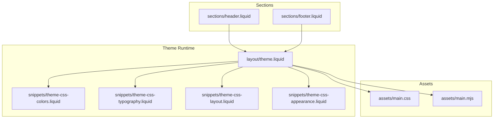
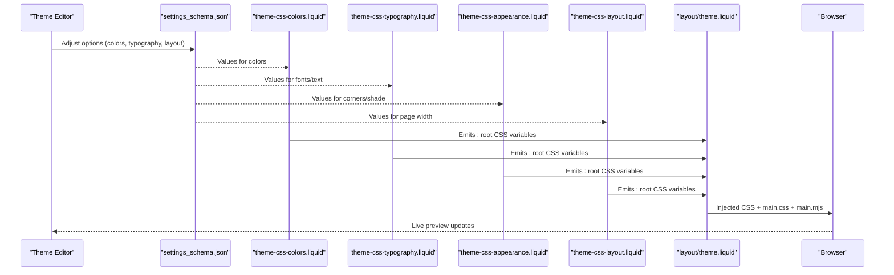
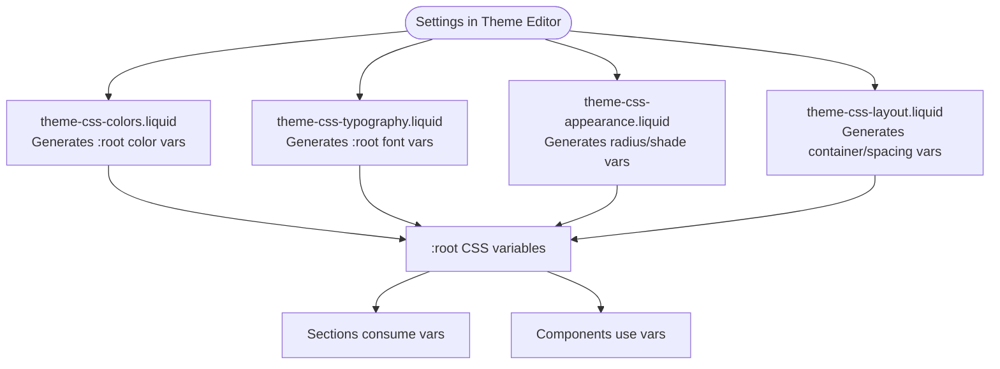
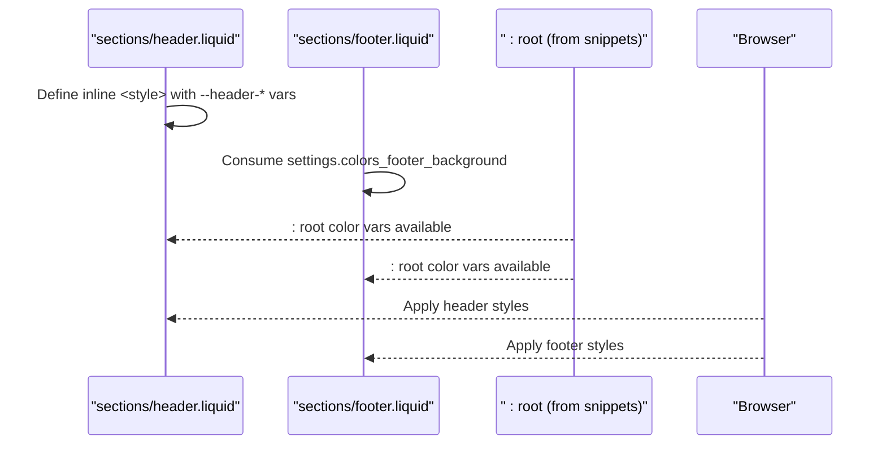
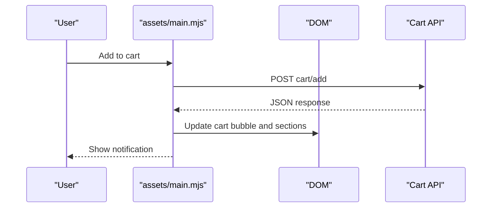
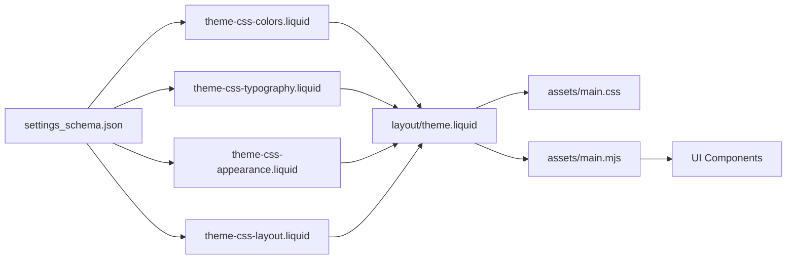

# Customization Guide

<cite>
**Referenced Files in This Document**
- [settings_schema.json](file://config/settings_schema.json)
- [theme-css-colors.liquid](file://snippets/theme-css-colors.liquid)
- [theme-css-typography.liquid](file://snippets/theme-css-typography.liquid)
- [theme-css-layout.liquid](file://snippets/theme-css-layout.liquid)
- [theme-css-appearance.liquid](file://snippets/theme-css-appearance.liquid)
- [button-vars.liquid](file://snippets/button-vars.liquid)
- [button-hover-active-vars.liquid](file://snippets/button-hover-active-vars.liquid)
- [theme.liquid](file://layout/theme.liquid)
- [header.liquid](file://sections/header.liquid)
- [footer.liquid](file://sections/footer.liquid)
- [main.mjs](file://assets/main.mjs)
- [main.css](file://assets/main.css)
</cite>

## Table of Contents
1. [Introduction](#introduction)
2. [Project Structure](#project-structure)
3. [Core Components](#core-components)
4. [Architecture Overview](#architecture-overview)
5. [Detailed Component Analysis](#detailed-component-analysis)
6. [Dependency Analysis](#dependency-analysis)
7. [Performance Considerations](#performance-considerations)
8. [Troubleshooting Guide](#troubleshooting-guide)
9. [Conclusion](#conclusion)
10. [Appendices](#appendices)

## Introduction
This guide explains how to customize and extend the Igogomi theme. It focuses on the settings schema, CSS custom properties, and JavaScript customization hooks. You will learn how the design system is implemented via custom properties, how to override styles safely, and how to extend functionality without breaking updates. The guide also covers creating custom sections, modifying existing components, and maintaining stability during theme upgrades.

## Project Structure
The theme follows a Shopify theme structure with a clear separation of concerns:
- Settings schema defines customization options exposed in the Theme Editor.
- Snippets generate CSS custom properties for colors, typography, layout, appearance, and icons.
- Layout renders the base HTML and injects generated CSS.
- Sections implement reusable UI blocks (header, footer, etc.).
- Assets include compiled CSS and modular JavaScript.

**Diagram sources**
- [theme.liquid:58-64](file://layout/theme.liquid#L58-L64)
- [theme-css-colors.liquid:1-147](file://snippets/theme-css-colors.liquid#L1-L147)
- [theme-css-typography.liquid:1-118](file://snippets/theme-css-typography.liquid#L1-L118)
- [theme-css-layout.liquid:1-20](file://snippets/theme-css-layout.liquid#L1-L20)
- [theme-css-appearance.liquid:1-67](file://snippets/theme-css-appearance.liquid#L1-L67)
- [header.liquid:1-200](file://sections/header.liquid#L1-L200)
- [footer.liquid:1-200](file://sections/footer.liquid#L1-L200)
- [main.css:1-200](file://assets/main.css#L1-L200)
- [main.mjs:1-60](file://assets/main.mjs#L1-L60)

**Section sources**
- [theme.liquid:1-200](file://layout/theme.liquid#L1-L200)

## Core Components
- Settings schema: Defines appearance, colors, typography, layout, and product card options. These drive CSS custom properties and runtime behavior.
- CSS custom properties: Generated from settings to control colors, fonts, spacing, corner radii, and more.
- Liquid snippets: Render CSS custom properties and dynamic styles.
- Layout: Injects CSS and loads JavaScript.
- Sections: Compose the header, footer, and other page regions.
- JavaScript: Provides UI behaviors, animations, modals, carousels, and cart interactions.

Key customization touchpoints:
- Appearance: Corner radii, input styles, icon styles, shade intensity.
- Colors: Base palette, buttons, headers, footers, product badges, alerts, and advanced accents.
- Typography: Fonts, scales, letter spacing, and text transforms.
- Layout: Page width and spacing between sections/blocks.
- Product card: Visibility toggles and quick actions.

**Section sources**
- [settings_schema.json:1-1158](file://config/settings_schema.json#L1-L1158)
- [theme-css-colors.liquid:1-147](file://snippets/theme-css-colors.liquid#L1-L147)
- [theme-css-typography.liquid:1-118](file://snippets/theme-css-typography.liquid#L1-L118)
- [theme-css-appearance.liquid:1-67](file://snippets/theme-css-appearance.liquid#L1-L67)
- [theme-css-layout.liquid:1-20](file://snippets/theme-css-layout.liquid#L1-L20)

## Architecture Overview
The theme’s customization architecture centers on a settings-driven design system:
- Settings schema entries map to CSS custom properties via snippets.
- The layout renders these properties into :root and scoped styles.
- Sections consume these variables and local overrides.
- JavaScript reads settings via global variables and applies behaviors.

**Diagram sources**
- [settings_schema.json:1-1158](file://config/settings_schema.json#L1-L1158)
- [theme-css-colors.liquid:1-147](file://snippets/theme-css-colors.liquid#L1-L147)
- [theme-css-typography.liquid:1-118](file://snippets/theme-css-typography.liquid#L1-L118)
- [theme-css-appearance.liquid:1-67](file://snippets/theme-css-appearance.liquid#L1-L67)
- [theme-css-layout.liquid:1-20](file://snippets/theme-css-layout.liquid#L1-L20)
- [theme.liquid:58-64](file://layout/theme.liquid#L58-L64)

## Detailed Component Analysis

### Design System and CSS Variables
The theme exposes a cohesive design system via CSS custom properties:
- Colors: Base background/foreground/headings, primary/secondary buttons, header/footer backgrounds, product badges, alerts, modal colors, and advanced accents.
- Typography: Body and heading families, weights, letter spacing, base scale, and transforms.
- Layout: Container width and spacing tokens.
- Appearance: Corner radii, input radii, dropdown radii, and image background shade.

These are generated from settings and rendered into :root by snippets. Sections can also define scoped overrides.

**Diagram sources**
- [theme-css-colors.liquid:1-147](file://snippets/theme-css-colors.liquid#L1-L147)
- [theme-css-typography.liquid:1-118](file://snippets/theme-css-typography.liquid#L1-L118)
- [theme-css-appearance.liquid:1-67](file://snippets/theme-css-appearance.liquid#L1-L67)
- [theme-css-layout.liquid:1-20](file://snippets/theme-css-layout.liquid#L1-L20)

**Section sources**
- [theme-css-colors.liquid:1-147](file://snippets/theme-css-colors.liquid#L1-L147)
- [theme-css-typography.liquid:1-118](file://snippets/theme-css-typography.liquid#L1-L118)
- [theme-css-appearance.liquid:1-67](file://snippets/theme-css-appearance.liquid#L1-L67)
- [theme-css-layout.liquid:1-20](file://snippets/theme-css-layout.liquid#L1-L20)

### Settings Schema Options
Key customization categories:
- Appearance: Block/button/input/dropdown corner radii, input style, icon corner style/thickness, image background shade controls and intensity.
- Colors: Background/text/headings, primary/secondary buttons, header/footer, product cards, sale/out stock badges, custom badges, star ratings, in/low stock text, free shipping bar, modal colors, article category badges, alerts (success/warning/danger), and advanced accents (filters, inputs, progress bar, slider, selected dropdown item, cart badge, text selection).
- Typography: Heading/body fonts, letter spacing, base body size, button/label/navigation/product card/accordion font choices, and text transforms/styles.
- Layout: Page width and spacing between sections/blocks.
- Product Card: Toggle visibility of vendor, quick add to cart, sold out badge, discount badge, custom badges, product rating, size preview; and second image on hover, show empty rating, dynamic checkout in quick add.

These options feed into CSS variables and runtime logic.

**Section sources**
- [settings_schema.json:1-1158](file://config/settings_schema.json#L1-L1158)

### Section-Level Overrides and Local Variables
Sections can define local CSS custom properties to fine-tune visuals per region. For example, the header sets logo width and transparent text color, while the footer consumes background color variables.

**Diagram sources**
- [header.liquid:27-57](file://sections/header.liquid#L27-L57)
- [footer.liquid:1-200](file://sections/footer.liquid#L1-L200)
- [theme-css-colors.liquid:1-147](file://snippets/theme-css-colors.liquid#L1-L147)

**Section sources**
- [header.liquid:27-57](file://sections/header.liquid#L27-L57)
- [footer.liquid:1-200](file://sections/footer.liquid#L1-L200)

### JavaScript Customization Hooks
JavaScript provides:
- UI components (modals, drawers, carousels, dropdowns).
- Cart interactions and notifications.
- Animations and transitions.
- Global variables for settings and strings.

Customization approaches:
- Extend or replace components by adding new custom elements alongside existing ones.
- Hook into events (e.g., product:added-to-cart) to trigger custom behavior.
- Use CSS custom properties to align styles with theme settings.

**Diagram sources**
- [main.mjs:1-60](file://assets/main.mjs#L1-L60)

**Section sources**
- [main.mjs:1-60](file://assets/main.mjs#L1-L60)

### Creating Custom Sections
Steps:
- Create a new section file under sections/.
- Add a schema block to expose settings in the Theme Editor.
- Use settings and CSS variables to style content.
- Optionally render partials/snippets for shared logic.

Best practices:
- Keep settings minimal and descriptive.
- Use CSS custom properties for colors and spacing.
- Scope overrides to the section’s container to avoid global leakage.

**Section sources**
- [settings_schema.json:1-1158](file://config/settings_schema.json#L1-L1158)
- [header.liquid:1-200](file://sections/header.liquid#L1-L200)
- [footer.liquid:1-200](file://sections/footer.liquid#L1-L200)

### Modifying Existing Components
Approach:
- Inspect the component’s Liquid and CSS.
- Override CSS variables in the component’s scope.
- Use the component’s settings where available.
- Avoid editing core snippets or layout unless necessary.

Examples:
- Button customization: Use button-vars and button-hover-active-vars to derive hover/active states from background color.
- Header/footer: Set local variables for logo sizing and transparent colors.

**Section sources**
- [button-vars.liquid:1-12](file://snippets/button-vars.liquid#L1-L12)
- [button-hover-active-vars.liquid:1-13](file://snippets/button-hover-active-vars.liquid#L1-L13)
- [header.liquid:27-57](file://sections/header.liquid#L27-L57)

### Adding New Functionality
Options:
- Extend JavaScript by adding new custom elements or event listeners.
- Introduce new settings in the schema and render corresponding CSS variables.
- Compose new sections that reuse existing components and CSS variables.

Guidelines:
- Encapsulate new logic in custom elements or isolated scripts.
- Mirror existing patterns for consistency.
- Test with live previews and across devices.

**Section sources**
- [main.mjs:1-60](file://assets/main.mjs#L1-L60)
- [settings_schema.json:1-1158](file://config/settings_schema.json#L1-L1158)

## Dependency Analysis
The theme’s customization pipeline depends on:
- Settings schema driving CSS variables.
- Snippets rendering :root variables consumed by sections and components.
- Layout injecting CSS and JavaScript.
- JavaScript reading settings and orchestrating UI behaviors.

**Diagram sources**
- [settings_schema.json:1-1158](file://config/settings_schema.json#L1-L1158)
- [theme-css-colors.liquid:1-147](file://snippets/theme-css-colors.liquid#L1-L147)
- [theme-css-typography.liquid:1-118](file://snippets/theme-css-typography.liquid#L1-L118)
- [theme-css-appearance.liquid:1-67](file://snippets/theme-css-appearance.liquid#L1-L67)
- [theme-css-layout.liquid:1-20](file://snippets/theme-css-layout.liquid#L1-L20)
- [theme.liquid:58-64](file://layout/theme.liquid#L58-L64)
- [main.css:1-200](file://assets/main.css#L1-L200)
- [main.mjs:1-60](file://assets/main.mjs#L1-L60)

**Section sources**
- [theme.liquid:58-64](file://layout/theme.liquid#L58-L64)

## Performance Considerations
- Prefer CSS custom properties over inline styles for scalability.
- Minimize heavy JavaScript initialization; initialize only when needed.
- Use lazy loading for images and components.
- Keep the number of active observers and animations reasonable.

## Troubleshooting Guide
Common issues and resolutions:
- Colors not updating: Verify the color setting is not blank and that the corresponding CSS variable is emitted by the color snippet.
- Typography mismatch: Confirm font settings and transforms are applied in the typography snippet.
- Layout spacing anomalies: Check layout spacing settings and ensure the layout snippet is included.
- JavaScript errors: Inspect browser console for component-related errors; confirm assets are loading and settings globals are present.

**Section sources**
- [theme-css-colors.liquid:1-147](file://snippets/theme-css-colors.liquid#L1-L147)
- [theme-css-typography.liquid:1-118](file://snippets/theme-css-typography.liquid#L1-L118)
- [theme-css-layout.liquid:1-20](file://snippets/theme-css-layout.liquid#L1-L20)
- [main.mjs:1-60](file://assets/main.mjs#L1-L60)

## Conclusion
The Igogomi theme offers a robust, settings-driven customization system. By leveraging the settings schema, CSS custom properties, and JavaScript hooks, you can tailor colors, typography, layout, and behavior while preserving upgrade safety. Follow the recommended patterns to maintain stability and consistency across theme updates.

## Appendices

### Best Practices for Maintenance and Updates
- Centralize customizations in settings and CSS variables.
- Avoid editing core snippets and layout unless absolutely necessary.
- Use section-scoped overrides to minimize side effects.
- Back up custom sections and schema additions before major updates.
- Test thoroughly after updates to catch regressions early.

### Avoiding Conflicts During Updates
- Track custom settings and overrides separately from core settings.
- Use comments to mark custom additions in schema and snippets.
- Review changelog for removed settings or changed defaults.
- Re-apply customizations incrementally after updates.