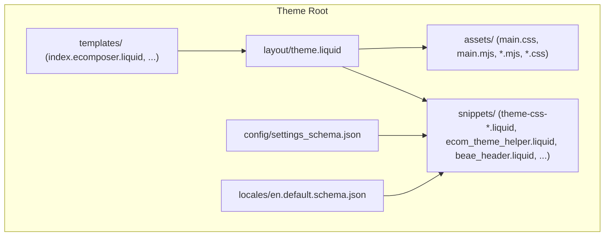
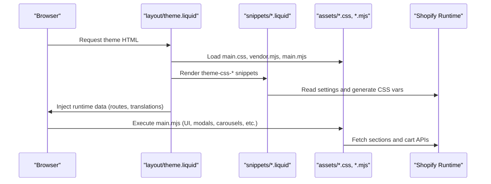
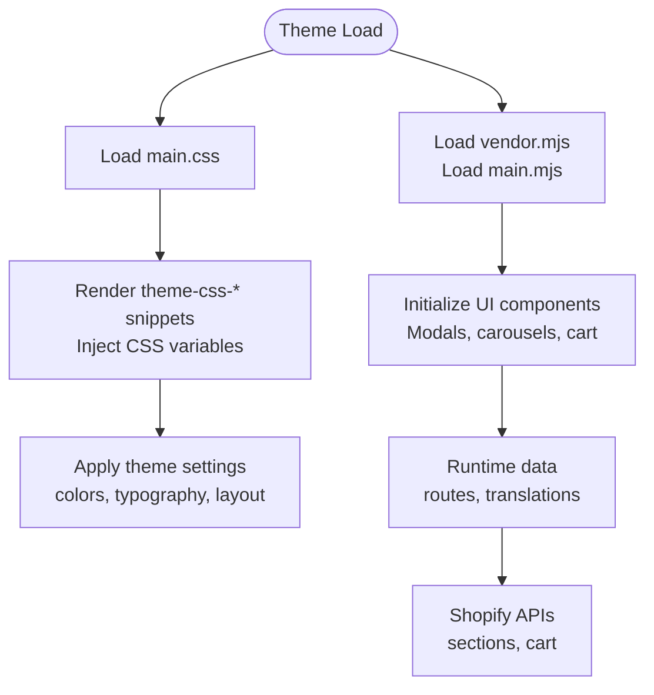
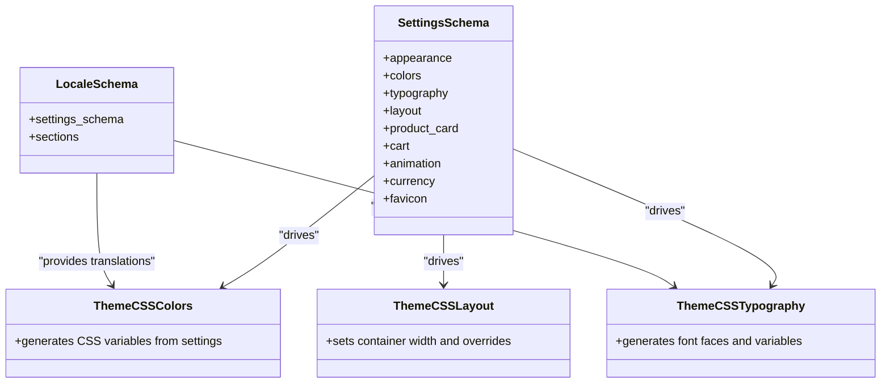
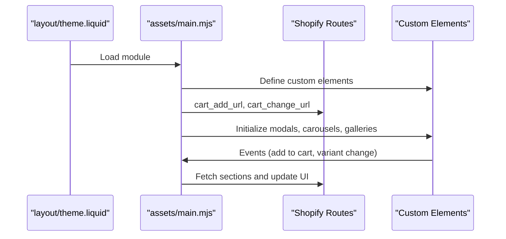
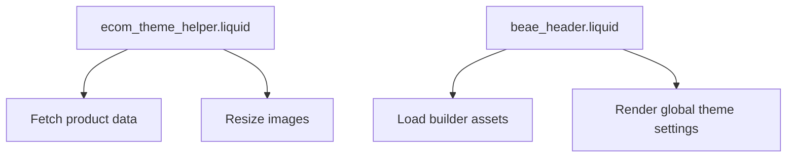
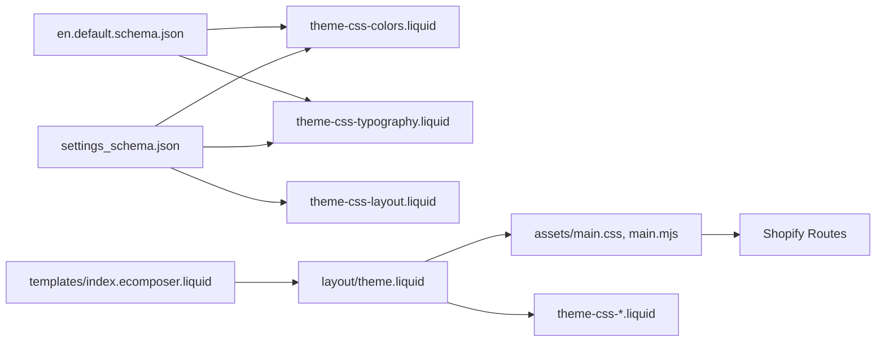

# Development Workflow

<cite>
**Referenced Files in This Document**
- [settings_schema.json](file://config/settings_schema.json)
- [theme.liquid](file://layout/theme.liquid)
- [main.mjs](file://assets/main.mjs)
- [main.css](file://assets/main.css)
- [theme-css-colors.liquid](file://snippets/theme-css-colors.liquid)
- [theme-css-typography.liquid](file://snippets/theme-css-typography.liquid)
- [theme-css-layout.liquid](file://snippets/theme-css-layout.liquid)
- [en.default.schema.json](file://locales/en.default.schema.json)
- [ecom_theme_helper.liquid](file://snippets/ecom_theme_helper.liquid)
- [index.ecomposer.liquid](file://templates/index.ecomposer.liquid)
- [beae_header.liquid](file://snippets/beae_header.liquid)
</cite>

## Table of Contents
1. [Introduction](#introduction)
2. [Project Structure](#project-structure)
3. [Core Components](#core-components)
4. [Architecture Overview](#architecture-overview)
5. [Detailed Component Analysis](#detailed-component-analysis)
6. [Dependency Analysis](#dependency-analysis)
7. [Performance Considerations](#performance-considerations)
8. [Testing Strategies](#testing-strategies)
9. [Deployment Workflow](#deployment-workflow)
10. [Debugging and Troubleshooting](#debugging-and-troubleshooting)
11. [Team Collaboration Practices](#team-collaboration-practices)
12. [Conclusion](#conclusion)

## Introduction
This document describes the complete development workflow for the theme, covering local development setup, asset compilation, testing, and deployment to Shopify. It explains how the theme’s build pipeline integrates Liquid snippets and JavaScript modules, how to configure theme settings, and how to maintain and collaborate on the theme effectively. It also outlines performance monitoring and debugging techniques tailored to Shopify themes.

## Project Structure
The theme follows a Shopify theme structure with dedicated directories for layouts, sections, snippets, templates, locales, and assets. The key files involved in the development workflow include:
- Layout and theme entry point
- Asset pipeline (stylesheets and JavaScript modules)
- Theme settings schema and locale translations
- Utility snippets for CSS generation and runtime helpers

**Diagram sources**
- [theme.liquid](file://layout/theme.liquid)
- [settings_schema.json](file://config/settings_schema.json)
- [main.css](file://assets/main.css)
- [main.mjs](file://assets/main.mjs)
- [theme-css-colors.liquid](file://snippets/theme-css-colors.liquid)
- [theme-css-typography.liquid](file://snippets/theme-css-typography.liquid)
- [theme-css-layout.liquid](file://snippets/theme-css-layout.liquid)
- [en.default.schema.json](file://locales/en.default.schema.json)
- [ecom_theme_helper.liquid](file://snippets/ecom_theme_helper.liquid)
- [index.ecomposer.liquid](file://templates/index.ecomposer.liquid)
- [beae_header.liquid](file://snippets/beae_header.liquid)

**Section sources**
- [theme.liquid](file://layout/theme.liquid)
- [settings_schema.json](file://config/settings_schema.json)
- [main.css](file://assets/main.css)
- [main.mjs](file://assets/main.mjs)
- [theme-css-colors.liquid](file://snippets/theme-css-colors.liquid)
- [theme-css-typography.liquid](file://snippets/theme-css-typography.liquid)
- [theme-css-layout.liquid](file://snippets/theme-css-layout.liquid)
- [en.default.schema.json](file://locales/en.default.schema.json)
- [ecom_theme_helper.liquid](file://snippets/ecom_theme_helper.liquid)
- [index.ecomposer.liquid](file://templates/index.ecomposer.liquid)
- [beae_header.liquid](file://snippets/beae_header.liquid)

## Core Components
- Theme layout and asset loading: The theme layout loads JavaScript modules and CSS, initializes theme settings via snippets, and renders header/footer sections.
- Asset pipeline: Styles are compiled via Tailwind and theme CSS snippets; JavaScript is served as ES modules.
- Theme settings and localization: Settings schema defines configurable options; locale files provide translated strings for settings and UI.
- Runtime helpers: Snippets generate CSS variables from settings and provide helper functions for product data and image resizing.

**Section sources**
- [theme.liquid](file://layout/theme.liquid)
- [main.css](file://assets/main.css)
- [main.mjs](file://assets/main.mjs)
- [theme-css-colors.liquid](file://snippets/theme-css-colors.liquid)
- [theme-css-typography.liquid](file://snippets/theme-css-typography.liquid)
- [theme-css-layout.liquid](file://snippets/theme-css-layout.liquid)
- [settings_schema.json](file://config/settings_schema.json)
- [en.default.schema.json](file://locales/en.default.schema.json)

## Architecture Overview
The theme architecture integrates Liquid rendering with a modern JavaScript runtime and CSS-in-variables approach. The layout orchestrates asset loading and passes runtime data to JavaScript. Snippets convert theme settings into CSS variables and provide reusable UI helpers.

**Diagram sources**
- [theme.liquid](file://layout/theme.liquid)
- [main.css](file://assets/main.css)
- [main.mjs](file://assets/main.mjs)
- [theme-css-colors.liquid](file://snippets/theme-css-colors.liquid)
- [theme-css-typography.liquid](file://snippets/theme-css-typography.liquid)
- [theme-css-layout.liquid](file://snippets/theme-css-layout.liquid)

## Detailed Component Analysis

### Asset Pipeline and Build Tools
- CSS: Tailwind-based styles are included via main.css. Theme CSS snippets inject color, typography, and layout variables into :root.
- JavaScript: ES module scripts are loaded asynchronously. The main module initializes UI components, modals, carousels, and cart interactions.
- Vendor assets: Additional vendor modules are loaded as separate modules.

**Diagram sources**
- [theme.liquid](file://layout/theme.liquid)
- [main.css](file://assets/main.css)
- [main.mjs](file://assets/main.mjs)
- [theme-css-colors.liquid](file://snippets/theme-css-colors.liquid)
- [theme-css-typography.liquid](file://snippets/theme-css-typography.liquid)
- [theme-css-layout.liquid](file://snippets/theme-css-layout.liquid)

**Section sources**
- [theme.liquid](file://layout/theme.liquid)
- [main.css](file://assets/main.css)
- [main.mjs](file://assets/main.mjs)
- [theme-css-colors.liquid](file://snippets/theme-css-colors.liquid)
- [theme-css-typography.liquid](file://snippets/theme-css-typography.liquid)
- [theme-css-layout.liquid](file://snippets/theme-css-layout.liquid)

### Theme Settings Schema and Localization
- Settings schema: Defines appearance, colors, typography, layout, product card, cart, animation, and other configuration options. These drive CSS variable generation and runtime behavior.
- Locale translations: Provide translated labels and descriptions for settings and UI strings.

**Diagram sources**
- [settings_schema.json](file://config/settings_schema.json)
- [en.default.schema.json](file://locales/en.default.schema.json)
- [theme-css-colors.liquid](file://snippets/theme-css-colors.liquid)
- [theme-css-typography.liquid](file://snippets/theme-css-typography.liquid)
- [theme-css-layout.liquid](file://snippets/theme-css-layout.liquid)

**Section sources**
- [settings_schema.json](file://config/settings_schema.json)
- [en.default.schema.json](file://locales/en.default.schema.json)
- [theme-css-colors.liquid](file://snippets/theme-css-colors.liquid)
- [theme-css-typography.liquid](file://snippets/theme-css-typography.liquid)
- [theme-css-layout.liquid](file://snippets/theme-css-layout.liquid)

### JavaScript Runtime and UI Components
- Module loading: vendor.mjs and main.mjs are loaded as modules with defer attributes.
- UI components: The main module registers custom elements for modals, carousels, dropdowns, galleries, and more.
- Cart and section updates: The module handles cart actions and partial section refreshes via Shopify routes.

**Diagram sources**
- [theme.liquid](file://layout/theme.liquid)
- [main.mjs](file://assets/main.mjs)

**Section sources**
- [theme.liquid](file://layout/theme.liquid)
- [main.mjs](file://assets/main.mjs)

### Runtime Helpers and Product Data
- Helper snippet: Provides product fetching and image resizing utilities used by the frontend.
- Beae integration: Header snippet integrates third-party builder assets and settings.

**Diagram sources**
- [ecom_theme_helper.liquid](file://snippets/ecom_theme_helper.liquid)
- [beae_header.liquid](file://snippets/beae_header.liquid)

**Section sources**
- [ecom_theme_helper.liquid](file://snippets/ecom_theme_helper.liquid)
- [beae_header.liquid](file://snippets/beae_header.liquid)

## Dependency Analysis
- Layout depends on assets and snippets to render the theme shell and pass runtime data.
- Snippets depend on settings to generate CSS variables and on locale files for translations.
- JavaScript depends on layout-provided runtime data and Shopify routes for cart and section updates.
- Templates integrate with the layout and workspace markers for builder environments.

**Diagram sources**
- [settings_schema.json](file://config/settings_schema.json)
- [en.default.schema.json](file://locales/en.default.schema.json)
- [theme-css-colors.liquid](file://snippets/theme-css-colors.liquid)
- [theme-css-typography.liquid](file://snippets/theme-css-typography.liquid)
- [theme-css-layout.liquid](file://snippets/theme-css-layout.liquid)
- [theme.liquid](file://layout/theme.liquid)
- [main.css](file://assets/main.css)
- [main.mjs](file://assets/main.mjs)
- [index.ecomposer.liquid](file://templates/index.ecomposer.liquid)

**Section sources**
- [settings_schema.json](file://config/settings_schema.json)
- [en.default.schema.json](file://locales/en.default.schema.json)
- [theme-css-colors.liquid](file://snippets/theme-css-colors.liquid)
- [theme-css-typography.liquid](file://snippets/theme-css-typography.liquid)
- [theme-css-layout.liquid](file://snippets/theme-css-layout.liquid)
- [theme.liquid](file://layout/theme.liquid)
- [main.css](file://assets/main.css)
- [main.mjs](file://assets/main.mjs)
- [index.ecomposer.liquid](file://templates/index.ecomposer.liquid)

## Performance Considerations
- CSS delivery: Tailwind CSS is included via main.css; keep unused styles minimal to reduce bundle size.
- JavaScript modules: vendor.mjs and main.mjs are deferred; ensure lazy initialization of heavy components.
- Images and placeholders: Use responsive image sizes and lazy loading to improve Core Web Vitals.
- Font loading: System fonts are used; avoid excessive font variations to minimize render-blocking.
- Section updates: Partial section refreshes reduce full-page reloads; throttle frequent updates.

[No sources needed since this section provides general guidance]

## Testing Strategies
- Theme functionality: Verify UI components (modals, carousels, galleries) and cart interactions across templates.
- Cross-browser compatibility: Test with modern browsers; ensure fallbacks for unsupported features (IntersectionObserver, ResizeObserver).
- Performance monitoring: Use browser devtools and Lighthouse to measure Largest Contentful Paint (LCP), First Input Delay (FID), and Cumulative Layout Shift (CLS).
- Responsive behavior: Validate breakpoints and layout adjustments using device emulation and real devices.

[No sources needed since this section provides general guidance]

## Deployment Workflow
- Local development: Edit theme files locally; use Shopify CLI to preview changes.
- Asset updates: Commit changes to assets; Shopify automatically serves updated assets.
- Theme settings: Adjust settings via the Shopify admin; changes propagate to CSS variables and UI.
- Version control: Track changes to Liquid files, settings_schema.json, and locales; treat assets as compiled outputs.
- Continuous deployment: Integrate with a CI/CD pipeline to automate builds and deploys when pushing to production branches.

[No sources needed since this section provides general guidance]

## Debugging and Troubleshooting
- JavaScript errors: Inspect the browser console for module load failures or runtime exceptions.
- CSS not applying: Confirm theme-css-* snippets render and CSS variables are present in :root.
- Cart and section issues: Verify routes and network requests; check for 4xx/5xx responses.
- Design mode and builder: Use design mode to inspect sections; ensure builder snippets are loaded.

**Section sources**
- [theme.liquid](file://layout/theme.liquid)
- [main.mjs](file://assets/main.mjs)
- [theme-css-colors.liquid](file://snippets/theme-css-colors.liquid)
- [ecom_theme_helper.liquid](file://snippets/ecom_theme_helper.liquid)

## Team Collaboration Practices
- Shared settings: Keep settings_schema.json and locales synchronized across contributors.
- Component ownership: Assign ownership of sections and snippets to teams; document custom elements and their events.
- Review process: Use pull requests to review changes to layout, assets, and settings.
- Documentation: Maintain a changelog for theme updates and breaking changes.

[No sources needed since this section provides general guidance]

## Conclusion
This theme’s development workflow combines Shopify’s Liquid templating with a modern JavaScript runtime and CSS-in-variables approach. By leveraging theme settings, locale files, and utility snippets, developers can efficiently build, test, and deploy theme updates while maintaining performance and cross-browser compatibility.