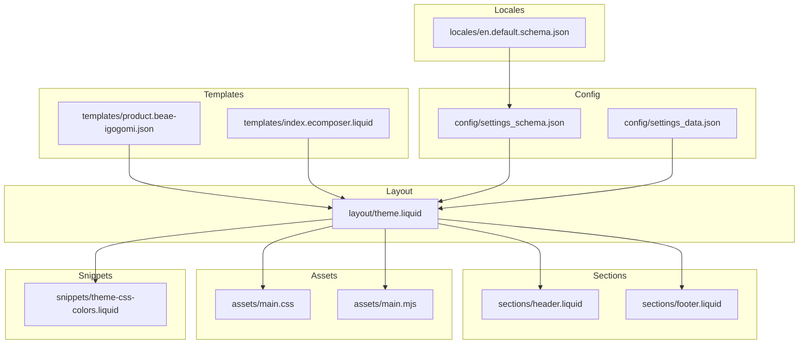
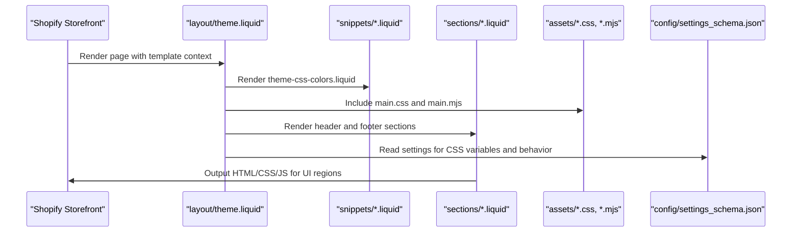
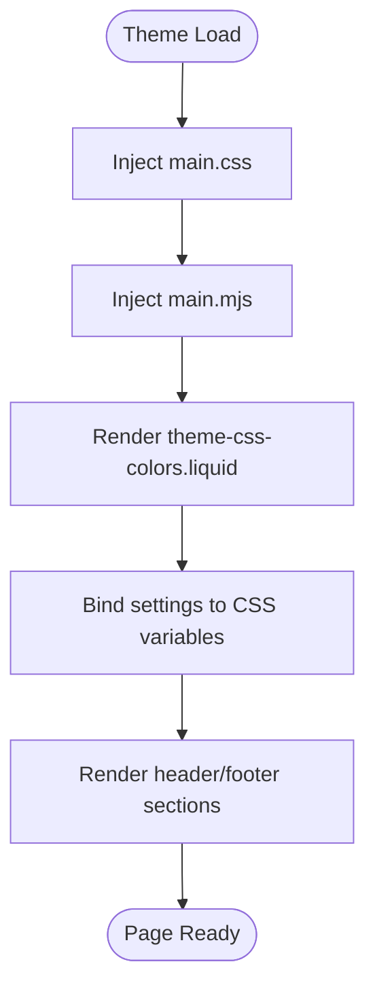
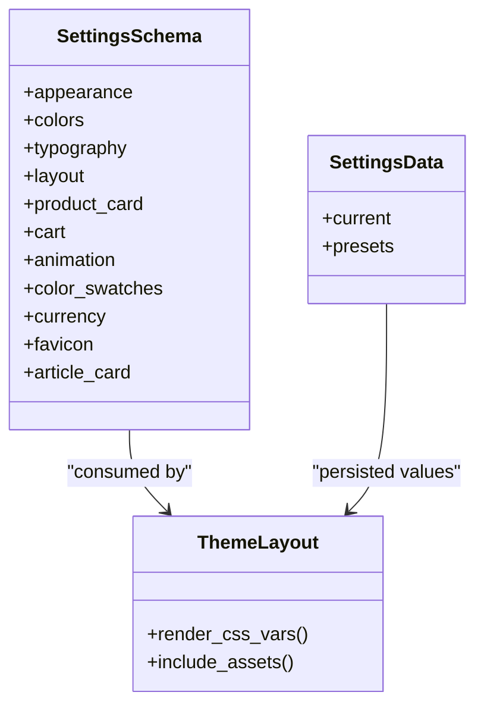
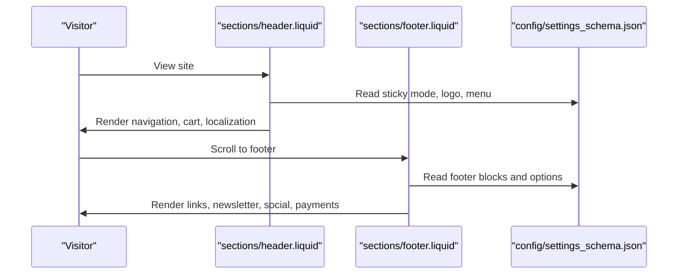
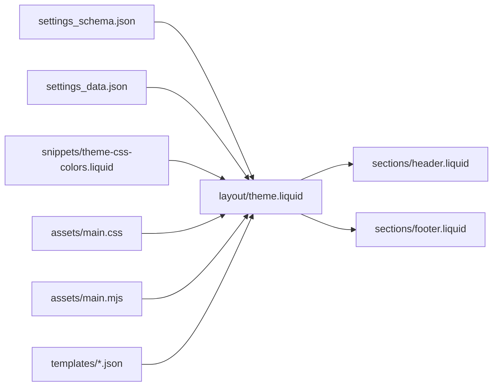

# Getting Started

<cite>
**Referenced Files in This Document**
- [settings_schema.json](file://config/settings_schema.json)
- [settings_data.json](file://config/settings_data.json)
- [theme.liquid](file://layout/theme.liquid)
- [main.mjs](file://assets/main.mjs)
- [main.css](file://assets/main.css)
- [theme-css-colors.liquid](file://snippets/theme-css-colors.liquid)
- [en.default.schema.json](file://locales/en.default.schema.json)
- [header.liquid](file://sections/header.liquid)
- [footer.liquid](file://sections/footer.liquid)
- [product.beae-igogomi.json](file://templates/product.beae-igogomi.json)
- [index.ecomposer.liquid](file://templates/index.ecomposer.liquid)
</cite>

## Table of Contents
1. [Introduction](#introduction)
2. [Project Structure](#project-structure)
3. [Core Components](#core-components)
4. [Architecture Overview](#architecture-overview)
5. [Detailed Component Analysis](#detailed-component-analysis)
6. [Dependency Analysis](#dependency-analysis)
7. [Performance Considerations](#performance-considerations)
8. [Troubleshooting Guide](#troubleshooting-guide)
9. [Conclusion](#conclusion)
10. [Appendices](#appendices)

## Introduction
This guide helps you install, configure, and customize the Igogomi Shopify theme. It covers:
- Prerequisites and environment basics
- Installing the theme in a Shopify store
- Accessing the Theme Editor and applying settings from the settings schema
- Local development setup and asset compilation
- Initial customization workflow
- Common setup issues and troubleshooting tips

## Project Structure
The Igogomi theme follows Shopify’s standard theme structure:
- Layout: shared page scaffolding and global includes
- Sections: reusable content blocks for headers, footers, and page-specific regions
- Templates: page templates for products, collections, blogs, and special pages
- Assets: compiled CSS and JavaScript bundles
- Config: theme settings schema and presets
- Locales: translation keys for settings and UI text
- Snippets: reusable Liquid partials injected into the layout

**Diagram sources**
- [theme.liquid:1-258](file://layout/theme.liquid#L1-L258)
- [header.liquid:1-555](file://sections/header.liquid#L1-L555)
- [footer.liquid:1-325](file://sections/footer.liquid#L1-L325)
- [main.css:1-800](file://assets/main.css#L1-L800)
- [main.mjs:1-60](file://assets/main.mjs#L1-L60)
- [settings_schema.json:1-800](file://config/settings_schema.json#L1-L800)
- [settings_data.json:1-1](file://config/settings_data.json#L1-L1)
- [en.default.schema.json:1-800](file://locales/en.default.schema.json#L1-L800)
- [theme-css-colors.liquid:1-147](file://snippets/theme-css-colors.liquid#L1-L147)
- [product.beae-igogomi.json:1-1](file://templates/product.beae-igogomi.json#L1-L1)
- [index.ecomposer.liquid:1-1](file://templates/index.ecomposer.liquid#L1-L1)

**Section sources**
- [theme.liquid:1-258](file://layout/theme.liquid#L1-L258)
- [settings_schema.json:1-800](file://config/settings_schema.json#L1-L800)
- [settings_data.json:1-1](file://config/settings_data.json#L1-L1)
- [en.default.schema.json:1-800](file://locales/en.default.schema.json#L1-L800)
- [main.css:1-800](file://assets/main.css#L1-L800)
- [main.mjs:1-60](file://assets/main.mjs#L1-L60)
- [theme-css-colors.liquid:1-147](file://snippets/theme-css-colors.liquid#L1-L147)
- [header.liquid:1-555](file://sections/header.liquid#L1-L555)
- [footer.liquid:1-325](file://sections/footer.liquid#L1-L325)
- [product.beae-igogomi.json:1-1](file://templates/product.beae-igogomi.json#L1-L1)
- [index.ecomposer.liquid:1-1](file://templates/index.ecomposer.liquid#L1-L1)

## Core Components
- Theme layout and globals: The main layout injects assets, renders global snippets, and binds theme settings to CSS variables and runtime behavior.
- Settings schema: Defines all customizable options (appearance, colors, typography, layout, product cards, cart, animation, etc.) surfaced in the Theme Editor.
- Sections: Header and footer are highly configurable via settings and blocks, enabling navigation, localization, cart integration, and social links.
- Assets: CSS and JavaScript bundles are included via the layout and drive interactive components and animations.
- Templates: Page templates bind to the theme layout and define section placements for specific pages.

What you will do:
- Install the theme in Shopify
- Open the Theme Editor and adjust settings from the schema
- Add and configure sections in the header and footer
- Preview and publish changes
- Optionally set up local development for asset compilation and testing

**Section sources**
- [theme.liquid:1-258](file://layout/theme.liquid#L1-L258)
- [settings_schema.json:1-800](file://config/settings_schema.json#L1-L800)
- [header.liquid:1-555](file://sections/header.liquid#L1-L555)
- [footer.liquid:1-325](file://sections/footer.liquid#L1-L325)
- [main.css:1-800](file://assets/main.css#L1-L800)
- [main.mjs:1-60](file://assets/main.mjs#L1-L60)

## Architecture Overview
The theme architecture centers on the layout rendering the page shell, injecting assets, and binding settings to CSS variables. Sections encapsulate UI regions, while templates connect pages to the layout and section groups.

**Diagram sources**
- [theme.liquid:1-258](file://layout/theme.liquid#L1-L258)
- [theme-css-colors.liquid:1-147](file://snippets/theme-css-colors.liquid#L1-L147)
- [main.css:1-800](file://assets/main.css#L1-L800)
- [main.mjs:1-60](file://assets/main.mjs#L1-L60)
- [settings_schema.json:1-800](file://config/settings_schema.json#L1-L800)

## Detailed Component Analysis

### Theme Layout and Asset Pipeline
- The layout sets up the HTML skeleton, loads global snippets, injects CSS and JS, and binds settings to CSS variables for responsive and theme-wide styling.
- CSS variables are generated from settings to control colors, typography, spacing, and UI accents.
- JavaScript initializes interactive components and handles cart, modals, carousels, and accessibility.

**Diagram sources**
- [theme.liquid:1-258](file://layout/theme.liquid#L1-L258)
- [theme-css-colors.liquid:1-147](file://snippets/theme-css-colors.liquid#L1-L147)
- [main.css:1-800](file://assets/main.css#L1-L800)
- [main.mjs:1-60](file://assets/main.mjs#L1-L60)

**Section sources**
- [theme.liquid:1-258](file://layout/theme.liquid#L1-L258)
- [theme-css-colors.liquid:1-147](file://snippets/theme-css-colors.liquid#L1-L147)
- [main.css:1-800](file://assets/main.css#L1-L800)
- [main.mjs:1-60](file://assets/main.mjs#L1-L60)

### Settings Schema and Theme Editor
- The settings schema defines categories such as Appearance, Colors, Typography, Layout, Product Card, Cart, Animation, and more.
- These settings are surfaced in the Theme Editor and persisted in settings data.
- The layout reads settings and renders CSS variables accordingly.

**Diagram sources**
- [settings_schema.json:1-800](file://config/settings_schema.json#L1-L800)
- [settings_data.json:1-1](file://config/settings_data.json#L1-L1)
- [theme.liquid:1-258](file://layout/theme.liquid#L1-L258)

**Section sources**
- [settings_schema.json:1-800](file://config/settings_schema.json#L1-L800)
- [settings_data.json:1-1](file://config/settings_data.json#L1-L1)
- [theme.liquid:1-258](file://layout/theme.liquid#L1-L258)

### Header and Footer Sections
- The header supports sticky modes, transparent header behavior, localization selectors, search, and cart integration.
- The footer supports multiple block types (links, text, newsletter), social icons, payment icons, and country/language selectors.

**Diagram sources**
- [header.liquid:1-555](file://sections/header.liquid#L1-L555)
- [footer.liquid:1-325](file://sections/footer.liquid#L1-L325)
- [settings_schema.json:1-800](file://config/settings_schema.json#L1-L800)

**Section sources**
- [header.liquid:1-555](file://sections/header.liquid#L1-L555)
- [footer.liquid:1-325](file://sections/footer.liquid#L1-L325)
- [settings_schema.json:1-800](file://config/settings_schema.json#L1-L800)

### Templates and Page Bindings
- Product and index templates bind to the theme layout and define section placements for product pages and workspace pages.
- These templates ensure sections render within the theme’s layout and settings context.

**Section sources**
- [product.beae-igogomi.json:1-1](file://templates/product.beae-igogomi.json#L1-L1)
- [index.ecomposer.liquid:1-1](file://templates/index.ecomposer.liquid#L1-L1)
- [theme.liquid:1-258](file://layout/theme.liquid#L1-L258)

## Dependency Analysis
- The layout depends on:
  - Settings schema for runtime values
  - Snippets for CSS variable generation
  - Assets for styling and interactivity
  - Sections for content regions
- Sections depend on:
  - Settings for behavior and appearance
  - Snippets for shared UI elements
  - Templates for page context

**Diagram sources**
- [settings_schema.json:1-800](file://config/settings_schema.json#L1-L800)
- [settings_data.json:1-1](file://config/settings_data.json#L1-L1)
- [theme.liquid:1-258](file://layout/theme.liquid#L1-L258)
- [theme-css-colors.liquid:1-147](file://snippets/theme-css-colors.liquid#L1-L147)
- [main.css:1-800](file://assets/main.css#L1-L800)
- [main.mjs:1-60](file://assets/main.mjs#L1-L60)
- [header.liquid:1-555](file://sections/header.liquid#L1-L555)
- [footer.liquid:1-325](file://sections/footer.liquid#L1-L325)
- [product.beae-igogomi.json:1-1](file://templates/product.beae-igogomi.json#L1-L1)
- [index.ecomposer.liquid:1-1](file://templates/index.ecomposer.liquid#L1-L1)

**Section sources**
- [settings_schema.json:1-800](file://config/settings_schema.json#L1-L800)
- [settings_data.json:1-1](file://config/settings_data.json#L1-L1)
- [theme.liquid:1-258](file://layout/theme.liquid#L1-L258)
- [theme-css-colors.liquid:1-147](file://snippets/theme-css-colors.liquid#L1-L147)
- [main.css:1-800](file://assets/main.css#L1-L800)
- [main.mjs:1-60](file://assets/main.mjs#L1-L60)
- [header.liquid:1-555](file://sections/header.liquid#L1-L555)
- [footer.liquid:1-325](file://sections/footer.liquid#L1-L325)
- [product.beae-igogomi.json:1-1](file://templates/product.beae-igogomi.json#L1-L1)
- [index.ecomposer.liquid:1-1](file://templates/index.ecomposer.liquid#L1-L1)

## Performance Considerations
- CSS and JavaScript are included via the layout; ensure only necessary assets are loaded.
- Settings-driven CSS variables reduce duplication and enable efficient theme-wide updates.
- Interactive components rely on modern JavaScript; test across browsers and devices.
- Image and media handling is optimized through lazy loading and responsive attributes in sections.

[No sources needed since this section provides general guidance]

## Troubleshooting Guide
Common setup issues and resolutions:
- Settings not applying
  - Verify settings are saved in the Theme Editor and match the schema categories.
  - Confirm the layout renders theme CSS variables from settings.
- Header or footer not displaying expected content
  - Check section settings (e.g., menu links, localization toggles) and ensure blocks are configured.
- Assets not loading
  - Ensure the layout includes the CSS and JS bundles and that the CDN is reachable.
- Transparent header or sticky behavior not working
  - Review header settings for sticky mode and transparent header options.

**Section sources**
- [theme.liquid:1-258](file://layout/theme.liquid#L1-L258)
- [header.liquid:1-555](file://sections/header.liquid#L1-L555)
- [footer.liquid:1-325](file://sections/footer.liquid#L1-L325)
- [settings_schema.json:1-800](file://config/settings_schema.json#L1-L800)

## Conclusion
You now have the essentials to install the Igogomi theme, open the Theme Editor, and apply settings from the schema. Use the header and footer sections to tailor navigation, localization, and branding. For deeper customization, explore the settings schema and templates. When ready, deploy to production and continue iterating with the Theme Editor.

[No sources needed since this section summarizes without analyzing specific files]

## Appendices

### A. Prerequisites
- A Shopify account and store
- Basic understanding of Shopify themes and Liquid templating
- Familiarity with the Theme Editor and section/block concepts

[No sources needed since this section provides general guidance]

### B. Step-by-Step Setup

1) Install the theme
- Upload the theme ZIP to your Shopify admin under Online Sales Channels > Themes.
- Select “Add theme” and choose the uploaded theme.

2) Open the Theme Editor
- From the Themes page, select “Customize” on the installed theme.

3) Adjust settings from the schema
- Navigate to the Theme Editor and use the Appearance, Colors, Typography, Layout, Product Card, Cart, and Animation sections to change options.
- Settings are defined in the settings schema and applied at runtime.

4) Configure header and footer
- In the Theme Editor, open the Header and Footer sections.
- Set menus, localization options, cart behavior, and social links.
- Add and arrange footer blocks (links, text, newsletter).

5) Preview and publish
- Use the preview pane to review changes across pages.
- Publish the theme when satisfied.

6) Optional: Local development
- Install the Shopify CLI and clone the theme locally.
- Use the CLI to watch and compile assets during development.
- Sync changes to your live store for testing.

[No sources needed since this section provides general guidance]