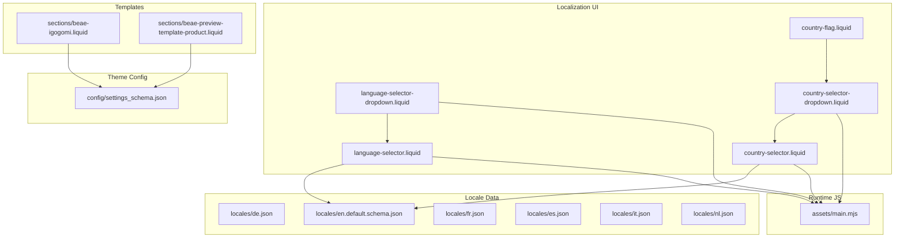
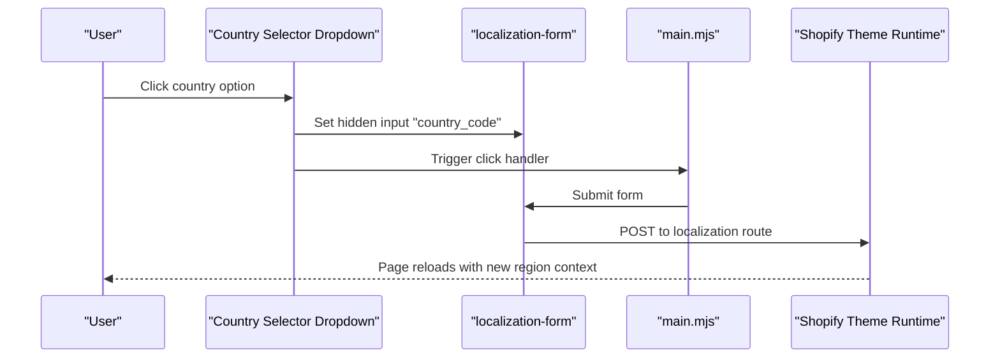
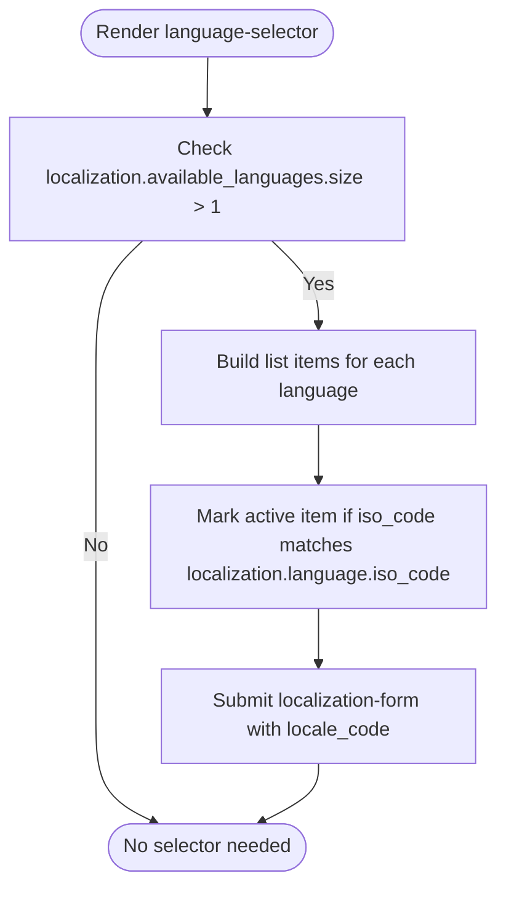
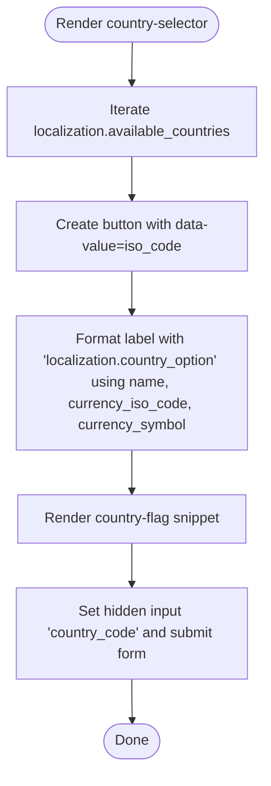
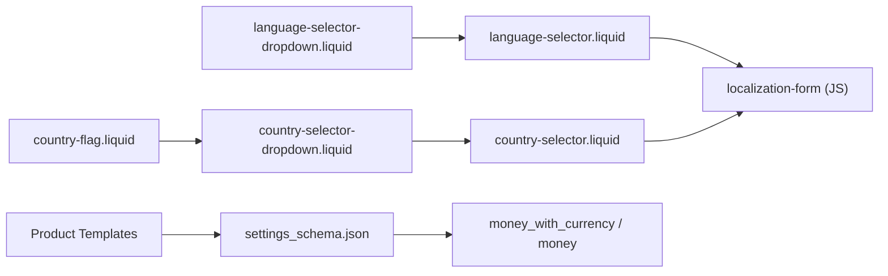

# Internationalization

<cite>
**Referenced Files in This Document**
- [language-selector.liquid](file://snippets/language-selector.liquid)
- [language-selector-dropdown.liquid](file://snippets/language-selector-dropdown.liquid)
- [country-selector.liquid](file://snippets/country-selector.liquid)
- [country-selector-dropdown.liquid](file://snippets/country-selector-dropdown.liquid)
- [country-flag.liquid](file://snippets/country-flag.liquid)
- [main.mjs](file://assets/main.mjs)
- [de.json](file://locales/de.json)
- [en.default.schema.json](file://locales/en.default.schema.json)
- [fr.json](file://locales/fr.json)
- [es.json](file://locales/es.json)
- [it.json](file://locales/it.json)
- [nl.json](file://locales/nl.json)
- [settings_schema.json](file://config/settings_schema.json)
- [beae-igogomi.liquid](file://sections/beae-igogomi.liquid)
- [beae-preview-template-product.liquid](file://sections/beae-preview-template-product.liquid)
</cite>

## Table of Contents
1. [Introduction](#introduction)
2. [Project Structure](#project-structure)
3. [Core Components](#core-components)
4. [Architecture Overview](#architecture-overview)
5. [Detailed Component Analysis](#detailed-component-analysis)
6. [Dependency Analysis](#dependency-analysis)
7. [Performance Considerations](#performance-considerations)
8. [Troubleshooting Guide](#troubleshooting-guide)
9. [Conclusion](#conclusion)

## Introduction
This document explains the internationalization (i18n) system for the theme, covering multi-language support, regional customization, and currency presentation. It details the localization framework built on Shopify’s Liquid localization APIs, the language and country selectors, and how regional preferences influence pricing display. It also outlines the locale file structure, translation management, and integration with Shopify’s commerce features such as currency codes and checkout behavior.

## Project Structure
The internationalization system spans several areas:
- Localization snippets for language and country selection
- Locale JSON files for translations and regional labels
- Theme configuration schema for currency display settings
- Product templates that render prices with currency codes when enabled
- A shared JavaScript module that handles localization forms and dropdown interactions

**Diagram sources**
- [language-selector.liquid:1-30](file://snippets/language-selector.liquid#L1-L30)
- [language-selector-dropdown.liquid:1-35](file://snippets/language-selector-dropdown.liquid#L1-L35)
- [country-selector.liquid:1-39](file://snippets/country-selector.liquid#L1-L39)
- [country-selector-dropdown.liquid:1-63](file://snippets/country-selector-dropdown.liquid#L1-L63)
- [country-flag.liquid:1-10](file://snippets/country-flag.liquid#L1-L10)
- [de.json:465-471](file://locales/de.json#L465-L471)
- [en.default.schema.json:617-630](file://locales/en.default.schema.json#L617-L630)
- [fr.json:465-471](file://locales/fr.json#L465-L471)
- [es.json:465-471](file://locales/es.json#L465-L471)
- [it.json:465-471](file://locales/it.json#L465-L471)
- [nl.json:465-471](file://locales/nl.json#L465-L471)
- [settings_schema.json:617-630](file://config/settings_schema.json#L617-L630)
- [beae-igogomi.liquid:402-430](file://sections/beae-igogomi.liquid#L402-L430)
- [beae-preview-template-product.liquid:425-451](file://sections/beae-preview-template-product.liquid#L425-L451)
- [main.mjs:1-60](file://assets/main.mjs#L1-L60)

**Section sources**
- [language-selector.liquid:1-30](file://snippets/language-selector.liquid#L1-L30)
- [language-selector-dropdown.liquid:1-35](file://snippets/language-selector-dropdown.liquid#L1-L35)
- [country-selector.liquid:1-39](file://snippets/country-selector.liquid#L1-L39)
- [country-selector-dropdown.liquid:1-63](file://snippets/country-selector-dropdown.liquid#L1-L63)
- [country-flag.liquid:1-10](file://snippets/country-flag.liquid#L1-L10)
- [de.json:465-471](file://locales/de.json#L465-L471)
- [en.default.schema.json:617-630](file://locales/en.default.schema.json#L617-L630)
- [fr.json:465-471](file://locales/fr.json#L465-L471)
- [es.json:465-471](file://locales/es.json#L465-L471)
- [it.json:465-471](file://locales/it.json#L465-L471)
- [nl.json:465-471](file://locales/nl.json#L465-L471)
- [settings_schema.json:617-630](file://config/settings_schema.json#L617-L630)
- [beae-igogomi.liquid:402-430](file://sections/beae-igogomi.liquid#L402-L430)
- [beae-preview-template-product.liquid:425-451](file://sections/beae-preview-template-product.liquid#L425-L451)
- [main.mjs:1-60](file://assets/main.mjs#L1-L60)

## Core Components
- Language selector: Renders a list of available languages and submits a localization form to switch language.
- Country selector: Presents selectable countries with currency ISO code and symbol, and submits a localization form to change region.
- Localization snippets: Provide reusable UI for dropdowns and lists.
- Locale files: Define translation keys and regional labels such as “Country / Region” and “Language.”
- Currency display setting: Controlled via theme settings to toggle currency codes on product and cart pages.
- JavaScript runtime: Handles localization form submission and dropdown interactions.

Key responsibilities:
- Language switching updates the page’s language context and triggers a full page refresh.
- Country selection updates the region context and influences pricing display and currency formatting.
- Currency codes are shown when the theme setting is enabled.

**Section sources**
- [language-selector.liquid:1-30](file://snippets/language-selector.liquid#L1-L30)
- [country-selector.liquid:1-39](file://snippets/country-selector.liquid#L1-L39)
- [country-selector-dropdown.liquid:1-63](file://snippets/country-selector-dropdown.liquid#L1-L63)
- [de.json:465-471](file://locales/de.json#L465-L471)
- [en.default.schema.json:617-630](file://locales/en.default.schema.json#L617-L630)
- [settings_schema.json:617-630](file://config/settings_schema.json#L617-L630)
- [main.mjs:1-60](file://assets/main.mjs#L1-L60)

## Architecture Overview
The internationalization architecture combines Liquid templates, locale files, and JavaScript to deliver a cohesive multilingual and regional experience.

**Diagram sources**
- [country-selector-dropdown.liquid:1-63](file://snippets/country-selector-dropdown.liquid#L1-L63)
- [country-selector.liquid:1-39](file://snippets/country-selector.liquid#L1-L39)
- [main.mjs:1-60](file://assets/main.mjs#L1-L60)

## Detailed Component Analysis

### Language Selector
The language selector renders a list of available languages from the current localization context. Each item is a button that sets the language code and submits the localization form. The dropdown wrapper integrates with the shared dropdown component and passes the current language state.

Implementation highlights:
- Uses localization.available_languages to enumerate options.
- Sets aria-current on the active language.
- Submits via a hidden input named locale_code.

**Diagram sources**
- [language-selector.liquid:1-30](file://snippets/language-selector.liquid#L1-L30)

**Section sources**
- [language-selector.liquid:1-30](file://snippets/language-selector.liquid#L1-L30)
- [language-selector-dropdown.liquid:1-35](file://snippets/language-selector-dropdown.liquid#L1-L35)

### Country Selector
The country selector presents a list of available countries, each showing the country name and currency information. The dropdown displays the current country’s flag, name, and currency code/symbol. Selecting an option updates the hidden country_code input and submits the form.

Implementation highlights:
- Uses localization.available_countries and localization.country.
- Formats the option label using translation keys with currency_iso_code and currency_symbol.
- Integrates with the country-flag snippet to render flags.

**Diagram sources**
- [country-selector.liquid:1-39](file://snippets/country-selector.liquid#L1-L39)
- [country-flag.liquid:1-10](file://snippets/country-flag.liquid#L1-L10)

**Section sources**
- [country-selector.liquid:1-39](file://snippets/country-selector.liquid#L1-L39)
- [country-selector-dropdown.liquid:1-63](file://snippets/country-selector-dropdown.liquid#L1-L63)
- [country-flag.liquid:1-10](file://snippets/country-flag.liquid#L1-L10)

### Localization Forms and JavaScript
The shared localization-form component binds click handlers to buttons inside the selector snippets. When clicked, it updates the hidden input for the chosen locale or country and submits the form. This triggers a full page reload with the new localization context.

Key behaviors:
- Updates input[name="locale_code"] or input[name="country_code"].
- Submits the nearest form element.
- Works for both language and country selectors.

**Section sources**
- [main.mjs:1-60](file://assets/main.mjs#L1-L60)

### Locale Files and Translation Keys
Locale files define translation keys for UI labels and regional strings. The “localization” namespace includes keys for labels and option formatting. These keys are used across selectors and templates.

Examples of localization keys:
- localization.country_label
- localization.country_option
- localization.language_label
- localization.update_language
- localization.update_country

These keys appear in:
- Country selector option formatting
- Language selector label rendering
- General localization strings

**Section sources**
- [de.json:465-471](file://locales/de.json#L465-L471)
- [fr.json:465-471](file://locales/fr.json#L465-L471)
- [es.json:465-471](file://locales/es.json#L465-L471)
- [it.json:465-471](file://locales/it.json#L465-L471)
- [nl.json:465-471](file://locales/nl.json#L465-L471)

### Currency Display and Regional Pricing
Regional pricing and currency formatting are controlled by:
- Theme settings: currency_code_enabled toggles whether currency codes are shown.
- Product templates: conditionally render money_with_currency or money based on the setting.

How it works:
- When currency_code_enabled is true, product prices display with currency codes (e.g., $1.00 USD).
- When disabled, prices display without currency codes.
- This setting affects product listings, detail pages, and cart/checkout contexts.

**Section sources**
- [en.default.schema.json:617-630](file://locales/en.default.schema.json#L617-L630)
- [settings_schema.json:617-630](file://config/settings_schema.json#L617-L630)
- [beae-igogomi.liquid:402-430](file://sections/beae-igogomi.liquid#L402-L430)
- [beae-preview-template-product.liquid:425-451](file://sections/beae-preview-template-product.liquid#L425-L451)

## Dependency Analysis
The internationalization system depends on:
- Liquid localization APIs for available_languages, available_countries, and current language/country.
- Locale JSON files for translation keys.
- Theme settings for currency display behavior.
- Shared JavaScript for form submission and dropdown interactions.

**Diagram sources**
- [language-selector.liquid:1-30](file://snippets/language-selector.liquid#L1-L30)
- [country-selector.liquid:1-39](file://snippets/country-selector.liquid#L1-L39)
- [country-selector-dropdown.liquid:1-63](file://snippets/country-selector-dropdown.liquid#L1-L63)
- [language-selector-dropdown.liquid:1-35](file://snippets/language-selector-dropdown.liquid#L1-L35)
- [country-flag.liquid:1-10](file://snippets/country-flag.liquid#L1-L10)
- [settings_schema.json:617-630](file://config/settings_schema.json#L617-L630)
- [beae-igogomi.liquid:402-430](file://sections/beae-igogomi.liquid#L402-L430)
- [beae-preview-template-product.liquid:425-451](file://sections/beae-preview-template-product.liquid#L425-L451)
- [main.mjs:1-60](file://assets/main.mjs#L1-L60)

**Section sources**
- [main.mjs:1-60](file://assets/main.mjs#L1-L60)
- [settings_schema.json:617-630](file://config/settings_schema.json#L617-L630)

## Performance Considerations
- Full page reloads occur on language and country changes. Keep selector lists concise to minimize DOM rendering overhead.
- Currency code rendering adds minor formatting overhead; enable only when required by business needs.
- Lazy-loading flags and images in selectors can reduce initial payload.

## Troubleshooting Guide
Common issues and resolutions:
- Language or country does not persist after selection
  - Ensure the localization-form is present and the hidden input (locale_code or country_code) is set before submission.
  - Verify the click handler in the shared JavaScript is attached to the buttons.
- Country flag not visible
  - Confirm the country-flag snippet resolves the asset URL for the flag SVG and that the asset exists.
- Currency codes not appearing
  - Check the currency_code_enabled setting in theme settings and ensure templates render money_with_currency when enabled.

**Section sources**
- [main.mjs:1-60](file://assets/main.mjs#L1-L60)
- [country-flag.liquid:1-10](file://snippets/country-flag.liquid#L1-L10)
- [settings_schema.json:617-630](file://config/settings_schema.json#L617-L630)

## Conclusion
The theme’s internationalization system leverages Shopify’s built-in localization APIs, a set of reusable Liquid snippets, and a small JavaScript module to provide language and country selection. Locale files centralize translation keys for UI labels and regional formatting. Currency display is configurable via theme settings and reflected in product templates. Together, these components deliver a flexible, maintainable i18n solution aligned with Shopify’s platform capabilities.