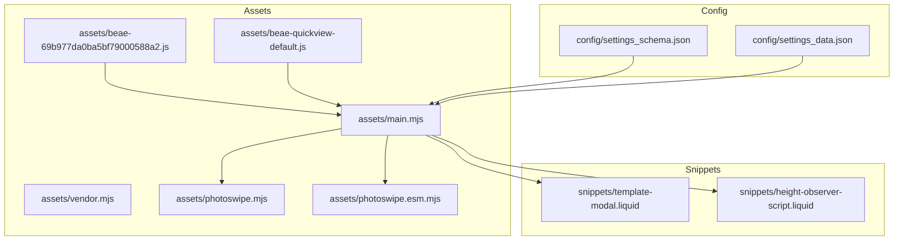
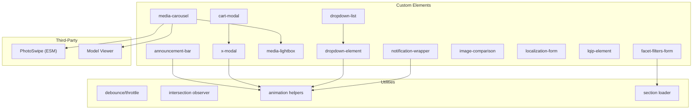
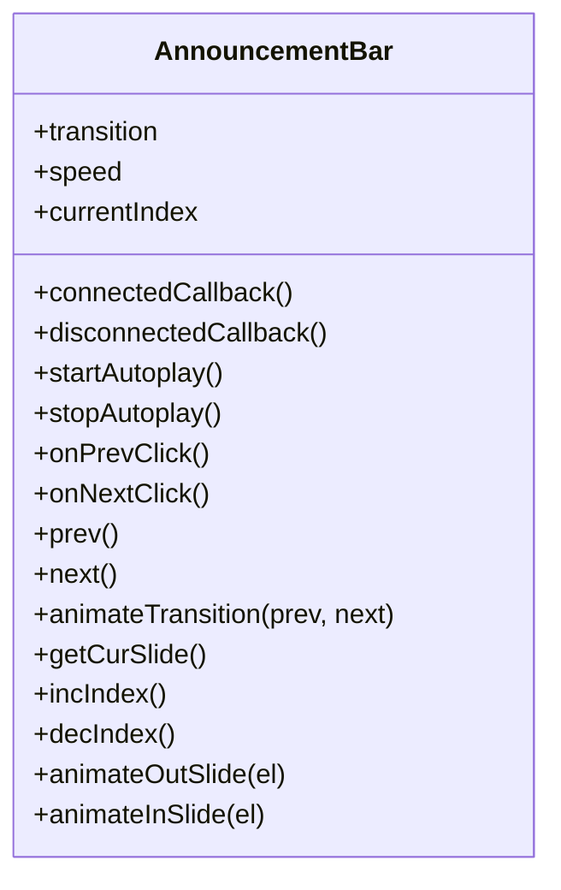
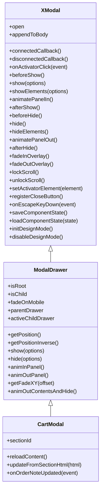
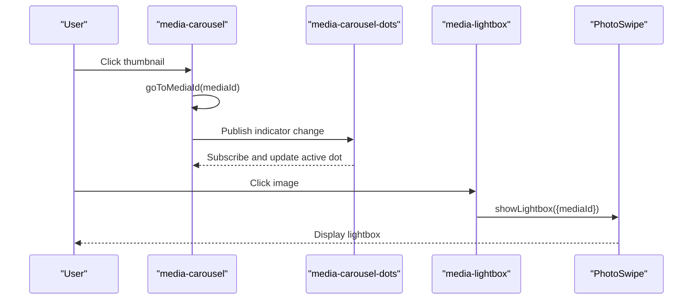
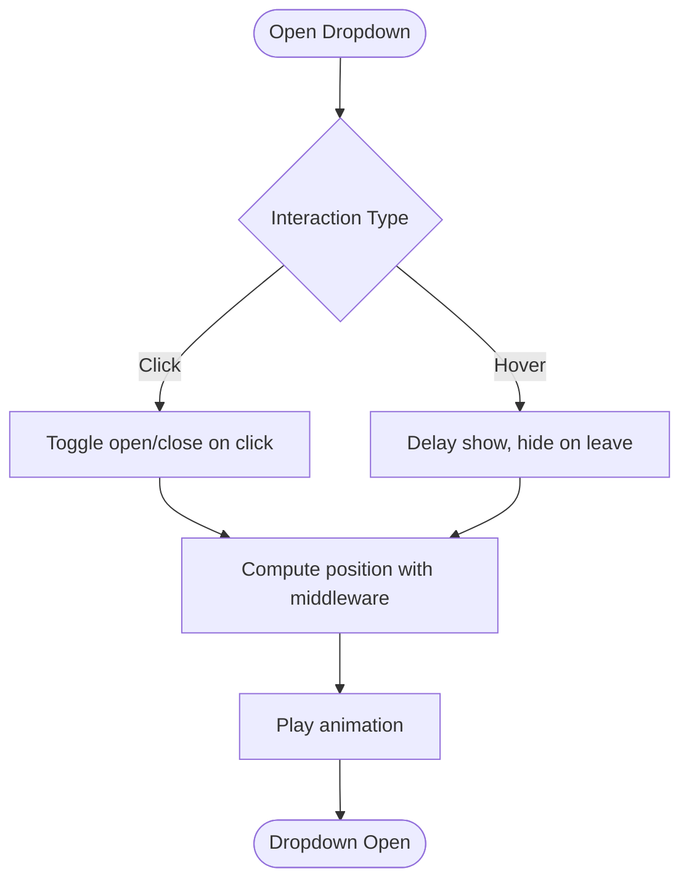
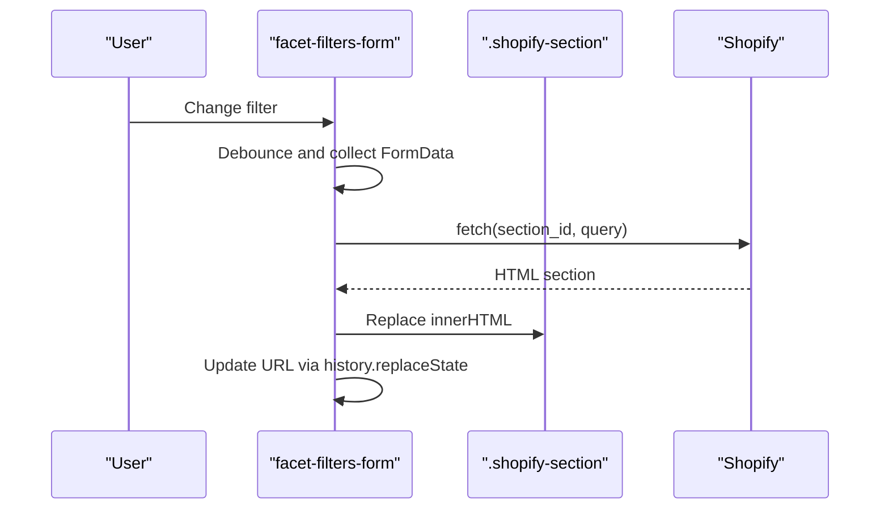
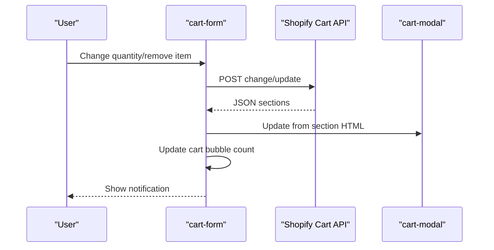
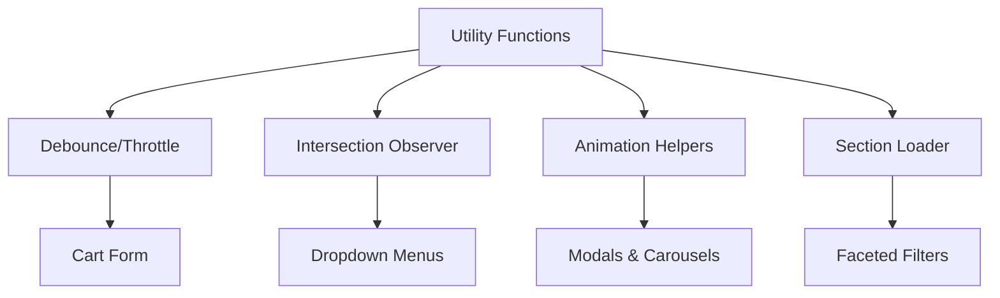
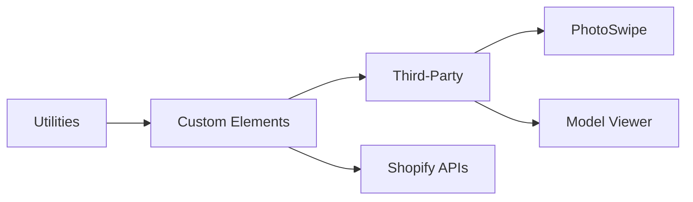

# JavaScript Framework

<cite>
**Referenced Files in This Document**
- [main.mjs](file://assets/main.mjs)
- [vendor.mjs](file://assets/vendor.mjs)
- [photoswipe.mjs](file://assets/photoswipe.mjs)
- [photoswipe.esm.mjs](file://assets/photoswipe.esm.mjs)
- [beae-69b977da0ba5bf79000588a2.js](file://assets/beae-69b977da0ba5bf79000588a2.js)
- [beae-quickview-default.js](file://assets/beae-quickview-default.js)
- [settings_schema.json](file://config/settings_schema.json)
- [settings_data.json](file://config/settings_data.json)
- [template-modal.liquid](file://snippets/template-modal.liquid)
- [height-observer-script.liquid](file://snippets/height-observer-script.liquid)
</cite>

## Table of Contents
1. [Introduction](#introduction)
2. [Project Structure](#project-structure)
3. [Core Components](#core-components)
4. [Architecture Overview](#architecture-overview)
5. [Detailed Component Analysis](#detailed-component-analysis)
6. [Dependency Analysis](#dependency-analysis)
7. [Performance Considerations](#performance-considerations)
8. [Troubleshooting Guide](#troubleshooting-guide)
9. [Conclusion](#conclusion)

## Introduction
This document describes the JavaScript framework and modern web components that power the Igogomi theme. It covers the ES6+ module structure, Web Components implementation, asset loading strategy, integration with Shopify’s JavaScript APIs, media carousel systems, interactive elements, event handling patterns, and third-party library integrations such as PhotoSwipe and Model Viewer. It also documents progressive enhancement, accessibility features, and performance optimizations, along with the JavaScript API surface, custom events, and extension points for developers.

## Project Structure
The JavaScript framework is organized around a primary ES module that defines Web Components, utility functions, animations, and integrations. Supporting assets include PhotoSwipe CSS and ESM modules, BEAE-specific scripts for third-party builder integrations, and vendor utilities for prefetching and custom elements polyfills. Configuration files define theme settings and defaults that influence runtime behavior.

**Diagram sources**
- [main.mjs](file://assets/main.mjs)
- [vendor.mjs](file://assets/vendor.mjs)
- [photoswipe.mjs](file://assets/photoswipe.mjs)
- [photoswipe.esm.mjs](file://assets/photoswipe.esm.mjs)
- [beae-69b977da0ba5bf79000588a2.js](file://assets/beae-69b977da0ba5bf79000588a2.js)
- [beae-quickview-default.js](file://assets/beae-quickview-default.js)
- [settings_schema.json](file://config/settings_schema.json)
- [settings_data.json](file://config/settings_data.json)
- [template-modal.liquid](file://snippets/template-modal.liquid)
- [height-observer-script.liquid](file://snippets/height-observer-script.liquid)

**Section sources**
- [main.mjs](file://assets/main.mjs)
- [vendor.mjs](file://assets/vendor.mjs)
- [photoswipe.mjs](file://assets/photoswipe.mjs)
- [photoswipe.esm.mjs](file://assets/photoswipe.esm.mjs)
- [beae-69b977da0ba5bf79000588a2.js](file://assets/beae-69b977da0ba5bf79000588a2.js)
- [beae-quickview-default.js](file://assets/beae-quickview-default.js)
- [settings_schema.json](file://config/settings_schema.json)
- [settings_data.json](file://config/settings_data.json)
- [template-modal.liquid](file://snippets/template-modal.liquid)
- [height-observer-script.liquid](file://snippets/height-observer-script.liquid)

## Core Components
The framework centers on a set of custom elements and shared utilities:

- Announcement bar carousel with automatic transitions and manual controls
- Modal system with focus trap, scroll lock, and shadow DOM encapsulation
- Cart form with live updates and optimistic UI
- Media carousel with thumbnails, indicators, and lightbox integration
- Dropdown menus with dynamic positioning and animations
- Faceted filters with live section updates
- Image comparison slider
- Localization form
- Lazy-loading LQIP image wrapper
- Notification banner
- Utility functions for debouncing, throttling, intersection observation, and animation helpers

These components are built with ES6+ classes extending HTMLElement, use Shadow DOM where appropriate, and integrate with Shopify’s APIs for cart and section rendering.

**Section sources**
- [main.mjs](file://assets/main.mjs)

## Architecture Overview
The architecture combines custom elements with a publish/subscribe pattern for cross-component communication, asynchronous section updates via fetch, and modular PhotoSwipe integration. Vendor utilities provide prefetching and custom elements polyfills.

**Diagram sources**
- [main.mjs](file://assets/main.mjs)
- [photoswipe.esm.mjs](file://assets/photoswipe.esm.mjs)

**Section sources**
- [main.mjs](file://assets/main.mjs)

## Detailed Component Analysis

### Announcement Bar Carousel
A horizontally scrolling carousel with optional autoplay and directional controls. Uses smooth scroll behavior and IntersectionObserver for visibility detection.

**Diagram sources**
- [main.mjs](file://assets/main.mjs)

**Section sources**
- [main.mjs](file://assets/main.mjs)

### Modal System (x-modal, modal-drawer, cart-modal)
Encapsulated modals with Shadow DOM, focus trap, scroll lock, and optional body appending. Supports nested drawers and programmatic state preservation.

**Diagram sources**
- [main.mjs](file://assets/main.mjs)
- [template-modal.liquid](file://snippets/template-modal.liquid)

**Section sources**
- [main.mjs](file://assets/main.mjs)
- [template-modal.liquid](file://snippets/template-modal.liquid)

### Media Carousel and Lightbox
A horizontally scrollable media gallery with thumbnail navigation, progress indicators, and PhotoSwipe integration for image lightboxes. Supports adaptive height, lazy loading, and Model Viewer integration for 3D models.

**Diagram sources**
- [main.mjs](file://assets/main.mjs)
- [photoswipe.esm.mjs](file://assets/photoswipe.esm.mjs)

**Section sources**
- [main.mjs](file://assets/main.mjs)
- [photoswipe.mjs](file://assets/photoswipe.mjs)
- [photoswipe.esm.mjs](file://assets/photoswipe.esm.mjs)

### Dropdown Menus
Dynamic dropdowns with hover/click handlers, automatic positioning, and optional mobile modal behavior.

**Diagram sources**
- [main.mjs](file://assets/main.mjs)

**Section sources**
- [main.mjs](file://assets/main.mjs)

### Faceted Filters and Live Updates
Faceted filtering forms submit via fetch to update sections without reload, with abort controller support and URL synchronization.

**Diagram sources**
- [main.mjs](file://assets/main.mjs)

**Section sources**
- [main.mjs](file://assets/main.mjs)

### Cart Form and Add-to-Cart
Live cart updates with optimistic UI, quantity change handling, and drawer-based notifications.

**Diagram sources**
- [main.mjs](file://assets/main.mjs)

**Section sources**
- [main.mjs](file://assets/main.mjs)

### Utility Functions and Animation Helpers
Shared utilities include debounce/throttle, intersection observers, animation helpers, and section loaders.

**Diagram sources**
- [main.mjs](file://assets/main.mjs)

**Section sources**
- [main.mjs](file://assets/main.mjs)

### Third-Party Integrations
- PhotoSwipe: Dynamically imported and CSS injected for lightbox functionality
- Model Viewer: Integration for 3D model previews via data attributes and Shopify XR
- Vendor Prefetch: Instant.page integration for link prefetching

**Section sources**
- [main.mjs](file://assets/main.mjs)
- [photoswipe.mjs](file://assets/photoswipe.mjs)
- [photoswipe.esm.mjs](file://assets/photoswipe.esm.mjs)
- [vendor.mjs](file://assets/vendor.mjs)

## Dependency Analysis
The framework exhibits low coupling between components, with clear separation of concerns:
- Utilities are standalone and reusable
- Custom elements encapsulate behavior and DOM
- Third-party libraries are dynamically loaded
- Shopify APIs are accessed via fetch and routes

**Diagram sources**
- [main.mjs](file://assets/main.mjs)
- [photoswipe.esm.mjs](file://assets/photoswipe.esm.mjs)

**Section sources**
- [main.mjs](file://assets/main.mjs)

## Performance Considerations
- Lazy loading: Images and PhotoSwipe are loaded on demand
- Debouncing: Cart form and dropdown interactions are debounced
- Intersection Observer: Used for visibility and loading triggers
- Scroll-aware components: Media carousel adapts to viewport and content
- Optimistic UI: Immediate feedback during cart operations
- Prefetching: Vendor module prefetches links for improved navigation

[No sources needed since this section provides general guidance]

## Troubleshooting Guide
Common issues and resolutions:
- Modals not closing or trapping focus: Verify focus trap initialization and overlay click handlers
- Cart updates failing silently: Check network errors and ensure routes are defined
- Media carousel not syncing thumbnails: Confirm event subscriptions and section IDs
- PhotoSwipe not loading: Ensure CSS injection and ESM import are executed
- Dropdowns misaligned: Confirm middleware placement and dynamic positioning logic

**Section sources**
- [main.mjs](file://assets/main.mjs)

## Conclusion
The Igogomi theme’s JavaScript framework leverages modern web standards and Shopify’s APIs to deliver a responsive, accessible, and performant shopping experience. Its modular Web Components, robust utility layer, and third-party integrations provide a solid foundation for customization and extension while maintaining progressive enhancement and accessibility.