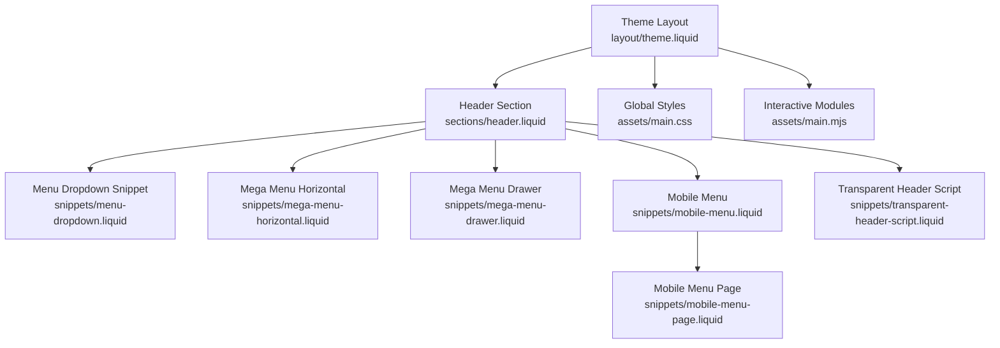
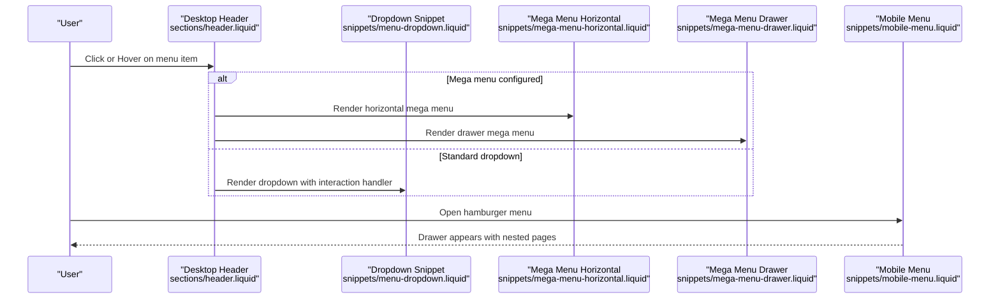
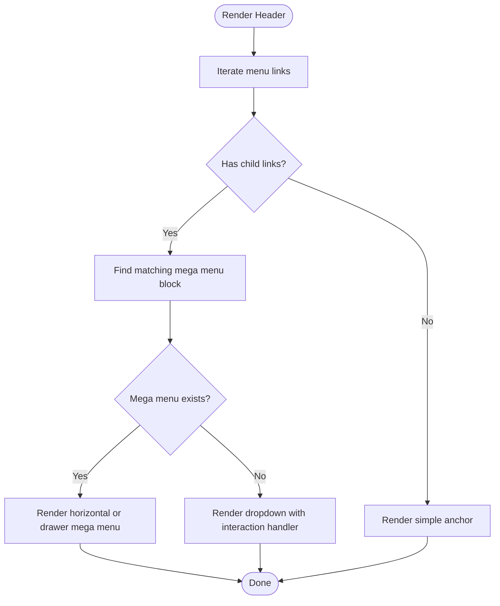
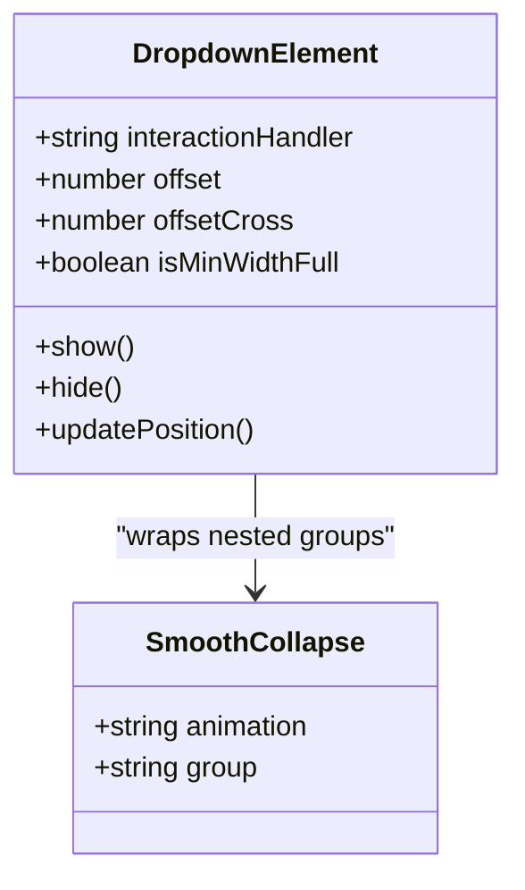
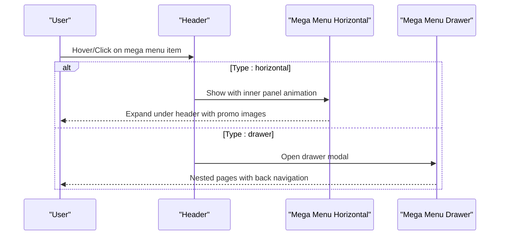
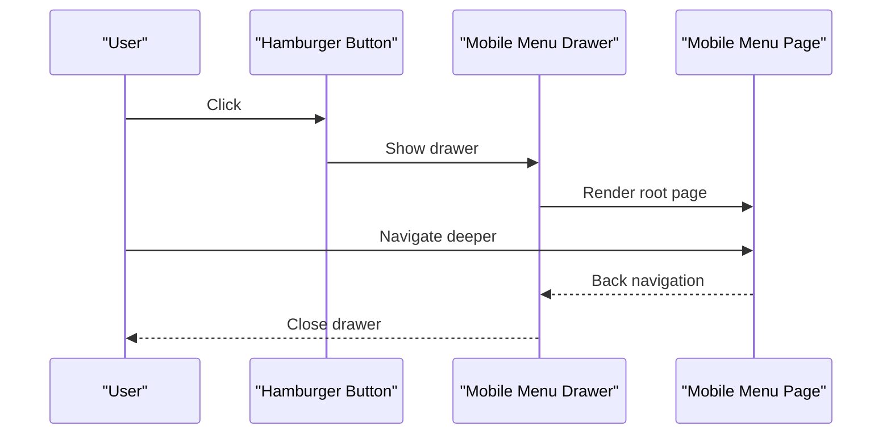
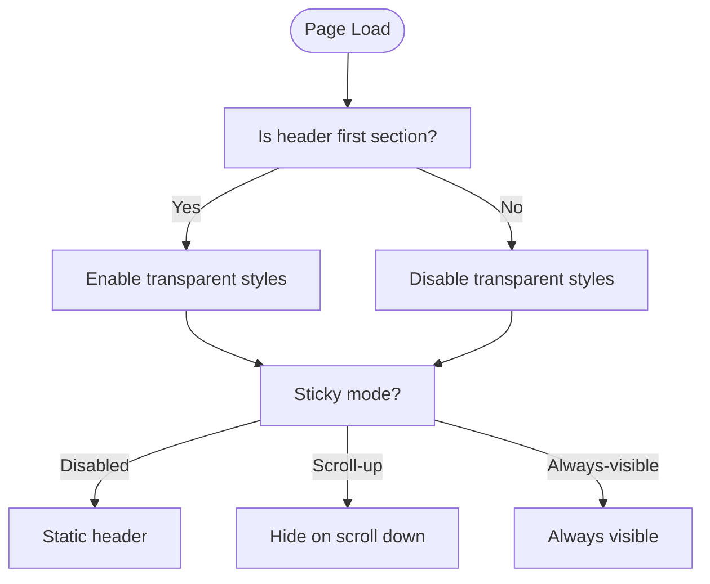
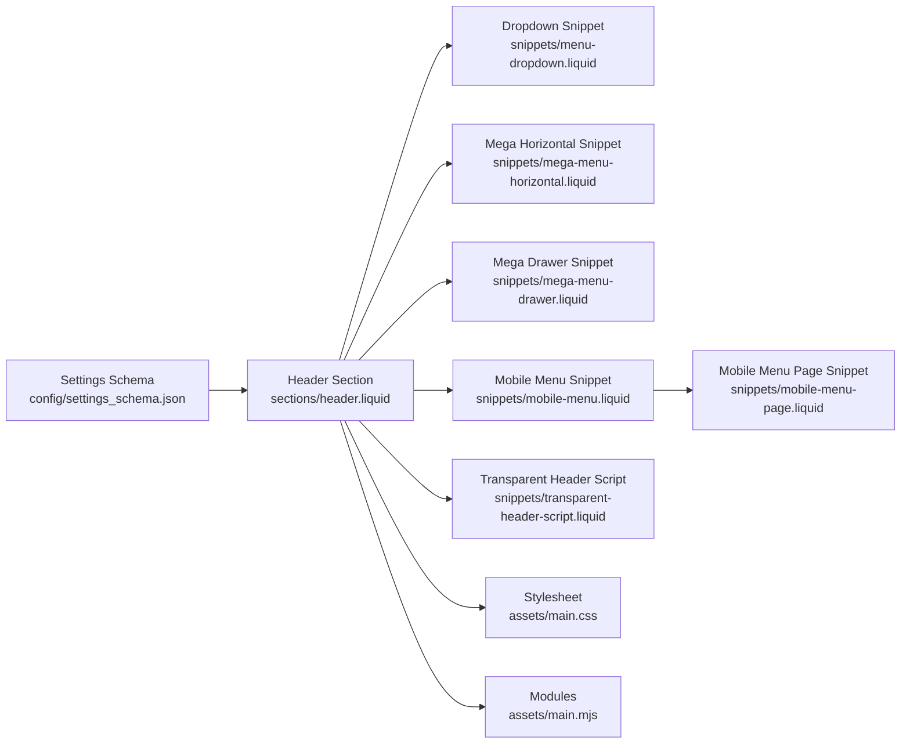

# Header Navigation

<cite>
**Referenced Files in This Document**
- [header.liquid](file://sections/header.liquid)
- [menu-dropdown.liquid](file://snippets/menu-dropdown.liquid)
- [mega-menu-horizontal.liquid](file://snippets/mega-menu-horizontal.liquid)
- [mega-menu-drawer.liquid](file://snippets/mega-menu-drawer.liquid)
- [mobile-menu.liquid](file://snippets/mobile-menu.liquid)
- [mobile-menu-page.liquid](file://snippets/mobile-menu-page.liquid)
- [transparent-header-script.liquid](file://snippets/transparent-header-script.liquid)
- [main.css](file://assets/main.css)
- [main.mjs](file://assets/main.mjs)
- [theme.liquid](file://layout/theme.liquid)
- [settings_schema.json](file://config/settings_schema.json)
</cite>

## Table of Contents
1. [Introduction](#introduction)
2. [Project Structure](#project-structure)
3. [Core Components](#core-components)
4. [Architecture Overview](#architecture-overview)
5. [Detailed Component Analysis](#detailed-component-analysis)
6. [Dependency Analysis](#dependency-analysis)
7. [Performance Considerations](#performance-considerations)
8. [Troubleshooting Guide](#troubleshooting-guide)
9. [Conclusion](#conclusion)

## Introduction
This document explains the header navigation system used in the igogomi theme. It covers desktop navigation structure, menu item rendering, dropdown and mega menu behaviors, responsive layouts (including logo-left-nav-left, logo-left-nav-center, and logo-center-nav-left), sticky header modes, transparent header behavior, mobile drawer navigation, and accessibility features such as ARIA labels, keyboard navigation, and screen reader support.

## Project Structure
The header navigation is composed of:
- A Liquid section that renders the desktop header, mobile menu, and transparent header logic
- Snippets for dropdown menus, horizontal and drawer mega menus, and mobile menu pages
- JavaScript modules that power interactive behaviors (dropdowns, modals, focus traps, sticky header)
- CSS that defines responsive layouts, transitions, and visual states

**Diagram sources**
- [theme.liquid](file://layout/theme.liquid)
- [header.liquid](file://sections/header.liquid)
- [menu-dropdown.liquid](file://snippets/menu-dropdown.liquid)
- [mega-menu-horizontal.liquid](file://snippets/mega-menu-horizontal.liquid)
- [mega-menu-drawer.liquid](file://snippets/mega-menu-drawer.liquid)
- [mobile-menu.liquid](file://snippets/mobile-menu.liquid)
- [mobile-menu-page.liquid](file://snippets/mobile-menu-page.liquid)
- [transparent-header-script.liquid](file://snippets/transparent-header-script.liquid)
- [main.css](file://assets/main.css)
- [main.mjs](file://assets/main.mjs)

**Section sources**
- [theme.liquid](file://layout/theme.liquid)
- [header.liquid](file://sections/header.liquid)

## Core Components
- Desktop header with logo, navigation menu, and action buttons (search, account, cart)
- Responsive desktop layouts: logo-left-nav-left, logo-left-nav-center, logo-center-nav-left
- Mobile drawer menu with nested pages and optional promo images
- Dropdown menus with click/hover interaction handlers
- Mega menu variants: horizontal and drawer, with optional promotional imagery
- Sticky header modes: disabled, scroll-up, always-visible
- Transparent header behavior with dynamic text color and logo switching
- Accessibility: ARIA labels, keyboard navigation, focus traps, skip link

**Section sources**
- [header.liquid](file://sections/header.liquid)
- [menu-dropdown.liquid](file://snippets/menu-dropdown.liquid)
- [mega-menu-horizontal.liquid](file://snippets/mega-menu-horizontal.liquid)
- [mega-menu-drawer.liquid](file://snippets/mega-menu-drawer.liquid)
- [mobile-menu.liquid](file://snippets/mobile-menu.liquid)
- [mobile-menu-page.liquid](file://snippets/mobile-menu-page.liquid)
- [transparent-header-script.liquid](file://snippets/transparent-header-script.liquid)
- [main.mjs](file://assets/main.mjs)

## Architecture Overview
The header integrates Liquid rendering, CSS for responsive layouts, and JavaScript for interactivity. The desktop header uses a link list to render menu items, conditionally wrapping them as dropdowns or mega menus. On small screens, a hamburger menu opens a drawer with a hierarchical mobile menu.

**Diagram sources**
- [header.liquid](file://sections/header.liquid)
- [menu-dropdown.liquid](file://snippets/menu-dropdown.liquid)
- [mega-menu-horizontal.liquid](file://snippets/mega-menu-horizontal.liquid)
- [mega-menu-drawer.liquid](file://snippets/mega-menu-drawer.liquid)
- [mobile-menu.liquid](file://snippets/mobile-menu.liquid)

## Detailed Component Analysis

### Desktop Navigation Structure and Rendering
- The header renders a logo area, a navigation list, and action buttons (search, account, cart).
- Menu items are iterated from a link list setting. Each item is either a leaf link or a parent with children.
- For parents, the system chooses between a standard dropdown or a mega menu based on associated blocks.

**Diagram sources**
- [header.liquid](file://sections/header.liquid)

**Section sources**
- [header.liquid](file://sections/header.liquid)

### Menu Dropdown Implementation
- Uses a custom dropdown element with configurable interaction handler (click or hover).
- Supports nested submenus via smooth-collapse and details/summary semantics.
- Dynamically positions the dropdown relative to the trigger using a positioning library.

**Diagram sources**
- [menu-dropdown.liquid](file://snippets/menu-dropdown.liquid)
- [main.mjs](file://assets/main.mjs)

**Section sources**
- [menu-dropdown.liquid](file://snippets/menu-dropdown.liquid)
- [main.mjs](file://assets/main.mjs)

### Mega Menu Integration
- Two types: horizontal and drawer.
- Horizontal mega menu expands under the header and can include promotional imagery.
- Drawer mega menu opens as a modal drawer with nested pages and optional promo images.

**Diagram sources**
- [header.liquid](file://sections/header.liquid)
- [mega-menu-horizontal.liquid](file://snippets/mega-menu-horizontal.liquid)
- [mega-menu-drawer.liquid](file://snippets/mega-menu-drawer.liquid)

**Section sources**
- [header.liquid](file://sections/header.liquid)
- [mega-menu-horizontal.liquid](file://snippets/mega-menu-horizontal.liquid)
- [mega-menu-drawer.liquid](file://snippets/mega-menu-drawer.liquid)

### Mobile Navigation Patterns
- A hamburger button toggles a bottom/left modal drawer.
- The drawer renders a hierarchical menu with nested pages and back navigation.
- Optional localized selectors appear at the bottom of the drawer on larger screens.

**Diagram sources**
- [mobile-menu.liquid](file://snippets/mobile-menu.liquid)
- [mobile-menu-page.liquid](file://snippets/mobile-menu-page.liquid)
- [main.mjs](file://assets/main.mjs)

**Section sources**
- [mobile-menu.liquid](file://snippets/mobile-menu.liquid)
- [mobile-menu-page.liquid](file://snippets/mobile-menu-page.liquid)

### Responsive Layouts
- Desktop layouts controlled by settings: logo-left-nav-left, logo-left-nav-center, logo-center-nav-left.
- Applied as CSS classes on the header container for layout control.
- Mobile layout supports logo-left and logo-center modes.

**Section sources**
- [header.liquid](file://sections/header.liquid)
- [settings_schema.json](file://config/settings_schema.json)

### Sticky Header and Transparent Modes
- Sticky modes: disabled, scroll-up, always-visible.
- Scroll padding adjusts for sticky behavior.
- Transparent header toggles text color and switches to a transparent logo when enabled.
- A script ensures transparent styles only apply when the header is first and meets conditions.

**Diagram sources**
- [header.liquid](file://sections/header.liquid)
- [transparent-header-script.liquid](file://snippets/transparent-header-script.liquid)
- [theme.liquid](file://layout/theme.liquid)

**Section sources**
- [header.liquid](file://sections/header.liquid)
- [transparent-header-script.liquid](file://snippets/transparent-header-script.liquid)
- [theme.liquid](file://layout/theme.liquid)

### Accessibility Features
- ARIA labels on interactive elements (hamburger, close buttons, modal triggers).
- Keyboard navigation support via focus traps in modals and dropdowns.
- Skip-to-content link for keyboard/screen reader users.
- Semantic HTML with details/summary for collapsible menus.
- Focus management for drawers and modals.

**Section sources**
- [header.liquid](file://sections/header.liquid)
- [menu-dropdown.liquid](file://snippets/menu-dropdown.liquid)
- [mobile-menu.liquid](file://snippets/mobile-menu.liquid)
- [theme.liquid](file://layout/theme.liquid)

## Dependency Analysis
The header navigation depends on:
- Liquid settings and link lists for menu structure
- Snippets for rendering dropdowns and mega menus
- JavaScript modules for dropdown positioning, modals, focus traps, and sticky behavior
- CSS for responsive layouts and animations

**Diagram sources**
- [settings_schema.json](file://config/settings_schema.json)
- [header.liquid](file://sections/header.liquid)
- [menu-dropdown.liquid](file://snippets/menu-dropdown.liquid)
- [mega-menu-horizontal.liquid](file://snippets/mega-menu-horizontal.liquid)
- [mega-menu-drawer.liquid](file://snippets/mega-menu-drawer.liquid)
- [mobile-menu.liquid](file://snippets/mobile-menu.liquid)
- [mobile-menu-page.liquid](file://snippets/mobile-menu-page.liquid)
- [transparent-header-script.liquid](file://snippets/transparent-header-script.liquid)
- [main.css](file://assets/main.css)
- [main.mjs](file://assets/main.mjs)

**Section sources**
- [settings_schema.json](file://config/settings_schema.json)
- [header.liquid](file://sections/header.liquid)
- [main.mjs](file://assets/main.mjs)

## Performance Considerations
- Dropdown positioning uses a lightweight positioning library to avoid layout thrashing.
- Animations leverage hardware-accelerated CSS transforms and opacity changes.
- Images in mega menus use lazy loading and LQIP placeholders to improve perceived performance.
- Modal drawers animate content in/out to reduce layout shifts.

[No sources needed since this section provides general guidance]

## Troubleshooting Guide
- Dropdown does not open on hover/click:
  - Verify the interaction handler setting matches the intended behavior.
  - Ensure the dropdown element is attached to the correct trigger.
- Mega menu not visible:
  - Confirm the associated block is configured with the correct menu item.
  - Check that the type is set to horizontal or drawer as desired.
- Transparent header styles not applying:
  - Ensure the header is the first section and the transparent mode is enabled.
  - Review the transparent header script logic for conditions.
- Mobile drawer not opening:
  - Confirm the hamburger button is present and the mobile menu snippet is rendered.
  - Check for JavaScript errors preventing modal initialization.

**Section sources**
- [header.liquid](file://sections/header.liquid)
- [menu-dropdown.liquid](file://snippets/menu-dropdown.liquid)
- [mega-menu-horizontal.liquid](file://snippets/mega-menu-horizontal.liquid)
- [mega-menu-drawer.liquid](file://snippets/mega-menu-drawer.liquid)
- [mobile-menu.liquid](file://snippets/mobile-menu.liquid)
- [transparent-header-script.liquid](file://snippets/transparent-header-script.liquid)

## Conclusion
The header navigation system combines flexible Liquid rendering, robust JavaScript interactivity, and responsive CSS to deliver a modern, accessible navigation experience. It supports multiple desktop layouts, dropdowns, and two mega menu types, with sticky and transparent modes. The mobile drawer provides a structured, nested navigation experience with optional promotions. Accessibility is addressed through ARIA attributes, keyboard navigation, and focus management.