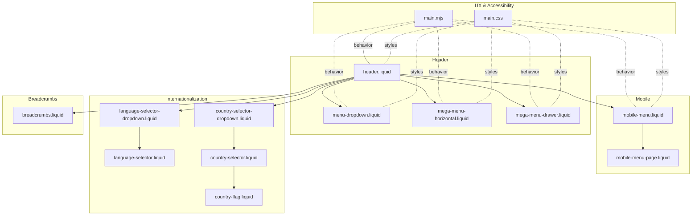
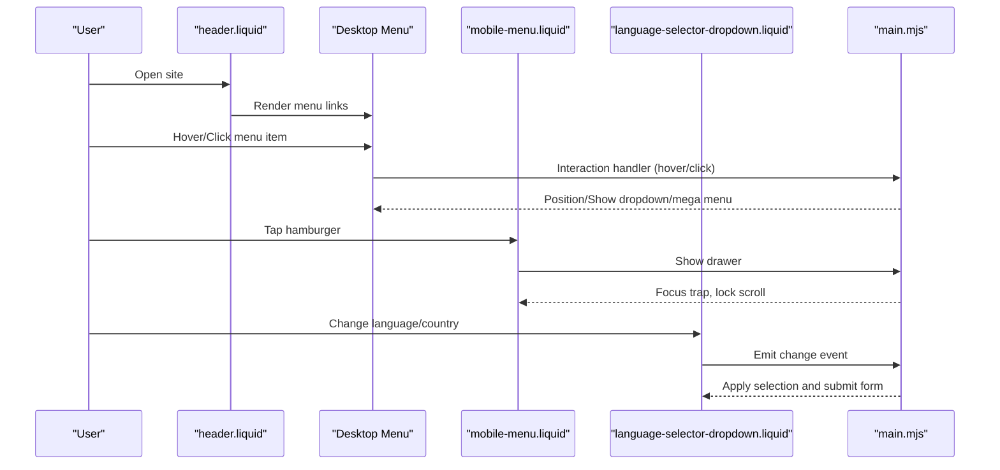
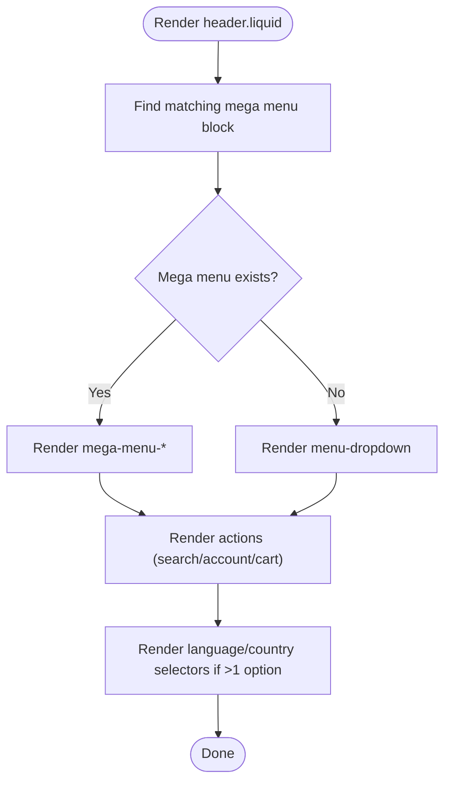
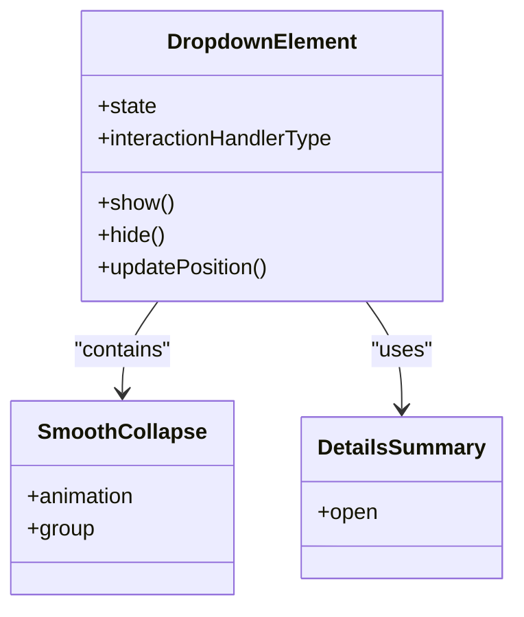
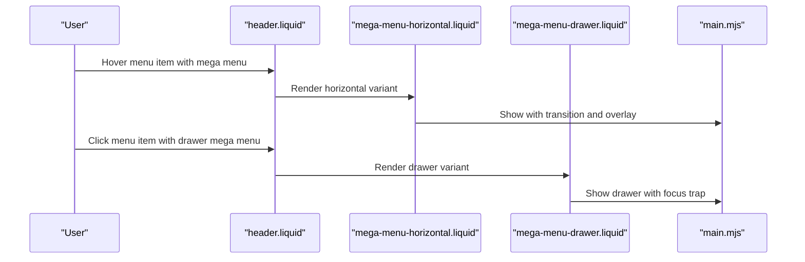
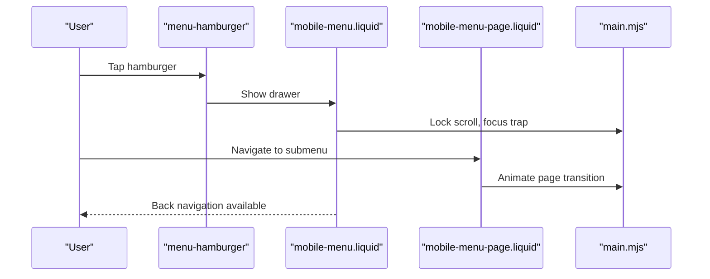
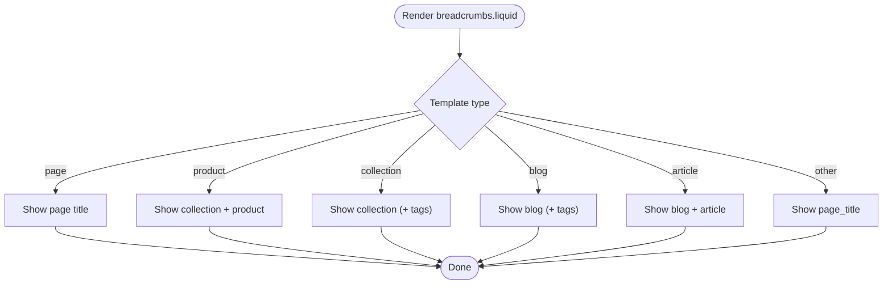
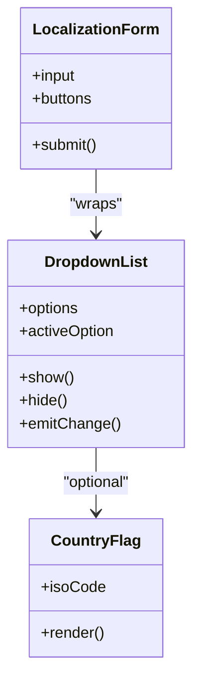
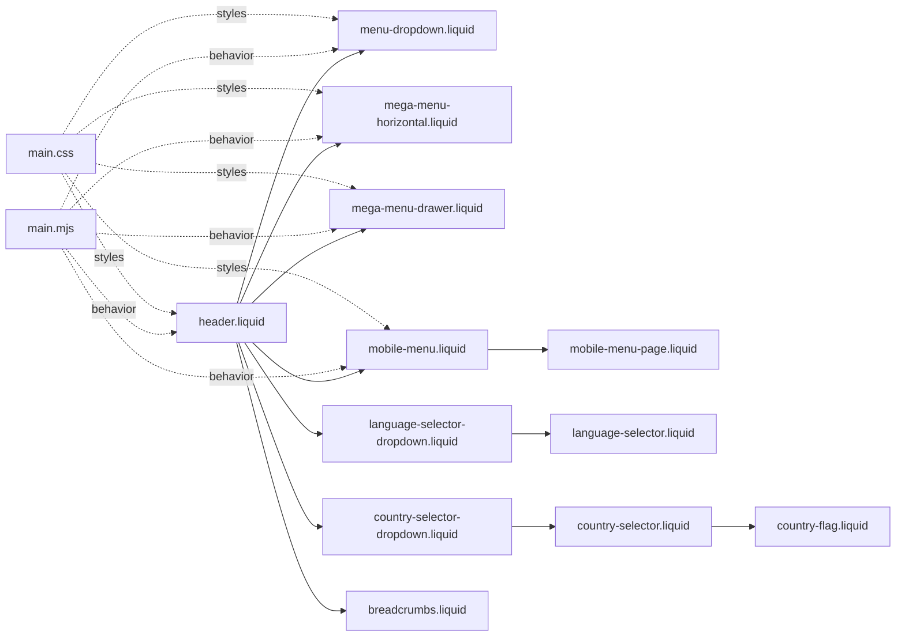

# Navigation System

<cite>
**Referenced Files in This Document**
- [header.liquid](file://sections/header.liquid)
- [breadcrumbs.liquid](file://snippets/breadcrumbs.liquid)
- [mobile-menu.liquid](file://snippets/mobile-menu.liquid)
- [menu-dropdown.liquid](file://snippets/menu-dropdown.liquid)
- [mega-menu-horizontal.liquid](file://snippets/mega-menu-horizontal.liquid)
- [mega-menu-drawer.liquid](file://snippets/mega-menu-drawer.liquid)
- [mobile-menu-page.liquid](file://snippets/mobile-menu-page.liquid)
- [language-selector.liquid](file://snippets/language-selector.liquid)
- [language-selector-dropdown.liquid](file://snippets/language-selector-dropdown.liquid)
- [country-selector.liquid](file://snippets/country-selector.liquid)
- [country-selector-dropdown.liquid](file://snippets/country-selector-dropdown.liquid)
- [country-flag.liquid](file://snippets/country-flag.liquid)
- [main.mjs](file://assets/main.mjs)
- [main.css](file://assets/main.css)
- [en.default.schema.json](file://locales/en.default.schema.json)
</cite>

## Table of Contents
1. [Introduction](#introduction)
2. [Project Structure](#project-structure)
3. [Core Components](#core-components)
4. [Architecture Overview](#architecture-overview)
5. [Detailed Component Analysis](#detailed-component-analysis)
6. [Dependency Analysis](#dependency-analysis)
7. [Performance Considerations](#performance-considerations)
8. [Troubleshooting Guide](#troubleshooting-guide)
9. [Conclusion](#conclusion)

## Introduction
This document explains the navigation system for the storefront, covering header navigation, mobile menu structure, and breadcrumbs. It details responsive navigation patterns, mega menu functionality, dropdown management, mobile-first design, touch-friendly elements, internationalization features (language and country selectors), and accessibility support including keyboard navigation and screen reader compatibility.

## Project Structure
The navigation system spans several Liquid templates and snippets, with shared JavaScript/CSS for behavior and styling:
- Header and desktop navigation: [header.liquid](file://sections/header.liquid)
- Mobile menu: [mobile-menu.liquid](file://snippets/mobile-menu.liquid) and [mobile-menu-page.liquid](file://snippets/mobile-menu-page.liquid)
- Dropdowns and mega menus: [menu-dropdown.liquid](file://snippets/menu-dropdown.liquid), [mega-menu-horizontal.liquid](file://snippets/mega-menu-horizontal.liquid), [mega-menu-drawer.liquid](file://snippets/mega-menu-drawer.liquid)
- Internationalization: [language-selector.liquid](file://snippets/language-selector.liquid), [language-selector-dropdown.liquid](file://snippets/language-selector-dropdown.liquid), [country-selector.liquid](file://snippets/country-selector.liquid), [country-selector-dropdown.liquid](file://snippets/country-selector-dropdown.liquid), [country-flag.liquid](file://snippets/country-flag.liquid)
- Breadcrumbs: [breadcrumbs.liquid](file://snippets/breadcrumbs.liquid)
- Behavior and accessibility: [main.mjs](file://assets/main.mjs)
- Base styles: [main.css](file://assets/main.css)
- Localization schema: [en.default.schema.json](file://locales/en.default.schema.json)

**Diagram sources**
- [header.liquid:113-161](file://sections/header.liquid#L113-L161)
- [menu-dropdown.liquid:1-52](file://snippets/menu-dropdown.liquid#L1-L52)
- [mega-menu-horizontal.liquid:1-69](file://snippets/mega-menu-horizontal.liquid#L1-L69)
- [mega-menu-drawer.liquid:1-78](file://snippets/mega-menu-drawer.liquid#L1-L78)
- [mobile-menu.liquid:14-71](file://snippets/mobile-menu.liquid#L14-L71)
- [mobile-menu-page.liquid:3-86](file://snippets/mobile-menu-page.liquid#L3-L86)
- [language-selector-dropdown.liquid:1-35](file://snippets/language-selector-dropdown.liquid#L1-L35)
- [language-selector.liquid:1-30](file://snippets/language-selector.liquid#L1-L30)
- [country-selector-dropdown.liquid:1-63](file://snippets/country-selector-dropdown.liquid#L1-L63)
- [country-selector.liquid:1-39](file://snippets/country-selector.liquid#L1-L39)
- [country-flag.liquid:1-10](file://snippets/country-flag.liquid#L1-L10)
- [breadcrumbs.liquid:5-75](file://snippets/breadcrumbs.liquid#L5-L75)
- [main.mjs:1-60](file://assets/main.mjs#L1-L60)

**Section sources**
- [header.liquid:1-555](file://sections/header.liquid#L1-L555)
- [mobile-menu.liquid:1-71](file://snippets/mobile-menu.liquid#L1-L71)
- [menu-dropdown.liquid:1-52](file://snippets/menu-dropdown.liquid#L1-L52)
- [mega-menu-horizontal.liquid:1-69](file://snippets/mega-menu-horizontal.liquid#L1-L69)
- [mega-menu-drawer.liquid:1-78](file://snippets/mega-menu-drawer.liquid#L1-L78)
- [mobile-menu-page.liquid:1-86](file://snippets/mobile-menu-page.liquid#L1-L86)
- [language-selector-dropdown.liquid:1-35](file://snippets/language-selector-dropdown.liquid#L1-L35)
- [language-selector.liquid:1-30](file://snippets/language-selector.liquid#L1-L30)
- [country-selector-dropdown.liquid:1-63](file://snippets/country-selector-dropdown.liquid#L1-L63)
- [country-selector.liquid:1-39](file://snippets/country-selector.liquid#L1-L39)
- [country-flag.liquid:1-10](file://snippets/country-flag.liquid#L1-L10)
- [breadcrumbs.liquid:1-75](file://snippets/breadcrumbs.liquid#L1-L75)
- [main.mjs:1-60](file://assets/main.mjs#L1-L60)
- [main.css:1-200](file://assets/main.css#L1-L200)

## Core Components
- Header navigation: renders desktop menu links, optional mega menus, and action icons; integrates internationalization controls.
- Mobile menu: slide-out drawer with nested pages and optional internationalization controls.
- Mega menus: horizontal and drawer variants with optional promotional imagery.
- Dropdowns: nested menu dropdowns with smooth collapsing submenus.
- Breadcrumbs: structured navigation trail for improved orientation and SEO.
- Internationalization: language and country selectors with flags and currency info.
- Accessibility: focus trap, keyboard navigation, ARIA roles, and semantic markup.

**Section sources**
- [header.liquid:113-234](file://sections/header.liquid#L113-L234)
- [mobile-menu.liquid:14-71](file://snippets/mobile-menu.liquid#L14-L71)
- [menu-dropdown.liquid:1-52](file://snippets/menu-dropdown.liquid#L1-L52)
- [mega-menu-horizontal.liquid:1-69](file://snippets/mega-menu-horizontal.liquid#L1-L69)
- [mega-menu-drawer.liquid:1-78](file://snippets/mega-menu-drawer.liquid#L1-L78)
- [mobile-menu-page.liquid:3-86](file://snippets/mobile-menu-page.liquid#L3-L86)
- [language-selector-dropdown.liquid:1-35](file://snippets/language-selector-dropdown.liquid#L1-L35)
- [language-selector.liquid:1-30](file://snippets/language-selector.liquid#L1-L30)
- [country-selector-dropdown.liquid:1-63](file://snippets/country-selector-dropdown.liquid#L1-L63)
- [country-selector.liquid:1-39](file://snippets/country-selector.liquid#L1-L39)
- [breadcrumbs.liquid:5-75](file://snippets/breadcrumbs.liquid#L5-L75)

## Architecture Overview
The navigation system is composed of:
- Template-driven rendering via Liquid (header, mobile menu, dropdowns, mega menus).
- Shared UI components implemented in custom elements (dropdown lists, modals, drawers) in JavaScript.
- Responsive behavior controlled by CSS utilities and component attributes.
- Internationalization handled through localization forms and selector components.

**Diagram sources**
- [header.liquid:113-161](file://sections/header.liquid#L113-L161)
- [mobile-menu.liquid:14-71](file://snippets/mobile-menu.liquid#L14-L71)
- [language-selector-dropdown.liquid:1-35](file://snippets/language-selector-dropdown.liquid#L1-L35)
- [main.mjs:1-60](file://assets/main.mjs#L1-L60)

## Detailed Component Analysis

### Header Navigation and Desktop Menu
- Renders logo, desktop navigation links, and action icons (search, account, cart).
- Determines whether to render a mega menu based on matching block settings to link titles.
- Supports click or hover interaction modes for dropdowns.
- Integrates internationalization controls (language and country selectors) when multiple options are available.

**Diagram sources**
- [header.liquid:120-161](file://sections/header.liquid#L120-L161)
- [header.liquid:163-234](file://sections/header.liquid#L163-L234)

**Section sources**
- [header.liquid:113-234](file://sections/header.liquid#L113-L234)

### Dropdown Management
- Uses a generic dropdown element with configurable interaction handler (click/hover).
- Supports nested submenus with smooth collapse transitions.
- Positions dropdowns dynamically with offsets and placements, adapting to viewport boundaries.

**Diagram sources**
- [menu-dropdown.liquid:1-52](file://snippets/menu-dropdown.liquid#L1-L52)
- [main.mjs:1-60](file://assets/main.mjs#L1-L60)

**Section sources**
- [menu-dropdown.liquid:1-52](file://snippets/menu-dropdown.liquid#L1-L52)
- [main.mjs:1-60](file://assets/main.mjs#L1-L60)

### Mega Menu Functionality
- Horizontal mega menu: expands under the navigation bar with optional promotional imagery.
- Drawer mega menu: slides in from the side with nested child drawers for deeper levels.
- Both variants support responsive behavior and optional promo images.

**Diagram sources**
- [mega-menu-horizontal.liquid:1-69](file://snippets/mega-menu-horizontal.liquid#L1-L69)
- [mega-menu-drawer.liquid:1-78](file://snippets/mega-menu-drawer.liquid#L1-L78)
- [main.mjs:1-60](file://assets/main.mjs#L1-L60)

**Section sources**
- [mega-menu-horizontal.liquid:1-69](file://snippets/mega-menu-horizontal.liquid#L1-L69)
- [mega-menu-drawer.liquid:1-78](file://snippets/mega-menu-drawer.liquid#L1-L78)
- [main.mjs:1-60](file://assets/main.mjs#L1-L60)

### Mobile Menu Structure
- Slide-out drawer accessible via a hamburger button.
- Nested pages with back navigation and optional promo images for mega menu-enabled categories.
- Internationalization controls appear at the bottom when multiple options are available.

**Diagram sources**
- [mobile-menu.liquid:14-71](file://snippets/mobile-menu.liquid#L14-L71)
- [mobile-menu-page.liquid:3-86](file://snippets/mobile-menu-page.liquid#L3-L86)
- [main.mjs:1-60](file://assets/main.mjs#L1-L60)

**Section sources**
- [mobile-menu.liquid:14-71](file://snippets/mobile-menu.liquid#L14-L71)
- [mobile-menu-page.liquid:3-86](file://snippets/mobile-menu-page.liquid#L3-L86)
- [main.mjs:1-60](file://assets/main.mjs#L1-L60)

### Breadcrumb Implementation
- Provides a navigational trail tailored to page templates (product, collection, blog, article).
- Uses separators and semantic navigation roles for accessibility.
- Includes localized labels and links appropriate to the current context.

**Diagram sources**
- [breadcrumbs.liquid:5-75](file://snippets/breadcrumbs.liquid#L5-L75)

**Section sources**
- [breadcrumbs.liquid:5-75](file://snippets/breadcrumbs.liquid#L5-L75)

### Internationalization Navigation Features
- Language selector: displays available languages with active state and ARIA current indicators.
- Country selector: shows country flags, names, and currency codes; supports hidden labels.
- Dropdown list component: handles focus-only behavior on small screens and emits change events.

**Diagram sources**
- [language-selector.liquid:1-30](file://snippets/language-selector.liquid#L1-L30)
- [language-selector-dropdown.liquid:1-35](file://snippets/language-selector-dropdown.liquid#L1-L35)
- [country-selector.liquid:1-39](file://snippets/country-selector.liquid#L1-L39)
- [country-selector-dropdown.liquid:1-63](file://snippets/country-selector-dropdown.liquid#L1-L63)
- [country-flag.liquid:1-10](file://snippets/country-flag.liquid#L1-L10)
- [main.mjs:1-60](file://assets/main.mjs#L1-L60)

**Section sources**
- [language-selector.liquid:1-30](file://snippets/language-selector.liquid#L1-L30)
- [language-selector-dropdown.liquid:1-35](file://snippets/language-selector-dropdown.liquid#L1-L35)
- [country-selector.liquid:1-39](file://snippets/country-selector.liquid#L1-L39)
- [country-selector-dropdown.liquid:1-63](file://snippets/country-selector-dropdown.liquid#L1-L63)
- [country-flag.liquid:1-10](file://snippets/country-flag.liquid#L1-L10)
- [main.mjs:1-60](file://assets/main.mjs#L1-L60)

## Dependency Analysis
- Liquid templates depend on snippets for modular UI parts.
- JavaScript components (dropdown-element, dropdown-list, modal-drawer, mobile-menu) encapsulate behavior and are reused across templates.
- Styles are standardized via Tailwind utilities and theme variables.

**Diagram sources**
- [header.liquid:113-234](file://sections/header.liquid#L113-L234)
- [mobile-menu.liquid:14-71](file://snippets/mobile-menu.liquid#L14-L71)
- [menu-dropdown.liquid:1-52](file://snippets/menu-dropdown.liquid#L1-L52)
- [mega-menu-horizontal.liquid:1-69](file://snippets/mega-menu-horizontal.liquid#L1-L69)
- [mega-menu-drawer.liquid:1-78](file://snippets/mega-menu-drawer.liquid#L1-L78)
- [mobile-menu-page.liquid:3-86](file://snippets/mobile-menu-page.liquid#L3-L86)
- [language-selector-dropdown.liquid:1-35](file://snippets/language-selector-dropdown.liquid#L1-L35)
- [language-selector.liquid:1-30](file://snippets/language-selector.liquid#L1-L30)
- [country-selector-dropdown.liquid:1-63](file://snippets/country-selector-dropdown.liquid#L1-L63)
- [country-selector.liquid:1-39](file://snippets/country-selector.liquid#L1-L39)
- [country-flag.liquid:1-10](file://snippets/country-flag.liquid#L1-L10)
- [breadcrumbs.liquid:5-75](file://snippets/breadcrumbs.liquid#L5-L75)
- [main.mjs:1-60](file://assets/main.mjs#L1-L60)
- [main.css:1-200](file://assets/main.css#L1-L200)

**Section sources**
- [header.liquid:113-234](file://sections/header.liquid#L113-L234)
- [mobile-menu.liquid:14-71](file://snippets/mobile-menu.liquid#L14-L71)
- [menu-dropdown.liquid:1-52](file://snippets/menu-dropdown.liquid#L1-L52)
- [mega-menu-horizontal.liquid:1-69](file://snippets/mega-menu-horizontal.liquid#L1-L69)
- [mega-menu-drawer.liquid:1-78](file://snippets/mega-menu-drawer.liquid#L1-L78)
- [mobile-menu-page.liquid:3-86](file://snippets/mobile-menu-page.liquid#L3-L86)
- [language-selector-dropdown.liquid:1-35](file://snippets/language-selector-dropdown.liquid#L1-L35)
- [language-selector.liquid:1-30](file://snippets/language-selector.liquid#L1-L30)
- [country-selector-dropdown.liquid:1-63](file://snippets/country-selector-dropdown.liquid#L1-L63)
- [country-selector.liquid:1-39](file://snippets/country-selector.liquid#L1-L39)
- [country-flag.liquid:1-10](file://snippets/country-flag.liquid#L1-L10)
- [breadcrumbs.liquid:5-75](file://snippets/breadcrumbs.liquid#L5-L75)
- [main.mjs:1-60](file://assets/main.mjs#L1-L60)
- [main.css:1-200](file://assets/main.css#L1-L200)

## Performance Considerations
- Lazy loading and aspect-ratio preservation for promotional images in mega menus.
- CSS containment and clipping for smooth dropdown and drawer animations.
- Minimal reflow by positioning dropdowns absolutely and constraining max-width/height.
- Adaptive height for media carousels to reduce layout shifts.

[No sources needed since this section provides general guidance]

## Troubleshooting Guide
- Dropdowns not appearing:
  - Verify interaction handler setting and that the component attaches handlers appropriately.
  - Ensure dropdowns are appended to body when configured and positioned correctly.
- Mega menu overlaps content:
  - Confirm overlay and transparent header adjustments are applied during show/hide.
- Mobile drawer does not lock scroll:
  - Check focus trap activation and lock scroll behavior in modal-drawer.
- Internationalization not updating:
  - Confirm localization form submits on option change and hidden inputs reflect current selections.

**Section sources**
- [main.mjs:1-60](file://assets/main.mjs#L1-L60)

## Conclusion
The navigation system combines modular Liquid templates with robust JavaScript components to deliver a responsive, accessible, and internationalized user experience. Desktop navigation leverages dropdowns and mega menus, while the mobile drawer ensures touch-friendly access. Breadcrumbs improve orientation, and internationalization controls enable region-specific experiences. Accessibility is built-in through focus traps, keyboard navigation, and semantic markup.