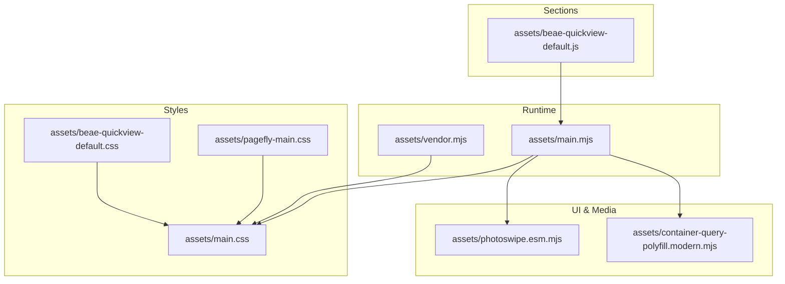
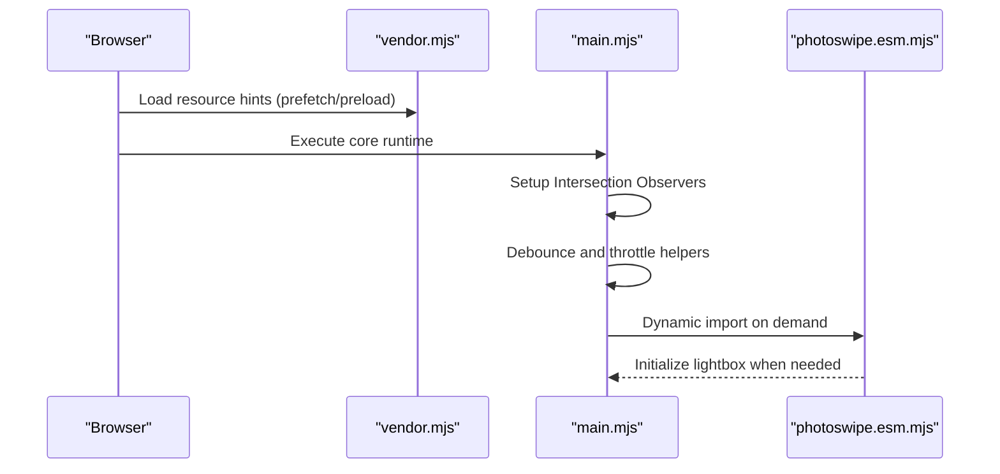
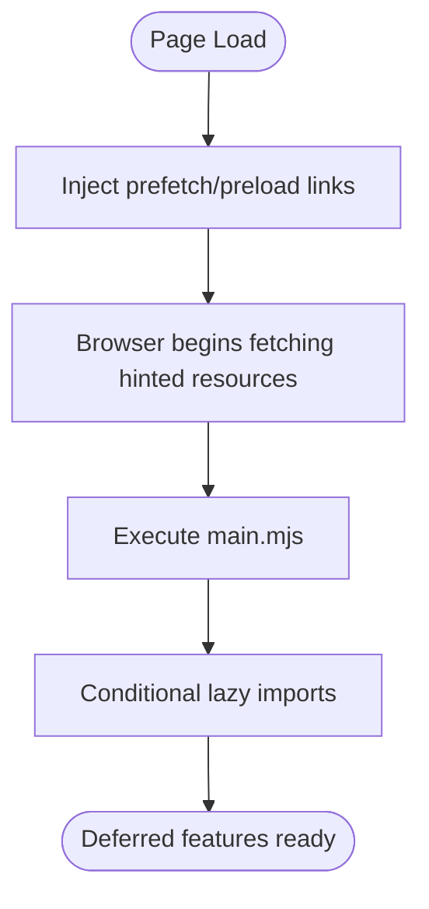
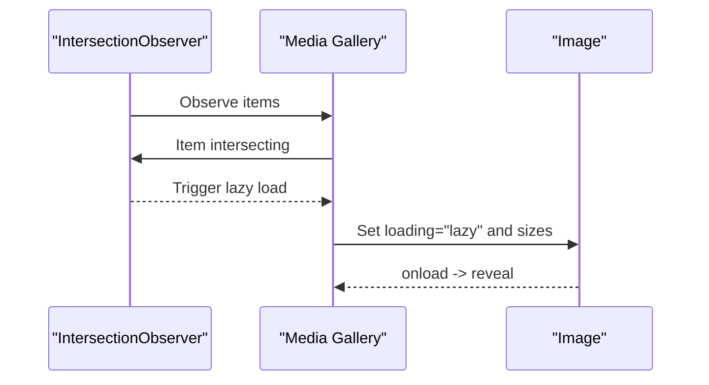
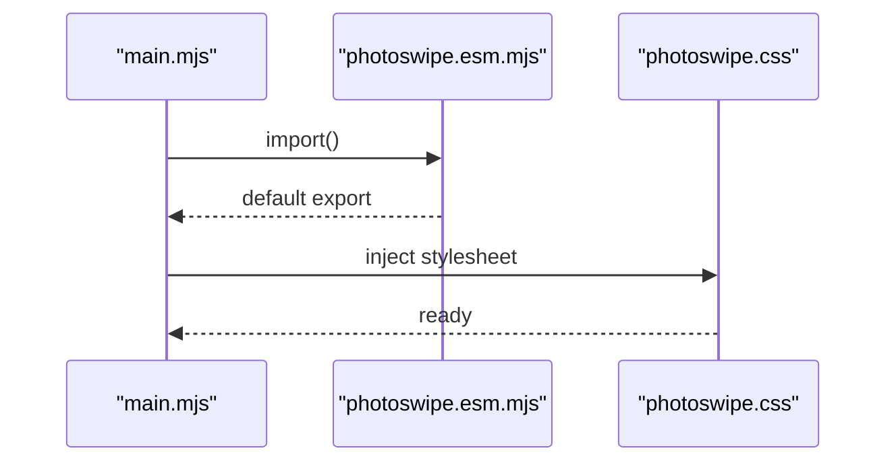
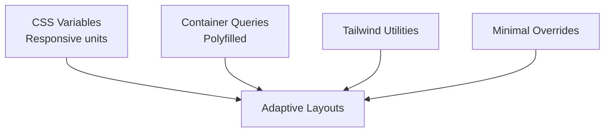
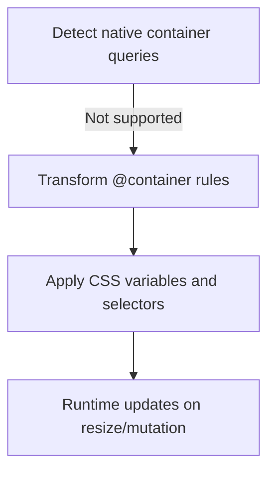
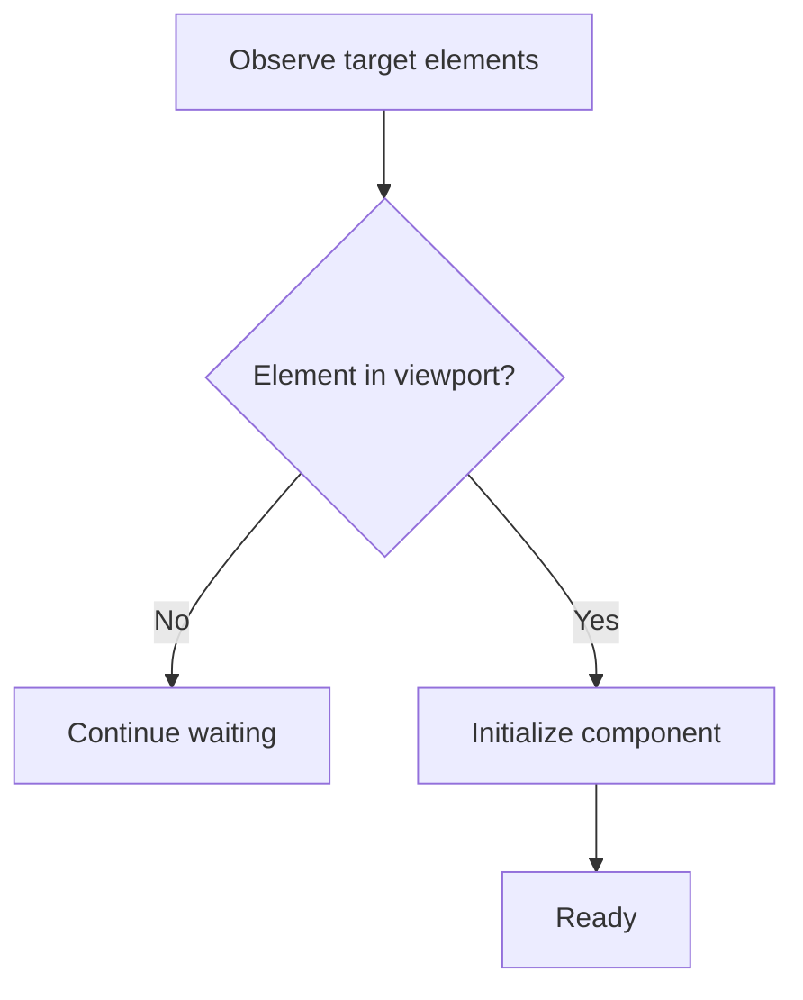
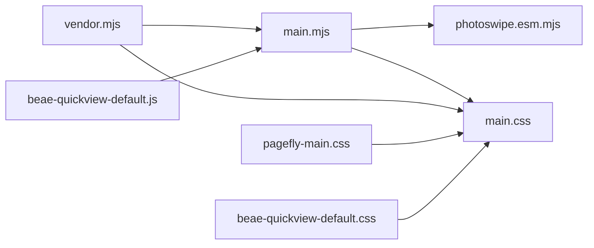

# Performance Optimization

<cite>
**Referenced Files in This Document**
- [main.mjs](file://assets/main.mjs)
- [vendor.mjs](file://assets/vendor.mjs)
- [container-query-polyfill.modern.mjs](file://assets/container-query-polyfill.modern.mjs)
- [photoswipe.esm.mjs](file://assets/photoswipe.esm.mjs)
- [main.css](file://assets/main.css)
- [pagefly-main.css](file://assets/pagefly-main.css)
- [beae-quickview-default.css](file://assets/beae-quickview-default.css)
- [beae-quickview-default.js](file://assets/beae-quickview-default.js)
</cite>

## Table of Contents
1. [Introduction](#introduction)
2. [Project Structure](#project-structure)
3. [Core Components](#core-components)
4. [Architecture Overview](#architecture-overview)
5. [Detailed Component Analysis](#detailed-component-analysis)
6. [Dependency Analysis](#dependency-analysis)
7. [Performance Considerations](#performance-considerations)
8. [Troubleshooting Guide](#troubleshooting-guide)
9. [Conclusion](#conclusion)

## Introduction
This document explains the performance optimization strategies implemented in the Igogomi theme. It focuses on asset optimization, lazy loading, image handling, bundle management, code splitting, conditional JavaScript loading, CSS optimization, critical path rendering, container query polyfills, Intersection Observer usage, resource hints, browser caching, and progressive enhancement for varied devices and connection speeds.

## Project Structure
The theme’s performance-critical assets are organized into modular JavaScript and CSS bundles:
- assets/main.mjs: Core runtime, animations, UI components, Intersection Observer usage, and dynamic imports for media/lightbox features.
- assets/vendor.mjs: Resource hinting via prefetch/preload and lightweight custom element polyfills.
- assets/container-query-polyfill.modern.mjs: Polyfill for container queries with minimal overhead and selective transforms.
- assets/photoswipe.esm.mjs: Lazy-loaded lightbox library with efficient animation and sizing logic.
- assets/main.css: Tailwind-based CSS with responsive breakpoints, CSS custom properties, and container query support.
- assets/pagefly-main.css: Lightweight PageFly-specific CSS for editor overlays and responsive grids.
- assets/beae-quickview-default.css: Product quickview and gallery CSS with lazy loading hooks.
- assets/beae-quickview-default.js: Conditional JS for BEAE sections, lazy loading, and intersection observers.

**Diagram sources**
- [main.mjs](file://assets/main.mjs)
- [vendor.mjs](file://assets/vendor.mjs)
- [container-query-polyfill.modern.mjs](file://assets/container-query-polyfill.modern.mjs)
- [photoswipe.esm.mjs](file://assets/photoswipe.esm.mjs)
- [main.css](file://assets/main.css)
- [pagefly-main.css](file://assets/pagefly-main.css)
- [beae-quickview-default.css](file://assets/beae-quickview-default.css)
- [beae-quickview-default.js](file://assets/beae-quickview-default.js)

**Section sources**
- [main.mjs](file://assets/main.mjs)
- [vendor.mjs](file://assets/vendor.mjs)
- [container-query-polyfill.modern.mjs](file://assets/container-query-polyfill.modern.mjs)
- [photoswipe.esm.mjs](file://assets/photoswipe.esm.mjs)
- [main.css](file://assets/main.css)
- [pagefly-main.css](file://assets/pagefly-main.css)
- [beae-quickview-default.css](file://assets/beae-quickview-default.css)
- [beae-quickview-default.js](file://assets/beae-quickview-default.js)

## Core Components
- Asset optimization and resource hints:
  - Prefetch/preload for critical paths and media galleries.
  - Module preloads for dynamic imports.
- Lazy loading and image handling:
  - Intersection Observer for deferred work and media lazy loading.
  - Loading attributes and decoding strategies for images.
- Bundle management and code splitting:
  - Dynamic imports for media/lightbox to avoid blocking the main thread.
  - Selective polyfills and lightweight custom element support.
- CSS optimization and critical path:
  - CSS custom properties for responsive units and container queries.
  - Tailwind utilities and minimal overrides for performance.
- Container query polyfills:
  - Transformed container queries with minimal runtime cost.
- Progressive enhancement:
  - Feature detection and graceful degradation for older browsers.

**Section sources**
- [main.mjs](file://assets/main.mjs)
- [vendor.mjs](file://assets/vendor.mjs)
- [container-query-polyfill.modern.mjs](file://assets/container-query-polyfill.modern.mjs)
- [main.css](file://assets/main.css)

## Architecture Overview
The runtime orchestrates performance-sensitive features:
- Resource hints and preloading are attached early to improve perceived performance.
- UI components use Intersection Observer to defer expensive work until needed.
- Media galleries and lightboxes are lazily imported to reduce initial payload.
- CSS leverages container queries and CSS variables for adaptive layouts without heavy JS.

**Diagram sources**
- [vendor.mjs](file://assets/vendor.mjs)
- [main.mjs](file://assets/main.mjs)
- [photoswipe.esm.mjs](file://assets/photoswipe.esm.mjs)

## Detailed Component Analysis

### Asset Optimization and Resource Hinting
- Prefetch and preload:
  - Prefetch links are injected for navigation and media galleries to reduce latency.
  - Preload module entries for dynamic imports to avoid render-blocking.
- Lightweight custom element polyfills:
  - Minimal polyfill registration and mutation observer for CE support without heavy frameworks.

**Diagram sources**
- [vendor.mjs](file://assets/vendor.mjs)
- [main.mjs](file://assets/main.mjs)

**Section sources**
- [vendor.mjs](file://assets/vendor.mjs)
- [main.mjs](file://assets/main.mjs)

### Lazy Loading and Image Handling
- Intersection Observer:
  - Used to defer non-critical work and trigger lazy loading when elements enter viewport.
  - Applied to media carousels and product galleries to load images on demand.
- Image decoding and loading:
  - Images use decoding and lazy loading attributes to optimize render performance.
  - Placeholder transitions and loading bars improve perceived performance.

**Diagram sources**
- [main.mjs](file://assets/main.mjs)
- [beae-quickview-default.js](file://assets/beae-quickview-default.js)

**Section sources**
- [main.mjs](file://assets/main.mjs)
- [beae-quickview-default.js](file://assets/beae-quickview-default.js)

### Bundle Management and Code Splitting
- Dynamic imports:
  - Lightbox initialization occurs only when requested, reducing initial bundle size.
  - CSS for lightbox is conditionally loaded and inserted into the head.
- Module preloads:
  - Preload module entries to avoid waterfall delays.

**Diagram sources**
- [main.mjs](file://assets/main.mjs)
- [photoswipe.esm.mjs](file://assets/photoswipe.esm.mjs)

**Section sources**
- [main.mjs](file://assets/main.mjs)
- [photoswipe.esm.mjs](file://assets/photoswipe.esm.mjs)

### CSS Optimization and Critical Path Rendering
- CSS custom properties and container queries:
  - Responsive typography and spacing rely on CSS variables and container queries for adaptive layouts.
- Tailwind utilities:
  - Utility-first CSS reduces duplication and improves maintainability.
- Minimal overrides:
  - Theme-specific overrides keep CSS lean and focused.

**Diagram sources**
- [main.css](file://assets/main.css)
- [container-query-polyfill.modern.mjs](file://assets/container-query-polyfill.modern.mjs)
- [pagefly-main.css](file://assets/pagefly-main.css)

**Section sources**
- [main.css](file://assets/main.css)
- [container-query-polyfill.modern.mjs](file://assets/container-query-polyfill.modern.mjs)
- [pagefly-main.css](file://assets/pagefly-main.css)

### Container Query Polyfills
- Transformation-based polyfill:
  - Converts container queries into CSS variable updates and selector transforms.
  - Applies only when needed, minimizing runtime overhead.

**Diagram sources**
- [container-query-polyfill.modern.mjs](file://assets/container-query-polyfill.modern.mjs)

**Section sources**
- [container-query-polyfill.modern.mjs](file://assets/container-query-polyfill.modern.mjs)

### Intersection Observer Usage
- Deferred initialization:
  - Non-critical UI components initialize only when they become visible.
- Media lazy loading:
  - Carousels and galleries defer loading images until scrolled into view.

**Diagram sources**
- [main.mjs](file://assets/main.mjs)
- [beae-quickview-default.js](file://assets/beae-quickview-default.js)

**Section sources**
- [main.mjs](file://assets/main.mjs)
- [beae-quickview-default.js](file://assets/beae-quickview-default.js)

### Browser Caching and Progressive Enhancement
- Resource hints:
  - Prefetch/preload improve caching and reduce latency for subsequent navigations.
- Progressive enhancement:
  - Features degrade gracefully on older browsers; polyfills and feature detection ensure compatibility without sacrificing performance.

**Section sources**
- [vendor.mjs](file://assets/vendor.mjs)
- [container-query-polyfill.modern.mjs](file://assets/container-query-polyfill.modern.mjs)

## Dependency Analysis
The runtime depends on:
- vendor.mjs for resource hints and lightweight polyfills.
- main.mjs for core UI, animations, and conditional imports.
- photoswipe.esm.mjs for media lightbox, loaded on demand.
- CSS files for base styles, container queries, and section-specific overrides.

**Diagram sources**
- [vendor.mjs](file://assets/vendor.mjs)
- [main.mjs](file://assets/main.mjs)
- [photoswipe.esm.mjs](file://assets/photoswipe.esm.mjs)
- [main.css](file://assets/main.css)
- [pagefly-main.css](file://assets/pagefly-main.css)
- [beae-quickview-default.css](file://assets/beae-quickview-default.css)
- [beae-quickview-default.js](file://assets/beae-quickview-default.js)

**Section sources**
- [vendor.mjs](file://assets/vendor.mjs)
- [main.mjs](file://assets/main.mjs)
- [photoswipe.esm.mjs](file://assets/photoswipe.esm.mjs)
- [main.css](file://assets/main.css)
- [pagefly-main.css](file://assets/pagefly-main.css)
- [beae-quickview-default.css](file://assets/beae-quickview-default.css)
- [beae-quickview-default.js](file://assets/beae-quickview-default.js)

## Performance Considerations
- Keep critical CSS above the fold and defer non-critical CSS.
- Use lazy loading for images and videos; set appropriate sizes and decoding strategies.
- Minimize main-thread work by deferring initialization with Intersection Observer.
- Split bundles and use dynamic imports for features used infrequently.
- Prefer CSS custom properties and container queries for adaptive layouts.
- Inject resource hints early to improve caching and reduce latency.
- Test on low-bandwidth and low-power devices; ensure graceful degradation.

## Troubleshooting Guide
- Lightbox not opening:
  - Verify dynamic import path and stylesheet injection.
  - Confirm Intersection Observer conditions are met for triggering.
- Images not lazy loading:
  - Ensure loading="lazy" and sizes attributes are applied.
  - Check Intersection Observer thresholds and root margins.
- Container queries not working:
  - Confirm polyfill is loaded and container elements are observed.
  - Validate CSS variable updates on resize/mutation.

**Section sources**
- [main.mjs](file://assets/main.mjs)
- [photoswipe.esm.mjs](file://assets/photoswipe.esm.mjs)
- [container-query-polyfill.modern.mjs](file://assets/container-query-polyfill.modern.mjs)

## Conclusion
The Igogomi theme employs a layered performance strategy: resource hints and preloading accelerate asset delivery, lazy loading defers non-critical work, dynamic imports split bundles, and CSS custom properties enable efficient responsive layouts. Container query polyfills extend modern capabilities without heavy runtime costs. Together, these techniques deliver fast, reliable experiences across devices and connection speeds while maintaining progressive enhancement.