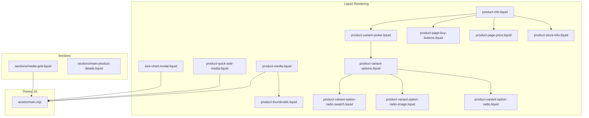
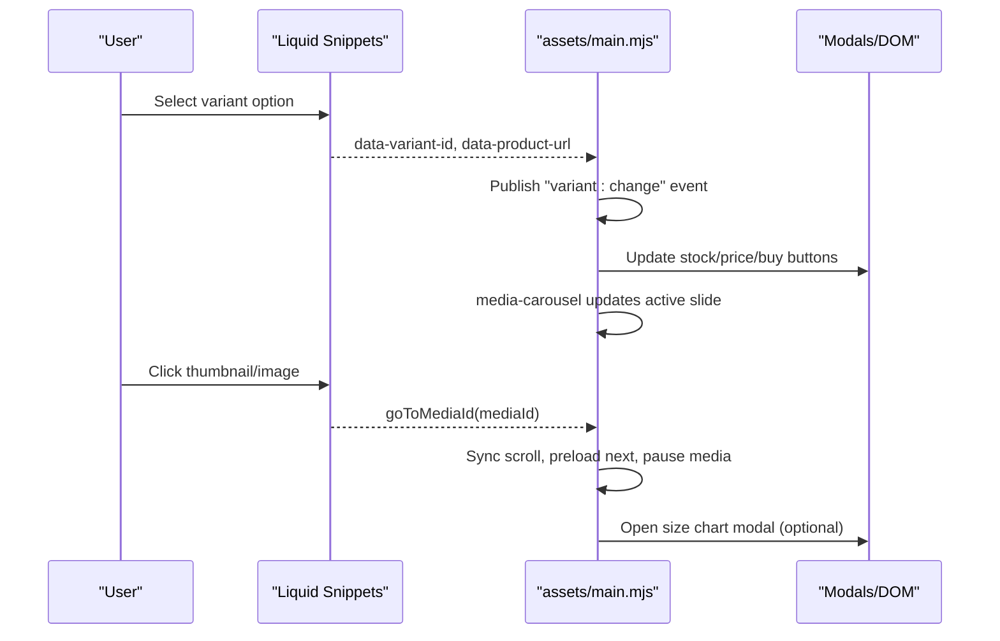
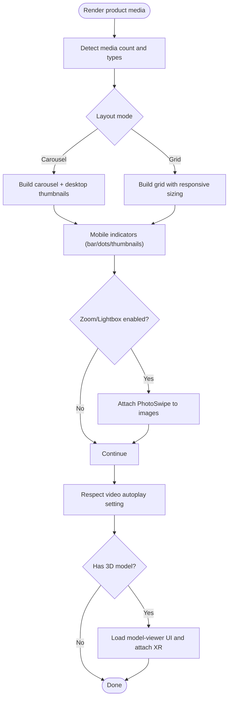
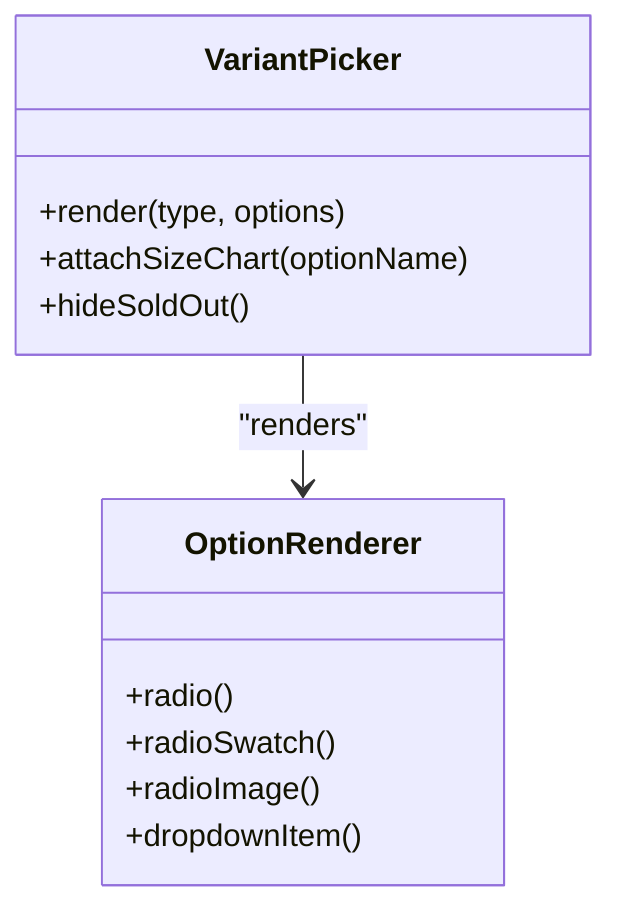
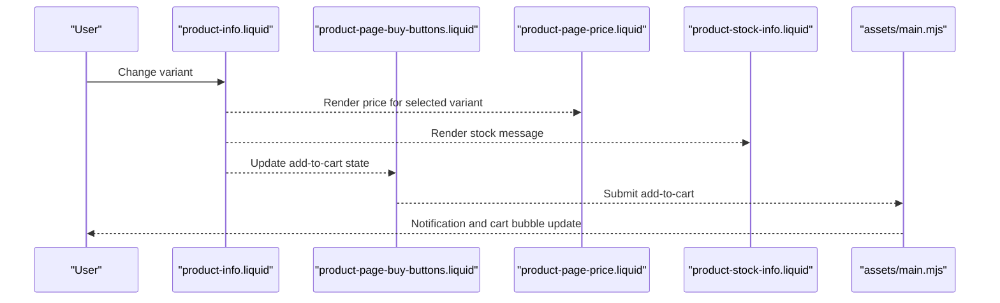
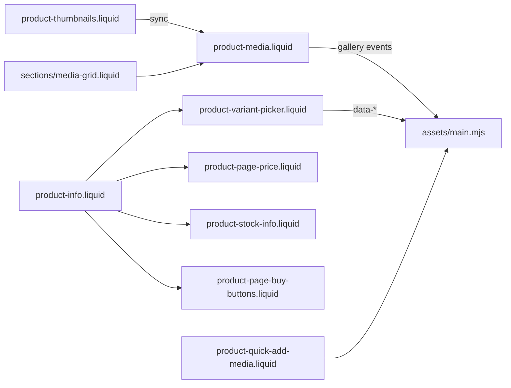

# Product Experience

<cite>
**Referenced Files in This Document**
- [product-media.liquid](file://snippets/product-media.liquid)
- [product-thumbnails.liquid](file://snippets/product-thumbnails.liquid)
- [product-variant-picker.liquid](file://snippets/product-variant-picker.liquid)
- [product-variant-options.liquid](file://snippets/product-variant-options.liquid)
- [product-variant-option-radio.liquid](file://snippets/product-variant-option-radio.liquid)
- [product-variant-option-radio-swatch.liquid](file://snippets/product-variant-option-radio-swatch.liquid)
- [product-variant-option-radio-image.liquid](file://snippets/product-variant-option-radio-image.liquid)
- [size-chart-modal.liquid](file://snippets/size-chart-modal.liquid)
- [product-page-buy-buttons.liquid](file://snippets/product-page-buy-buttons.liquid)
- [product-page-price.liquid](file://snippets/product-page-price.liquid)
- [product-stock-info.liquid](file://snippets/product-stock-info.liquid)
- [product-info.liquid](file://snippets/product-info.liquid)
- [product-quick-add-media.liquid](file://snippets/product-quick-add-media.liquid)
- [main.mjs](file://assets/main.mjs)
- [media-grid.liquid](file://sections/media-grid.liquid)
- [main-product-details.liquid](file://sections/main-product-details.liquid)
</cite>

## Table of Contents
1. [Introduction](#introduction)
2. [Project Structure](#project-structure)
3. [Core Components](#core-components)
4. [Architecture Overview](#architecture-overview)
5. [Detailed Component Analysis](#detailed-component-analysis)
6. [Dependency Analysis](#dependency-analysis)
7. [Performance Considerations](#performance-considerations)
8. [Troubleshooting Guide](#troubleshooting-guide)
9. [Conclusion](#conclusion)

## Introduction
This document explains the product experience features in the Igogomi theme, focusing on the advanced product media gallery, variant picker, product information display, pricing, inventory, and dynamic checkout buttons. It also describes how the theme integrates with Shopify’s product data model and enhances the default experience with modern UI patterns and interactive elements such as zoom, lightbox, carousels, and quick add.

## Project Structure
The product experience spans Liquid snippets for rendering, JavaScript for interactivity, and theme sections for configuration and layout. Key areas:
- Media gallery rendering and interaction: snippets for media, thumbnails, and quick add media
- Variant picker and options: snippets for picker, options, and swatch/image radios
- Pricing, inventory, and buy buttons: snippets for price display, stock info, and add-to-cart/dynamic checkout
- Theme JS: media carousel, lightbox, modals, and cross-component messaging
- Sections: product info container and media grid

**Diagram sources**
- [product-media.liquid:1-286](file://snippets/product-media.liquid#L1-L286)
- [product-thumbnails.liquid:1-21](file://snippets/product-thumbnails.liquid#L1-L21)
- [product-variant-picker.liquid:1-173](file://snippets/product-variant-picker.liquid#L1-L173)
- [product-variant-options.liquid:1-49](file://snippets/product-variant-options.liquid#L1-L49)
- [product-variant-option-radio-swatch.liquid:1-46](file://snippets/product-variant-option-radio-swatch.liquid#L1-L46)
- [product-variant-option-radio-image.liquid:1-42](file://snippets/product-variant-option-radio-image.liquid#L1-L42)
- [product-variant-option-radio.liquid:1-25](file://snippets/product-variant-option-radio.liquid#L1-L25)
- [product-page-buy-buttons.liquid:1-102](file://snippets/product-page-buy-buttons.liquid#L1-L102)
- [product-page-price.liquid:1-20](file://snippets/product-page-price.liquid#L1-L20)
- [product-stock-info.liquid:1-27](file://snippets/product-stock-info.liquid#L1-L27)
- [product-info.liquid:1-208](file://snippets/product-info.liquid#L1-L208)
- [product-quick-add-media.liquid:1-87](file://snippets/product-quick-add-media.liquid#L1-L87)
- [size-chart-modal.liquid:1-35](file://snippets/size-chart-modal.liquid#L1-L35)
- [main.mjs:1-60](file://assets/main.mjs#L1-L60)
- [media-grid.liquid](file://sections/media-grid.liquid)
- [main-product-details.liquid:1-279](file://sections/main-product-details.liquid#L1-L279)

**Section sources**
- [product-media.liquid:1-286](file://snippets/product-media.liquid#L1-L286)
- [product-info.liquid:1-208](file://snippets/product-info.liquid#L1-L208)
- [main.mjs:1-60](file://assets/main.mjs#L1-L60)

## Core Components
- Advanced product media gallery
  - Horizontal/vertical carousel, grid layouts, adaptive height, and thumbnail navigation
  - Zoom/lightbox integration for images; 3D model XR button and viewer
  - Mobile bar/dots/thumbnail indicators; video autoplay toggle
- Variant picker
  - Radio, dropdown, swatch, and image-option styles
  - Size chart modal trigger for configured options
  - Inventory-aware options and “sold out” states
- Pricing and inventory
  - Price rendering with badges and tax notice
  - Stock availability messaging with low stock and backorder support
- Dynamic checkout buttons
  - Add-to-cart primary button and optional Shopify Payments dynamic checkout buttons
  - Gift card recipient form integration
- Quick add and media preview
  - Quick add media carousel template and buttons
  - Featured media synchronization across galleries

**Section sources**
- [product-media.liquid:1-286](file://snippets/product-media.liquid#L1-L286)
- [product-variant-picker.liquid:1-173](file://snippets/product-variant-picker.liquid#L1-L173)
- [product-page-price.liquid:1-20](file://snippets/product-page-price.liquid#L1-L20)
- [product-stock-info.liquid:1-27](file://snippets/product-stock-info.liquid#L1-L27)
- [product-page-buy-buttons.liquid:1-102](file://snippets/product-page-buy-buttons.liquid#L1-L102)
- [product-quick-add-media.liquid:1-87](file://snippets/product-quick-add-media.liquid#L1-L87)

## Architecture Overview
The product experience is a hybrid of server-rendered Liquid and client-side JavaScript. Liquid renders structured markup and embeds JSON for variants and media. JavaScript powers:
- Media carousel navigation, adaptive height, and loading overlays
- Lightbox for images via PhotoSwipe
- Cross-component eventing for gallery indicators and thumbnails
- Modals for size charts and quick add previews
- Variant change propagation to galleries and stock/price displays

**Diagram sources**
- [product-variant-picker.liquid:1-173](file://snippets/product-variant-picker.liquid#L1-L173)
- [product-media.liquid:1-286](file://snippets/product-media.liquid#L1-L286)
- [product-quick-add-media.liquid:1-87](file://snippets/product-quick-add-media.liquid#L1-L87)
- [size-chart-modal.liquid:1-35](file://snippets/size-chart-modal.liquid#L1-L35)
- [main.mjs:1-60](file://assets/main.mjs#L1-L60)

## Detailed Component Analysis

### Advanced Product Media Gallery
- Layout modes
  - Carousel horizontal/vertical with desktop thumbnails and mobile indicators
  - Grid layout with responsive sizing and “main” grid emphasis
- Zoom and lightbox
  - Optional lightbox mode for images; click triggers PhotoSwipe
  - 3D model viewer integration with XR button and model JSON payload
- Adaptive behavior
  - Adaptive height on desktop; mobile bar/dots/thumbnail indicators
  - Video autoplay toggle; loading overlay while switching slides
- Thumbnails and grid
  - Dedicated thumbnail renderer; grid orders featured media first

**Diagram sources**
- [product-media.liquid:1-286](file://snippets/product-media.liquid#L1-L286)
- [product-thumbnails.liquid:1-21](file://snippets/product-thumbnails.liquid#L1-L21)
- [main.mjs:1-60](file://assets/main.mjs#L1-L60)

**Section sources**
- [product-media.liquid:1-286](file://snippets/product-media.liquid#L1-L286)
- [product-thumbnails.liquid:1-21](file://snippets/product-thumbnails.liquid#L1-L21)

### Variant Picker and Options
- Picker supports:
  - Radio, radio-swatch, radio-image, and dropdown styles
  - Swatch color detection and visibility enhancement
  - Size chart modal trigger for configured options
- Options rendering:
  - Radio, swatch, image, and dropdown items
  - Availability and selection state per option value
- Inventory and UX:
  - “Sold out” variants disabled; “hide sold out variants” option
  - Variant JSON embedded for client-side handling

**Diagram sources**
- [product-variant-picker.liquid:1-173](file://snippets/product-variant-picker.liquid#L1-L173)
- [product-variant-options.liquid:1-49](file://snippets/product-variant-options.liquid#L1-L49)
- [product-variant-option-radio-swatch.liquid:1-46](file://snippets/product-variant-option-radio-swatch.liquid#L1-L46)
- [product-variant-option-radio-image.liquid:1-42](file://snippets/product-variant-option-radio-image.liquid#L1-L42)
- [product-variant-option-radio.liquid:1-25](file://snippets/product-variant-option-radio.liquid#L1-L25)

**Section sources**
- [product-variant-picker.liquid:1-173](file://snippets/product-variant-picker.liquid#L1-L173)
- [product-variant-options.liquid:1-49](file://snippets/product-variant-options.liquid#L1-L49)
- [product-variant-option-radio-swatch.liquid:1-46](file://snippets/product-variant-option-radio-swatch.liquid#L1-L46)
- [product-variant-option-radio-image.liquid:1-42](file://snippets/product-variant-option-radio-image.liquid#L1-L42)
- [product-variant-option-radio.liquid:1-25](file://snippets/product-variant-option-radio.liquid#L1-L25)

### Pricing, Inventory, and Buy Buttons
- Pricing
  - Renders current variant price with badges and optional tax notice
- Inventory
  - In stock, low stock threshold message, and backorder messaging
- Buy buttons
  - Add-to-cart button with disabled states when unavailable
  - Optional dynamic checkout buttons; gift card recipient form when applicable

**Diagram sources**
- [product-info.liquid:1-208](file://snippets/product-info.liquid#L1-L208)
- [product-page-buy-buttons.liquid:1-102](file://snippets/product-page-buy-buttons.liquid#L1-L102)
- [product-page-price.liquid:1-20](file://snippets/product-page-price.liquid#L1-L20)
- [product-stock-info.liquid:1-27](file://snippets/product-stock-info.liquid#L1-L27)
- [main.mjs:1-60](file://assets/main.mjs#L1-L60)

**Section sources**
- [product-page-price.liquid:1-20](file://snippets/product-page-price.liquid#L1-L20)
- [product-stock-info.liquid:1-27](file://snippets/product-stock-info.liquid#L1-L27)
- [product-page-buy-buttons.liquid:1-102](file://snippets/product-page-buy-buttons.liquid#L1-L102)
- [product-info.liquid:1-208](file://snippets/product-info.liquid#L1-L208)

### Quick Add and Media Preview
- Quick add media template
  - Builds a compact media carousel for quick add modal
  - Includes carousel buttons and adaptive height
- Integration
  - Used alongside product info to provide a streamlined media preview

**Section sources**
- [product-quick-add-media.liquid:1-87](file://snippets/product-quick-add-media.liquid#L1-L87)
- [product-info.liquid:198-207](file://snippets/product-info.liquid#L198-L207)

### Size Chart Integration
- Modal trigger
  - Adds a link to open a size chart page in a modal drawer
- Modal drawer
  - Right-positioned drawer with header and scrollable body

**Section sources**
- [size-chart-modal.liquid:1-35](file://snippets/size-chart-modal.liquid#L1-L35)
- [product-variant-picker.liquid:37-43](file://snippets/product-variant-picker.liquid#L37-L43)

## Dependency Analysis
- Liquid-to-JavaScript communication
  - Data attributes on inputs carry variant IDs and URLs
  - Events published/observed for gallery and modal interactions
- Media carousel dependencies
  - Thumbnail clicks and indicator dots publish carousel index changes
  - Featured media synchronization across galleries
- Sections and snippets
  - Product info section orchestrates blocks: variant picker, price, stock, buy buttons
  - Media grid section complements carousel with a responsive grid layout

**Diagram sources**
- [product-variant-picker.liquid:1-173](file://snippets/product-variant-picker.liquid#L1-L173)
- [product-media.liquid:1-286](file://snippets/product-media.liquid#L1-L286)
- [product-thumbnails.liquid:1-21](file://snippets/product-thumbnails.liquid#L1-L21)
- [product-info.liquid:1-208](file://snippets/product-info.liquid#L1-L208)
- [product-page-price.liquid:1-20](file://snippets/product-page-price.liquid#L1-L20)
- [product-stock-info.liquid:1-27](file://snippets/product-stock-info.liquid#L1-L27)
- [product-page-buy-buttons.liquid:1-102](file://snippets/product-page-buy-buttons.liquid#L1-L102)
- [product-quick-add-media.liquid:1-87](file://snippets/product-quick-add-media.liquid#L1-L87)
- [media-grid.liquid](file://sections/media-grid.liquid)
- [main.mjs:1-60](file://assets/main.mjs#L1-L60)

**Section sources**
- [product-info.liquid:1-208](file://snippets/product-info.liquid#L1-L208)
- [product-media.liquid:1-286](file://snippets/product-media.liquid#L1-L286)
- [media-grid.liquid](file://sections/media-grid.liquid)

## Performance Considerations
- Lazy loading and preloading
  - Images are lazy-loaded except for the active slide; next slide is eagerly loaded on scroll end
- Adaptive height
  - Desktop adaptive height avoids layout shifts; mobile carousel uses fixed height
- Intersection and resize observers
  - Efficiently compute active slide and update shadows without heavy polling
- Event throttling/debouncing
  - Debounced scroll and resize handlers reduce reflow work
- Minimal repaints
  - CSS transforms and opacity animations used for carousel transitions

[No sources needed since this section provides general guidance]

## Troubleshooting Guide
- Variant picker shows “sold out”
  - Ensure inventory policy and availability are set; picker hides sold out variants when configured
- Add-to-cart disabled
  - Button is disabled when no variant is selected or when selected variant is unavailable
- Lightbox not opening
  - Verify lightbox is enabled in media settings and that images are rendered with correct data attributes
- 3D model not visible
  - Confirm a 3D model exists on the product and that the model viewer UI is loaded
- Size chart modal not appearing
  - Ensure a size chart page is configured and linked in the variant picker block settings

**Section sources**
- [product-variant-picker.liquid:1-173](file://snippets/product-variant-picker.liquid#L1-L173)
- [product-page-buy-buttons.liquid:1-102](file://snippets/product-page-buy-buttons.liquid#L1-L102)
- [product-media.liquid:1-286](file://snippets/product-media.liquid#L1-L286)
- [size-chart-modal.liquid:1-35](file://snippets/size-chart-modal.liquid#L1-L35)

## Conclusion
The Igogomi theme elevates the default product experience by combining flexible media layouts, robust variant selection with swatches and size charts, and modern interactive elements powered by JavaScript. The architecture cleanly separates server-rendered content from client-side behavior, enabling smooth transitions, accessibility, and performance.