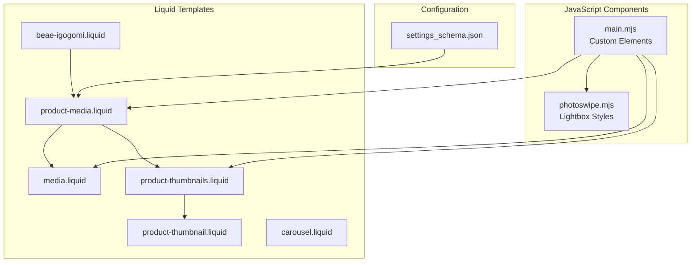
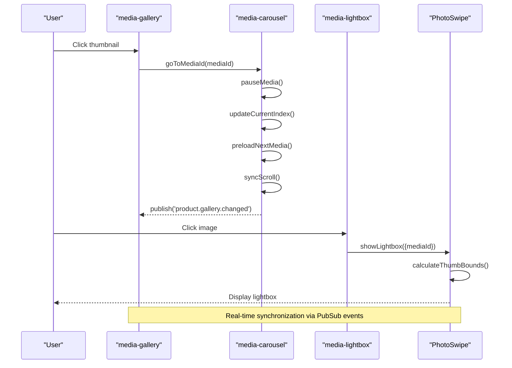
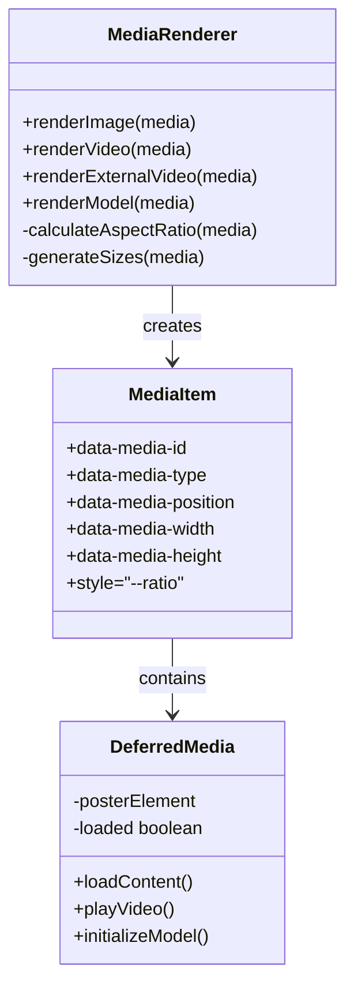
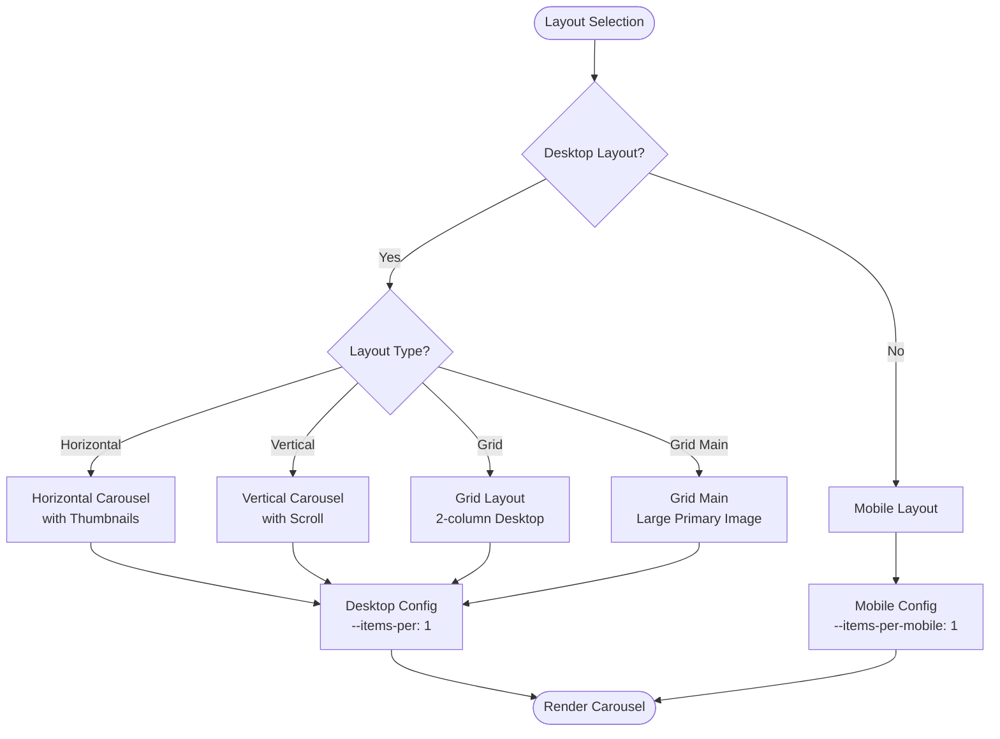
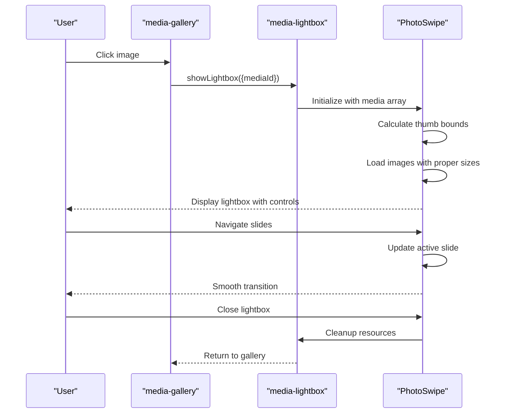
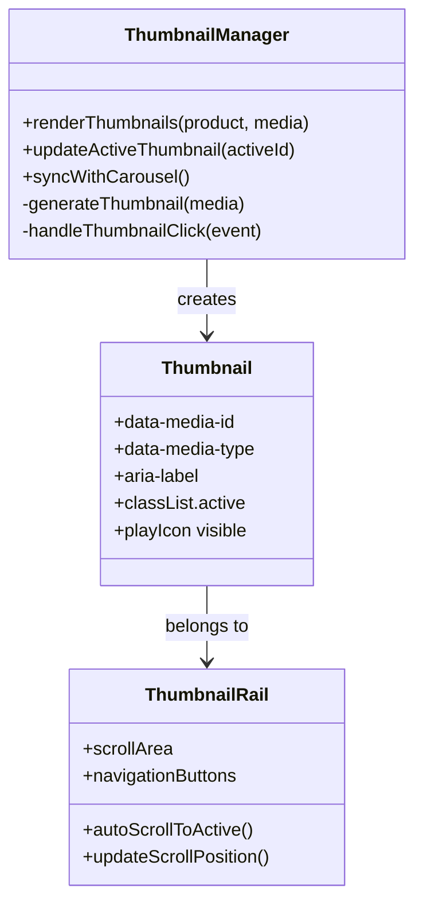
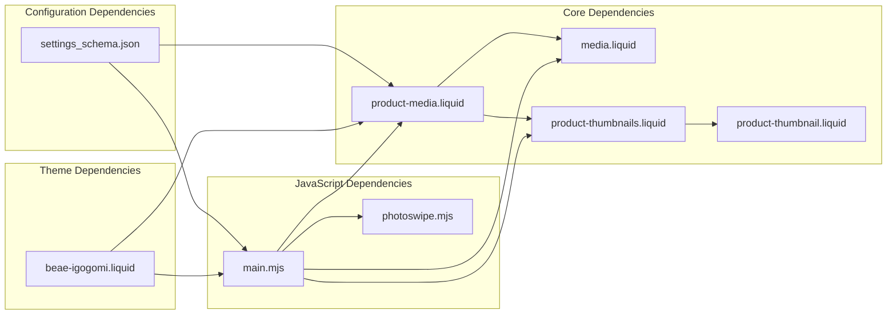

# Product Media Gallery

<cite>
**Referenced Files in This Document**
- [product-media.liquid](file://snippets/product-media.liquid)
- [media.liquid](file://snippets/media.liquid)
- [product-thumbnails.liquid](file://snippets/product-thumbnails.liquid)
- [product-thumbnail.liquid](file://snippets/product-thumbnail.liquid)
- [carousel.liquid](file://snippets/carousel.liquid)
- [main.mjs](file://assets/main.mjs)
- [photoswipe.mjs](file://assets/photoswipe.mjs)
- [beae-igogomi.liquid](file://sections/beae-igogomi.liquid)
- [settings_schema.json](file://config/settings_schema.json)
</cite>

## Table of Contents
1. [Introduction](#introduction)
2. [Project Structure](#project-structure)
3. [Core Components](#core-components)
4. [Architecture Overview](#architecture-overview)
5. [Detailed Component Analysis](#detailed-component-analysis)
6. [Dependency Analysis](#dependency-analysis)
7. [Performance Considerations](#performance-considerations)
8. [Troubleshooting Guide](#troubleshooting-guide)
9. [Conclusion](#conclusion)

## Introduction
This document provides comprehensive documentation for the product media gallery system in the Igogomi theme. It covers multi-format media support (images, videos, external videos, and 3D models), carousel layout options (horizontal, vertical, grid, grid_main), zoom functionality with lightbox integration, thumbnail management, indicator styles (bar, dots, thumbnails), mobile behavior, configuration options, media sizing calculations, lazy loading implementation, and performance optimizations for large media collections.

## Project Structure
The media gallery system is implemented through a combination of Liquid snippets, custom HTML elements, and JavaScript components:
- Liquid snippets handle rendering of media items, thumbnails, and carousel layouts
- Custom HTML elements provide interactive behaviors for media galleries
- JavaScript manages carousel navigation, lightbox integration, and adaptive height features
- Theme settings define configuration options for gallery behavior

**Diagram sources**
- [product-media.liquid](file://snippets/product-media.liquid)
- [media.liquid](file://snippets/media.liquid)
- [product-thumbnails.liquid](file://snippets/product-thumbnails.liquid)
- [product-thumbnail.liquid](file://snippets/product-thumbnail.liquid)
- [carousel.liquid](file://snippets/carousel.liquid)
- [main.mjs](file://assets/main.mjs)
- [photoswipe.mjs](file://assets/photoswipe.mjs)
- [beae-igogomi.liquid](file://sections/beae-igogomi.liquid)
- [settings_schema.json](file://config/settings_schema.json)

**Section sources**
- [product-media.liquid](file://snippets/product-media.liquid)
- [media.liquid](file://snippets/media.liquid)
- [product-thumbnails.liquid](file://snippets/product-thumbnails.liquid)
- [product-thumbnail.liquid](file://snippets/product-thumbnail.liquid)
- [carousel.liquid](file://snippets/carousel.liquid)
- [main.mjs](file://assets/main.mjs)
- [photoswipe.mjs](file://assets/photoswipe.mjs)
- [beae-igogomi.liquid](file://sections/beae-igogomi.liquid)
- [settings_schema.json](file://config/settings_schema.json)

## Core Components
The media gallery system consists of several interconnected components:

### Media Rendering Engine
The system supports four primary media types with specialized rendering:
- **Images**: Standard image rendering with aspect ratio preservation
- **Videos**: HTML5 video players with poster images
- **External Videos**: Embedded video players (YouTube, Vimeo, etc.)
- **3D Models**: Interactive 3D model viewers with Shopify XR integration

### Carousel Management
The carousel system provides flexible layout options with responsive behavior:
- Horizontal scrolling carousels with thumbnail navigation
- Vertical scrolling carousels for compact layouts
- Grid layouts optimized for desktop viewing
- Adaptive height calculation for smooth transitions

### Lightbox Integration
Built-in lightbox functionality powered by PhotoSwipe with:
- Touch-friendly navigation controls
- Zoom capabilities for high-resolution images
- Thumbnail synchronization
- Performance-optimized image loading

**Section sources**
- [product-media.liquid](file://snippets/product-media.liquid)
- [media.liquid](file://snippets/media.liquid)
- [main.mjs](file://assets/main.mjs)

## Architecture Overview
The media gallery system follows a modular architecture with clear separation of concerns:

**Diagram sources**
- [main.mjs](file://assets/main.mjs)

The architecture implements a publish-subscribe pattern for real-time gallery updates and maintains consistent state across all gallery instances.

**Section sources**
- [main.mjs](file://assets/main.mjs)

## Detailed Component Analysis

### Media Type Support
The system provides comprehensive support for different media formats through specialized rendering logic:

#### Image Rendering
Images are rendered with automatic aspect ratio detection and responsive sizing:
- Automatic portrait/landscape detection
- Multiple width variants for different screen densities
- Lazy loading implementation for performance
- Aspect ratio preservation through CSS custom properties

#### Video Integration
Video support includes both hosted and external video sources:
- HTML5 video players with poster fallback
- External video embedding with host-specific handling
- Deferred loading until user interaction
- Looping and autoplay configuration options

#### 3D Model Support
Interactive 3D model viewing with Shopify XR integration:
- Model Viewer UI for immersive 3D experiences
- Mobile-optimized XR button for AR viewing
- Placeholder image loading with deferred initialization
- Automatic model switching on variant changes

**Diagram sources**
- [media.liquid](file://snippets/media.liquid)

**Section sources**
- [media.liquid](file://snippets/media.liquid)
- [product-media.liquid](file://snippets/product-media.liquid)

### Carousel Layout System
The carousel system provides multiple layout configurations optimized for different use cases:

#### Layout Types
- **Horizontal Carousel**: Best for desktop with thumbnail navigation
- **Vertical Carousel**: Compact layout for mobile or space-constrained designs
- **Grid Layout**: Desktop-optimized grid with main image prominence
- **Grid Main**: Specialized two-column layout with larger primary image

#### Responsive Behavior
The carousel adapts seamlessly across device sizes:
- Desktop: Full-width carousel with thumbnail rail
- Tablet: Optimized spacing and touch targets
- Mobile: Simplified interface with indicator controls

**Diagram sources**
- [product-media.liquid](file://snippets/product-media.liquid)

**Section sources**
- [product-media.liquid](file://snippets/product-media.liquid)

### Zoom and Lightbox Functionality
The zoom system provides multiple interaction modes:

#### Lightbox Integration
PhotoSwipe-powered lightbox with:
- Touch gestures for navigation
- Zoom functionality for detailed viewing
- Thumbnail synchronization
- Performance-optimized image loading

#### Adaptive Height Features
Dynamic height adjustment based on media content:
- Automatic height calculation for images
- Aspect ratio preservation
- Smooth transitions between different media types
- Mobile-optimized height handling

**Diagram sources**
- [main.mjs](file://assets/main.mjs)
- [photoswipe.mjs](file://assets/photoswipe.mjs)

**Section sources**
- [main.mjs](file://assets/main.mjs)
- [photoswipe.mjs](file://assets/photoswipe.mjs)

### Thumbnail Management System
The thumbnail system provides efficient navigation and visual cues:

#### Thumbnail Generation
- Automatic thumbnail creation for all media types
- Consistent sizing and aspect ratios
- Play icons for video and 3D model thumbnails
- Active state indication for current media

#### Navigation Integration
- Click-to-navigate functionality
- Keyboard accessibility support
- Touch-friendly target areas
- Scroll synchronization with main gallery

**Diagram sources**
- [product-thumbnails.liquid](file://snippets/product-thumbnails.liquid)
- [product-thumbnail.liquid](file://snippets/product-thumbnail.liquid)

**Section sources**
- [product-thumbnails.liquid](file://snippets/product-thumbnails.liquid)
- [product-thumbnail.liquid](file://snippets/product-thumbnail.liquid)

### Indicator Styles and Mobile Behavior
The system provides multiple indicator styles for different contexts:

#### Desktop Indicators
- **Bar Indicator**: Progress bar showing current position
- **Dot Indicators**: Circular dots for each media item
- **Thumbnail Indicators**: Full thumbnails as navigation aids

#### Mobile Optimization
- Simplified indicator controls
- Touch-friendly navigation
- Adaptive positioning based on screen size
- Reduced visual clutter on small screens

**Section sources**
- [product-media.liquid](file://snippets/product-media.liquid)

## Dependency Analysis
The media gallery system has well-defined dependencies and minimal coupling:

**Diagram sources**
- [product-media.liquid](file://snippets/product-media.liquid)
- [media.liquid](file://snippets/media.liquid)
- [product-thumbnails.liquid](file://snippets/product-thumbnails.liquid)
- [product-thumbnail.liquid](file://snippets/product-thumbnail.liquid)
- [main.mjs](file://assets/main.mjs)
- [photoswipe.mjs](file://assets/photoswipe.mjs)
- [beae-igogomi.liquid](file://sections/beae-igogomi.liquid)
- [settings_schema.json](file://config/settings_schema.json)

The system maintains loose coupling between components, allowing for easy maintenance and extension while ensuring consistent behavior across different gallery implementations.

**Section sources**
- [product-media.liquid](file://snippets/product-media.liquid)
- [main.mjs](file://assets/main.mjs)
- [settings_schema.json](file://config/settings_schema.json)

## Performance Considerations
The media gallery system implements several performance optimizations:

### Lazy Loading Implementation
- Images use `loading="lazy"` for automatic lazy loading
- Preloading of next media during transitions
- Deferred initialization of video and 3D content
- Resource cleanup on carousel navigation

### Media Sizing Calculations
- Dynamic width calculation based on page width and desktop media width settings
- Responsive image sizing with multiple width variants
- Aspect ratio preservation through CSS custom properties
- Optimized image loading with appropriate resolutions

### Memory Management
- Automatic cleanup of video players and model viewers
- Resource pooling for frequently accessed media
- Efficient DOM manipulation during navigation
- Debounced resize handlers for optimal performance

**Section sources**
- [product-media.liquid](file://snippets/product-media.liquid)
- [media.liquid](file://snippets/media.liquid)
- [main.mjs](file://assets/main.mjs)

## Troubleshooting Guide
Common issues and their solutions:

### Media Loading Issues
- **Problem**: Images not loading properly
- **Solution**: Verify image URLs and check for network connectivity issues
- **Debug**: Inspect browser console for 404 errors or CORS issues

### Carousel Navigation Problems
- **Problem**: Carousel not responding to clicks or swipes
- **Solution**: Ensure proper event listeners are attached and check for JavaScript errors
- **Debug**: Verify that media IDs match between thumbnails and carousel items

### Lightbox Not Working
- **Problem**: Lightbox fails to open or displays incorrectly
- **Solution**: Check PhotoSwipe initialization and ensure proper CSS loading
- **Debug**: Verify media array construction and thumbnail bounds calculation

### Performance Issues
- **Problem**: Slow loading or janky transitions
- **Solution**: Implement lazy loading and optimize image sizes
- **Debug**: Monitor network requests and check for memory leaks

**Section sources**
- [main.mjs](file://assets/main.mjs)
- [product-media.liquid](file://snippets/product-media.liquid)

## Conclusion
The Igogomi theme's product media gallery system provides a comprehensive, performant solution for displaying various media types with flexible layout options and advanced interaction features. The modular architecture ensures maintainability while the extensive configuration options allow for customization to meet diverse design requirements. The system's focus on performance through lazy loading, adaptive sizing, and efficient resource management makes it suitable for products with large media collections.