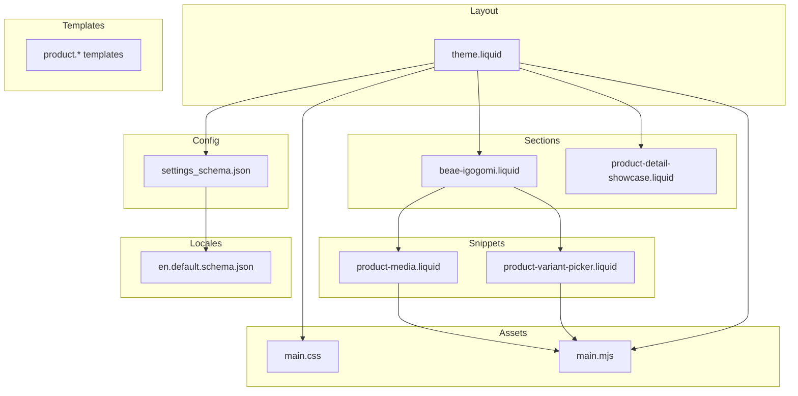
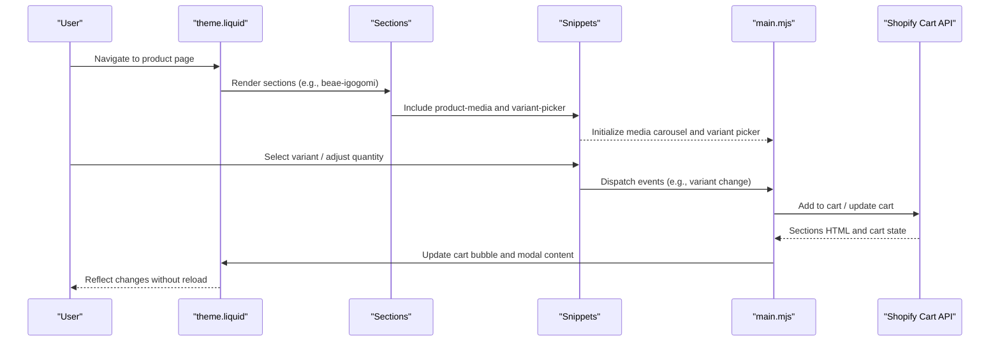
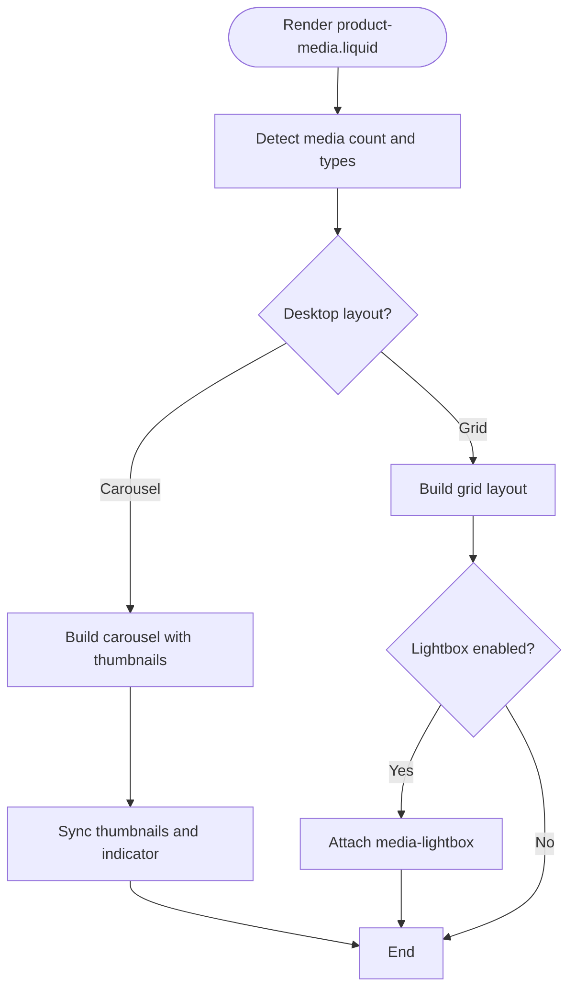
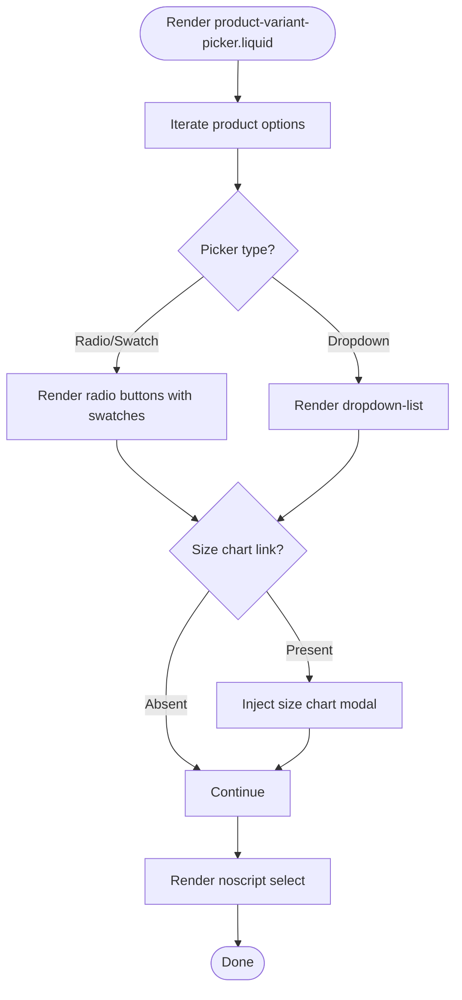
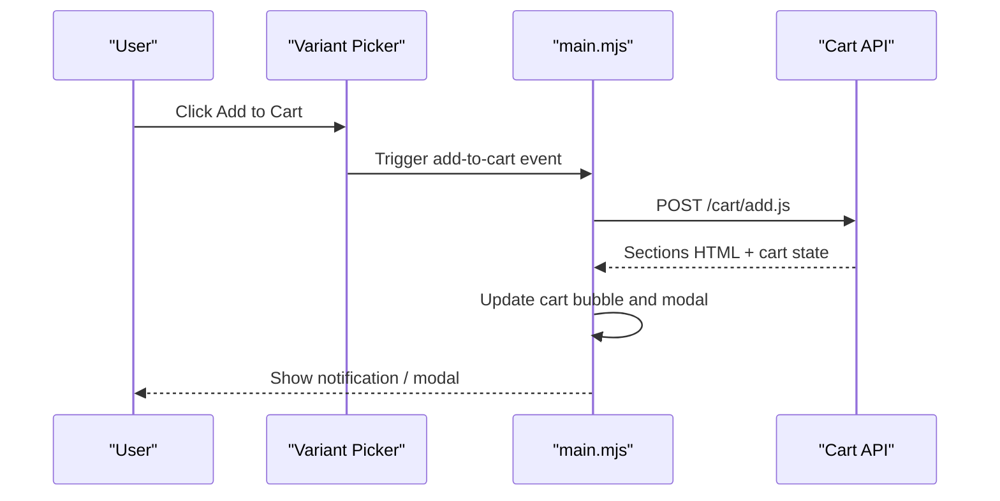
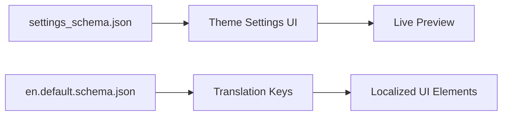
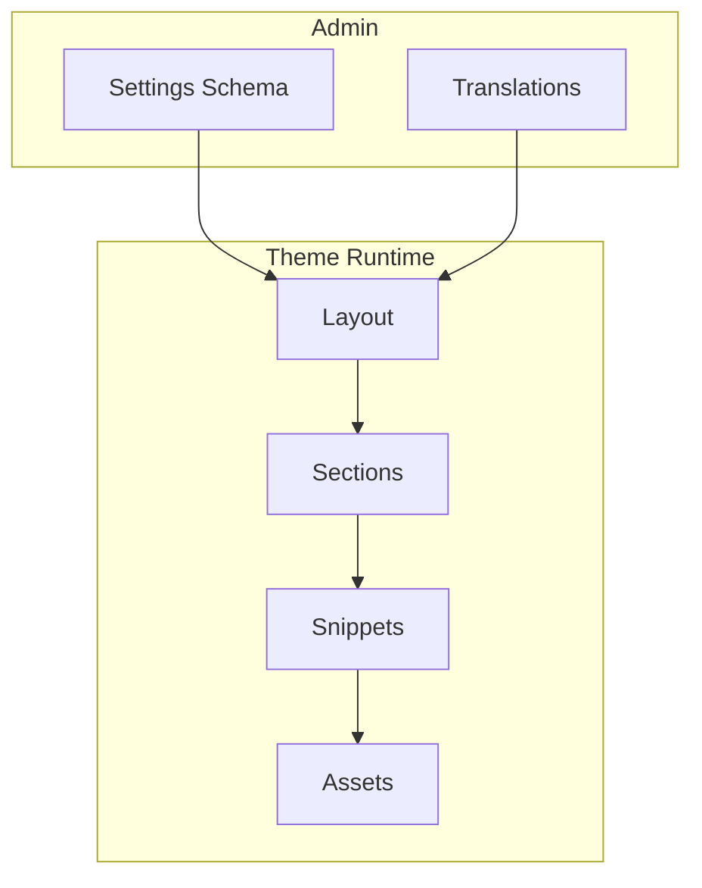
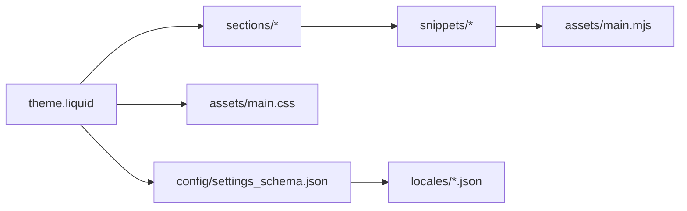

# Project Overview

<cite>
**Referenced Files in This Document**
- [settings_schema.json](file://config/settings_schema.json)
- [theme.liquid](file://layout/theme.liquid)
- [beae-igogomi.liquid](file://sections/beae-igogomi.liquid)
- [main.css](file://assets/main.css)
- [main.mjs](file://assets/main.mjs)
- [product-media.liquid](file://snippets/product-media.liquid)
- [product-variant-picker.liquid](file://snippets/product-variant-picker.liquid)
- [en.default.schema.json](file://locales/en.default.schema.json)
</cite>

## Table of Contents
1. [Introduction](#introduction)
2. [Project Structure](#project-structure)
3. [Core Components](#core-components)
4. [Architecture Overview](#architecture-overview)
5. [Detailed Component Analysis](#detailed-component-analysis)
6. [Dependency Analysis](#dependency-analysis)
7. [Performance Considerations](#performance-considerations)
8. [Troubleshooting Guide](#troubleshooting-guide)
9. [Conclusion](#conclusion)

## Introduction
Igogomi is a modern Shopify theme designed to deliver an immersive e-commerce experience. It emphasizes advanced product presentation, responsive design, and enhanced user interaction. Built with Shopify’s Liquid templating system, the theme leverages a component-based architecture to modularize UI elements across sections, snippets, and templates. Key strengths include robust multi-format media support, an intuitive variant picker, seamless shopping cart integration, and comprehensive internationalization capabilities.

## Project Structure
The theme follows a structured, modular organization aligned with Shopify conventions:
- Layout: Centralized HTML shell and head/body rendering via theme.liquid
- Sections: Reusable UI blocks rendered within page layouts
- Snippets: Shared partials for components like product media and variant selection
- Templates: Page-specific templates for products, collections, and CMS pages
- Assets: Stylesheets and JavaScript modules for styling and interactivity
- Config: Theme settings schema for admin customization
- Locales: Translation keys for internationalization

**Diagram sources**
- [theme.liquid:1-258](file://layout/theme.liquid#L1-L258)
- [beae-igogomi.liquid:1-800](file://sections/beae-igogomi.liquid#L1-L800)
- [product-media.liquid:1-286](file://snippets/product-media.liquid#L1-L286)
- [product-variant-picker.liquid:1-173](file://snippets/product-variant-picker.liquid#L1-L173)
- [settings_schema.json:1-800](file://config/settings_schema.json#L1-L800)
- [en.default.schema.json:1-200](file://locales/en.default.schema.json#L1-L200)

**Section sources**
- [theme.liquid:1-258](file://layout/theme.liquid#L1-L258)
- [settings_schema.json:1-800](file://config/settings_schema.json#L1-L800)
- [en.default.schema.json:1-200](file://locales/en.default.schema.json#L1-L200)

## Core Components
- Multi-format media support: Product galleries support images, videos, external videos, and 3D models with adaptive layouts and optional lightbox.
- Variant picker: Flexible radio, radio-image, radio-swatch, and dropdown options with swatch and size chart integration.
- Shopping cart integration: AJAX-driven cart actions with real-time updates, notifications, and modal/cart drawer synchronization.
- Internationalization: Extensive translation keys and locale-aware rendering for global stores.
- Responsive design: Tailwind-based CSS and adaptive media layouts ensuring optimal viewing across devices.

**Section sources**
- [product-media.liquid:1-286](file://snippets/product-media.liquid#L1-L286)
- [product-variant-picker.liquid:1-173](file://snippets/product-variant-picker.liquid#L1-L173)
- [main.mjs:1-51](file://assets/main.mjs#L1-L51)
- [main.css:1-200](file://assets/main.css#L1-L200)

## Architecture Overview
Igogomi’s architecture centers on:
- Liquid-driven server-side rendering for SEO-friendly markup and initial hydration
- Client-side JavaScript modules for dynamic interactions, cart management, modals, and media carousels
- A design system configured via theme settings schema and localized via JSON translations
- Modular sections and snippets enabling flexible composition of product and page experiences

**Diagram sources**
- [theme.liquid:1-258](file://layout/theme.liquid#L1-L258)
- [beae-igogomi.liquid:1-800](file://sections/beae-igogomi.liquid#L1-L800)
- [product-media.liquid:1-286](file://snippets/product-media.liquid#L1-L286)
- [product-variant-picker.liquid:1-173](file://snippets/product-variant-picker.liquid#L1-L173)
- [main.mjs:1-51](file://assets/main.mjs#L1-L51)

## Detailed Component Analysis

### Media Gallery and Carousels
The media gallery adapts to desktop and mobile layouts, supports multiple media types, and integrates with a lightbox. It synchronizes thumbnail navigation with the main carousel and handles adaptive heights and autoplay for videos.

**Diagram sources**
- [product-media.liquid:19-48](file://snippets/product-media.liquid#L19-L48)
- [product-media.liquid:134-254](file://snippets/product-media.liquid#L134-L254)

**Section sources**
- [product-media.liquid:1-286](file://snippets/product-media.liquid#L1-L286)

### Variant Picker and Size Charts
The variant picker supports radio, radio-image, radio-swatch, and dropdown styles. It integrates with swatch colors and size charts, and falls back to a standard select for noscript contexts.

**Diagram sources**
- [product-variant-picker.liquid:28-121](file://snippets/product-variant-picker.liquid#L28-L121)

**Section sources**
- [product-variant-picker.liquid:1-173](file://snippets/product-variant-picker.liquid#L1-L173)

### Shopping Cart Integration
Cart actions are handled client-side with AJAX requests to Shopify routes. Responses update the cart bubble, modal, and cart drawer content dynamically.

**Diagram sources**
- [main.mjs:1-51](file://assets/main.mjs#L1-L51)

**Section sources**
- [main.mjs:1-51](file://assets/main.mjs#L1-L51)

### Internationalization and Settings
Theme settings define appearance, typography, layout, and product card options. Translations are managed via locale JSON files, enabling consistent messaging across markets.

**Diagram sources**
- [settings_schema.json:1-800](file://config/settings_schema.json#L1-L800)
- [en.default.schema.json:1-200](file://locales/en.default.schema.json#L1-L200)

**Section sources**
- [settings_schema.json:1-800](file://config/settings_schema.json#L1-L800)
- [en.default.schema.json:1-200](file://locales/en.default.schema.json#L1-L200)

### Conceptual Overview
The theme’s component-based structure enables:
- Composable sections for diverse page types
- Reusable snippets for media and variants
- Dynamic JavaScript for cart and media interactions
- Admin-configurable design system and translations

[No sources needed since this diagram shows conceptual workflow, not actual code structure]

[No sources needed since this section doesn't analyze specific files]

## Dependency Analysis
- Layout depends on sections and snippets for content assembly
- Snippets depend on Liquid filters and theme settings for rendering
- JavaScript modules depend on DOM elements initialized by Liquid
- Assets rely on Tailwind utilities and theme variables

**Diagram sources**
- [theme.liquid:1-258](file://layout/theme.liquid#L1-L258)
- [settings_schema.json:1-800](file://config/settings_schema.json#L1-L800)
- [main.mjs:1-51](file://assets/main.mjs#L1-L51)
- [main.css:1-200](file://assets/main.css#L1-L200)

**Section sources**
- [theme.liquid:1-258](file://layout/theme.liquid#L1-L258)
- [settings_schema.json:1-800](file://config/settings_schema.json#L1-L800)
- [main.mjs:1-51](file://assets/main.mjs#L1-L51)
- [main.css:1-200](file://assets/main.css#L1-L200)

## Performance Considerations
- Lazy loading and preloading strategies for media improve perceived performance
- Adaptive heights and minimal reflows reduce layout thrashing
- Efficient cart updates via targeted section refreshes minimize DOM churn
- Tailwind utilities enable compact, maintainable styles while keeping bundle sizes manageable

[No sources needed since this section provides general guidance]

## Troubleshooting Guide
- If media does not load, verify media types and sizes in the media snippet and ensure proper image URLs
- If variant selections do not update the URL, confirm the variant picker’s update_url setting
- If cart updates fail, inspect network responses and ensure routes are correctly populated in the layout
- For localization issues, validate translation keys and locale file presence

**Section sources**
- [product-media.liquid:1-286](file://snippets/product-media.liquid#L1-L286)
- [product-variant-picker.liquid:1-173](file://snippets/product-variant-picker.liquid#L1-L173)
- [theme.liquid:1-258](file://layout/theme.liquid#L1-L258)

## Conclusion
Igogomi delivers a modern, responsive e-commerce experience through a well-structured, component-based architecture. Its emphasis on advanced product media, flexible variant selection, seamless cart integration, and internationalization makes it ideal for brands seeking immersive shopping experiences across global markets.