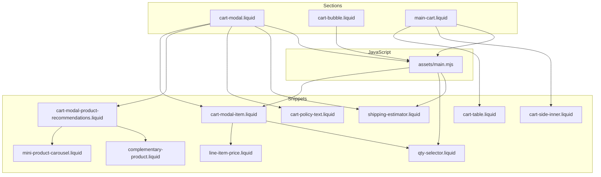
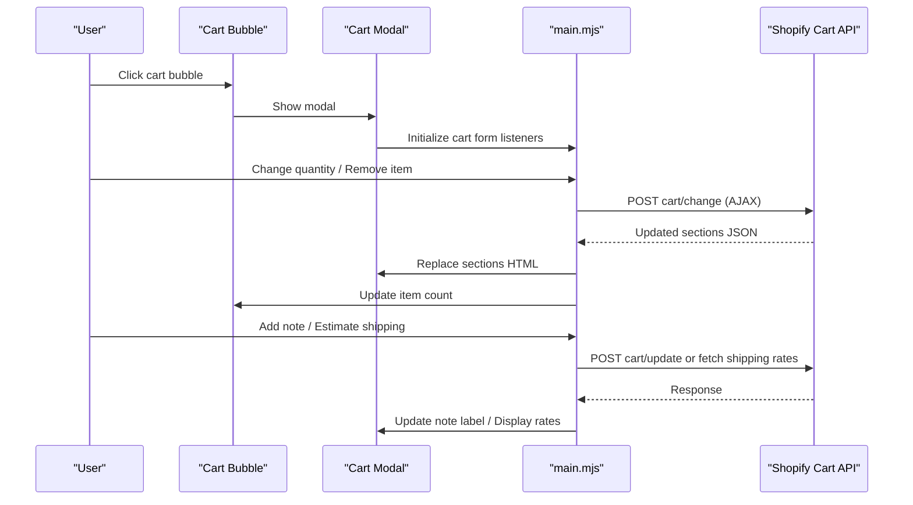
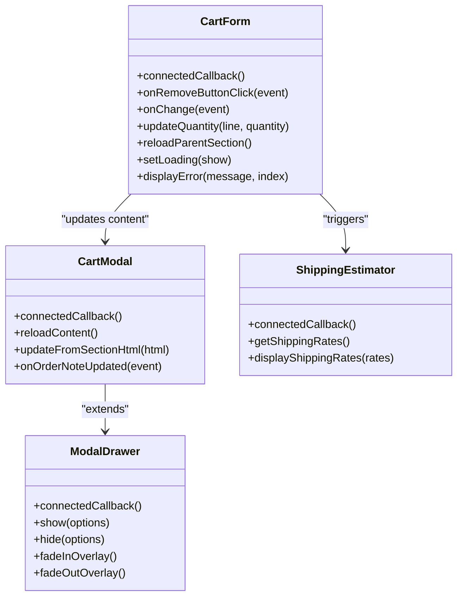

# Cart Management

<cite>
**Referenced Files in This Document**
- [cart-modal.liquid](file://sections/cart-modal.liquid)
- [cart-bubble.liquid](file://sections/cart-bubble.liquid)
- [cart-modal-item.liquid](file://snippets/cart-modal-item.liquid)
- [cart-policy-text.liquid](file://snippets/cart-policy-text.liquid)
- [line-item-price.liquid](file://snippets/line-item-price.liquid)
- [qty-selector.liquid](file://snippets/qty-selector.liquid)
- [shipping-estimator.liquid](file://snippets/shipping-estimator.liquid)
- [main-cart.liquid](file://sections/main-cart.liquid)
- [cart-table.liquid](file://snippets/cart-table.liquid)
- [cart-side-inner.liquid](file://snippets/cart-side-inner.liquid)
- [cart-modal-product-recommendations.liquid](file://snippets/cart-modal-product-recommendations.liquid)
- [complementary-product.liquid](file://snippets/complementary-product.liquid)
- [mini-product-carousel.liquid](file://snippets/mini-product-carousel.liquid)
- [main.mjs](file://assets/main.mjs)
- [cart.json](file://templates/cart.json)
</cite>

## Table of Contents
1. [Introduction](#introduction)
2. [Project Structure](#project-structure)
3. [Core Components](#core-components)
4. [Architecture Overview](#architecture-overview)
5. [Detailed Component Analysis](#detailed-component-analysis)
6. [Dependency Analysis](#dependency-analysis)
7. [Performance Considerations](#performance-considerations)
8. [Troubleshooting Guide](#troubleshooting-guide)
9. [Conclusion](#conclusion)

## Introduction
This document explains the cart management system for the igogomi theme, focusing on three primary areas:
- Cart modal drawer: responsive drawer UI, item rendering loop, interactive elements, and child drawers for notes and shipping estimates
- Cart bubble: quick cart access indicator with item count
- Individual cart item handling: removal, quantity adjustment, variant info display, and pricing presentation

It also covers totals calculation, tax and shipping messaging, Shopify cart integration, cart note functionality, order modifications, empty cart state handling, and configuration options for button colors, product recommendations, and cart behavior.

## Project Structure
The cart system spans Liquid sections, snippets, and JavaScript:
- Sections define the cart modal and cart bubble UI
- Snippets encapsulate reusable UI elements like item rendering, pricing, quantity selectors, and shipping estimator
- JavaScript handles cart updates, modal interactions, and dynamic content refresh

**Diagram sources**
- [cart-modal.liquid:17-203](file://sections/cart-modal.liquid#L17-L203)
- [cart-bubble.liquid:1-4](file://sections/cart-bubble.liquid#L1-L4)
- [main-cart.liquid:15-58](file://sections/main-cart.liquid#L15-L58)
- [cart-modal-item.liquid:1-95](file://snippets/cart-modal-item.liquid#L1-L95)
- [cart-policy-text.liquid:1-10](file://snippets/cart-policy-text.liquid#L1-L10)
- [line-item-price.liquid:1-55](file://snippets/line-item-price.liquid#L1-L55)
- [qty-selector.liquid:1-43](file://snippets/qty-selector.liquid#L1-L43)
- [shipping-estimator.liquid:1-56](file://snippets/shipping-estimator.liquid#L1-L56)
- [cart-table.liquid:1-150](file://snippets/cart-table.liquid#L1-L150)
- [cart-side-inner.liquid:1-151](file://snippets/cart-side-inner.liquid#L1-L151)
- [cart-modal-product-recommendations.liquid:1-29](file://snippets/cart-modal-product-recommendations.liquid#L1-L29)
- [complementary-product.liquid:1-80](file://snippets/complementary-product.liquid#L1-L80)
- [mini-product-carousel.liquid:1-41](file://snippets/mini-product-carousel.liquid#L1-L41)
- [main.mjs:1-60](file://assets/main.mjs#L1-L60)

**Section sources**
- [cart-modal.liquid:1-281](file://sections/cart-modal.liquid#L1-L281)
- [cart-bubble.liquid:1-4](file://sections/cart-bubble.liquid#L1-L4)
- [main-cart.liquid:1-292](file://sections/main-cart.liquid#L1-L292)

## Core Components
- Cart Modal Drawer: renders items, totals, optional notes/shipping estimator, and checkout actions; supports child drawers for order notes and shipping estimate
- Cart Bubble: displays item count when cart is not empty
- Cart Item Snippet: renders product image/title/variant/properties, quantity selector, price, and remove action
- Pricing and Quantity: line-item pricing with sale/regular/unit price, quantity selector with +/- buttons
- Shipping Estimator: form to calculate shipping rates via AJAX
- Main Cart Page: traditional cart table with totals, notes, shipping estimator trigger, and checkout button
- Product Recommendations: related products displayed inside the cart modal

**Section sources**
- [cart-modal.liquid:17-203](file://sections/cart-modal.liquid#L17-L203)
- [cart-bubble.liquid:1-4](file://sections/cart-bubble.liquid#L1-L4)
- [cart-modal-item.liquid:1-95](file://snippets/cart-modal-item.liquid#L1-L95)
- [line-item-price.liquid:1-55](file://snippets/line-item-price.liquid#L1-L55)
- [qty-selector.liquid:1-43](file://snippets/qty-selector.liquid#L1-L43)
- [shipping-estimator.liquid:1-56](file://snippets/shipping-estimator.liquid#L1-L56)
- [main-cart.liquid:15-58](file://sections/main-cart.liquid#L15-L58)
- [cart-table.liquid:1-150](file://snippets/cart-table.liquid#L1-L150)
- [cart-side-inner.liquid:1-151](file://snippets/cart-side-inner.liquid#L1-L151)
- [cart-modal-product-recommendations.liquid:1-29](file://snippets/cart-modal-product-recommendations.liquid#L1-L29)

## Architecture Overview
The cart system integrates Liquid templates with JavaScript for dynamic updates:
- Liquid renders static markup and passes cart data
- JavaScript intercepts cart actions, performs AJAX requests, and updates sections without full page reloads
- Modals and drawers provide focused interactions for notes and shipping estimation
- Totals and policy text reflect current cart state

**Diagram sources**
- [cart-bubble.liquid:1-4](file://sections/cart-bubble.liquid#L1-L4)
- [cart-modal.liquid:17-203](file://sections/cart-modal.liquid#L17-L203)
- [main.mjs:1-60](file://assets/main.mjs#L1-L60)

## Detailed Component Analysis

### Cart Modal Drawer
Responsibilities:
- Render cart items via a loop over cart.items
- Display cart total and optional tax/shipping messaging
- Provide buttons for viewing cart and checkout
- Support child drawers for order notes and shipping estimator
- Handle empty cart state with a continue shopping action
- Configure button colors and visibility of features

Key behaviors:
- Responsive layout with a drawer positioned to the right
- Uses a cart-form wrapper to bind quantity and remove actions
- Renders product recommendations below items
- Conditionally shows tax/shipping messaging and cart note/shipping estimator toggles
- Uses modal-drawer and order-note-drawer components for child modals

Configuration options:
- Show/hide tax/shipping message, cart note, shipping estimator
- Show/hide view cart and checkout buttons
- Button color customization for view cart and checkout
- Product recommendations heading and product list

**Section sources**
- [cart-modal.liquid:17-203](file://sections/cart-modal.liquid#L17-L203)
- [cart-modal.liquid:205-281](file://sections/cart-modal.liquid#L205-L281)

### Cart Bubble
Responsibilities:
- Display the cart item count when the cart is not empty
- Hidden when cart is empty

Integration:
- JavaScript updates the bubble content after cart changes
- Used as a quick-access trigger to open the cart modal

**Section sources**
- [cart-bubble.liquid:1-4](file://sections/cart-bubble.liquid#L1-L4)
- [main.mjs:1-60](file://assets/main.mjs#L1-L60)

### Cart Item Snippet (cart-modal-item)
Responsibilities:
- Render product thumbnail, title, variant, and properties
- Provide a remove link with accessible labeling
- Render line item price and unit pricing
- Embed a quantity selector bound to the cart line index

Interactive elements:
- Remove button links to item.url_to_remove
- Quantity selector triggers cart change via data-index binding
- Variant info shown when product has multiple variants
- Properties rendered with special handling for uploads

Accessibility:
- Proper aria-labels for remove button
- Accessible labels for quantity input

**Section sources**
- [cart-modal-item.liquid:1-95](file://snippets/cart-modal-item.liquid#L1-L95)
- [line-item-price.liquid:1-55](file://snippets/line-item-price.liquid#L1-L55)
- [qty-selector.liquid:1-43](file://snippets/qty-selector.liquid#L1-L43)

### Pricing and Line Item Price
Responsibilities:
- Display final price and original price when on sale
- Show unit price measurement when applicable
- Handle compare-at pricing fallback for variants

Logic highlights:
- Detect sale vs regular pricing
- Render unit price with reference value and unit
- Gracefully handle missing unit measurements

**Section sources**
- [line-item-price.liquid:1-55](file://snippets/line-item-price.liquid#L1-L55)

### Quantity Selector
Responsibilities:
- Provide +/- controls for quantity adjustment
- Bind to cart line item via data-index
- Support both standalone and form-bound usage

Behavior:
- Prevents negative quantities
- Updates cart via cart/change endpoint on change events

**Section sources**
- [qty-selector.liquid:1-43](file://snippets/qty-selector.liquid#L1-L43)
- [main.mjs:1-60](file://assets/main.mjs#L1-L60)

### Shipping Estimator
Responsibilities:
- Collect country/province/zip to estimate shipping rates
- Display rates or error messages
- Integrated as a modal drawer inside the cart modal

Flow:
- Form submission triggers AJAX fetch to cart/shipping_rates.json
- Displays list of available shipping rates or error message

**Section sources**
- [shipping-estimator.liquid:1-56](file://snippets/shipping-estimator.liquid#L1-L56)
- [cart-modal.liquid:167-185](file://sections/cart-modal.liquid#L167-L185)

### Main Cart Page (Traditional Cart)
Responsibilities:
- Render a table-based cart with items, quantities, and totals
- Provide a sticky summary panel with subtotal, discounts, total, and policy text
- Offer cart note editing and shipping estimator trigger
- Include checkout button with optional additional checkout buttons

Highlights:
- Uses cart-table snippet for item rendering
- cart-side-inner renders blocks for heading, text, free shipping indicator, totals, shipping estimator, cart note, and checkout button
- Provides a dedicated shipping estimator modal

**Section sources**
- [main-cart.liquid:15-58](file://sections/main-cart.liquid#L15-L58)
- [cart-table.liquid:1-150](file://snippets/cart-table.liquid#L1-L150)
- [cart-side-inner.liquid:1-151](file://snippets/cart-side-inner.liquid#L1-L151)

### Product Recommendations in Cart Modal
Responsibilities:
- Filter out unavailable or already present products
- Render recommended products as a scrollable carousel
- Use complementary-product and mini-product-carousel snippets

Behavior:
- Builds product IDs from cart items to avoid duplicates
- Renders a heading and navigation arrows when multiple items

**Section sources**
- [cart-modal-product-recommendations.liquid:1-29](file://snippets/cart-modal-product-recommendations.liquid#L1-L29)
- [complementary-product.liquid:1-80](file://snippets/complementary-product.liquid#L1-L80)
- [mini-product-carousel.liquid:1-41](file://snippets/mini-product-carousel.liquid#L1-L41)

### Tax and Shipping Messaging
Responsibilities:
- Display appropriate messaging based on taxes_included and shop.shipping_policy
- Used in both cart modal and main cart totals area

**Section sources**
- [cart-policy-text.liquid:1-10](file://snippets/cart-policy-text.liquid#L1-L10)
- [cart-modal.liquid:68-72](file://sections/cart-modal.liquid#L68-L72)
- [cart-side-inner.liquid:60-64](file://snippets/cart-side-inner.liquid#L60-L64)

### Cart Total Calculation and Order Modifications
Totals:
- Cart modal shows cart.total_price formatted with currency
- Main cart totals include items_subtotal_price, cart-level discounts, and total_price with currency
- Policy text reflects whether taxes and shipping are included or quoted at checkout

Order modifications:
- Cart note editing via textarea with AJAX update
- Shipping estimator fetches rates via AJAX
- Quantity adjustments and item removal handled via cart/change endpoint

**Section sources**
- [cart-modal.liquid:60-66](file://sections/cart-modal.liquid#L60-L66)
- [cart-side-inner.liquid:21-64](file://snippets/cart-side-inner.liquid#L21-L64)
- [cart.json:1-1](file://templates/cart.json#L1-L1)

### Empty Cart State Handling
- Cart modal shows an empty state with a continue shopping button
- Main cart page shows empty state with a continue shopping button
- Cart bubble remains hidden when cart is empty

**Section sources**
- [cart-modal.liquid:186-201](file://sections/cart-modal.liquid#L186-L201)
- [main-cart.liquid:16-22](file://sections/main-cart.liquid#L16-L22)
- [cart-bubble.liquid:1-4](file://sections/cart-bubble.liquid#L1-L4)

### Configuration Options
- Cart Modal:
  - Show/hide tax/shipping message, cart note, shipping estimator
  - Show/hide view cart and checkout buttons
  - Button color customization for view cart and checkout
  - Product recommendations heading and product list
- Main Cart:
  - Text alignment, background/text/heading colors
  - Summary background/text/heading colors
  - Blocks: heading, text, free_shipping_bar, totals (with shipping/taxes message and order weight), shipping_estimator, cart_note, checkout_button (style and colors)

**Section sources**
- [cart-modal.liquid:205-281](file://sections/cart-modal.liquid#L205-L281)
- [main-cart.liquid:76-292](file://sections/main-cart.liquid#L76-L292)

## Dependency Analysis
The JavaScript module defines custom elements and handlers that integrate with Shopify’s cart endpoints:
- cart-form: binds remove and quantity change events, performs AJAX cart/change and cart/add
- cart-modal: manages modal lifecycle and content reload
- modal-drawer: base drawer component with animations and positioning
- shipping-estimator: handles form submission and rate retrieval
- Utility helpers: section reload, loading overlays, focus trap, animations

**Diagram sources**
- [main.mjs:1-60](file://assets/main.mjs#L1-L60)

**Section sources**
- [main.mjs:1-60](file://assets/main.mjs#L1-L60)

## Performance Considerations
- Lazy loading and LQIP for images in cart items and recommendations
- Debounced and throttled event handlers for smooth interactions
- Minimal DOM updates via targeted section reloads
- Animations use hardware-accelerated properties where possible
- Intersection observers for loading and scroll-aware components

## Troubleshooting Guide
Common issues and resolutions:
- Quantity updates fail silently: ensure cart/change endpoint is reachable and that the form includes required sections targeting
- Remove item does nothing: verify data-index attributes match cart line indices and that remove links point to item.url_to_remove
- Cart note save fails: confirm AJAX route availability and that the note field is posted correctly
- Shipping estimator shows no rates: verify zip/postal code validity and server response format
- Totals mismatch: check cart-level discounts and unit price calculations in line-item-price snippet

**Section sources**
- [main.mjs:1-60](file://assets/main.mjs#L1-L60)
- [cart-modal-item.liquid:1-95](file://snippets/cart-modal-item.liquid#L1-L95)
- [line-item-price.liquid:1-55](file://snippets/line-item-price.liquid#L1-L55)
- [shipping-estimator.liquid:1-56](file://snippets/shipping-estimator.liquid#L1-L56)

## Conclusion
The cart management system combines a responsive cart modal with a compact cart bubble, robust item rendering and quantity controls, and seamless integration with Shopify’s cart APIs. The modular Liquid and JavaScript architecture enables efficient updates, accessible interactions, and flexible configuration for themes and stores.