# Shopping Experience

<cite>
**Referenced Files in This Document**
- [cart-modal.liquid](file://sections/cart-modal.liquid)
- [cart-bubble.liquid](file://sections/cart-bubble.liquid)
- [cart-modal-item.liquid](file://snippets/cart-modal-item.liquid)
- [shipping-estimator.liquid](file://snippets/shipping-estimator.liquid)
- [free-shipping-indicator.liquid](file://snippets/free-shipping-indicator.liquid)
- [line-item-price.liquid](file://snippets/line-item-price.liquid)
- [qty-selector.liquid](file://snippets/qty-selector.liquid)
- [product-stock-info.liquid](file://snippets/product-stock-info.liquid)
- [cart-policy-text.liquid](file://snippets/cart-policy-text.liquid)
- [cart-modal-product-recommendations.liquid](file://snippets/cart-modal-product-recommendations.liquid)
- [complementary-product.liquid](file://snippets/complementary-product.liquid)
- [mini-product-carousel.liquid](file://snippets/mini-product-carousel.liquid)
- [promotion-bar.liquid](file://sections/promotion-bar.liquid)
- [cart.json](file://templates/cart.json)
- [product-pickup-availability.liquid](file://snippets/product-pickup-availability.liquid)
</cite>

## Table of Contents
1. [Introduction](#introduction)
2. [Project Structure](#project-structure)
3. [Core Components](#core-components)
4. [Architecture Overview](#architecture-overview)
5. [Detailed Component Analysis](#detailed-component-analysis)
6. [Dependency Analysis](#dependency-analysis)
7. [Performance Considerations](#performance-considerations)
8. [Troubleshooting Guide](#troubleshooting-guide)
9. [Conclusion](#conclusion)

## Introduction
This document explains the shopping experience features of the theme, focusing on cart integration, checkout processes, and purchase flow enhancements. It covers the cart modal system, cart bubble, cart item management, checkout button integration, shipping estimator, order summary components, inventory management integration, stock indicators, low stock notifications, free shipping bar, promotional pricing display, discount application, and integration with Shopify’s cart and checkout systems while preserving the theme’s enhanced UI patterns.

## Project Structure
The shopping experience spans several Liquid sections and snippets:
- Sections define cart modal, cart bubble, and promotion bar containers.
- Snippets encapsulate reusable UI elements such as item rendering, quantity selector, pricing display, shipping estimator, free shipping indicator, product recommendations, and stock info.
- The cart page template configures the cart summary, totals, shipping estimator, cart note, and checkout button blocks.

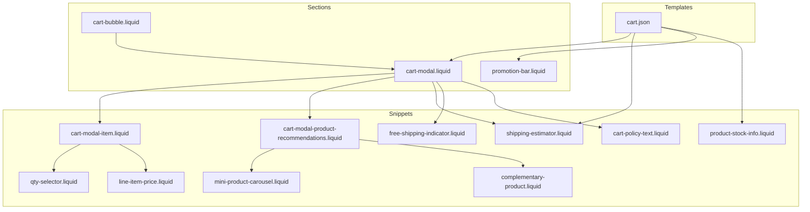

**Diagram sources**
- [cart-modal.liquid](file://sections/cart-modal.liquid)
- [cart-bubble.liquid](file://sections/cart-bubble.liquid)
- [cart-modal-item.liquid](file://snippets/cart-modal-item.liquid)
- [qty-selector.liquid](file://snippets/qty-selector.liquid)
- [line-item-price.liquid](file://snippets/line-item-price.liquid)
- [shipping-estimator.liquid](file://snippets/shipping-estimator.liquid)
- [free-shipping-indicator.liquid](file://snippets/free-shipping-indicator.liquid)
- [product-stock-info.liquid](file://snippets/product-stock-info.liquid)
- [cart-policy-text.liquid](file://snippets/cart-policy-text.liquid)
- [cart-modal-product-recommendations.liquid](file://snippets/cart-modal-product-recommendations.liquid)
- [complementary-product.liquid](file://snippets/complementary-product.liquid)
- [mini-product-carousel.liquid](file://snippets/mini-product-carousel.liquid)
- [cart.json](file://templates/cart.json)

**Section sources**
- [cart-modal.liquid](file://sections/cart-modal.liquid)
- [cart-bubble.liquid](file://sections/cart-bubble.liquid)
- [cart-modal-item.liquid](file://snippets/cart-modal-item.liquid)
- [shipping-estimator.liquid](file://snippets/shipping-estimator.liquid)
- [free-shipping-indicator.liquid](file://snippets/free-shipping-indicator.liquid)
- [line-item-price.liquid](file://snippets/line-item-price.liquid)
- [qty-selector.liquid](file://snippets/qty-selector.liquid)
- [product-stock-info.liquid](file://snippets/product-stock-info.liquid)
- [cart-policy-text.liquid](file://snippets/cart-policy-text.liquid)
- [cart-modal-product-recommendations.liquid](file://snippets/cart-modal-product-recommendations.liquid)
- [complementary-product.liquid](file://snippets/complementary-product.liquid)
- [mini-product-carousel.liquid](file://snippets/mini-product-carousel.liquid)
- [cart.json](file://templates/cart.json)

## Core Components
- Cart Modal: Renders the cart drawer with items, total, optional note and shipping estimator triggers, and primary actions (view cart or checkout).
- Cart Bubble: Displays the item count badge in the header navigation.
- Cart Item Management: Renders product images, titles, variants, properties, pricing, quantities, and remove actions.
- Checkout Button Integration: Provides a submit-based checkout action integrated with Shopify’s cart form.
- Shipping Estimator: Allows estimating shipping per country/province/zip and displays rates.
- Order Summary Components: Policy text, totals, and optional notes.
- Inventory & Stock Indicators: Shows in-stock, low stock, and backorder messaging.
- Free Shipping Bar: Progress indicator toward a free shipping threshold.
- Promotional Pricing Display: Renders sale vs regular price and unit pricing.
- Product Recommendations: Suggests complementary products inside the cart modal.
- Promotion Bar: Optional homepage promotional banner.

**Section sources**
- [cart-modal.liquid](file://sections/cart-modal.liquid)
- [cart-bubble.liquid](file://sections/cart-bubble.liquid)
- [cart-modal-item.liquid](file://snippets/cart-modal-item.liquid)
- [shipping-estimator.liquid](file://snippets/shipping-estimator.liquid)
- [free-shipping-indicator.liquid](file://snippets/free-shipping-indicator.liquid)
- [line-item-price.liquid](file://snippets/line-item-price.liquid)
- [qty-selector.liquid](file://snippets/qty-selector.liquid)
- [product-stock-info.liquid](file://snippets/product-stock-info.liquid)
- [cart-policy-text.liquid](file://snippets/cart-policy-text.liquid)
- [cart-modal-product-recommendations.liquid](file://snippets/cart-modal-product-recommendations.liquid)
- [complementary-product.liquid](file://snippets/complementary-product.liquid)
- [mini-product-carousel.liquid](file://snippets/mini-product-carousel.liquid)
- [promotion-bar.liquid](file://sections/promotion-bar.liquid)
- [cart.json](file://templates/cart.json)

## Architecture Overview
The shopping experience integrates Shopify’s cart and checkout via native forms and routes, while the theme augments the UI with custom drawers, modals, and recommendation carousels.

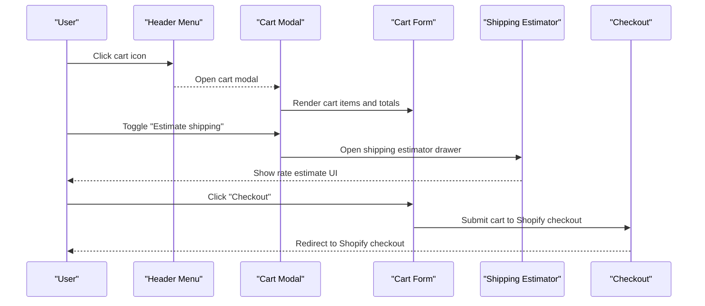

**Diagram sources**
- [cart-modal.liquid](file://sections/cart-modal.liquid)
- [shipping-estimator.liquid](file://snippets/shipping-estimator.liquid)

## Detailed Component Analysis

### Cart Modal System
The cart modal renders the cart contents, total price, optional note and shipping estimator toggles, and primary buttons. It supports:
- Rendering each cart item via a dedicated snippet.
- Showing a free shipping indicator near the header.
- Triggering child modals for order note editing and shipping estimation.
- Providing “View cart” and “Checkout” actions.

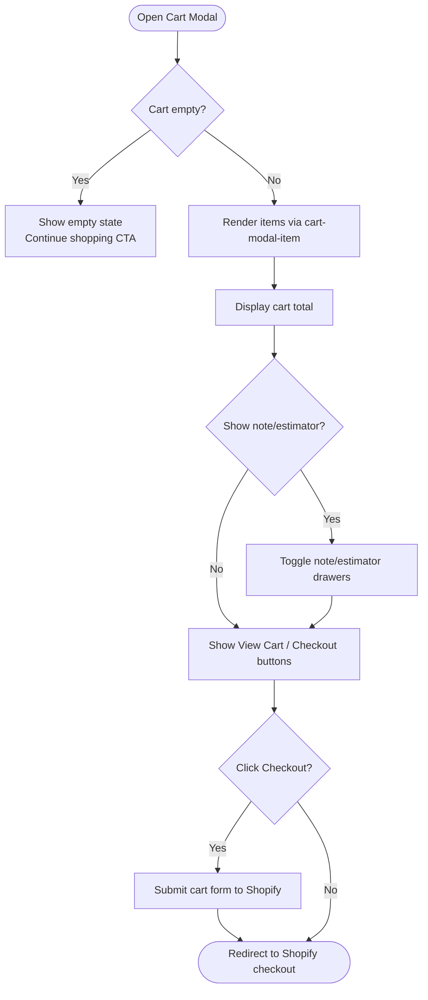

**Diagram sources**
- [cart-modal.liquid](file://sections/cart-modal.liquid)
- [cart-modal-item.liquid](file://snippets/cart-modal-item.liquid)
- [free-shipping-indicator.liquid](file://snippets/free-shipping-indicator.liquid)

**Section sources**
- [cart-modal.liquid](file://sections/cart-modal.liquid)

### Cart Bubble Functionality
The cart bubble displays the current item count when the cart is not empty. It is typically rendered in the header navigation.

**Section sources**
- [cart-bubble.liquid](file://sections/cart-bubble.liquid)

### Cart Item Management
Each cart item is rendered with:
- Product image and thumbnail.
- Product name and variant title.
- Custom properties display.
- Line item pricing (sale vs regular price, unit pricing).
- Quantity selector with increment/decrement controls.
- Remove item action.

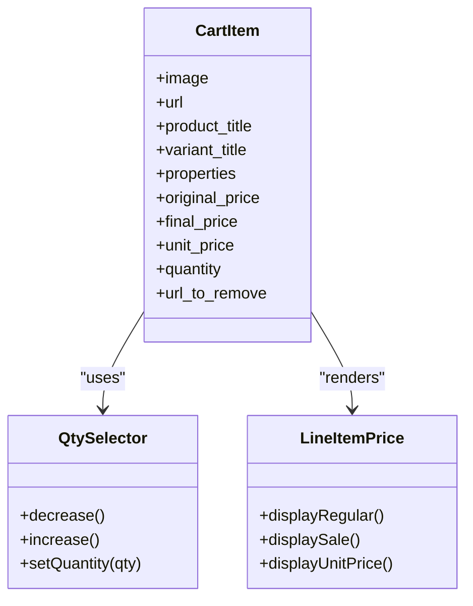

**Diagram sources**
- [cart-modal-item.liquid](file://snippets/cart-modal-item.liquid)
- [qty-selector.liquid](file://snippets/qty-selector.liquid)
- [line-item-price.liquid](file://snippets/line-item-price.liquid)

**Section sources**
- [cart-modal-item.liquid](file://snippets/cart-modal-item.liquid)
- [qty-selector.liquid](file://snippets/qty-selector.liquid)
- [line-item-price.liquid](file://snippets/line-item-price.liquid)

### Checkout Button Integration
The checkout button is implemented as a submit button within the cart form. When clicked, it submits the cart to Shopify’s checkout endpoint.

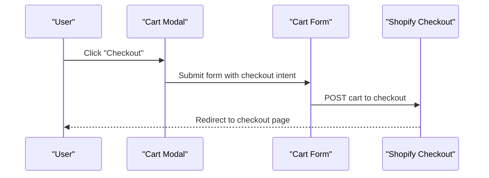

**Diagram sources**
- [cart-modal.liquid](file://sections/cart-modal.liquid)

**Section sources**
- [cart-modal.liquid](file://sections/cart-modal.liquid)

### Shipping Estimator
The shipping estimator allows users to select a country, province, and enter a zip code to receive shipping estimates. It uses a form with dynamic province selection and a submit button.

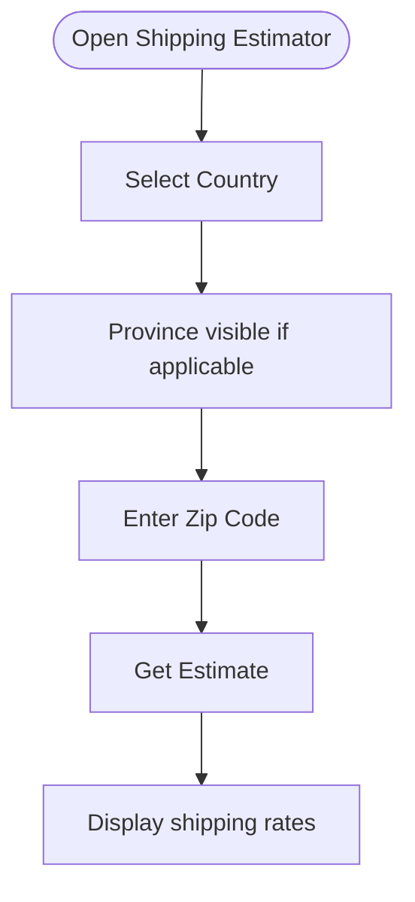

**Diagram sources**
- [shipping-estimator.liquid](file://snippets/shipping-estimator.liquid)

**Section sources**
- [shipping-estimator.liquid](file://snippets/shipping-estimator.liquid)

### Order Summary Components
- Policy Text: Communicates tax inclusion and shipping policy messaging.
- Totals: Displays the cart total prominently.
- Cart Note: Optional order note editing drawer.

**Section sources**
- [cart-policy-text.liquid](file://snippets/cart-policy-text.liquid)
- [cart-modal.liquid](file://sections/cart-modal.liquid)

### Inventory Management Integration and Stock Indicators
Stock messaging is rendered per variant, indicating in-stock, low stock thresholds, or backorder eligibility when inventory policy allows continuing sales.

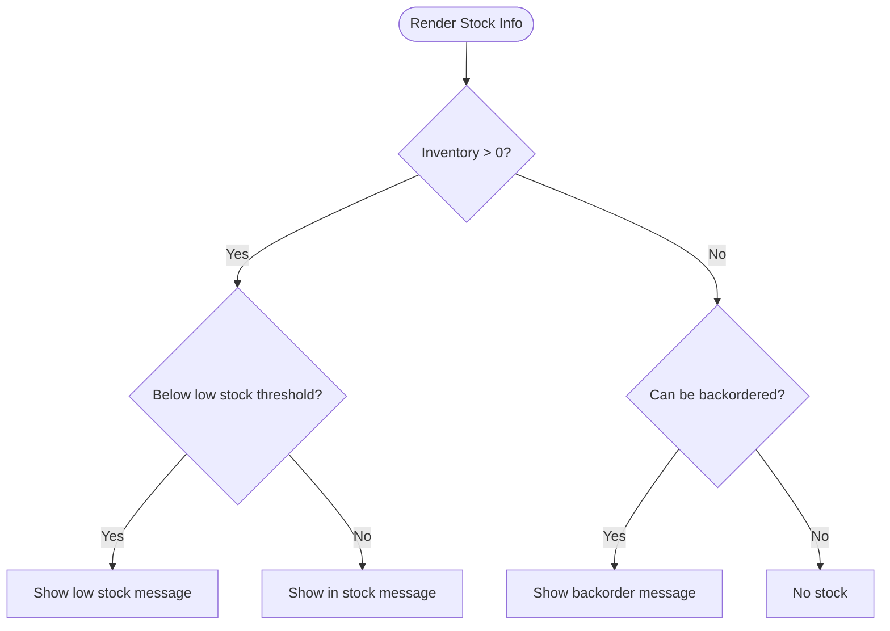

**Diagram sources**
- [product-stock-info.liquid](file://snippets/product-stock-info.liquid)

**Section sources**
- [product-stock-info.liquid](file://snippets/product-stock-info.liquid)

### Low Stock Notifications
Low stock notifications appear when the variant’s inventory falls below a configurable threshold. They are surfaced as messages within the product context and can be shown alongside the cart modal.

**Section sources**
- [product-stock-info.liquid](file://snippets/product-stock-info.liquid)

### Free Shipping Bar
The free shipping indicator shows progress toward a configured threshold, displaying either a remaining amount to qualify or a qualified message.

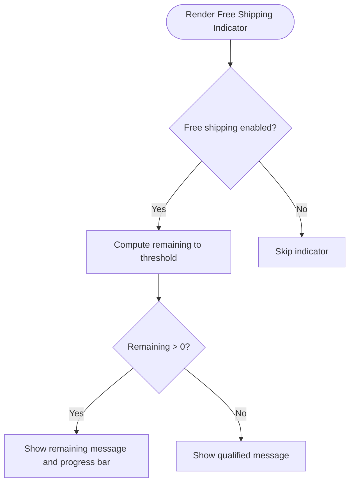

**Diagram sources**
- [free-shipping-indicator.liquid](file://snippets/free-shipping-indicator.liquid)

**Section sources**
- [free-shipping-indicator.liquid](file://snippets/free-shipping-indicator.liquid)

### Promotional Pricing Display and Discount Application
Promotional pricing is handled by the line item price snippet, which compares original and final prices and optionally shows unit pricing. Discounts are applied server-side by Shopify; the theme surfaces sale pricing and compare-at pricing when present.

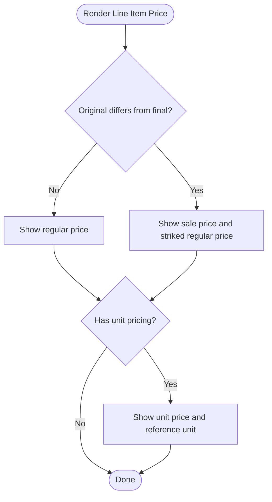

**Diagram sources**
- [line-item-price.liquid](file://snippets/line-item-price.liquid)

**Section sources**
- [line-item-price.liquid](file://snippets/line-item-price.liquid)

### Product Recommendations in Cart Modal
The cart modal includes a recommendations carousel that filters out products already in the cart and unavailable items.

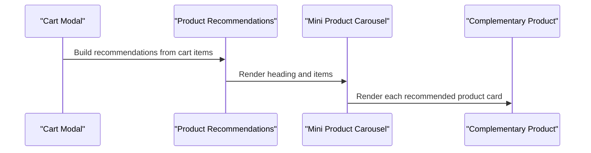

**Diagram sources**
- [cart-modal-product-recommendations.liquid](file://snippets/cart-modal-product-recommendations.liquid)
- [mini-product-carousel.liquid](file://snippets/mini-product-carousel.liquid)
- [complementary-product.liquid](file://snippets/complementary-product.liquid)

**Section sources**
- [cart-modal-product-recommendations.liquid](file://snippets/cart-modal-product-recommendations.liquid)
- [mini-product-carousel.liquid](file://snippets/mini-product-carousel.liquid)
- [complementary-product.liquid](file://snippets/complementary-product.liquid)

### Promotion Bar
The promotion bar is a configurable header section that can show content and link, optionally restricted to the home page, and styled with background and text colors.

**Section sources**
- [promotion-bar.liquid](file://sections/promotion-bar.liquid)

### Pickup Availability
Pickup availability shows nearby stores where a variant can be picked up, with a modal drawer to view store details and addresses.

**Section sources**
- [product-pickup-availability.liquid](file://snippets/product-pickup-availability.liquid)

## Dependency Analysis
The cart modal depends on multiple snippets for rendering items, quantities, pricing, and recommendations. The cart page template orchestrates the placement and behavior of summary, totals, shipping estimator, cart note, and checkout button blocks.

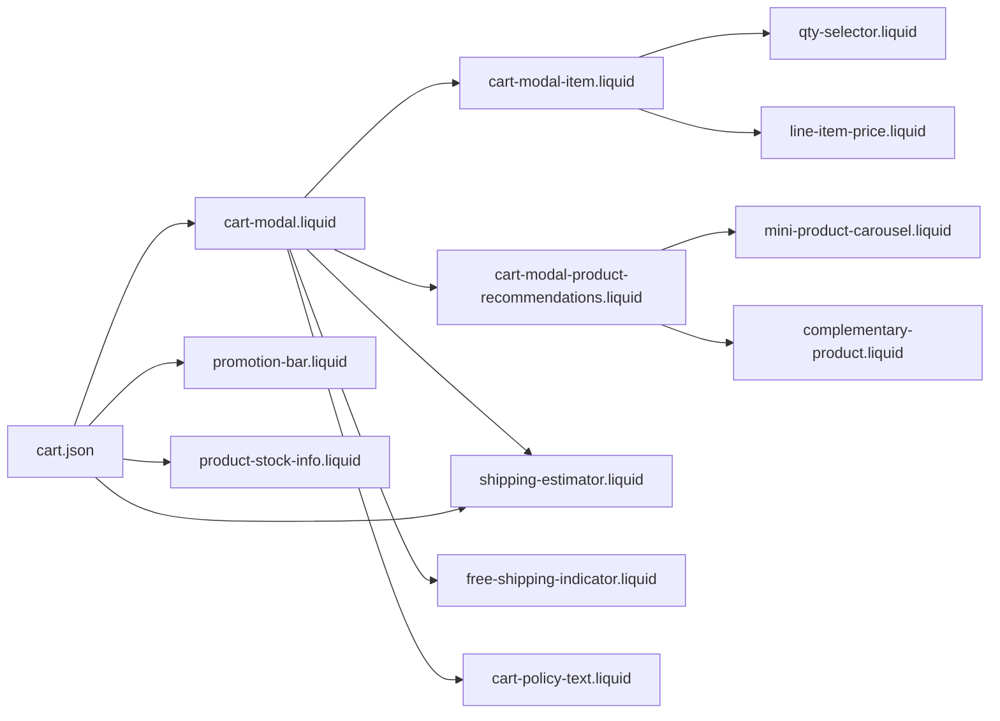

**Diagram sources**
- [cart-modal.liquid](file://sections/cart-modal.liquid)
- [cart-modal-item.liquid](file://snippets/cart-modal-item.liquid)
- [cart-modal-product-recommendations.liquid](file://snippets/cart-modal-product-recommendations.liquid)
- [mini-product-carousel.liquid](file://snippets/mini-product-carousel.liquid)
- [complementary-product.liquid](file://snippets/complementary-product.liquid)
- [shipping-estimator.liquid](file://snippets/shipping-estimator.liquid)
- [free-shipping-indicator.liquid](file://snippets/free-shipping-indicator.liquid)
- [cart-policy-text.liquid](file://snippets/cart-policy-text.liquid)
- [qty-selector.liquid](file://snippets/qty-selector.liquid)
- [line-item-price.liquid](file://snippets/line-item-price.liquid)
- [cart.json](file://templates/cart.json)
- [promotion-bar.liquid](file://sections/promotion-bar.liquid)
- [product-stock-info.liquid](file://snippets/product-stock-info.liquid)

**Section sources**
- [cart-modal.liquid](file://sections/cart-modal.liquid)
- [cart-modal-item.liquid](file://snippets/cart-modal-item.liquid)
- [cart-modal-product-recommendations.liquid](file://snippets/cart-modal-product-recommendations.liquid)
- [mini-product-carousel.liquid](file://snippets/mini-product-carousel.liquid)
- [complementary-product.liquid](file://snippets/complementary-product.liquid)
- [shipping-estimator.liquid](file://snippets/shipping-estimator.liquid)
- [free-shipping-indicator.liquid](file://snippets/free-shipping-indicator.liquid)
- [cart-policy-text.liquid](file://snippets/cart-policy-text.liquid)
- [qty-selector.liquid](file://snippets/qty-selector.liquid)
- [line-item-price.liquid](file://snippets/line-item-price.liquid)
- [cart.json](file://templates/cart.json)
- [promotion-bar.liquid](file://sections/promotion-bar.liquid)
- [product-stock-info.liquid](file://snippets/product-stock-info.liquid)

## Performance Considerations
- Lazy-loading images in cart thumbnails and product recommendations reduces initial payload.
- Minimal DOM updates by reusing quantity selectors and line item pricing snippets improves interactivity.
- Conditional rendering of shipping estimator and note modals reduces unnecessary markup.
- Carousel components are only rendered when recommendations exist.

## Troubleshooting Guide
- Cart modal does not open: Verify the cart modal section is included in the theme and the cart bubble is rendering the item count.
- Checkout button does nothing: Confirm the cart form is present and the checkout button is inside the form.
- Shipping estimator shows no rates: Ensure country/province/zip are selected and submitted; check for JavaScript errors in the console.
- Free shipping indicator not visible: Confirm the setting enabling the free shipping bar is turned on and the threshold is configured.
- Stock messages incorrect: Verify the variant inventory settings and low stock threshold in the theme settings.
- Promotion bar not showing: Confirm the section is placed in the header and homepage-only setting matches the current page.

**Section sources**
- [cart-modal.liquid](file://sections/cart-modal.liquid)
- [cart-bubble.liquid](file://sections/cart-bubble.liquid)
- [shipping-estimator.liquid](file://snippets/shipping-estimator.liquid)
- [free-shipping-indicator.liquid](file://snippets/free-shipping-indicator.liquid)
- [product-stock-info.liquid](file://snippets/product-stock-info.liquid)
- [promotion-bar.liquid](file://sections/promotion-bar.liquid)

## Conclusion
The shopping experience leverages Shopify’s cart and checkout infrastructure while enhancing the UI with a rich cart modal, actionable stock indicators, shipping estimation, and promotional elements. The modular snippet-based design ensures maintainability and consistent user experience across cart and product contexts.