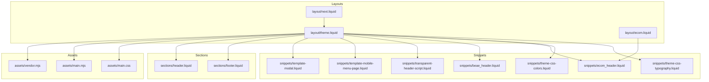
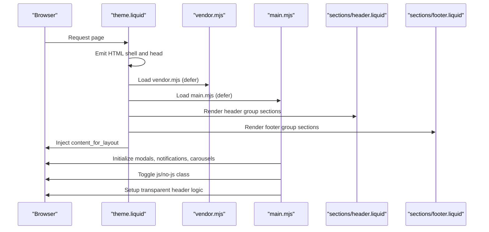
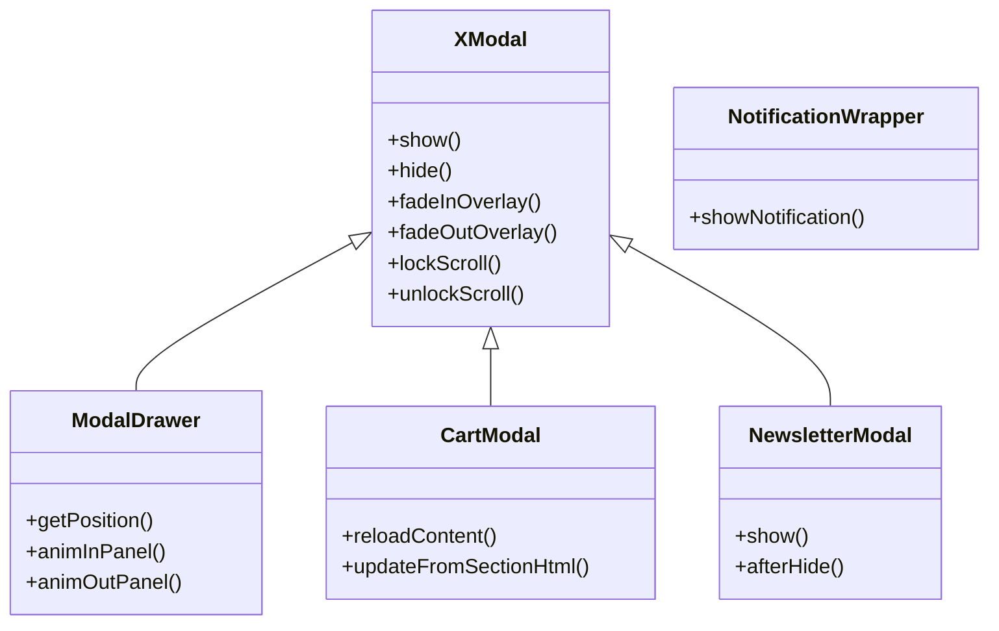
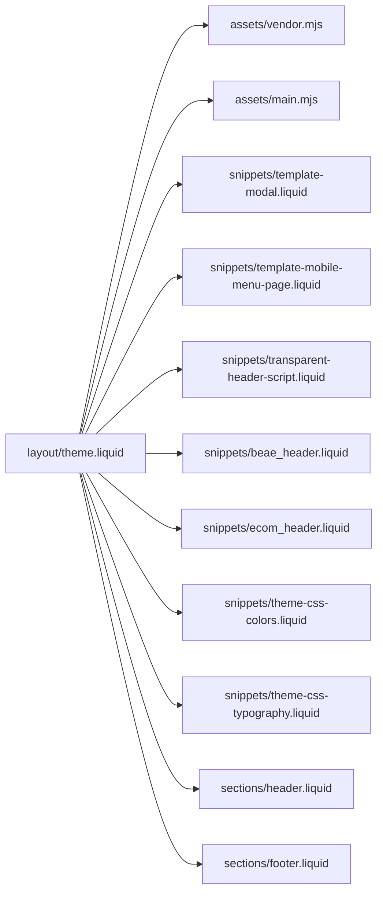

# Layout System

<cite>
**Referenced Files in This Document**
- [theme.liquid](file://layout/theme.liquid)
- [ecom.liquid](file://layout/ecom.liquid)
- [next.liquid](file://layout/next.liquid)
- [main.mjs](file://assets/main.mjs)
- [vendor.mjs](file://assets/vendor.mjs)
- [template-modal.liquid](file://snippets/template-modal.liquid)
- [template-mobile-menu-page.liquid](file://snippets/template-mobile-menu-page.liquid)
- [transparent-header-script.liquid](file://snippets/transparent-header-script.liquid)
- [beae_header.liquid](file://snippets/beae_header.liquid)
- [ecom_header.liquid](file://snippets/ecom_header.liquid)
- [theme-css-colors.liquid](file://snippets/theme-css-colors.liquid)
- [theme-css-typography.liquid](file://snippets/theme-css-typography.liquid)
- [header.liquid](file://sections/header.liquid)
- [footer.liquid](file://sections/footer.liquid)
</cite>

## Table of Contents
1. [Introduction](#introduction)
2. [Project Structure](#project-structure)
3. [Core Components](#core-components)
4. [Architecture Overview](#architecture-overview)
5. [Detailed Component Analysis](#detailed-component-analysis)
6. [Dependency Analysis](#dependency-analysis)
7. [Performance Considerations](#performance-considerations)
8. [Troubleshooting Guide](#troubleshooting-guide)
9. [Conclusion](#conclusion)

## Introduction
This document explains the Igogomi theme’s layout system and how it orchestrates page rendering across templates. It covers:
- The main theme.liquid structure and its role as the primary HTML shell
- Layout variants (theme.liquid, ecom.liquid, next.liquid) and their intended use cases
- Asset loading strategy for JavaScript modules and CSS
- Progressive enhancement via the no-js/js class toggle
- Section rendering with  and content_for_layout integration
- Modal and notification systems, SVG sprite rendering, and internationalization
- Transparent header functionality and scroll animation integration

## Project Structure
The layout system centers around three layout files:
- layout/theme.liquid: The primary theme shell for most pages
- layout/ecom.liquid: A specialized layout for EComposer themes
- layout/next.liquid: A minimal layout for Beae themes

These layouts embed the page content via content_for_layout and coordinate with sections and snippets to assemble the final HTML.

**Diagram sources**
- [theme.liquid](file://layout/theme.liquid)
- [ecom.liquid](file://layout/ecom.liquid)
- [next.liquid](file://layout/next.liquid)
- [main.mjs](file://assets/main.mjs)
- [vendor.mjs](file://assets/vendor.mjs)
- [template-modal.liquid](file://snippets/template-modal.liquid)
- [template-mobile-menu-page.liquid](file://snippets/template-mobile-menu-page.liquid)
- [transparent-header-script.liquid](file://snippets/transparent-header-script.liquid)
- [beae_header.liquid](file://snippets/beae_header.liquid)
- [ecom_header.liquid](file://snippets/ecom_header.liquid)
- [theme-css-colors.liquid](file://snippets/theme-css-colors.liquid)
- [theme-css-typography.liquid](file://snippets/theme-css-typography.liquid)
- [header.liquid](file://sections/header.liquid)
- [footer.liquid](file://sections/footer.liquid)

**Section sources**
- [theme.liquid](file://layout/theme.liquid)
- [ecom.liquid](file://layout/ecom.liquid)
- [next.liquid](file://layout/next.liquid)

## Core Components
- theme.liquid: The central layout that defines the HTML skeleton, loads vendor and main JS modules, injects theme CSS snippets, renders header/footer sections, and wires up modals, notifications, and transparent header logic.
- ecom.liquid: A lightweight layout tailored for EComposer-generated pages, embedding content_for_layout and including EComposer-specific header/footer hooks.
- next.liquid: A minimal shell for Beae themes, forwarding content_for_layout with basic metadata.
- Assets: vendor.mjs (prefetch/link rel preload utilities) and main.mjs (rich client behavior, modals, carousels, dropdowns, notifications, etc.).
- Snippets: template-modal and template-mobile-menu-page define shadow DOM templates for reusable UI; transparent-header-script manages header transparency logic; theme CSS snippets emit CSS variables; header/footer sections render navigation and branding.

**Section sources**
- [theme.liquid](file://layout/theme.liquid)
- [ecom.liquid](file://layout/ecom.liquid)
- [next.liquid](file://layout/next.liquid)
- [main.mjs](file://assets/main.mjs)
- [vendor.mjs](file://assets/vendor.mjs)
- [template-modal.liquid](file://snippets/template-modal.liquid)
- [template-mobile-menu-page.liquid](file://snippets/template-mobile-menu-page.liquid)
- [transparent-header-script.liquid](file://snippets/transparent-header-script.liquid)
- [theme-css-colors.liquid](file://snippets/theme-css-colors.liquid)
- [theme-css-typography.liquid](file://snippets/theme-css-typography.liquid)
- [header.liquid](file://sections/header.liquid)
- [footer.liquid](file://sections/footer.liquid)

## Architecture Overview
The layout orchestrates rendering through a deterministic pipeline:
- HTML shell and head: theme.liquid sets the doctype, html lang, viewport, canonical, favicon, SEO metadata, and theme CSS variables.
- JavaScript modules: vendor.mjs and main.mjs are loaded with type="module" and defer to enable progressive enhancement.
- Body composition: header and footer sections are rendered via , content_for_layout is embedded, and overlays are injected.
- Runtime enhancements: transparent header styles, modal/drawer components, notifications, and scroll animations are initialized.

**Diagram sources**
- [theme.liquid](file://layout/theme.liquid)
- [main.mjs](file://assets/main.mjs)
- [vendor.mjs](file://assets/vendor.mjs)
- [header.liquid](file://sections/header.liquid)
- [footer.liquid](file://sections/footer.liquid)

## Detailed Component Analysis

### Layout Types and Use Cases
- theme.liquid: Full-featured layout for standard pages. Loads theme CSS variables, vendor/main JS, renders header/footer sections, and initializes modals and notifications.
- ecom.liquid: Designed for EComposer-generated pages. Includes EComposer-specific header/footer hooks and wraps content_for_layout in a container.
- next.liquid: Minimal shell for Beae themes, forwarding content_for_layout with basic metadata and content_for_header injection.

**Section sources**
- [theme.liquid](file://layout/theme.liquid)
- [ecom.liquid](file://layout/ecom.liquid)
- [next.liquid](file://layout/next.liquid)

### Asset Loading Strategy
- JavaScript modules:
  - vendor.mjs: Lightweight prefetch/link rel preload utilities for improved navigation performance.
  - main.mjs: Rich client behavior including modals, carousels, dropdowns, notifications, scroll animations, and section updates.
- CSS:
  - theme-css-colors.liquid and theme-css-typography.liquid emit CSS variables for colors, typography, and layout tokens.
  - main.css is included via stylesheet_tag.

Progressive enhancement:
- The html element starts with class "no-js".
- A script immediately switches to "js" after DOMContentLoaded, enabling enhanced behavior.

**Section sources**
- [theme.liquid](file://layout/theme.liquid)
- [main.mjs](file://assets/main.mjs)
- [vendor.mjs](file://assets/vendor.mjs)
- [theme-css-colors.liquid](file://snippets/theme-css-colors.liquid)
- [theme-css-typography.liquid](file://snippets/theme-css-typography.liquid)

### Section Rendering and content_for_layout Integration
-  and  render the header and footer sections.
-  renders overlay content.
- content_for_layout is embedded twice:
  - Once inside a scroll-animate element for reveal-on-scroll animations
  - Again inside the main element
- The layout also captures content_for_layout to detect whether a transparent header is enabled in the first section.

**Section sources**
- [theme.liquid](file://layout/theme.liquid)
- [header.liquid](file://sections/header.liquid)
- [footer.liquid](file://sections/footer.liquid)

### Modal and Notification System
- Template-based modals:
  - template-modal.liquid defines a shadow DOM template for modal panels, overlay, and loading spinner.
  - template-mobile-menu-page.liquid defines a shadow DOM template for mobile menu pages.
- JavaScript integration:
  - main.mjs registers custom elements (x-modal, modal-drawer, cart-modal, newsletter-modal, etc.) and implements show/hide logic, focus trapping, scroll locking, and animations.
- Notifications:
  - notification-wrapper displays transient messages with configurable timing and types.
- SVG sprites:
  - window.svgs is populated with inline SVG icons for chevron, times, zoom-in, and zoom-out, used across components.

**Diagram sources**
- [template-modal.liquid](file://snippets/template-modal.liquid)
- [template-mobile-menu-page.liquid](file://snippets/template-mobile-menu-page.liquid)
- [main.mjs](file://assets/main.mjs)

**Section sources**
- [template-modal.liquid](file://snippets/template-modal.liquid)
- [template-mobile-menu-page.liquid](file://snippets/template-mobile-menu-page.liquid)
- [main.mjs](file://assets/main.mjs)

### Transparent Header and Scroll Animation Integration
- Transparent header logic:
  - A style block with data-transparent-header-style is conditionally enabled only when the first child section allows transparency and the header is the last element in the header group.
  - transparent-header-script.liquid toggles media attributes on these styles depending on design mode and section reordering events.
- Scroll animations:
  - theme.liquid conditionally adds classes for reveal-on-scroll and image hover zoom based on settings.
  - main.mjs includes scroll animation utilities and animations (fade-in/out, scale, clip inset, etc.).

**Section sources**
- [theme.liquid](file://layout/theme.liquid)
- [transparent-header-script.liquid](file://snippets/transparent-header-script.liquid)
- [main.mjs](file://assets/main.mjs)

### Internationalization Support
- Locale detection:
  - The html lang attribute is set to request.locale.iso_code.
- Translations:
  - Strings for variants, cart, routes, and UI messages are passed into window._t and window.routes for runtime use.
- Localization snippets:
  - Country/language selectors are rendered in header/footer sections when enabled.

**Section sources**
- [theme.liquid](file://layout/theme.liquid)
- [header.liquid](file://sections/header.liquid)
- [footer.liquid](file://sections/footer.liquid)

### Additional Integrations
- Beae and EComposer headers:
  - beae_header.liquid injects Beae-specific assets and helpers.
  - ecom_header.liquid is included for EComposer themes.
- Theme CSS generation:
  - theme-css-colors.liquid and theme-css-typography.liquid emit CSS variables for colors, typography, and layout tokens.

**Section sources**
- [beae_header.liquid](file://snippets/beae_header.liquid)
- [ecom_header.liquid](file://snippets/ecom_header.liquid)
- [theme-css-colors.liquid](file://snippets/theme-css-colors.liquid)
- [theme-css-typography.liquid](file://snippets/theme-css-typography.liquid)

## Dependency Analysis
The layout depends on:
- Assets: vendor.mjs and main.mjs for runtime behavior
- Snippets: theme CSS variables, modal templates, transparent header script, and third-party headers
- Sections: header and footer groups for navigation and branding

**Diagram sources**
- [theme.liquid](file://layout/theme.liquid)
- [main.mjs](file://assets/main.mjs)
- [vendor.mjs](file://assets/vendor.mjs)
- [template-modal.liquid](file://snippets/template-modal.liquid)
- [template-mobile-menu-page.liquid](file://snippets/template-mobile-menu-page.liquid)
- [transparent-header-script.liquid](file://snippets/transparent-header-script.liquid)
- [beae_header.liquid](file://snippets/beae_header.liquid)
- [ecom_header.liquid](file://snippets/ecom_header.liquid)
- [theme-css-colors.liquid](file://snippets/theme-css-colors.liquid)
- [theme-css-typography.liquid](file://snippets/theme-css-typography.liquid)
- [header.liquid](file://sections/header.liquid)
- [footer.liquid](file://sections/footer.liquid)

**Section sources**
- [theme.liquid](file://layout/theme.liquid)
- [main.mjs](file://assets/main.mjs)
- [vendor.mjs](file://assets/vendor.mjs)
- [template-modal.liquid](file://snippets/template-modal.liquid)
- [template-mobile-menu-page.liquid](file://snippets/template-mobile-menu-page.liquid)
- [transparent-header-script.liquid](file://snippets/transparent-header-script.liquid)
- [beae_header.liquid](file://snippets/beae_header.liquid)
- [ecom_header.liquid](file://snippets/ecom_header.liquid)
- [theme-css-colors.liquid](file://snippets/theme-css-colors.liquid)
- [theme-css-typography.liquid](file://snippets/theme-css-typography.liquid)
- [header.liquid](file://sections/header.liquid)
- [footer.liquid](file://sections/footer.liquid)

## Performance Considerations
- Deferred module loading: vendor.mjs and main.mjs are loaded with defer to avoid blocking render while still enabling progressive enhancement.
- Prefetch/link rel preload: vendor.mjs includes prefetch/link rel preload utilities to accelerate navigation.
- CSS variables: Centralized theme CSS via snippets reduces duplication and improves maintainability.
- Conditional animations: Scroll and zoom animation classes are applied only when settings are enabled, minimizing unnecessary work.

[No sources needed since this section provides general guidance]

## Troubleshooting Guide
- Modals not appearing:
  - Verify template-modal and template-mobile-menu-page are rendered and that main.mjs custom elements are registered.
- Transparent header not working:
  - Confirm the first child section has enable-transparent-header and the header is last in the header group; check transparent-header-script behavior in design mode.
- Notifications not visible:
  - Ensure notification-wrapper exists and showNotification is called with appropriate arguments.
- JS not enhancing:
  - Confirm the html element class transitions from "no-js" to "js" after DOMContentLoaded.

**Section sources**
- [theme.liquid](file://layout/theme.liquid)
- [template-modal.liquid](file://snippets/template-modal.liquid)
- [template-mobile-menu-page.liquid](file://snippets/template-mobile-menu-page.liquid)
- [transparent-header-script.liquid](file://snippets/transparent-header-script.liquid)
- [main.mjs](file://assets/main.mjs)

## Conclusion
The Igogomi theme’s layout system is a cohesive pipeline that combines a robust theme.liquid shell, modular JavaScript, and reusable snippets to deliver a progressive, accessible, and customizable storefront. By leveraging , content_for_layout, and theme CSS variables, it supports flexible page construction while maintaining strong defaults for modals, notifications, transparent headers, and internationalization.