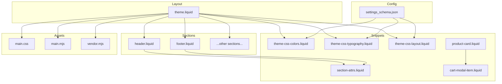
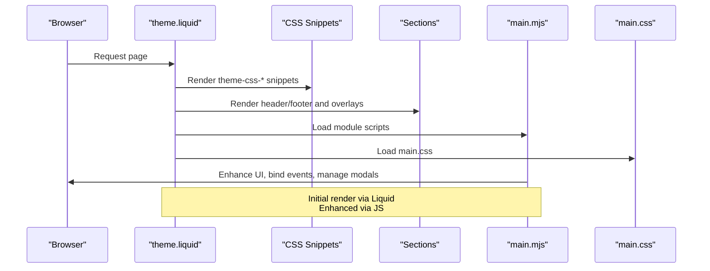
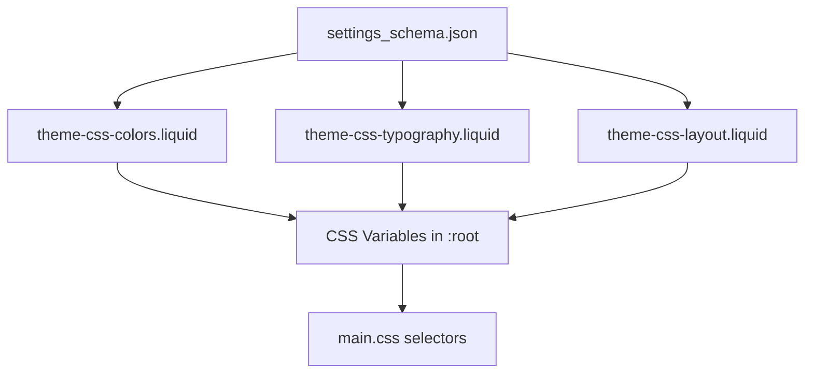
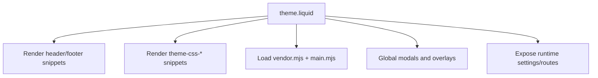
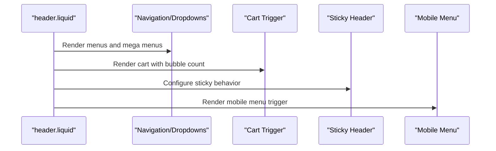
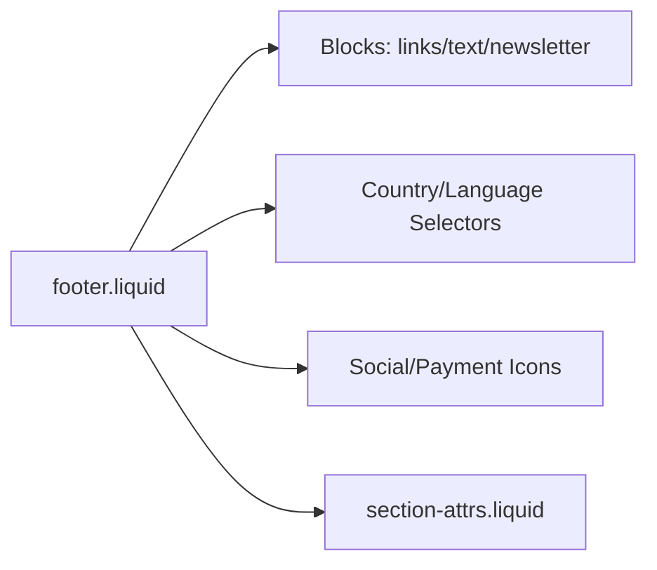
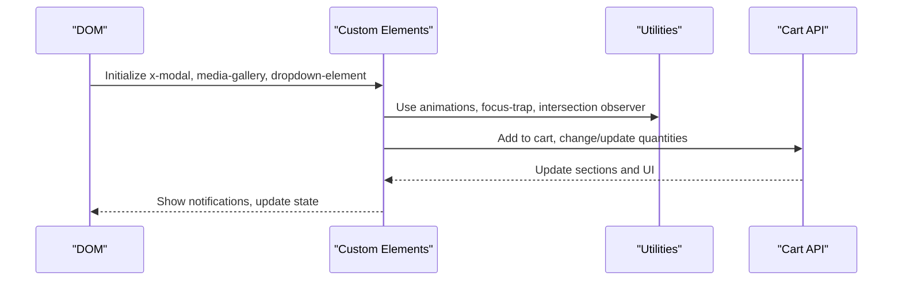
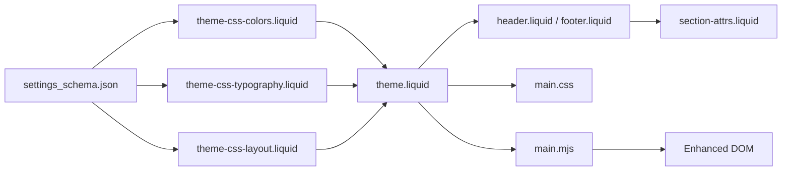

# Theme Architecture

<cite>
**Referenced Files in This Document**
- [settings_schema.json](file://config/settings_schema.json)
- [theme.liquid](file://layout/theme.liquid)
- [main.mjs](file://assets/main.mjs)
- [main.css](file://assets/main.css)
- [header.liquid](file://sections/header.liquid)
- [footer.liquid](file://sections/footer.liquid)
- [theme-css-colors.liquid](file://snippets/theme-css-colors.liquid)
- [theme-css-typography.liquid](file://snippets/theme-css-typography.liquid)
- [theme-css-layout.liquid](file://snippets/theme-css-layout.liquid)
- [section-attrs.liquid](file://snippets/section-attrs.liquid)
- [cart-modal-item.liquid](file://snippets/cart-modal-item.liquid)
- [product-card.liquid](file://snippets/product-card.liquid)
</cite>

## Table of Contents
1. [Introduction](#introduction)
2. [Project Structure](#project-structure)
3. [Core Components](#core-components)
4. [Architecture Overview](#architecture-overview)
5. [Detailed Component Analysis](#detailed-component-analysis)
6. [Dependency Analysis](#dependency-analysis)
7. [Performance Considerations](#performance-considerations)
8. [Troubleshooting Guide](#troubleshooting-guide)
9. [Conclusion](#conclusion)

## Introduction
This document describes the architectural design of the Igogomi theme, focusing on its component-based system, section-based layout, snippet reusability, and template organization. It explains how Shopify’s Liquid rendering integrates with a modern JavaScript enhancement layer, how configuration drives design and behavior, and how the asset pipeline and CSS variable system enable a flexible, maintainable, and progressively enhanced storefront.

## Project Structure
The theme follows a classic Shopify theme structure with clear separation of concerns:
- Layouts define the shell and global hooks for sections, modals, and scripts.
- Sections encapsulate reusable page regions (header, footer, collections, products).
- Snippets provide small, composable UI building blocks and configuration-driven styles.
- Templates map pages to layouts and sections.
- Assets include the CSS framework, a modern JS module bundle, and vendor scripts.



**Diagram sources**
- [theme.liquid:1-258](file://layout/theme.liquid#L1-L258)
- [header.liquid:1-555](file://sections/header.liquid#L1-L555)
- [footer.liquid:1-325](file://sections/footer.liquid#L1-L325)
- [theme-css-colors.liquid:1-147](file://snippets/theme-css-colors.liquid#L1-L147)
- [theme-css-typography.liquid:1-118](file://snippets/theme-css-typography.liquid#L1-L118)
- [theme-css-layout.liquid:1-20](file://snippets/theme-css-layout.liquid#L1-L20)
- [section-attrs.liquid:1-23](file://snippets/section-attrs.liquid#L1-L23)
- [cart-modal-item.liquid:1-95](file://snippets/cart-modal-item.liquid#L1-L95)
- [product-card.liquid:1-195](file://snippets/product-card.liquid#L1-L195)
- [settings_schema.json:1-1158](file://config/settings_schema.json#L1-L1158)

**Section sources**
- [theme.liquid:1-258](file://layout/theme.liquid#L1-L258)
- [settings_schema.json:1-1158](file://config/settings_schema.json#L1-L1158)

## Core Components
- Settings-driven configuration: The settings schema defines appearance, colors, typography, layout, and product card options. These drive CSS variables and runtime behavior.
- Layout shell: The theme layout wires up global assets, renders configuration-driven CSS snippets, and hosts sections and modals.
- Sections: Header and footer are prominent examples of sections that render navigation, cart, localization controls, and content blocks.
- Snippets: Small, composable pieces for styling, attributes, cart items, and product cards.
- Asset pipeline: Tailwind-based CSS and a modern ES module bundle provide progressive enhancement and animations.

**Section sources**
- [settings_schema.json:1-1158](file://config/settings_schema.json#L1-L1158)
- [theme.liquid:1-258](file://layout/theme.liquid#L1-L258)
- [header.liquid:1-555](file://sections/header.liquid#L1-L555)
- [footer.liquid:1-325](file://sections/footer.liquid#L1-L325)
- [theme-css-colors.liquid:1-147](file://snippets/theme-css-colors.liquid#L1-L147)
- [theme-css-typography.liquid:1-118](file://snippets/theme-css-typography.liquid#L1-L118)
- [theme-css-layout.liquid:1-20](file://snippets/theme-css-layout.liquid#L1-L20)
- [section-attrs.liquid:1-23](file://snippets/section-attrs.liquid#L1-L23)
- [cart-modal-item.liquid:1-95](file://snippets/cart-modal-item.liquid#L1-L95)
- [product-card.liquid:1-195](file://snippets/product-card.liquid#L1-L195)

## Architecture Overview
The architecture blends Shopify’s server-rendered Liquid with a client-side enhancement layer:
- Liquid renders the initial HTML and configuration-driven CSS variables.
- JavaScript enhances interactivity, animations, modals, carousels, and AJAX-driven updates.
- Progressive enhancement ensures core functionality remains intact without JavaScript.



**Diagram sources**
- [theme.liquid:1-258](file://layout/theme.liquid#L1-L258)
- [main.mjs:1-60](file://assets/main.mjs#L1-L60)
- [main.css:1-800](file://assets/main.css#L1-L800)
- [theme-css-colors.liquid:1-147](file://snippets/theme-css-colors.liquid#L1-L147)
- [theme-css-typography.liquid:1-118](file://snippets/theme-css-typography.liquid#L1-L118)
- [theme-css-layout.liquid:1-20](file://snippets/theme-css-layout.liquid#L1-L20)

## Detailed Component Analysis

### Settings Schema and Configuration-Driven Design
The settings schema defines:
- Appearance: corner radii, input styles, icons, and shade intensity.
- Colors: base palette, button variants, headers/footers, product badges, alerts, and extras.
- Typography: fonts, weights, letter spacing, and text transforms.
- Layout: page width and spacing between sections/blocks.
- Product card: visibility toggles and quick-add behavior.

These settings feed CSS variables and runtime flags that shape the UI globally.



**Diagram sources**
- [settings_schema.json:1-1158](file://config/settings_schema.json#L1-L1158)
- [theme-css-colors.liquid:1-147](file://snippets/theme-css-colors.liquid#L1-L147)
- [theme-css-typography.liquid:1-118](file://snippets/theme-css-typography.liquid#L1-L118)
- [theme-css-layout.liquid:1-20](file://snippets/theme-css-layout.liquid#L1-L20)
- [main.css:1-800](file://assets/main.css#L1-L800)

**Section sources**
- [settings_schema.json:1-1158](file://config/settings_schema.json#L1-L1158)
- [theme-css-colors.liquid:1-147](file://snippets/theme-css-colors.liquid#L1-L147)
- [theme-css-typography.liquid:1-118](file://snippets/theme-css-typography.liquid#L1-L118)
- [theme-css-layout.liquid:1-20](file://snippets/theme-css-layout.liquid#L1-L20)
- [main.css:1-800](file://assets/main.css#L1-L800)

### Layout Shell and Global Hooks
The theme layout:
- Renders global header and footer snippets.
- Includes configuration-driven CSS snippets for colors, typography, layout, appearance, and icons.
- Loads vendor and main JS modules.
- Provides global modals and overlays.
- Exposes runtime configuration (flags, routes, translations) to the client.



**Diagram sources**
- [theme.liquid:1-258](file://layout/theme.liquid#L1-L258)

**Section sources**
- [theme.liquid:1-258](file://layout/theme.liquid#L1-L258)

### Header Section
The header section:
- Computes dynamic settings (e.g., transparent header colors, cart drawer behavior).
- Renders logo, navigation, localization dropdowns, search trigger, and cart.
- Integrates with sticky header behavior and mobile menu.
- Emits structured data for SEO.



**Diagram sources**
- [header.liquid:1-555](file://sections/header.liquid#L1-L555)

**Section sources**
- [header.liquid:1-555](file://sections/header.liquid#L1-L555)

### Footer Section
The footer section:
- Renders configurable blocks (links, text, newsletter).
- Supports country/language selectors and social/payment icons.
- Uses section attributes and background color variables.



**Diagram sources**
- [footer.liquid:1-325](file://sections/footer.liquid#L1-L325)
- [section-attrs.liquid:1-23](file://snippets/section-attrs.liquid#L1-L23)

**Section sources**
- [footer.liquid:1-325](file://sections/footer.liquid#L1-L325)
- [section-attrs.liquid:1-23](file://snippets/section-attrs.liquid#L1-L23)

### Snippet-Based Composition
- theme-css-colors.liquid: Defines CSS variables from settings and generates foreground colors.
- theme-css-typography.liquid: Injects font faces and typography variables.
- theme-css-layout.liquid: Applies layout constraints and conditional styles.
- section-attrs.liquid: Applies background/text/heading color variables to sections.
- cart-modal-item.liquid: Builds a cart line item UI with image, properties, pricing, and quantity control.
- product-card.liquid: Renders product preview with badges, ratings, vendor, pricing, and quick add.

```mermaid
classDiagram
class ThemeCSSColors {
+reads settings
+generates CSS vars
}
class ThemeCSSTypography {
+injects font faces
+sets typography vars
}
class ThemeCSSLayout {
+sets container width
+conditional styles
}
class SectionAttrs {
+applies bg/text/heading vars
}
class CartModalItem {
+renders line item UI
}
class ProductCard {
+renders product preview
+badges, ratings, quick add
}
ThemeCSSColors --> MainCSS["main.css"]
ThemeCSSTypography --> MainCSS
ThemeCSSLayout --> MainCSS
SectionAttrs --> MainCSS
CartModalItem --> MainCSS
ProductCard --> MainCSS
```

**Diagram sources**
- [theme-css-colors.liquid:1-147](file://snippets/theme-css-colors.liquid#L1-L147)
- [theme-css-typography.liquid:1-118](file://snippets/theme-css-typography.liquid#L1-L118)
- [theme-css-layout.liquid:1-20](file://snippets/theme-css-layout.liquid#L1-L20)
- [section-attrs.liquid:1-23](file://snippets/section-attrs.liquid#L1-L23)
- [cart-modal-item.liquid:1-95](file://snippets/cart-modal-item.liquid#L1-L95)
- [product-card.liquid:1-195](file://snippets/product-card.liquid#L1-L195)
- [main.css:1-800](file://assets/main.css#L1-L800)

**Section sources**
- [theme-css-colors.liquid:1-147](file://snippets/theme-css-colors.liquid#L1-L147)
- [theme-css-typography.liquid:1-118](file://snippets/theme-css-typography.liquid#L1-L118)
- [theme-css-layout.liquid:1-20](file://snippets/theme-css-layout.liquid#L1-L20)
- [section-attrs.liquid:1-23](file://snippets/section-attrs.liquid#L1-L23)
- [cart-modal-item.liquid:1-95](file://snippets/cart-modal-item.liquid#L1-L95)
- [product-card.liquid:1-195](file://snippets/product-card.liquid#L1-L195)
- [main.css:1-800](file://assets/main.css#L1-L800)

### JavaScript Enhancement Layer
The main module provides:
- Custom elements for modals, carousels, dropdowns, galleries, and media players.
- Utility functions for animations, intersection observers, focus traps, and section updates.
- Cart interactions, notifications, and lightweight state preservation during AJAX updates.
- Responsive helpers and breakpoint-aware behavior.



**Diagram sources**
- [main.mjs:1-60](file://assets/main.mjs#L1-L60)

**Section sources**
- [main.mjs:1-60](file://assets/main.mjs#L1-L60)

## Dependency Analysis
- Layout depends on configuration-driven snippets to inject CSS variables.
- Sections depend on shared snippets for consistent styling and attributes.
- JavaScript depends on DOM structure produced by Liquid and exposes runtime configuration to the browser.
- CSS relies on CSS variables set by snippets and layout.



**Diagram sources**
- [settings_schema.json:1-1158](file://config/settings_schema.json#L1-L1158)
- [theme-css-colors.liquid:1-147](file://snippets/theme-css-colors.liquid#L1-L147)
- [theme-css-typography.liquid:1-118](file://snippets/theme-css-typography.liquid#L1-L118)
- [theme-css-layout.liquid:1-20](file://snippets/theme-css-layout.liquid#L1-L20)
- [theme.liquid:1-258](file://layout/theme.liquid#L1-L258)
- [header.liquid:1-555](file://sections/header.liquid#L1-L555)
- [footer.liquid:1-325](file://sections/footer.liquid#L1-L325)
- [section-attrs.liquid:1-23](file://snippets/section-attrs.liquid#L1-L23)
- [main.css:1-800](file://assets/main.css#L1-L800)
- [main.mjs:1-60](file://assets/main.mjs#L1-L60)

**Section sources**
- [settings_schema.json:1-1158](file://config/settings_schema.json#L1-L1158)
- [theme-css-colors.liquid:1-147](file://snippets/theme-css-colors.liquid#L1-L147)
- [theme-css-typography.liquid:1-118](file://snippets/theme-css-typography.liquid#L1-L118)
- [theme-css-layout.liquid:1-20](file://snippets/theme-css-layout.liquid#L1-L20)
- [theme.liquid:1-258](file://layout/theme.liquid#L1-L258)
- [header.liquid:1-555](file://sections/header.liquid#L1-L555)
- [footer.liquid:1-325](file://sections/footer.liquid#L1-L325)
- [section-attrs.liquid:1-23](file://snippets/section-attrs.liquid#L1-L23)
- [main.css:1-800](file://assets/main.css#L1-L800)
- [main.mjs:1-60](file://assets/main.mjs#L1-L60)

## Performance Considerations
- CSS variables minimize cascade and reduce repaint costs; layout and typography are computed once per setting change.
- Lazy-loading and LQIP placeholders improve perceived performance for images.
- Intersection observers and throttled handlers optimize scroll and resize handling.
- Conditional CSS injection avoids unnecessary styles.
- Progressive enhancement ensures minimal JS overhead and graceful degradation.

[No sources needed since this section provides general guidance]

## Troubleshooting Guide
- If UI flickers or transitions appear before JS loads, confirm the “no-js” class is removed and CSS animations are gated behind a JS class.
- If modals or carousels do not open, verify the modal triggers and custom elements are initialized after DOM hydration.
- If cart actions fail, check network responses and ensure routes are populated in the layout script block.
- If typography or colors look incorrect, validate the settings schema entries and that the corresponding CSS snippets are rendered.

**Section sources**
- [theme.liquid:1-258](file://layout/theme.liquid#L1-L258)
- [main.mjs:1-60](file://assets/main.mjs#L1-L60)

## Conclusion
The Igogomi theme employs a robust, configuration-driven, component-based architecture. Liquid constructs the semantic structure and configuration-driven styles, while JavaScript enhances interactivity and UX without compromising accessibility or functionality. The modular design of sections, snippets, and assets enables easy customization, extension, and maintenance across diverse storefront needs.