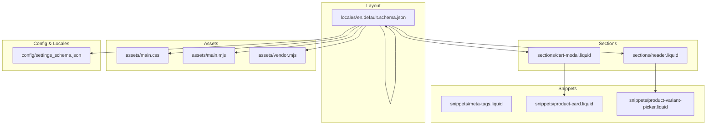
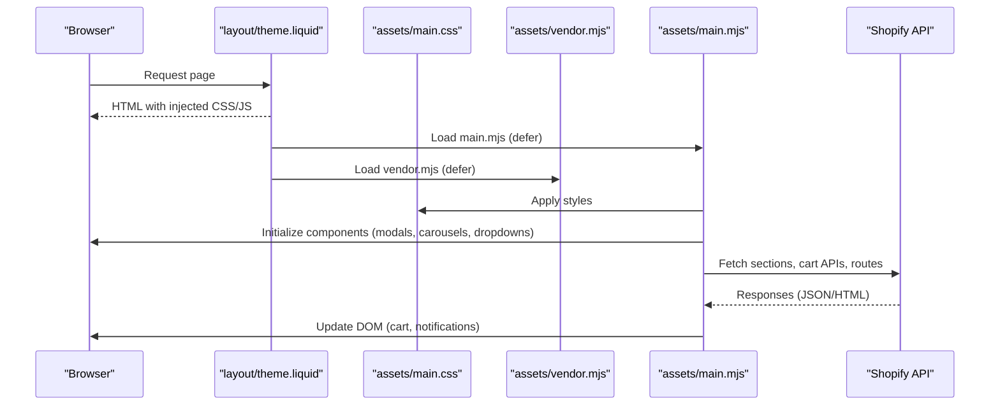
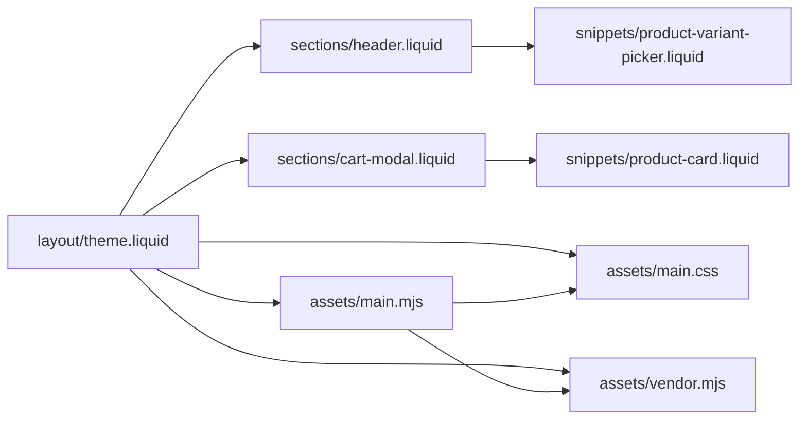
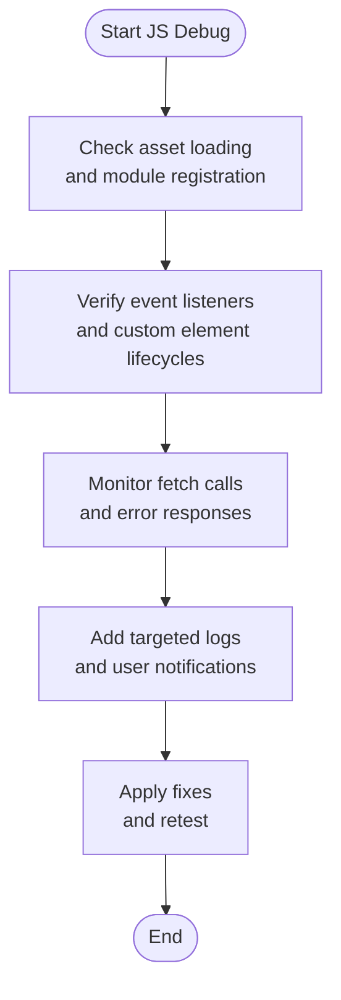

# Troubleshooting

<cite>
**Referenced Files in This Document**
- [theme.liquid](file://layout/theme.liquid)
- [settings_schema.json](file://config/settings_schema.json)
- [en.default.schema.json](file://locales/en.default.schema.json)
- [header.liquid](file://sections/header.liquid)
- [cart-modal.liquid](file://sections/cart-modal.liquid)
- [product-card.liquid](file://snippets/product-card.liquid)
- [product-variant-picker.liquid](file://snippets/product-variant-picker.liquid)
- [meta-tags.liquid](file://snippets/meta-tags.liquid)
- [main.mjs](file://assets/main.mjs)
- [vendor.mjs](file://assets/vendor.mjs)
- [main.css](file://assets/main.css)
</cite>

## Table of Contents
1. [Introduction](#introduction)
2. [Project Structure](#project-structure)
3. [Core Components](#core-components)
4. [Architecture Overview](#architecture-overview)
5. [Detailed Component Analysis](#detailed-component-analysis)
6. [Dependency Analysis](#dependency-analysis)
7. [Performance Considerations](#performance-considerations)
8. [Troubleshooting Guide](#troubleshooting-guide)
9. [Conclusion](#conclusion)
10. [Appendices](#appendices)

## Introduction
This document provides a comprehensive troubleshooting guide for the Igogomi theme. It focuses on diagnosing and resolving common issues during installation, customization, and runtime behavior. It covers JavaScript problems, CSS conflicts, Liquid template errors, performance bottlenecks, browser compatibility, mobile-specific issues, error handling/logging, and integration concerns with Shopify features and third-party services. The goal is to equip developers and support teams with practical, step-by-step strategies to identify and fix problems efficiently.

## Project Structure
The theme follows a typical Shopify theme structure:
- Layout and templates define the shell and page composition.
- Sections encapsulate reusable UI blocks.
- Snippets provide shared partials.
- Assets include CSS and JavaScript bundles.
- Config and locales define settings and translations.

**Diagram sources**
- [theme.liquid:1-258](file://layout/theme.liquid#L1-L258)
- [header.liquid:1-555](file://sections/header.liquid#L1-L555)
- [cart-modal.liquid:1-281](file://sections/cart-modal.liquid#L1-L281)
- [meta-tags.liquid:1-40](file://snippets/meta-tags.liquid#L1-L40)
- [product-card.liquid:1-195](file://snippets/product-card.liquid#L1-L195)
- [product-variant-picker.liquid:1-173](file://snippets/product-variant-picker.liquid#L1-L173)
- [main.css:1-800](file://assets/main.css#L1-L800)
- [main.mjs:1-60](file://assets/main.mjs#L1-L60)
- [vendor.mjs:1-3](file://assets/vendor.mjs#L1-L3)
- [settings_schema.json:1-800](file://config/settings_schema.json#L1-L800)
- [en.default.schema.json:1-800](file://locales/en.default.schema.json#L1-L800)

**Section sources**
- [theme.liquid:1-258](file://layout/theme.liquid#L1-L258)
- [settings_schema.json:1-800](file://config/settings_schema.json#L1-L800)
- [en.default.schema.json:1-800](file://locales/en.default.schema.json#L1-L800)

## Core Components
- Theme shell and asset pipeline: The layout injects CSS and JS, renders theme settings, and sets up global data attributes and routes.
- Header section: Provides navigation, localization selectors, cart trigger, and sticky/transparent header behavior.
- Cart modal: Implements cart drawer with live updates, order note, shipping estimator, and recommendations.
- Product card and variant picker: Render product cards, badges, pricing, and variant selection with fallbacks.
- Meta tags: Generates Open Graph and Twitter metadata for SEO/social sharing.
- JavaScript runtime: Handles modals, carousels, dropdowns, cart updates, media galleries, and prefetching.

Common issues often stem from:
- Asset loading order and missing dependencies.
- Liquid rendering errors (undefined variables, missing includes).
- JavaScript exceptions during DOM manipulation or async fetches.
- CSS specificity conflicts and responsive breakpoints.
- Third-party integrations (analytics, reviews, page builders).

**Section sources**
- [theme.liquid:1-258](file://layout/theme.liquid#L1-L258)
- [header.liquid:1-555](file://sections/header.liquid#L1-L555)
- [cart-modal.liquid:1-281](file://sections/cart-modal.liquid#L1-L281)
- [product-card.liquid:1-195](file://snippets/product-card.liquid#L1-L195)
- [product-variant-picker.liquid:1-173](file://snippets/product-variant-picker.liquid#L1-L173)
- [meta-tags.liquid:1-40](file://snippets/meta-tags.liquid#L1-L40)
- [main.mjs:1-60](file://assets/main.mjs#L1-L60)
- [vendor.mjs:1-3](file://assets/vendor.mjs#L1-L3)
- [main.css:1-800](file://assets/main.css#L1-L800)

## Architecture Overview
The runtime architecture ties together Liquid-rendered markup, CSS, and JavaScript:

**Diagram sources**
- [theme.liquid:49-66](file://layout/theme.liquid#L49-L66)
- [main.mjs:1-60](file://assets/main.mjs#L1-L60)
- [vendor.mjs:1-3](file://assets/vendor.mjs#L1-L3)
- [main.css:1-800](file://assets/main.css#L1-L800)

## Detailed Component Analysis

### Header Section Troubleshooting
Symptoms:
- Navigation dropdowns not opening.
- Transparent header not applying.
- Localization selectors not visible.

Checklist:
- Verify section settings for sticky mode and transparent header.
- Confirm localization availability and toggles.
- Ensure menu links and mega menu blocks are configured.
- Validate image URLs and sizes for logos.

Resolution steps:
- Confirm section settings keys and defaults in the schema.
- Inspect generated HTML for missing classes or attributes.
- Test with minimal menu configuration to isolate issues.

**Section sources**
- [header.liquid:1-555](file://sections/header.liquid#L1-L555)
- [settings_schema.json:276-555](file://config/settings_schema.json#L276-L555)
- [en.default.schema.json:670-800](file://locales/en.default.schema.json#L670-L800)

### Cart Modal Troubleshooting
Symptoms:
- Cart drawer does not open.
- Cart total not updating.
- Order note fails to save.
- Shipping estimator not working.

Checklist:
- Verify cart type setting (drawer/page).
- Confirm modal triggers and targets.
- Check network requests to cart endpoints.
- Validate form submission and error messages.

Resolution steps:
- Switch cart type to drawer/page and test.
- Inspect cart-form component and event handlers.
- Review error handling and notification display.
- Validate shipping estimator partials and data.

**Section sources**
- [cart-modal.liquid:1-281](file://sections/cart-modal.liquid#L1-L281)
- [settings_schema.json:532-575](file://config/settings_schema.json#L532-L575)
- [en.default.schema.json:532-575](file://locales/en.default.schema.json#L532-L575)

### Product Card and Variant Picker Troubleshooting
Symptoms:
- Sold-out badges not appearing.
- Quick add to cart not functional.
- Variant picker shows incorrect options.
- Swatches not displayed.

Checklist:
- Confirm product card settings for badges and quick add.
- Validate variant availability and selected variant.
- Check color swatch option names and mapping.
- Ensure fallback <noscript> select renders correctly.

Resolution steps:
- Enable/disable specific badges and observe changes.
- Toggle variant picker type and verify DOM structure.
- Compare variant JSON payload with UI selections.
- Test with default variant to confirm basic functionality.

**Section sources**
- [product-card.liquid:1-195](file://snippets/product-card.liquid#L1-L195)
- [product-variant-picker.liquid:1-173](file://snippets/product-variant-picker.liquid#L1-L173)
- [settings_schema.json:437-531](file://config/settings_schema.json#L437-L531)
- [en.default.schema.json:437-531](file://locales/en.default.schema.json#L437-L531)

### Meta Tags and SEO Troubleshooting
Symptoms:
- Open Graph images missing.
- Twitter card not rendering.
- Canonical URL incorrect.

Checklist:
- Verify page type detection and metadata generation.
- Confirm page image and product price metadata.
- Check social links and site name.

Resolution steps:
- Validate page context variables (page_title, canonical_url).
- Ensure page_image exists and has dimensions.
- Test with different page types (product/article/home).

**Section sources**
- [meta-tags.liquid:1-40](file://snippets/meta-tags.liquid#L1-L40)
- [theme.liquid:47-47](file://layout/theme.liquid#L47-L47)

### JavaScript Runtime Troubleshooting
Symptoms:
- Modals fail to open/close.
- Carousels not scrolling.
- Dropdown menus not positioning.
- Cart updates throw errors.

Checklist:
- Inspect browser console for errors.
- Verify asset loading order and module definitions.
- Check custom element registrations and lifecycle hooks.
- Monitor fetch requests and error responses.

Resolution steps:
- Add logging around fetch calls and DOM updates.
- Validate custom element callbacks (connected/disconnected).
- Use devtools to step through animation and intersection observers.
- Test with minimal components isolated.

**Section sources**
- [main.mjs:1-60](file://assets/main.mjs#L1-L60)
- [vendor.mjs:1-3](file://assets/vendor.mjs#L1-L3)

### CSS Conflicts and Responsive Issues
Symptoms:
- Buttons overlap or misalign.
- Typography not scaling.
- Media gallery aspect ratios incorrect.

Checklist:
- Review Tailwind-based CSS and custom variables.
- Inspect breakpoint-specific overrides.
- Validate CSS custom properties and container queries.

Resolution steps:
- Temporarily disable custom CSS to isolate conflicts.
- Use browser devtools to inspect computed styles.
- Adjust theme settings affecting typography and spacing.

**Section sources**
- [main.css:1-800](file://assets/main.css#L1-L800)
- [settings_schema.json:399-435](file://config/settings_schema.json#L399-L435)
- [en.default.schema.json:399-435](file://locales/en.default.schema.json#L399-L435)

## Dependency Analysis
Runtime dependencies and interactions:

**Diagram sources**
- [theme.liquid:1-258](file://layout/theme.liquid#L1-L258)
- [header.liquid:1-555](file://sections/header.liquid#L1-L555)
- [cart-modal.liquid:1-281](file://sections/cart-modal.liquid#L1-L281)
- [product-variant-picker.liquid:1-173](file://snippets/product-variant-picker.liquid#L1-L173)
- [product-card.liquid:1-195](file://snippets/product-card.liquid#L1-L195)
- [main.mjs:1-60](file://assets/main.mjs#L1-L60)
- [vendor.mjs:1-3](file://assets/vendor.mjs#L1-L3)
- [main.css:1-800](file://assets/main.css#L1-L800)

**Section sources**
- [theme.liquid:1-258](file://layout/theme.liquid#L1-L258)
- [main.mjs:1-60](file://assets/main.mjs#L1-L60)
- [vendor.mjs:1-3](file://assets/vendor.mjs#L1-L3)
- [main.css:1-800](file://assets/main.css#L1-L800)

## Performance Considerations
- Asset loading: Ensure vendor and theme scripts are deferred to avoid blocking.
- Lazy loading: Use native loading attributes for images and videos.
- CSS delivery: Keep critical CSS inline and defer non-critical styles.
- Animations: Limit expensive transitions and use transform/opacity where possible.
- Prefetching: Verify prefetch behavior and connection conditions.

[No sources needed since this section provides general guidance]

## Troubleshooting Guide

### Installation and Setup
Common issues:
- Theme not appearing in the theme list.
- Missing assets or broken links.
- Settings not saving.

Diagnostic steps:
- Verify theme ZIP upload and activation via admin.
- Check asset URLs and CDN configuration.
- Clear browser cache and hard refresh.
- Reset theme settings to defaults and reconfigure.

Resolution tips:
- Reinstall theme from scratch.
- Validate asset integrity and public URLs.
- Confirm theme version compatibility with Shopify platform.

**Section sources**
- [theme.liquid:49-66](file://layout/theme.liquid#L49-L66)

### Customization and Settings
Common issues:
- Settings not reflected in UI.
- Unexpected layout changes after updates.
- Missing translation strings.

Diagnostic steps:
- Confirm settings_schema.json entries match UI.
- Validate locale files and translation keys.
- Test with a clean settings_data.json backup.

Resolution tips:
- Incrementally apply settings and verify each change.
- Use the theme editor to preview changes before publishing.
- Validate custom CSS/JS against theme updates.

**Section sources**
- [settings_schema.json:1-800](file://config/settings_schema.json#L1-L800)
- [en.default.schema.json:1-800](file://locales/en.default.schema.json#L1-L800)

### JavaScript Issues
Common symptoms:
- Console errors on page load.
- Components not responding to user actions.
- Async operations failing silently.

Diagnostic steps:
- Open browser devtools and check Network tab for failed requests.
- Add targeted console logs around component initialization.
- Validate custom element definitions and lifecycle methods.
- Inspect animation and IntersectionObserver usage.

Resolution tips:
- Wrap async operations in try/catch and surface user-friendly messages.
- Debounce rapid events (resize, scroll) to prevent thrashing.
- Ensure DOMContentLoaded or equivalent before manipulating nodes.

**Diagram sources**
- [main.mjs:1-60](file://assets/main.mjs#L1-L60)

**Section sources**
- [main.mjs:1-60](file://assets/main.mjs#L1-L60)
- [vendor.mjs:1-3](file://assets/vendor.mjs#L1-L3)

### CSS Conflicts
Common issues:
- Styles overridden unexpectedly.
- Breakpoints not behaving as expected.
- Custom CSS breaking core layout.

Diagnostic steps:
- Inspect computed styles and cascade order.
- Temporarily disable custom CSS to isolate conflicts.
- Validate CSS custom properties and container queries.

Resolution tips:
- Use more specific selectors or CSS modules.
- Prefer CSS custom properties for theme-wide adjustments.
- Test responsive breakpoints across devices.

**Section sources**
- [main.css:1-800](file://assets/main.css#L1-L800)

### Liquid Template Errors
Common issues:
- Undefined variable errors.
- Missing includes or snippets.
- Incorrect section rendering.

Diagnostic steps:
- Enable development mode and review error pages.
- Validate variable existence before use.
- Check include paths and snippet names.

Resolution tips:
- Add safe guards for optional variables.
- Use default values for missing settings.
- Keep includes minimal and well-scoped.

**Section sources**
- [theme.liquid:16-68](file://layout/theme.liquid#L16-L68)
- [meta-tags.liquid:1-40](file://snippets/meta-tags.liquid#L1-L40)

### Performance Troubleshooting
Common issues:
- Slow page loads.
- Heavy JavaScript execution.
- Excessive reflows and repaints.

Diagnostic steps:
- Use Lighthouse and Web Vitals reports.
- Profile long tasks and paint work.
- Audit asset sizes and caching headers.

Resolution tips:
- Defer non-critical scripts and lazy-load images.
- Minimize DOM mutations and batch updates.
- Optimize images and leverage modern formats.

**Section sources**
- [vendor.mjs:1-3](file://assets/vendor.mjs#L1-L3)
- [main.mjs:1-60](file://assets/main.mjs#L1-L60)

### Browser Compatibility and Mobile-Specific Problems
Common issues:
- Certain features unsupported on older browsers.
- Touch interactions not working on mobile.
- Viewport scaling anomalies.

Diagnostic steps:
- Test on target browsers and devices.
- Validate viewport meta tag and touch actions.
- Check CSS Grid/Flexbox support and polyfills.

Resolution tips:
- Provide graceful degradation for unsupported features.
- Use pointer and touch event detection.
- Validate mobile-first breakpoints and gestures.

**Section sources**
- [theme.liquid:26-28](file://layout/theme.liquid#L26-L28)
- [main.mjs:1-60](file://assets/main.mjs#L1-L60)

### Error Handling Strategies and Logging
Recommended practices:
- Centralized error reporting for AJAX calls.
- User-facing notifications for failures.
- Structured logging with context (page, action, payload).
- Graceful fallbacks for optional features.

Implementation anchors:
- Cart update error handling and notifications.
- Modal and drawer state persistence.
- Image loading and LQIP transitions.

**Section sources**
- [cart-modal.liquid:1-281](file://sections/cart-modal.liquid#L1-L281)
- [main.mjs:1-60](file://assets/main.mjs#L1-L60)

### Monitoring Techniques
- Use browser devtools Network panel to track API calls.
- Observe Performance panel for long tasks and memory usage.
- Leverage Shopify’s built-in analytics and conversion tracking.
- Monitor third-party script performance and consent.

[No sources needed since this section provides general guidance]

### Integration Issues with Shopify Features and Third-Party Services
Common issues:
- Search and predictive search not returning results.
- Checkout and dynamic checkout buttons not displaying.
- Reviews and ratings not loading.
- Page builder or app conflicts.

Diagnostic steps:
- Validate routes and endpoints used by the theme.
- Confirm app permissions and script injection order.
- Test with third-party apps disabled to isolate conflicts.

Resolution tips:
- Coordinate with app providers for compatibility.
- Use theme hooks and sections to integrate features.
- Keep theme and apps updated to latest versions.

**Section sources**
- [theme.liquid:203-211](file://layout/theme.liquid#L203-L211)
- [product-variant-picker.liquid:1-173](file://snippets/product-variant-picker.liquid#L1-L173)

## Conclusion
This guide outlines a structured approach to troubleshooting the Igogomi theme across installation, customization, JavaScript runtime, CSS, Liquid templates, performance, compatibility, and integrations. By following the diagnostic steps and resolution strategies outlined here, teams can quickly identify root causes and apply targeted fixes while maintaining a high-quality user experience.

[No sources needed since this section summarizes without analyzing specific files]

## Appendices

### Quick Diagnostic Checklist
- Assets load without 404s.
- Settings save and reflect in UI.
- No Liquid parse or render errors.
- JavaScript console shows no uncaught exceptions.
- CSS custom properties and breakpoints behave as expected.
- Cart and checkout flows complete successfully.
- Mobile and desktop layouts are consistent.
- Third-party scripts do not block core functionality.

[No sources needed since this section provides general guidance]